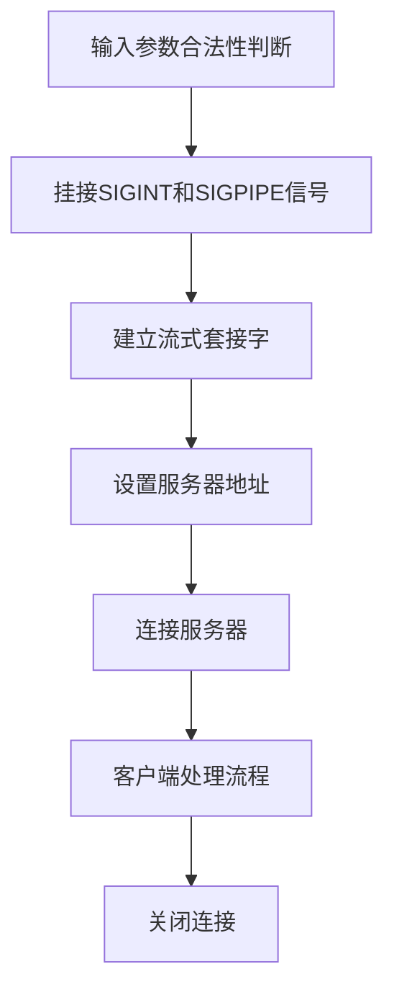

# Linux Network Programming
[TOC]

Linux 内核主要由5个子系统组成,进程管理,虚拟文件系统,网络接口，进程间通信

* 进程调度:
  1. SCHED_OTHER 是用于针对普通进程的时间片轮转调度策略,在这种策略中系统给所有运行状态的进程分配时间片,在当前进程的时间片用完之后,系统从进程中优先级最高的进程选择进程运行
  2. SCHED_FIFO 是针对运行的实时性要求比较高,运行时间短的进程调度策略,这种策略中,系统按照进入队列的先后进行进程的调度,在没有更高优先级进程到来或者当前进程没有因为等待资源而阻塞的情况下会一直运行
  3. SHED_RR 是针对实时性要求比较高,运行时间比较长的进程调度策略,这种策略与SCHED_OTHER 的策略类似,只不过SCHED_RR进程优先级要高的多,系统分配给SCHED_RR进程时间片,然后轮询执行这些进程,将时间片用完的进程放入队列的末尾

* 内存管理MMU
   虚拟内存的分配策略是每个进程都可以公平地使用虚拟内存,虚拟内存的大小通常设置为物理内存的两倍

* 虚拟文件系统VFS
  在liunx下支持多种文件系统,如ext，ext2,minix,unsdos,msdos,vfat,ntfs,proc,snb,ncp,iso9660,sysv,hpfs,affs等,目前linux下最常用的文件格式是ext2和ext3
  ext2文件系统用于固定文件系统和可活动文件系统,是ext文件系统的扩展,ext3文件系统是在ext2上增加日志功能后的扩展,它兼容ext2

* 网络接口
  支持多种网络接口和协议,网络接口分为网络协议和驱动程序,网络协议是一种网络传输的通信标准,而网络驱动则是对硬件设备的驱动程序

* 进程间通信
  Linux下的进程间通信方式主要有管道方式,信号方式,消息队列方式,共享内存和套接字等方法

Linux的文件结构:linux不使用磁盘分区符号来访问文件系统,而是将整个文件系统表示成树状的结构，Linux系统每增加一个文件系统都会将其加入到这个树中
操作系统文件结构的开始只有一个单独的顶级目录结构,叫做根目录,所有一切都从"根"开始,用"/"代表,并且延伸到子目录,DOC/Windows下文件系统按照磁盘分区的概念分类,目录都存于分区上,linux则通过"挂接"的方式把所有分区都防止在"根"下各个目录里
一些常用目录的作用如下:
- /etc:包括绝大多数Linux系统引导所需要的配置文件,系统引导时读取配置文件,按照配置文件的选项进行不同情况的启动,例如fstab,host.conf等
- /lib:包含c编译程序需要的函数库,是一组二进制文件,例如glibc等
- /usr:包括所有其他内容,如src，local，linux的内核就在/usr/src中,其下有子目录/bin,存放所有安装语言的命令,如gcc，perl等
- /var:包含系统定义表,以便在系统运行改变时可以只备份该目录,如cache
- /tmp:用于临时性的存储
- /bin:大多数命令存放在这里
- /home:主要存放用户账号,并且可以支持ftp的用户管理,系统管理员增加用户时,系统在home目录下创建与用户同名的目录,此目录下一般默认有Desktop目录
- /dev:这个目录下存放一种设备文件的特殊文件,如fd0,had等
- /mnt:在Linux系统中,它是专门给外挂的文件系统使用的,里面有两个文件cdrom,floopy,登录光驱,软驱时要用到

生成和使用静态库:
```
af -rcs libstr.a string.o
gcc -o main main.c libstr.a
gcc -o main main.c -L./ -lstr
```

生成动态链接库
```
gcc -shared -W1,-soname,libstr.os -o libstr.so.l string.c
```

动态链接库的配置
系统中的配置文件/etc/ld.so.conf是动态链接库的搜索路径配置文件

动态链接库管理命令
```
ldconfig [-v|--verbose] [-n] [-N] [-X] [-f CONF] [-C CACHE] [-r ROOT] [-l]
[-p|--print-cache] [-c FORMAT] [--format=FORMAT] [-V] [-?|--help|--usage]
path...
```

## 表 2.4 ldconfig的选项含义

| 选项 | 含义 |
|------|------|
| -v   | 此选项打印 ldconfig 的当前版本号，显示所扫描的每一个目录和动态链接库 |
| -n   | 此选项 ldconfig 处理命令行指定的目录，不对系统的默认目录（/lib，/usr/lib）进行扫描，也不对配置文件/etc/ld.so.conf中所指定的目录进行扫描 |
| -N   | 此选项 ldconfig 不会重建缓存文件 |
| -X   | 此选项 ldconfig 不更新链接 |
| -f CONF | 此选项使用用户指定的配置文件代替默认文件/etc/ld.so.conf |
| -C CACHE | 此选项使用用户指定的缓存文件代替系统默认的缓存文件/etc/ld.so.cache |
| -r ROOT | 此选项改变当前应用程序的根目录 |
| -l   | 此选项用于手动检查一个动态链接库 |
| -p 或 --print-cache | 此选项用于打印出缓存文件中共享库的名字 |

使用动态链接库
```
gcc -o main main.c -L./ -lstr
```
在运行时,程序连接的动态链接库需要在系统目录下才行
1. 可以将库的路径添加到环境变量LD_LIBRARY_PATH中
```
export LD_LIBRARY_PATH=$LD_LIBRARY_PATH=./example/ex02 :$LD_LIBRARY_PATH
```
2. 使用ld-linux.so.2来运行程序
```
/libname/ld-linux.so.2 --library-path ./example/ex02 main
```
如果系统的搜索路径下同时存在静态链接库和动态链接库,默认情况下会链接动态链接库,如果需要强制链接静态链接库,需要加上-static选项
```
gcc -o main main.c -L./ -lstr -static
```

动态加载库
一般动态链接库在程序启动时就要寻找动态库,而动态加载库可以用程序的方法来控制什么时候加载
动态加载库主要有函数dllopen()，dllerror(),dllsym()和dllclose()来控制动态库的使用
打开动态库
```c++
void * dllopen(const char * filename,int flag);
```
获得函数指针dllsym()
```c++
void *phandle = dlopen("./libstr.so",RTLD_LAZY);
```

```c++
#include <dlfcn.h>
#include <stdlib.h>
#include <stdio.h>

int main(void) {
    char src[] = "Hello Dymatic";
    int (*pStrLenFun)(char *str);
    void *phandle = NULL;
    char *perr = NULL;

    // 加载共享库
    phandle = dlopen("./libstr.so", RTLD_LAZY);
    if (!phandle) {
        printf("Failed to load library: %s\n", dlerror());
        return 1;
    }

    // 获取 StrLen 函数的地址
    pStrLenFun = (int (*)(char*)) dlsym(phandle, "StrLen");
    perr = dlerror();
    if (perr != NULL || !pStrLenFun) {
        printf("Failed to find symbol StrLen: %s\n", perr);
        dlclose(phandle);
        return 1;
    }

    // 调用 StrLen 函数并输出结果
    printf("The string length is: %d\n", pStrLenFun(src));

    // 关闭共享库
    if (dlclose(phandle) != 0) {
        printf("Failed to close library: %s\n", dlerror());
        return 1;
    }

    return 0;
}
```

GCC常用选项
1. -DMACRO选项
定义一个宏,在多种预定义的程序中会经常使用

-Idir:将头文件的搜索路径扩大,包含dir目录
-Ldir:将连接时使用的链接库搜索路径扩大,包含dir目录
-static:仅选用静态程序库进行链接,如果一个目录中静态库和动态库都存在,则仅选择静态库
-g:包括调试信息
-On:优化程序，程序优化后执行速度会更快,程序占用空间会更小,通常gcc会进行很小的优化,优化的级别可以选择,即n.最常用的优化级别是2
-wall:打开gcc能够提供的常用的警告

## linux文件系统
Linux系统下要使用一个文件系统需要先将文件系统的分区挂载到系统上,mount命令用于挂接文件,它有很多选项
```
mount -t type mountpoint device -o options
```
上述命令表示将文件类型为type的设备device挂载到mountpoint上,挂接时要遵循options的设置

/dev/console是控制台的文件描述符,打印控制台描述符可能导致系统循环运行

虚拟文件系统VFS
Linux文件系统支持多种类型的文件,对多种类型的文件系统进行了很好的抽象,通过一组相同的系统调用接口,linux可以在各种设备上实现多种不同的文件系统
VFS是文件系统的接口框架,这个组件导出一组接口,然后将它们抽象到各个文件系统,各个文件系统的具体实现方式差异很大,有两个针对文件系统对象的缓存(inode和dentry),它们缓存的对象时最近使用过的文件系统
每个文件系统的实现导出一组通用接口,供VFS使用,缓冲区用于缓存文件和相关块设备二者之间的请求
例如,对底层设备驱动程序的读写请求会通过缓冲区缓存来传递,这就允许其中缓存请求,减少访问物理设备的次数,加快访问速度,以最近使用LRU列表的形式管理缓冲区缓存,注意,可以使用sync命令将缓冲区缓存中的请求发送到存储媒体

文件系统类型:
linux的文件系统用一组通用对象来表示,这些对象是超级块,节点索引,目录结构,和文件
超级块是每种文件系统的跟,用于描述和维护文件系统的状态,文件系统中管理的每个对象在linux中表示为一个索引节点inode
inode包含管理文件系统中的对象所需的所有元数据(包括可以在对象上执行的操作)另一组结构称为dentry,它们用来实现名称和inode之间的映射,有一个目录缓存用来保存最近使用的dentry
dentry还维护目录与文件之间的关系,支持目录和文件在文件系统中的移动,VFS文件表示一个打开的文件(保存打开的文件的状态,像文件的读偏移量和写偏移量等)
```c++
struct file_system_type{
    const char *name;   // 文件系统类型名称
    int fs_flags;        // 文件系统标志
    struct super_block * (*read_super)(struct super_block *sb, void *data, int silent); // 读取超级块
    struct module *owner; // 所有者模块
    struct file_system_type *next; //下一个文件类型
    struct list_head fs_supers; //头结构
}
```
linux的内核中保存系统所支持的文件系统的列表,可以通过/proc文件系统在用户空间中查看这个列表,虚拟文件系统所支持的文件系统的列表,可以通过/proc文件系统在用户空间中查看这个列表
虚拟文件系统还显示当前系统中与文件系统相关联的具体设备,在linux中添加新的文件系统的方法是调用register_filesystem，这个函数的参数定义一个文件结构的引用

```c++
struct super_block{
    unsigned long long s_maxbytes; //最大文件尺寸
    struct file_system type *s_type; //文件系统类型
    const struct super_operations *s_op; //超级块的操作，主要是对inode的操作
    char s_id[32];  //文件系统的名称
}
```

在linux系统中每种文件类型都有一个超级块,如果系统中存在ext2和vfat,则存在两个超级块,分别表示ext2文件系统和vfat文件系统

```c++
struct super_operations{
    struct inode *(*alloc_inode)(struct super_block *sb); //申请节点
    void (*destroy_inode)(struct inode *inode); //销毁节点
    void (*dirty_inode)(struct inode *inode); //标记节点已修改
    int (*write_inode)(struct inode *inode, struct writeback_control *wbc); //写节点
    int (*drop_inode)(struct inode *inode); //丢弃节点
    void (*truncate)(struct inode *inode); //截断文件

};
```
超级块中的一个重要元素是超级块操作函数的定义,这个结构定义一组用来管理这个文件系统中的节点索引inode的函数

文件操作
在文件fs.h中定义了文件操作的结构,通常实际的文件系统都要实现对应的操作函数
```c++
struct file_operations{
    struct module *owner; //所有者模块
   loff_t (*llseek)(struct file *file, loff_t offset, int origin); //移动文件指针
   ssize_t (*read)(struct file *file, char __user *buf, size_t count, loff_t *ppos); //读文件
   ssize_t (*write)(struct file *file, const char __user *buf, size_t count, loff_t *ppos); //写文件
   int (*readdir)(struct file *file, void *dirent, filldir_t filldir); //读取目录
   unsigned int (*poll)(struct file *file, poll_table *wait); //等待事件
   int (*ioctl)(struct inode *inode, struct file *file, unsigned int cmd, unsigned long arg); //ioctl命令
   long (*unlocked_ioctl)(struct file *file, unsigned int cmd, unsigned long arg); //ioctl命令
   int (*mmap)(struct file *file, struct vm_area_struct *vma); //映射文件到内存
   int (*open)(struct inode *inode, struct file *file); //打开文件
   int (*flush)(struct file *file, fl_owner_t id); //刷新文件
   int (*release)(struct inode *inode, struct file *file); //释放文件
   int (*fsync)(struct file *file, struct dentry *dentry, int datasync); //同步文件
   int (*fasync)(int fd, struct file *file, int on); //异步通知
   int (*lock)(struct file *file, int cmd, struct file_lock *fl); //锁定文件
   ssize_t (*sendpage)(struct file *file, struct page *page, int offset, size_t size, loff_t *ppos, int flags); //发送页面
   unsigned long (*get_unmapped_area)(struct file *file, unsigned long addr, unsigned long len, unsigned long pgoff, unsigned long flags); //获取未映射区域
   int (*check_flags)(int flags); //检查文件标志
   int (*flock)(struct file *file, int cmd, struct file_lock *fl); //文件锁定
   int (*mmap_capabilities)(struct file *file); //映射能力
   int (*revalidate_disk)(struct super_block *sb); //重新验证磁盘
   int (*getattr)(struct vfsmount *mnt, struct dentry *dentry, struct kstat *stat); //获取属性
   int (*setattr)(struct dentry *dentry, struct iattr *attr); //设置属性
   int (*listxattr)(struct dentry *dentry, char *list, size_t size); //列出扩展属性
   int (*fiemap)(struct file *file, struct fiemap_extent_info *fieinfo, u64 start, u64 len); //文件映射信息
   int (*fsgetxattr)(const char *path, const char *name, void *value, size_t size); //获取扩展属性
   int (*fssetxattr)(const char *path, const char *name, const void *value, size_t size, int flags); //设置扩展属性
   int (*removexattr)(const char *path, const char *name); //删除扩展属性
   int (*quotactl)(struct super_block *sb, int cmd, int type, unsigned long arg); //磁盘配额控制
   int (*bmap)(struct inode *inode, sector_t block); //块映射
   int (*pathconf)(struct path *path, int name, unsigned long *result); //路径配置
   ....
};
```
ext2文件系统实现了如下的文件操作,当打开一个ext2格式的文件时,系统调用ext2文件系统注册的open()函数,即函数generic_file_open()
```c++
const struct file_operations ext2_file_operations = {
   .llseek = generic_file_llseek,
   .read = do_sync_read,
   .write = do_sync_write,
   .aio_read = generic_file_aio_read,'
   .aio_write = generic_file_aio_write,
   .unlocked_ioctl = ext2_ioctl,
   #ifdef CONFIG_COMPAT
   .compat_ioctl = ext2_compat_ioctl,
   #endif
   .mmap = generic_file_mmap,
   .open = generic_file_open,
   .release = ext2_release_file,
   .fsync = ext2_sync_file,
   .splice_read = generic_file_splice_read,
   .splice_write = generic_file_splice_write,
};
```

### 文件的通用操作方法
#### 文件描述符
在linux下用文件描述符来表示设备文件和普通文件,文件描述符是一个整型的数据,所有对文件的操作都通过文件描述符实现
文件描述符是文件系统中连接用户控件和内核空间的枢纽,当打开一个或者创建一个文件时,内核空间创建相应的结构,并生成一个整型的变量传递给用户空间的对应进程,进程用这个文件描述符来对文件进行操作,用户空间的文件操作,例如读写一个文件时,将文件描述符作为参数传递给read或write,读写函数的系统调用到达内核时,内核解析作为文件描述符的整型变量,找出对应的设备文件,运行相应函数,并返回用户空间的结果

文件描述符的范围是0~OPEN_MAX,因此是一个有限的资源,在使用完毕之后要及时释放,通常是调用close()函数关闭,文件描述符的值仅在同一个进程中有效,即不同进程的文件描述符,同一个值很可能描述的不是同一个设备或普通文件

在linux系统中有3个已经分配的文件描述符,即标准输入,标准输出和标准错误,分别是0,1,2

#### 打开创建文件open(),create()函数

```c++
int open(const char * pathname,int flags);
int open(const char * pathname,int flags,mode_t mode);
```

文件的打开标志flags用于设置文件打开后允许的操作方式,可以为只读,只写或可以进行读写,O_RDONLY,O_WRONLY,O_RDWR
打开文件时必须指定上述的三种模式之一
O_APPEND:使每次对文件进行写操作都追加到文件的尾端
O_CREAT：如果文件不存在则创建它,当使用此选项时,第三个参数mode需要同时设定,用来说明文件的权限
O_EXCL：查看文件是否存在,如果同时指定了O_CREAT，而文件已存在,则返回错误
O_TRUNC：如果文件存在,则截断它,即删除文件中的所有数据,并将文件大小置为0

O_NONBLOCK:打开文件为非阻塞方式,如果不指定此项,默认的打开方式为阻塞方式,即对文件读写操作需要等待操作的返回状态
如果不指定此项,默认的代开方式是阻塞方式,即对文件的读写操作需要等待操作的返回状态,其中mode用于表示打开文件的权限
mode的使用必须结合flags的O_CREAT使用,否则是无效的

# 表 3.2 mode 参数的值和含义

| 选 项      | 值    | 含 义                                  |
|----------|------|-------------------------------------|
| S_IRWXU  | 00700 | 用户（文件拥有者）有读写和执行的权限           |
| S_IRUSR  | 00400 | 用户对文件有读权限                           |
| S_IWUSR  | 00200 | 用户对文件有写权限                           |
| S_IXUSR  | 00100 | 用户对文件有执行权限                         |
| S_IRWXG  | 00770 | 组用户（文件拥有者）有读写和执行的权限         |
| S_IRGRP  | 00400 | 组用户对文件有读权限                         |
| S_IWGRP  | 00200 | 组用户对文件有写权限                         |
| S_IXGRP  | 00100 | 组用户对文件有执行权限                       |
| S_IRWXO  | 00007 | 其他用户（文件所有者）有读写和执行的权限       |
| S_IROTH  | 00004 | 其他用户对文件有读权限                     |
| S_IWOTH  | 00002 | 其他用户对文件有写权限                     |
| S_IXOTH  | 00001 | 其他用户对文件有执行权限                   |

关闭文件close()函数
```c++
#include <unistd.h>
int close(int fd);
```
在打开文件之后,必须关闭文件,如果一个进程没有正常关闭文件,在进程退出的时候系统会自动关闭打开的文件,但是打开一个文件的时候,系统分配的文件描述符为当前进程中最小的文件描述符的值,这个值一般情况下是递增的,而当每个进程中的文件描述符的数量大小是有限时,如果一个进程频繁打开文件而忘记关闭可能导致文件描述符使用达到限制

读取文件read()函数
使用这个函数需要将头文件unistd.h加入,read函数的原型定义如下,read()函数从头文件描述符fd对应的文件中读取count字节,放到buf开始的缓冲区
```c++
#include <unistd.h>
ssize_t read(int fd, void *buf, size_t count);
```

如果read()函数执行成功,返回读取的字节数

写入文件write()函数
```c++
#include <unistd.h>
ssize_t write(int fd,const void *buf,size_t count);
```
函数成功会返回写入的字节数,当出错的时候返回-1,出错的原因有多种,像磁盘已满,或者文件大小超出系统的设置,例如ext2下的文件大小限制为2Gbytes

文件偏移lseek()函数
```c++
#include <unistd.h>
#include <sys/types.h>
off_t lseek(int fildes,off_t offset,int whence);
```
如果lseek()函数操作成功,则返回新的文件偏移量的值,如果返回=-1则为失败,由于文件的偏移量可以为负值,所以判断需要使用==-1来判断是否成功

参数whence和offset结合使用,whence表示操作的模式,offset是偏移量的值,offset的值可以为负数
offset的含义如下:
如果whence为SEEK_SET则offset为相对文件开始处的位置,即将该文件偏移量设为距文件开始处offset个字节
如果whence为SEEK_CUR 则offset为相对当前位置的值
如果whence为SEEK_END 则offset为相对文件结尾处的位置,即将该文件偏移量设为距文件结尾处offset个字节

lseek()函数对文件偏移量的设置可以移出文件,即设置的位置可以超出文件的大小,但是这个位置仅仅在内核中保存,并不引起任何的IO操作当下一次读写动作时,lseek()设置的位置就是操作的当前位置,当文件进行读写操作时会延长文件,跳过的数据用"\0"填充

获得文件状态fstat()函数
在程序设计时要用到文件的一些特性值,例如文件所有者,文件的修改时间,文件的大小等,stat()函数,fstat()函数和lstat()函数可以获得文件的状态,其函数原型如下:
```c++
#include <sys/types.h>
#include <sys/stat.h>
#include <unistd.h>
int stat(const char *path,struct stat *buf);
int fstat(int filedes,struct stat *buf);
int lstat(const char *path,struct stat *buf);
```
struct stat为描述文件状态的结构,定义如下:
```c++
struct stat {
    dev_t     st_dev;    //此文件所处设备的设备ID号
    ino_t     st_ino;    //此文件在设备中的i节点号
    mode_t    st_mode;   //文件类型和访问权限
    nlink_t   st_nlink;  //文件链接数
    uid_t     st_uid;    //文件所有者的用户ID
    gid_t     st_gid;    //文件所有者的组ID
    dev_t     st_rdev;   //设备号(如果是设备文件)
    off_t     st_size;   //文件大小(字节数)
    blksize_t st_blksize;//块大小
    blkcnt_t  st_blocks; //文件所占的块数
    time_t    st_atime;  //最后一次访问时间
    time_t    st_mtime;  //最后一次修改时间
    time_t    st_ctime;  //最后一次改变时间(比如权限改变)
};
```
```c++
#include <sys/types.h>
#include <sys/stat.h>
#include <unistd.h>
#include <stdio.h>
#include <time.h>

int main(int argc, char *argv[]) {
    if (argc < 2) {
        printf("Usage: %s <file_path>\n", argv[0]);
        return -1;
    }

    const char *file_path = argv[1];
    struct stat st;

    // 获取文件状态
    if (-1 == stat(file_path, &st)) {
        perror("Failed to get file status");
        return -1;
    }

    // 打印文件元数据
    printf("File ID (st_dev): %d\n", st.st_dev);          // 文件所在设备的 ID
    printf("Inode number (st_ino): %ld\n", st.st_ino);    // 文件的 inode 编号
    printf("File mode (st_mode): %d\n", st.st_mode);      // 文件类型和权限
    printf("Hard links (st_nlink): %d\n", st.st_nlink);   // 硬链接数量
    printf("Owner UID (st_uid): %d\n", st.st_uid);        // 文件所有者的用户 ID
    printf("Group GID (st_gid): %d\n", st.st_gid);        // 文件所属组的组 ID
    printf("Device ID (st_rdev): %d\n", st.st_rdev);      // 设备 ID（如果是设备文件）
    printf("File size (st_size): %ld\n", st.st_size);     // 文件大小（字节）
    printf("Block size (st_blksize): %ld\n", st.st_blksize); // 文件系统的 I/O 块大小
    printf("Number of blocks (st_blocks): %ld\n", st.st_blocks); // 文件占用的块数

    // 打印时间戳（转换为可读格式）
    printf("Last access time: %s", ctime(&st.st_atime));
    printf("Last modification time: %s", ctime(&st.st_mtime));
    printf("Last status change time: %s", ctime(&st.st_ctime));

    return 0;
}
```
文件空间映射mmap()函数
将文件描述符fd对应的文件中,自offset开始的一段长length的数据空间映射到内存中,用户可以设定映射内存的地址,但是具体函数会映射到内存的位置由返回值确定,当映射成功后,返回映射到的内存地址
```c++
#include <sys/mman.h>
void *mmap(void *addr, size_t len, int prot, int flags, int fd, off_t offset);
```
使用mmap()函数有一个限制,只能对映射到内存的数据进行操作,即限制于开始为offset,大小为len的区域
参数fd,代表文件描述符,表示要映射到内存中的文件,通常是open()的返回值,如果需要对文件中需要映射地址进行偏移,则在参数offset中进行指定

参数prot表示映射区保护方式,保护方式prot的值是一个组合值,可选如下的一个或多个,这些值可以进行复合运算,其中,PROT_EXEC表示映射区域可执行,PROT_READ表示映射区可读取,PROT_WRITE表示映射区可写入,PROT_NONE表示映射区不可存取

flags用于设定映射对象的类型,选项和是否可以对映射对象进行操作,这个参数和open()函数中的含义类似,参数flags也是一个组合值,下面是其可选的设置
* MAP_SHARED 表示映射对象可以被其他进程共享,映射区域允许其他线程共享,对映射区域写入数据将会写入到原来的文件中
* MAP_FIXED:如果参数start指定了用于需要映射的地址,而所指的地址无法成功建立映射,则映射失败,通常不推荐使用此设置,而将start设置为0,由系统自动选取映射地址
* MAP_ANONYMOUS:创建一个匿名映射对象,即不与任何文件关联,此时参数fd和offset无效,映射区域不会共享
* MAP_PRIVATE:创建一个私有映射对象,即与其他进程隔离,映射区域只能被当前进程访问,对映射区域的写入不会影响原文件
* MAP_DENYWRITE:映射区域不能被写入,即使映射对象是可写的,也不能对其进行写入操作
* MAP_LOCKED:映射区域只能被锁定,此区域不会被虚拟内存重置

munmap()函数
```c++  
#include <sys/mman.h>
int munmap(void *start, size_t length);
```
mmap对文件操作完毕后,需要使用munmap()函数将mmap()映射的地址取消并关闭打开的文件

```c++
fd = open(filename,flags,mode);
if(fd < 0) //错误处理
ptr = mmap(NULL,len,PROT_READ|PROT_WRITE,MAP_SHARED,fd,0);

munmap(ptr,len);
close(fd);
```
```c++
#include <sys/types.h>
#include <sys/stat.h>
#include <fcntl.h>
#include <sys/mman.h> // mmap
#include <string.h>   // memset, memcpy
#include <stdio.h>
#include <unistd.h>   // lseek, write, close

#define FILELENGTH 80

int main(void) {
    int fd = -1;
    char buf[] = "quick brown fox jumps over the lazy dog";
    char *ptr = NULL;

    // 打开文件 mmap.txt，如果文件不存在则创建
    fd = open("mmap.txt", O_RDWR | O_CREAT, S_IRWXU);
    if (fd == -1) {
        perror("Failed to open file");
        return -1;
    }

    // 将文件大小设置为 80 字节
    lseek(fd, FILELENGTH - 1, SEEK_SET);
    write(fd, "a", 1);

    // 将文件映射到内存
    ptr = (char *)mmap(NULL, FILELENGTH, PROT_READ | PROT_WRITE, MAP_SHARED, fd, 0);
    if (ptr == MAP_FAILED) {
        perror("mmap failure");
        close(fd);
        return -1;
    }

    // 将 buf 复制到内存映射区域（从偏移 16 开始）
    memcpy(ptr + 16, buf, strlen(buf) + 1);

    // 解除内存映射
    munmap(ptr, FILELENGTH);

    // 关闭文件描述符
    close(fd);

    return 0;
}
```

文件属性fcntl()函数
```c++
#include <fcntl.h>
#include <unistd.h>
int fcntl(int fd, int cmd);
int fcntl(int fd, int cmd, long arg);
int fcntl(int fd,int cmd,struct flock *lock);
```
fcntl()函数向打开的文件fd发送命令,更改其属性
如果操作成功其返回值依赖于cmd,如果出错返回值为-1,下面的4个命令有特殊的返回值:F_DUPFD,F_GETFD,F_GETFL,以及F_GETOWN,第1个命令返回值为新的文件描述符,第2个命令返回值为获得的相应标志,第3个命令返回值为文件描述符的状态标志,第4个返回值如果为正数则是进程ID，如果为负数则为进程组ID号

函数fcntl()的功能分为以下6类:
1. 复制文件描述符(cmd=F_DUPFD)
2. 获得/设置文件描述符(cmd=F_GETFD,F_SETFD)
3. 获得/设置文件状态值(cmd=F_GETFL,F_SETFL)
4. 获得/设置信号发送对象(cmd=F_GETOWN,F_SETOWN,F_GETSIG或F_SETSIG)
5. 获得/设置记录锁(cmd= F_GETLK,F_SETLK,或F_SETLKW)
6. 获取/设置文件租约(cmd= F_GETLEASE,或F_SETLEASE)

F_DUPFD：命令用于复制文件描述符fd,获得的新文件描述符作为函数的返回值,获得的文件描述符尚未使用的文件描述符中大于或等于第3个参数值中的最小值
F_GETFD:获得文件描述符
F_SETFD:设置文件描述符
F_GETFL:标志获得文件描述符fd的文件状态标志,标志的含义如下
| 文件状态值     | 含义      | 文件状态值      | 含义       |
|----------------|-----------|-----------------|------------|
| O_RDONLY       | 只读     | O_NONBLOCK      | 非阻塞方式 |
| O_WRONLY       | 只写     | O_SYNC          | 写同步     |
| O_RDWR         | 读写     | O_ASYNC         | 异步方式   |
| O_APPEND       | 写入是添加至文件末尾 |     |            |

F_GETFL的例子
```c++
#include <unistd.h>
#include <fcntl.h>
#include <stdio.h>

int main(void) {
    int flags = -1;
    int accmode = -1;

    // 获取标准输入（STDIN）的文件状态标志
    flags = fcntl(0, F_GETFL, 0);
    if (flags < 0) {
        perror("Failed to use fcntl");
        return -1;
    }

    // 提取访问模式
    accmode = flags & O_ACCMODE;
    if (accmode == O_RDONLY) {
        printf("STDIN READ ONLY\n");
    } else if (accmode == O_WRONLY) {
        printf("STDIN WRITE ONLY\n");
    } else if (accmode == O_RDWR) {
        printf("STDIN READ WRITE\n");
    } else {
        printf("STDIN UNKNOWN MODE\n");
    }

    // 检查其他标志
    if (flags & O_APPEND) {
        printf("STDIN APPEND\n");
    }
    if (flags & O_NONBLOCK) {
        printf("STDIN NONBLOCK\n");
    }

    return 0;
}
```
F_SETFL:设置文件状态标志的值，此时用到了第三个参数,其中O_RDONLY，O_WRONLY,O_CREAT,O_EXCL,O_TRUNC不受影响,可以更改的几个标志是O_APPEND,O_ASYNC,O_DIRECT,O_NOATIME,和O_NONBLOCK

```c++
#include <unistd.h>
#include <fcntl.h>
#include <stdio.h>
#include <string.h>

int main(void)
{
    int flags = -1;
    char buf[]="FCNTL";
    int fd = open("F_SETFL.txt", O_RDWR|O_CREAT);
    flags=fcntl(fd, F_GETFL, 0);
    flags |= O_APPEND;
    flags = fcntl(fd, F_SETFL, &flags);
    if (flags < 0) {
        perror("fcntl");
        return 1;
    }
    write(fd, buf, strlen(buf));
    close(fd);
    return 0;
}
```

F_GETOWN
```c++
#include <unistd.h>
#include <fcntl.h>
#include <stdio.h>
int main(void)
{
    int uid;
    int fd = open("test.txt",O_RDWR);
    uid = fcntl(fd, F_GETOWN, 0);
    printf("The owner of the file is %d\n",uid);
    close(fd);
    return 0;
}
```


ioctl()函数介绍
输入输出控制,ioctl()函数通过对文件描述符的发送命令来控制设备
通常情况下ioctl()函数出错返回-1，成功返回0,或者大于1的值,取决于对应设备的驱动程序对命令的处理
```c++
#include <sys/ioctl.h>
int ioctl(int fd, int request, ... /* arg */ );
```

ioctl函数通过对文件描述符发送特定的命令来控制文件描述符所代表的设备,参数d是一个已经打开的设备,通常情况下ioctl()函数出错返回-1,成功返回0,或者大于1的值,取决于对应设备的驱动程序对命令的处理
```c++
#include <sys/ioctl.h>
#include <linux/cdrom.h>
#include <fcntl.h>
#include <stdio.h>
#include <stdlib.h>
#include <unistd.h>

int main(void)
{
    int fd = open("/dev/cdrom", O_RDONLY);
    if(fd<0){
        printf("open error\n");
        return -1;
    }
    if(!ioctl(fd,CDROMEJECT,NULL)){
        printf("eject success\n");
    }
    else{
        printf("eject error\n");
    }
    close(fd);
    return 0;
}
```

## 程序,进程,线程
进程产生的过程
1. 首先复制其父进程的环境配置
2. 在内核建立进程结构
3. 将结构插入到进程列表,便于维护
4. 分配资源给此进程
5. 复制父进程的内存映射信息
6. 管理文件描述符和链接点
7. 通知父进程

进程终止的方式:
1. 从main返回
2. 调用exit
3. 调用_exit
4. 调用abort
5. 由一个信号终止

进程间通信:
1. 管道,利用内核在两个进程之间建立通道
2. 共享内存,将内存中的一段地址,在多个进程之间共享,多个进程利用获得的共享内存的地址来直接对内存进行操作
3. 消息,在内核中建立一个链表,发送方按照一定的标识将数据发送到内核中,内核将其放入量表后,等待接收方的请求


进程号:
每个进程在初始化的时候,系统都分配了一个ID号,用于标识此进程,在linux中进程号是唯一的
描述进程的ID号通常叫做PID,即进程ID,PID变量类型为pid_t
getpid()返回当前进程的ID号,getppid()返回父进程的ID号
```c++
#include <unistd.h>
#include <sys/types.h>
pid_t getpid(void);
pid_t getppid(void);
```
进程复制fork()
1. fork()函数介绍
```c++
#include <unistd.h>
pid_t fork(void);
```
fork()函数创建一个新的进程,它复制了父进程的地址空间,包括内存,文件描述符,信号处理程序,堆栈等,但是子进程和父进程共享相同的PID,子进程的PID为0,父进程的PID为子进程的ID号

system()方式
1. system()函数介绍
system()函数调用"/bin/sh-c command"来执行特定的命令,阻塞当前进程直到command命令执行完毕
```c++
#include <stdlib.h>
int system(const char *command);
```
失败返回 -1
sh不能执行时返回127
成功返回进程状态值

```c++
#include <stdio.h>
#include <stdlib.h>

int main()
{
    int ret;
    ret = system("ls -l");
    printf("system() returned %d\n", ret);
    return 0;
}
```

exec()族函数会用新进程代替原有的进程,系统会从新的进程运行,新的进程的PID值会与原来进程的PID值相同

```c++
#include <unistd.h>
extern char **environ;
int execl(const char *path,const char *arg,...);
int execlp(const char *file,const char *arg,...);
int execle(const char *path,const char *arg,...,char *const envp[]);
int execv(const char *path,char *const argv[]);
int execvp(const char *file,char *const argv[]);
int execve(const char *path,char *const argv[],char *const envp[]);
```
exec()函数族的作用是在当前系统可执行路径中根据指定的文件名来找到合适的可执行文件名,并用它来取代调用的进程的内容,即在原进程内部执行一个可执行文件

linux针对fork()后使用exec()进行了优化,此时fork()不会进行系统复制,而是直接使用exec指定的参数来覆盖原有的进程、

```c++
#include <unistd.h>
#include <stdio.h>
int main(void){
    char *argv[]={"bin/ls","-l",NULL};
    printf("before execve,pid=%d\n",getpid());
    if(execve("/bin/ls",argv,NULL)<0){
        perror("execve error");
        return -1;
    }
    return 0;
}
```
linux中除了初始进程init,系统中的每个进程都有一个父进程,新的进程不是被全新的创建,通常是从一个原有的进程进行复制或者克隆的
linux操作系统下的每一个进程都有以父进程或者兄弟进程,并且有自己的子进程,可以在linux下使用命令pstree来查看系统中运行的进程之间的关系

半双工管道:
管道是一种将两个进程之间的标准输入和标准输出连接起来的机制,管道是一种历史悠久的进程间通信的方法
进程创建管道,每次创建两个文件描述符来操作管道,其中一个对管道进行写操作,另一个描述符对管道进行读操作

```c++
#include <unistd.h>
int pipe(int filedes[2]);
```
```c++
#include <stdio.h>
#include <stdlib.h>
#include <string.h>
#include <sys/types.h>
#include <unistd.h>

int main(void)
{
    int result = -1;
    int fd[2],nbytes;
    pid_t pid;
    int *write_fd = &fd[1];
    int *read_fd = &fd[0];
    char message[] = "Hello, world!";

    result = pipe(fd);
    if(-1 == result){
        printf("pipe failed\n");
        exit(1);
    }
    pid = fork();
    if(-1 == pid){
        printf("fork failed\n");
        exit(1);
    }
    if(0 == pid){
        close(*read_fd);
        nbytes = write(*write_fd, message, strlen(message));
    }
    else{
        close(*write_fd);
        nbytes = read(*read_fd, message, strlen(message));
        printf("nbytes = %d, message = %s\n", nbytes, message);
    }
    
    return 0;
}
```
管道写入操作时,当写入数据的数目小于128k时写入是非原子的,如果把父进程中的两次写入字节数都改为128k,可以发现:写入管道的数据量大于128K字节时,缓冲区的数据将被连续的写入管道,直到数据全部写完为止,如果没有进程读取数据,则一直阻塞

命名管道:
命名管道的工作方式与普通的管道非常相似,但也有明细的区别:
1. 在文件系统中命名管道是以设备特殊文件的形式存在的
2. 不同的进程可以通过命名管道共享数据

创建FIFO:
```c++
#include <sys/types.h>
#include <sys/stat.h>
int mkfifo(const char *pathname, mode_t mode);
```

消息队列
消息队列是内核空间的内部链表,通过Linux内核在各个进程之间传递内容,消息顺序地发送到消息队列中,并以几种不同的方式从队列中获取,每个消息队列可以用IPC标识符唯一的进行标识

消息缓冲区的结构:
```c++
struct msgbuf{
    long mtype;
    char mtext[1];
};
```
mtype：消息类型,以正数表示,用户可以给某个消息设定一个类型,可以在消息队列中正确地发送和接收自己的消息,在socket编程过程中,一个服务器可以接受多个客户端的连接,可以为每个客户端设定一个消息类型,服务器和客户端之间的通信可以通过此消息来发送和接收消息,并且多个客户端之间可以通过消息类型来区分
mtex:消息数据

```c++
struct msgmbuf
{
    long mtype;
    char mtext[10];
    long length;
};
```
上面定义的消息结构与模板定义的不一致,但是mtype是一致的,消息在通过内核在进程之间收发时,内核不对mtext域进行转换,任意消息都可以发送
但是消息的大小,存在一个内部的限制,在Linux中,在linux/msg.h中定义如下:
```c++
#define MSGMAX 8192
```
结构msgid_ds
内核msgid_ds结构——IPC对象分为3类,每一类都有一个内部数据结构,由内核卫华,对于消息队列而言,其内部数据结构是msgid_ds,对于系统上创建的每个消息队列,内核均为其创建,存储和维护该结构的一个实例,该结构在Linux/msg.h中定义
```c++
struct msgid_ds{
    struct ipc_perm msg_perm;
    time_t msg_stime; //发送到队列的最后一个消息的时间戳
    time_t msg_rtime; //最后一次读取消息的时间戳
    time_t msg_ctime; //最后一次改变权限的时间戳
    unsigned long msg_cbytes; //消息队列中所有消息的总字节数
    unsigned long msg_qnum; //消息队列中当前消息的数目
    unsigned long msg_qbytes; //消息队列的最大字节数
    pid_t msg_lspid; //最后一次发送消息的进程ID
    pid_t msg_lrpid; //最后一次接收消息的进程ID
};
```

结构ipc_perm内核把IPC对象的许可权信息存放在ipc_perm类型的结构中,例如在前面描述的某个消息队列的内部结构中,msg_perm成员就是ipc_perm类型的,它的定义是在文件<linux/ipc.h>中
```c++
struct ipc_perm{
    key_t key;    //函数msgget()使用的键值
    uid_t uid;    //用户UID
    gid_t gid;    //用户GID
    uid_t cuid;   //创建者的UID
    gid_t cgid;   //创建者的GID
    mode_t mode;  //访问权限
    unsigned short int seq; //序列号
};
```
键值构建ftok()函数
flok()函数将路径名和项目的表示符转变为一个系统V的IPC键值
```c++
#include <sys/types.h>
#include <sys/ipc.h>
key_t ftok(const char *pathname,int proj_id);
```
pathname:文件路径名
```c++
key_t key;
key = ftok("/tmp/myfifo", 'a');
if(key == -1){
    printf("ftok failed\n");
}
else{
    printf("key = %d\n", key);
}
```
获得消息函数
```c++
#include <sys/types.h>
#include <sys/ipc.h>
#include <sys/msg.h>
int msgget(key_t key,int msgflg);
```
第一个参数是键值,可以用ftok()函数生成,第二个关键字:
IPC_CREAT:如果消息队列不存在,则创建它
IPC_EXCL:如果消息队列已经存在,则返回错误

发送消息msgsnd()函数
```c++
#include <sys/types.h>
#include <sys/ipc.h>
#include <sys/msg.h>
int msgsnd(int msqid,const void *msgp,size_t msgsz,int msgflg);
```
第一个参数是队列标识符,通过前面的msgget()获得的返回值,第二个参数是msgp,是一个void类型的指针,指向一个消息缓冲区,msgsz参数包含着消息的大小,它是以字节为单位的,其中不包括消息类型的长度(4个字节长)

msgflg参数可以设置为0,也可以设置为IPC_NOWAIT,如果消息队列已满,则消息将不会被写入到队列中,如果没有指定IPC_NOWAIT,则函数调用将被阻塞,直到消息队列中有空闲的空间

如下代码向已经打开的消息队列发送消息
```c++
struct msgbuf{
    long mtype;
    char mtext[10];
};

int msg_sflags;
int msg_id;
struct msgbuf msg_mbuf;

msg_sflags = IPC_NOWAIT;
msg_mbuf.mtype = 10 ;
strcpy(msg_mbuf.mtext, "Hello, world!",sizeof(Hello, world!));

ret = msgsnd(msg_id, &msg_mbuf, sizeof(msg_mbuf), msg_sflags);
if(ret == -1){
    perror("msgsnd error");
}
```

Msgsnd函数的msg_id是之前的msgget创建的

接收消息msgrcv()函数
当获得队列标识符后,用户就可以开始在消息队列上执行消息队列的接收动作
```c++
#include <sys/types.h>
#include <sys/ipc.h>
#include <sys/msg.h>
ssize_t msgrcv(int msqid,void *msgp,size_t msgsz,long msgtyp,int msgflg);
```
msgp代表缓冲区变量的地址,获取的消息将存放在这里
msgsz代表消息缓冲区结构的大小,不包括mtype成员的长度
mtype指定要从队列中获取的消息类型,内核将查找队列中具有匹配类型的第一个到达的消息,并把它复制返回到由msgp参数所指定的地址中,如果mtype参数传递一个为0的值,则将返回队列中最老的消息,不管该消息的类型是什么

如果IPC_NOWAIT作为一个标志传送给该函数,而队列中没有任何消息,则该次调用会向调用进程返回ENOMSG，否则,调用进程将阻塞,直到满足msgrcv()参数的消息到达队列位置
如果客户在等待消息的时候队列被删除了,则返回EIDRM，如果在进程阻塞并等待消息的到来时捕获到一个信号,则返回EINTR，函数msgrcv的使用代码如下:
```c++
msg_rflags = IPC_NOWAIT|MSG_NOERROR;
ret = msgrcv(msg_id,&msg_mbuf,10,10,msg_rflags);
if(ret == -1){
    printf("msgrcv error\n");
}
else{
    printf("msgrcv success,msg_mbuf.mtype = %ld,msg_mbuf.mtext = %s\n",msg_mbuf.mtype,msg_mbuf.mtext);
}
```
消息控制msgctl()函数
```c++
#include <sys/types.h>
#include <sys/ipc.h>
#include <sys/msg.h>

int msgctl(int msqid,int cmd,struct msqid_ds *buf);
```
msgctl()向内核发送一个cmd命令,内核根据此来判断进行何种操作,buf为应用层和内核空间进行数据交换的指针,其中cmd可以为如下值:
IPC_STAT：获取队列的msqid_ds结构,并把它存放在buf变量所指定的地址中,通过这种方式,应用层可以获得当前消息队列的设置情况
IPC_SET：设置队列的msqid_ds结构的ipc_perm成员值,它是从buf中取得该值的,通过该命令,应用层可以设置消息队列的状态,例如修改消息队列的权限,使其他用户可以访问或者不能访问当前的队列,甚至可以设置消息队列的某些当前值来伪装
IPC_RMID：删除消息队列,使用此命令后,内核会把消息队列从系统中删除

消息队列的一个例子
```c++
void msg_show_attr(int msg_id,struct msqid_ds msg_info)
{
    int ret = -1;
    sleep(1);
    ret = msgctl(msg_id, IPC_STAT, &msg_info);
    if(ret == -1)
    {
        std::cout << "msgctl error" << std::endl;
        return;
    }
    std::cout << "msg_id: " << msg_id << std::endl;
    std::cout << "msg_info.msg_perm.uid: " << msg_info.msg_perm.uid << std::endl;
    std::cout << "msg_info.msg_perm.gid: " << msg_info.msg_perm.gid << std::endl;
    std::cout << "msg_info.msg_perm.cuid: " << msg_info.msg_perm.cuid << std::endl;
    std::cout << "msg_info.msg_perm.cgid: " << msg_info.msg_perm.cgid << std::endl;
    std::cout << "msg_info.msg_perm.mode: " << msg_info.msg_perm.mode << std::endl;
    std::cout << "msg_info.msg_stime: " << msg_info.msg_stime << std::endl;
    std::cout << "msg_info.msg_rtime: " << msg_info.msg_rtime << std::endl;
    std::cout << "msg_info.msg_ctime: " << msg_info.msg_ctime << std::endl;
    std::cout << "msg_info.msg_qnum: " << msg_info.msg_qnum << std::endl;
    std::cout << "msg_info.msg_qbytes: " << msg_info.msg_qbytes << std::endl;
}

int main()
{
    int ret =-1;
    int msg_flags,msg_id;
    key_t key;
    struct msgmbuf{
        int mtype;
        char mtext[10];
    };
    struct msqid_ds msg_info;
    struct msgmbuf msg_buf;

    int msg_sflags,msg_rflags;
    char *msgpath ="/ipc/msg";
    key = ftok(msgpath, 'b');
    if(key == -1)
    {
        printf("ftok failed\n");
    }
    else
    {
        printf("key = %d\n",key);
    }

    msg_flags = IPC_CREAT | IPC_EXCL;
    msg_id = msgget(key, msg_flags|0x0666);
    if(msg_id == -1)
    {
        printf("msgget failed\n");
    }
    else
    {
        printf("msg_id = %d\n",msg_id);
    }
    
    msg_show_attr(msg_id,msg_info);
    msg_sflags = IPC_NOWAIT;
    msg_buf.mtype = 10;
    memcpy(msg_buf.mtext,"test message",sizeof("test message"));
    ret = msgsnd(msg_id, &msg_buf, sizeof(msg_buf.mtext), msg_sflags);
    if(ret == -1)
    {
        printf("msgsnd failed\n");
    }
    else
    {
        printf("send message success\n");
    }
    msg_show_attr(msg_id,msg_info);
    msg_info.msg_qnum = 0;

    msg_rflags = IPC_NOWAIT|MSG_NOERROR;
    ret = msgrcv(msg_id, &msg_buf, sizeof(msg_buf.mtext), 10, msg_rflags);
    if(ret == -1)
    {
        printf("msgrcv failed\n");
    }
    else
    {
        printf("receive message success\n");
    }
    msg_show_attr(msg_id,msg_info);

    msg_info.msg_perm.uid = 8;
    msg_info.msg_perm.gid = 8;
    msg_info.msg_qbytes = 666;
    ret = msgctl(msg_id, IPC_SET, &msg_info);
    if(ret == -1)
    {
        printf("msgctl failed\n");
    }
    else
    {
        printf("set message attribute success\n");
    }
    msg_show_attr(msg_id,msg_info);

    ret = msgctl(msg_id, IPC_RMID, NULL);
    if(ret == -1)
    {
        printf("msgctl failed\n");
    }
    else
    {
        printf("remove message queue success\n");
    }
    return 0;
}
```
信号量
```c++
union semun{
    int val; //整型变量
    struct semid_ds *buf; //指向semid_ds结构的指针
    unsigned short int *array; //指向数组的指针
    struct seminfo *__buf; //信号量内部结构
}
```
新建信号量函数semget()
```c++
#include <sys/types.h>
#include <sys/ipc.h>
#include <sys/sem.h>

int semget(key_t key,int nsems,int semflg);
```
key是ftok生成的键值,nsems参数可以指定在新的集合中应该创建的信号量的数目,第三个参数semflg是打开信号量的方式

IPC_CREAT:如果信号量集合不存在,则创建它
IPC_EXCL:如果信号量集合已经存在,则返回错误
利用semget()函数包装建立信号量的代码如下:
```c++
typedef int sem_t;
union semun{
    int val;
    struct semid_ds *buf;
    unsigned short *array;
} arg;

sem_t CreateSem(key_t key, int value)
{
    union semun sem;  //信号量参数
    sem_t semid;      //信号量ID     
    sem.val = value;  //初始化信号量的值
    semid = semget(key, 1, IPC_CREAT | 0666);  //创建信号量
    if(semid == -1)
    {
        printf("create semaphore error\n");
        return -1;
    }
    semctl(semid,0,SETVAL,sem);
    return semid;
}
```
CreateSem()函数按照用户的键值生成一个信号量,把信号量的初始值设为用户输入的value
信号量操作函数semop()
```c++
#include <sys/types.h>
#include <sys/ipc.h>
#include <sys/sem.h>
int semop(int semid,struct sembuf *sops,unsigned nsops);
```
sops是指向将在信号量集合上执行操作的一个数组,nsops则是数组中的操作的个数
```c++
struct sembuf{
    ushort sem_num;
    short sem_op;
    short sem_flg;
};
```
sem_num：用户要处理的信号量的编号
sem_op:将要执行的操作
sem_flg:信号量操作的标志,如果sem_op为负,则从信号量中减掉一个值,如果sem_op为正,则从信号量中加上值,如果sem_op为0,则将进程设置为睡眠状态,直到信号量为0为止

```c++
int Sem_P(sem_t semid)
{
    struct sembuf sops={0,+1,IPC_NOWAIT};
    return semop(semid,&sops,1);
}

int Sem_V(sem_t semid)
{
    struct sembuf sops={0,-1,IPC_NOWAIT};
    return semop(semid,&sops,1);
}
```

控制信号量参数semctl()
与文件操作的ioctl()函数类似,信号量的其他操作是通过函数semctl()来完成的,函数semctl()的原型如下:
```c++
#include <sys/types.h>
#include <sys/ipc.h>
#include <sys/sem.h>
int semctl(int semid,int semnum,int cmd,...);
```

函数semctl()用于在信号量集合上执行控制操作,
第一个参数semid是信号量集合的ID,第二个参数semnum是要控制的信号量的编号,是信号量集合的一个索引值,第三个参数cmd则是控制命令,第四个参数则是命令参数,不同的控制命令有不同的参数
IPC_STAT:获取某个集合的semid_ds结构,并把它存储在semun联合体的buf参数所指定的地址中
IPC_SET:设置某个集合的semid_ds结构的ipc_perm成员的值,该命令所取的值是从semun联合体的buf参数中取到的
IPC_RMID:从内核删除该集合
GETALL:用于获取集合中所有信号量的值,整数值放在无符号短整数的一个数组中,该数组由联合体的array成员所指定
GETNCNT:返回当前正在等待资源的进程的数目
GETPID:返回最后一次执行semop调用的进程的PID
GETVAL:返回集合中某个信号量的值
GETZCNT:返回正在等待资源利用率达到百分之百的进程的数目
SETALL:把集合中所有信号量的值,设置为联合体的array成员所包含的值
SETVAL:把集合中单个信号量的值设置为联合体的val成员的值

参数arg代表类型semun的一个实例,这个特殊的联合体是在Linux/sem.h中定义的
val:当执行SETVAL命令时将用到这个成员,它用于指定要把信号量设置为什么值
buf:在命令IPC_STAT/IPC_SET中使用,它代表内核中所使用的内部信号量数据结构的一个复制
array:用在GETALL/SETALL命令中的一个指针,它应当指向整数值的一个数组,在设置或获取集合中所有信号量的值的过程中,将会用到该数组
剩下的参数_buf和_pad将在内核中的信号量代码的内部使用,对于应用程序开发人员来说,它们的用处很少

```c++
void SetvalueSem(sem_t semid, int value)
{
    union semun sem;
    sem.val = value;
    semctl(semid, 0, SETVAL, sem);
}

int GetvalueSem(sem_t semid)
{
    union semun sem;
    sem.val =0;
    semctl(semid,0,IPC_RMID,sem);
}
```
```c++
void DestroySem(sem_t semid)
{
    union semun sem;
    sem.val = 0;
    semctl(semid, 0, IPC_RMID, sem);
}
```

一个信号量操作的例子:
```c++
#include <stdio.h>
#include <sys/sem.h>
#include <sys/ipc.h>
int main(void)
{
    key_t key;
    int semid;
    char i;
    struct semid_ds buf;
    int value =0;

    key = ftok("/ipc/sem",'a');
    semid = CreateSem(key,100);
    for(i=0;i<=3;i++)
    {
        sem_P(semid);
        sem_V(semid);
    }
    value = GetvalueSem(semid);
    printf("value = %d\n",value);
    DestroySem(semid);
    return 0;
}
```

共享内存
多个进程之间共享内存区域的一种进程通信方式,是在多个进程之间对内存段进行映射的方式实现那内存共享的,这是IPC最快捷的方式,因为共享内存方式的通信没有中间过程,而管道,消息队列等方式则是需要将数据通过中间机制进行转换的
而共享内存方式直接将某段内存进行映射,多个进程的共享内存是同一块物理空间

1. 创建共享内存函数shmget()
```c++
#include <sys/ipc.h>
#include <sys/shm.h>
int shmget(key_t key,size_t size,int shmflg);
```
shmget()的第一个参数是关键字的值,然后这个值将内核中现有的其他共享内存段的关键字值相比较比较之后,打开和访问操作都将依赖于shmflg参数的内容
IPC_CREAT:如果在内核中不存在该内容，则创建它
IPC_EXCL:当与IPC_CREAT一起使用时,如果共享内存已经存在,则返回错误
2. 获得共享内存地址函数shmat()
```c++
#include <sys/types.h>
#include <sys/shm.h>
void *shmat(int shmid,const void *shmaddr,int shmflg);

```
shmat()函数的第一个参数是共享内存段的ID,第二个参数是映射到共享内存段的地址,第三个参数是映射标志,它可以是0,表示共享内存段的当前地址,或是SHM_RND,表示映射到一个随机的地址
SHM_RND标志可以与标志参数进行OR操作,结果再置为标志参数,这样可以让传送的地址页对齐

3. 删除共享内存函数shmdt()
```c++
#include <sys/shm.h>
int shmdt(const void *shmaddr);
```
4. 共享内存控制函数shmctl()
共享内存的控制函数的使用类似iostl()的方式对共享内存进行操作，向共享内存的句柄发送命令,来完成某种功能
其中shmid是共享内存的句柄,cmd是向共享内存发送的命令,最后一个参数buf是向共享内存发送命令的参数
```c++
#include <sys/ipc.h>
#include <sys/shm.h>
int shmctl(int shmid,int cmd,struct shmid_ds *buf);
```
结构shmid_ds结构定义如下:
```c++
struct shmid_ds{
    struct ipc_perm shm_perm; //所有者和权限
    size_t shm_segsz; //共享内存段的大小
    time_t shm_atime; //最后挂接时间
    time_t shm_dtime; //最后解除挂接时间
    time_t shm_ctime; //最后修改时间
    pid_t shm_cpid; //建立者ID
    pid_t shm_lpid; //最后调用函数
    shmatt_t shm_nattch; //现在挂载数量
};
```
此函数与消息队列的msgctl()调用时完全类似的,它的合法命令是
IPC_STT:获取内存的shmid_ds结构,buf参数应当指向一个shmid_ds结构的指针
IPC_SET:设置内存的shmid_ds结构,buf参数应当指向一个shmid_ds结构的指针
IPC_RMID:删除内存段
IPC_RMID并不是真正的删除内存段只是标记内存段将来以备删除,只有当前连接到该内存段的最后一个进程正确的断开了与它的连接,则删除将立刻发生

5. 一个共享内存的例子
```c++
#include <stdio.h>
#include <sys/sem.h>
#include <sys/ipc.h>
#include <sys/shm.h>
#include <string.h>
#include <stdlib.h>
#include <unistd.h>
#include <myclass.h>

static char msg[]="Hello World!";

int main()
{
    key_t key;
    int semid,shmid;
    char i,*shms,*shmc;
    struct semid_ds buf;
    int value = 0;
    char buffer[80];
    pid_t p;

    key = ftok("./Makefile", 'a');
    shmid = shmget(key, 1024, IPC_CREAT | 0666);

    semid =CreateSem(key,0);
    p = fork();
    if(p>0){
        shms = (char*)shmat(shmid, 0, 0);
        memcpy(shms,msg,strlen(msg)+1);
        sleep(10);
        Sem_P(semid);
        shmdt(shms);
        DestroySem(semid);
    }
    else if(p==0){
        shmc = (char*)shmat(shmid, 0, 0);
        Sem_V(semid);
        printf("Message from shared memory: %s\n",shmc);
        shmdt(shmc);
    }
    return 0;
}
```

信号
用于在一个或多个进程中传递异步信号,信号可以由各种异步事件产生,例如键盘中断
1) SIGHUP       2) SIGINT       3) SIGQUIT      4) SIGILL       5) SIGTRAP
 6) SIGABRT      7) SIGBUS       8) SIGFPE       9) SIGKILL     10) SIGUSR1
11) SIGSEGV     12) SIGUSR2     13) SIGPIPE     14) SIGALRM     15) SIGTERM
16) SIGSTKFLT   17) SIGCHLD     18) SIGCONT     19) SIGSTOP     20) SIGTSTP
21) SIGTTIN     22) SIGTTOU     23) SIGURG      24) SIGXCPU     25) SIGXFSZ
26) SIGVTALRM   27) SIGPROF     28) SIGWINCH    29) SIGIO       30) SIGPWR
31) SIGSYS      34) SIGRTMIN    35) SIGRTMIN+1  36) SIGRTMIN+2  37) SIGRTMIN+3
38) SIGRTMIN+4  39) SIGRTMIN+5  40) SIGRTMIN+6  41) SIGRTMIN+7  42) SIGRTMIN+8
43) SIGRTMIN+9  44) SIGRTMIN+10 45) SIGRTMIN+11 46) SIGRTMIN+12 47) SIGRTMIN+13
48) SIGRTMIN+14 49) SIGRTMIN+15 50) SIGRTMAX-14 51) SIGRTMAX-13 52) SIGRTMAX-12
53) SIGRTMAX-11 54) SIGRTMAX-10 55) SIGRTMAX-9  56) SIGRTMAX-8  57) SIGRTMAX-7
58) SIGRTMAX-6  59) SIGRTMAX-5  60) SIGRTMAX-4  61) SIGRTMAX-3  62) SIGRTMAX-2
63) SIGRTMAX-1  64) SIGRTMAX

进程可以屏蔽掉大多数信号,除了SIGSTOP和SIGKILL
进程可以选择系统默认方式处理信号,也可以选择自己的方式处理产生的信号,信号之间不存在相对的优先权,系统也无法处理同时产生的多个同种的信号,也就是说,进程不能分辨它收到的是1个或是42个SIGCONT信号

- **SIGABRT**: 调用 `abort()` 函数产生此信号，进程异常终止。
- **SIGALRM**: 超过用 `alarm()` 函数设定的时间。
- **SIGBUS**: 发生总线错误，通常是硬件故障。
- **SIGCHLD**: 在一个进程终止或停止时，`SIGCHLD` 信号被送给其父进程。如果希望从父进程中了解其子进程的状态改变，则应捕捉此信号，信号捕捉函数中通常要调用 `wait()` 函数以取得子进程 ID 和其终止状态。
- **SIGCONT**: 此作业控制信号送给需要继续运行的处于停止状态的进程。如果接受到此信号的进程处于停止状态，则操作系统的默认动作是使该停止的进程继续运行，否则默认动作是忽略此信号。
- **SIGEMT**: 指示一个实现定义的硬件故障。
- **SIGFPE**: 此信号表示一个算术运算异常，例如除以 0，浮点溢出等。
- **SIGHUP**: 如果终端界面检测到一个链接断开，则将此信号发送给与该终端相关的进程。
- **SIGILL**: 此信号指示进程已执行一条非法硬件指令。
- **SIGINT**: 用户中断键，终端驱动程序产生这个信号并将信号送给前台进程组的每个进程，当一个进程在运行时失控，特别是它正在屏幕上产生大量不需要的输出。
- **SIGIO**: 此信号指示一个异步 IO。
- **SIGIOT**: 指示一个实现定义的硬件故障。

- **SIGPIPE**: 如果在该进程已终止时与管道，则产生此信号。
- **SIGQUIT**: 当用户在控制台按退出键（一般采用 Ctrl+C）时，产生此信号，并发送至前台进程组的所有进程。
- **SIGSEGV**: 指示进程进行了一个无效的存储访问。
- **SIGSTOP**: 这是一个作业控制信号，它停止一个进程。
- **SIGSYS**: 指示一个无效的系统调用。由于某种未知原因，该进程执行了一条系统调用命令，但是调用命令所用的参数无效。
- **SIGTERM**: 这是由 kill 命令发送的系统结束信号。
- **SIGTRAP**: 指示程序执行的断点指令。
- **SIGTSTP**: 在当前的终端上按下中止键（一般采用 Ctrl+Z）时，终端驱动程序产生此信号。
- **SIGTGIN**: 当一个后台进程组进程读取其控制终端时产生此信号。
- **SIGTTOU**: 当一个后台进程组进程试图读取其控制终端时产生此信号。
- **SIGURG**: 此信号在进程已经发生一个紧急情况时产生。如网络连接上，按时到达的数据。
- **SIGUSR1**: 这是一个用户定义的信号，可用于用户程序。
- **SIGUSR2**: 这是一个用户定义的信号，可用于用户程序。

1. 信号截取函数signal()
用于截取系统的信号,对此信号挂接用户自己的处理函数
```c++
#include <signal.h>
typedef void (*sighandler_t)(int);
sighandler_t signal(int signum, sighandler_t handler);
```
signal()函数的原型说明此函数要求两个参数,返回一个函数指针,而该指针所指向的函数无返回值(void)，signal的返回值指向以前信号处理程序的指针
```c++
#include <signal.h>
#include <stdio.h>

static void sig_handle(int signo)
{
    if(signo == SIGSTOP)
        printf("SIGSTOP received\n");
    else if(signo == SIGKILL)
        printf("SIGKILL received\n");
    else{
        printf("Signal %d received\n", signo);
    }
}

int main()
{
    sighandler_t ret;
    ret = signal(SIGINT, sig_handle);
    if(ret == SIG_ERR){
        printf("signal() failed\n");
        return -1;
    }
    printf("Press Ctrl-C to send SIGINT\n");
    ret = signal(SIGKILL, sig_handle);
    if(ret == SIG_ERR){
        printf("signal() failed\n");
        return -1;
    }
    for(;;);
    return 0;
}
    
```
2. 向进程发送信号函数kill和raise
```c++
#include <signal.h>
int kill(pid_t pid, int sig);
int raise(int sig);
```
kill()函数的作用是向进程发送信号,参数pid是进程ID,sig是信号值,raise()函数的作用是向当前进程发送信号,参数sig是信号值

### linux 下的线程
```c++
#include <stdio.h>
#include <pthread.h>
#include <unistd.h>
#include <stdlib.h>

static int run = 1;
static int retvalue;

void *start_routine(void *arg) {
    int *running = (int *)arg;
    printf("线程正在运行；传入参数：%d\n", *running);
    while (*running) {
        printf("线程正在执行中\n");
        sleep(1);
    }

    printf("线程结束\n");
    retvalue = 0;
    pthread_exit((void *)(intptr_t)retvalue); // 将返回值转换为指针类型
}

int main(void) {
    pthread_t pt;
    int ret = -1;
    int times = 3;
    int i = 0;
    void *ret_join = NULL; // 用于接收线程返回值

    ret = pthread_create(&pt, NULL, start_routine, &run); // 传递 run 的地址
    if (ret != 0) {
        printf("线程创建失败\n");
        return 1;
    }

    sleep(1);
    for (i = 0; i < times; i++) {
        printf("主线程正在打印\n");
    }

    run = 0; // 任务结束
    pthread_join(pt, &ret_join); // 等待线程结束，并接收返回值
    printf("线程返回值：%ld\n", (intptr_t)ret_join); // 将指针类型转换回整型

    return 0;
}
```
linux下线程创建函数:
```c++
int pthread_create(pthread_t *thread,pthread_attr_t *attr,void *(*start_routine)(void *),void *arg);
```
thread:用于标识一个线程,它是一个pthread_t类型的变量,在头文件pthreadtypes.h中定义
```c++
typedef unsigned long int pthread_t;
```
attr:用于设置线程的属性,它是一个pthread_attr_t类型的变量,在头文件pthreadtypes.h中定义
start_routine:线程资源分配成功后,线程中运行的单元
arg:线程函数运行时传入的参数

函数pthread_join()用来等待一个线程运行结束,这个函数是阻塞函数,一直到等待的线程结束为止
```c++
extern int pthread_join __P(pthread_t thread, void **retval)
```
```c++
extern void pthread_exit __P ((void *__retval)) __attribute__
((__noreturn__));
```

线程的属性
一般情况下默认属性即可
1. 线程的属性结构
```c++
typedef struct __pthread_attr_s 
{
    int      __detachstate;         //线程的终止状态
    int      __schedpolicy;         //调度优先级
    struct __sched_param_s __schedparam; //调度参数
    int   __inheritsched;          //继承
    int   __scope;                 //范围
    size_t __guardsize;            //页大小
    int   __stackaddr_set;         //运行栈
    void *__stackaddr;             //运行栈地址
    size_t __stacksize;            //运行栈大小
} pthread_attr_t;
```
2. 线程的优先级
```c++
int pthread_attr_setshedparam(pthread_attr_t *attr,const struct sched_param *param);
int pthread_attr_getschedparam(const pthread_attr_t *attr,struct sched_param *param);
```
进程的优先级放在结构sched_param中,其操作方式是将优先级先取出来,然后对需要设置的参数修改后再写回
```c++
#include <stdio.h>
#include <pthread.h>
#include <sched.h>
pthread_attr_t attr;
struct sched_param sch;
pthread_t pt;
pthread_attr_init(&attr);
pthread_attr_getschedparam(&attr,&sch);
sch.sched_priority = 256;
pthread_attr_setschedparam(&attr,&sch);
pthread_create(&pt.&attr,(void*)start_routine,&run);
```

3. 线程的绑定状态
设置线程绑定状态的函数pthread_attr_setscope(),它有两个参数,第1个是指向属性结构的指针
第2个是绑定类型,它有两个取值:PTHREAD_SCOPE_SYSTEM(绑定的)和PTHREAD_SCOPE_PROCESS(非绑定的)
```c++
#include <pthread.h>
pthread_attr_t attr;
pthread_t tid;
pthread_attr_init(&attr);
pthread_attr_setscope(&attr,PTHREAD_SCOPE_SYSTEM);
pthread_create(&tid,&attr,start_routine,&run);
```
4. 线程的分离状态
线程的分离状态决定线程的终止方法,线程的分离状态有分离线程和非分离线程两种
```c++
#include <pthread.h>
int pthread_attr_setdetachstate(pthread_attr_t *attr,int detachstate);
```
参数detachstate可以分离线程或者非分离线程,PTHREAD_CREATE_DETACHED用于设置分离线程,PTHREAD_CREATE_JOINABLE用于设置非分离线程
当将一个线程设置为分离线程时,如果线程运行非常快,可能在pthread_create()函数返回之前就终止了,由于一个线程在终止以后可以将线程号和系统资源移交给其他的线程使用,此时再使用函数pthread_create()获得的线程号进行操作会发生错误

线程间的互斥
```c++
#include <pthread.h>
pthread_mutex_t fastmutex = PTHREAD_MUTEX_INITIALIZER;
pthread_mutex_t recmutex = PTHREAD_RECURSIVE_MUTEX_INITIALIZER_NP;
pthread_mutex_t errchkmutex = PTHREAD_ERRORCHECK_MUTEX_INITIALIZER_NP;

int pthread_mutex_init(pthread_mutex_t *mutex,const pthread_mutexattr_t *mutexattr)
int pthread_mutex_lock(pthread_mutex_t *mutex);
int pthread_mutex_trylock(pthread_mutex_t *mutex);
int pthread_mutex_unlock(pthread_mutex_t *mutex);
int pthread_mutex_destroy(pthread_mutex_t *mutex);
```
```c++
#include <pthread.h>
#include <sched.h>
#include <stdio.h>
#include <stdlib.h>
#include <unistd.h>

void * productor(void * arg);
void * consumer(void * arg);
int buffer_has_item = 0;
pthread_mutex_t mutex;
int running = 1;

int main(void)
{
    pthread_t consumer_t;
    pthread_t producer_t;

    pthread_mutex_init(&mutex, NULL);
    pthread_create(&consumer_t, NULL, consumer, NULL);
    pthread_create(&producer_t, NULL, productor, NULL);

    sleep(1);
    running = 0;
    pthread_join(consumer_t, NULL);
    pthread_join(producer_t, NULL);
    pthread_mutex_destroy(&mutex);

    return 0;
}

void * productor(void * arg)
{
    while(running)
    {
        pthread_mutex_lock(&mutex);
        buffer_has_item ++;
        printf("productor: produce an item%d\n", buffer_has_item);
        pthread_mutex_unlock(&mutex);
    }
}

void * consumer(void * arg)
{
    while(running){
        pthread_mutex_lock(&mutex);
        buffer_has_item--;
        printf("consumer: consume an item%d\n", buffer_has_item);
        pthread_mutex_unlock(&mutex);
    }
}
```

线程中使用信号量
1. 线程信号初始化函数sem_init()
sem_init()函数用来初始化一个信号量,它的原型为:
```c++
extern int sem_init __P((sem_t *sem, int pshared, unsigned int value));
```
其中参数sem指向信号结构的一个指针,当信号量初始化成功的时候,可以使用这个指针进行信号量的增加或减少操作,参数pshared用于表示信号量的共享类型,不为0时这个信号量可以在进程间共享,否则这个信号量只能在当前进程的多个线程之间共享:参数value用于设置信号量初始化的时候信号量的值
2. 线程信号量增加函数sem_post()
```c++
#include <semaphore.h>
int sem_post(sem_t *sem);
```
3. 线程信号量减少函数sem_wait()
```c++
#include <semaphore.h>
int sem_wait(sem_t *sem);
```
4. 线程信号量销毁函数sem_destroy()
```c++
#include <semaphore.h>
int sem_destroy(sem_t *sem);
```
5. 线程信号量的例子
```c++
#include <stdio.h>
#include <pthread.h>
#include <semaphore.h>
#include <unistd.h>
#include <stdlib.h>

void *producter_f(void * arg);
void *consumer_f(void * arg);
sem_t sem;
int running =1;
int main(void)
{
    pthread_t consumer_t;
    pthread_t producter_t;

    sem_init(&sem,0,16);
    pthread_create(&producter_t, NULL, producter_f, NULL);
    pthread_create(&consumer_t, NULL, consumer_f, NULL);

    sleep(1);
    running = 0;
    pthread_join(consumer_t, NULL);
    pthread_join(producter_t, NULL);
    sem_destroy(&sem);
    return 0;
}
    
void *producter_f(void * arg)
{
    int semval =0;
    while(running)
    {
        sleep(1);
        sem_post(&sem);
        sem_getvalue(&sem,&semval);
        printf("producter: semval = %d\n",semval);
    }
}

void *consumer_f(void * arg)
{
    int semval =0;
    while(running)
    {
        sleep(1);
        sem_wait(&sem);
        sem_getvalue(&sem,&semval);
        printf("consumer: semval = %d\n",semval);
    }
}
```

## linux用户层网络编程
## TCP/IP协议族简介

ICMP网际控制报文
| 类型 | 代码 |   含义   |  查  |  询  |  差  |  错  |
|------|------|----------|------|------|------|------|
| 0    | 0    | 回显应答, ping程序使用   |  ✓   |      |      |  ✓   |
| 0    | 1    | 目的不可达   |      |  ✓   |      |  ✓   |
| 0    | 2    | 协议不可达   |      |      |      |  ✓   |
| 0    | 3    | 端口不可达   |      |      |      |  ✓   |
| 0    | 4    | 需要进行分片但设置了不分片 |      |      |      |  ✓   |
| 0    | 5    | 源路由失败   |      |  ✓   |      |      |
| 3    | 6    | 目的网络不可识别 |      |      |  ✓   |      |
| 3    | 7    | 目的主机不可达   |  ✓   |      |      |      |
| 3    | 8    | 源主机被限制（已经废弃） |      |      |      |      |
| 3    | 9    | 目的网络被限制   |      |      |  ✓   |      |
| 3    | 10   | 目的主机被限制   |      |      |      |      |
| 3    | 11   | 由于服务质量的设置而网络不可达 |      |      |      |      |
| 3    | 12   | 由于服务质量的设置而主机不可达 |      |      |      |      |
| 3    | 13   | 由于状态溯源，通信被限制   |      |      |      |      |
| 3    | 14   | 主机趣味   |      |      |  ✓   |      |
| 3    | 15   | 优先权中止-生效   |      |      |      |      |
| 4    | 0    | 源路由无关   |  ✓   |      |      |      |
| 5    | 0    | 对网络重定向   |      |      |      |      |
| 5    | 1    | 对主机重定向   |      |      |      |      |
| 5    | 2    | 对服务类型和网络重定向 |      |      |      |      |
| 5    | 3    | 对服务类型和主机重定向 |      |      |      |      |

| 类型 | 代码 |            含义            |  查  |  询  |  差  |  错  |
|------|------|----------------------------|------|------|------|------|
| 8    | 0    | 请求回显，用于ping        |  ✓   |      |      |      |
| 9    | 0    | 路由器通告                |      |  ✓   |      |      |
| 10   | 0    | 路由器请求                |      |      |      |  ✓   |
| 11   | 0    | 超时                      |      |      |  ✓   |      |
| 11   | 1    | 在备份期限内，TTL 为0    |  ✓   |      |      |      |
| 11   | 2    | 重数据信息期间，TTL 为0  |      |      |      |  ✓   |
| 12   | 0    | 坏的 IP 头部             |      |      |  ✓   |      |
| 13   | 0    | 缺少必须的选项           |      |      |      |  ✓   |
| 14   | 0    | 时间戳请求                |      |      |      |  ✓   |
| 14   | 1    | 时间戳回应                |      |      |      |  ✓   |
| 15   | 0    | 信息请求                  |      |      |      |  ✓   |
| 16   | 0    | 信息响应                  |      |      |      |  ✓   |
| 17   | 0    | 地址掩码请求              |      |      |      |  ✓   |
| 18   | 0    | 地址掩码响应              |      |      |      |  ✓   |


字节序转换
```c++
#if ISLE
//小端字节序平台调用此部分代码
long htonl(long value)
{
    return((value << 24)|((value << 8)&0x00FF0000)|((value >>8)&0x0000FF00)|(value >> 24));
}
#else if ISBE
//大端字节序平台调用此部分代码
long htonl(long value)
{
    //由于大端字节序平台调用此部分代码与网络字节序一致,不需要进行转换
    return value;
}
#endif
//htons和ntohs()以及htonl和ntohl()函数用于网络字节序和主机字节序的转换是对应的,两个函数完全可以使用同一套代码,例如:
#define ntohl htonl
```

## 应用层网络服务程序简介

NFS协议与服务
使得主机之间进行文件共享，客户端可以像在本机上的文件一样操作远程主机的文件


## TCP网络编程基础
套接字地址结构
1. 通用套接字数据结构
```c++
struct sockaddr{
    sa_family_t sa_family; //协议族
    char sa_data[14];     //协议族相关的地址数据
};
typedef unsigned short sa_family_t;
```

2. 实际使用的套接字数据结构
```c++
int bind(int sockfd,const struct sockaddr *my_addr,socklen_t addrlen);
```
使用sockaddr不方便进行设置,在以太网中,一般采用结构struct sockaddr_in进行设置,这个结构定义如下:
```c++
struct sockaddr_in{
    u8 sin_len;  //结构struct sockaddr_in的长度
    u8 sin_family; //协议族
    u16 sin_port; //端口号
    struct in_addr sin_addr; //IP地址32位
    char sin_zero[8]; //填充字节
};
```

3. 结构sockaddr和sockaddr_in的关系
结构struct sockaddr和sockaddr_in是一个同样大小的结构
通常的方法是利用结构struct sockaddr_in进行设置,然后强制转换为结构struct sockaddr类型,因为这两个结构大小是完全一致的

用户层和内核层交互过程

TCP网络编程流程

# 服务端和客户端流程图

| 服务端流程        | 客户端流程     |
|-------------------|----------------|
| 开始              | 开始           |
| ↓                 | ↓              |
| socket()          | socket()       |
| ↓                 |                |
| bind()            |                |
| ↓                 |                |
| listen()          |                |
| ↓                 |                |
| accept()          |                |
| ↘                |                |
| 三次握手连接      |                |
|                   | connect()      |
| ↓                 |                |
| read()           |                |
| ↓                 |                |
| write()          |                |
| ↓                 |                |
| 读取数据         |                |
|                   | write()        |
| ↓                 |                |
| close()          |                |
| ↓                 |                |
| 结束              | close()        |
|                   | ↓              |
|                   | 结束           |

客户端与服务器的交互过程
- 客户端的连接过程,对服务器端是接收过程,在这个过程中客户端与服务器进行三次握手,建立TCP连接,建立TCP连接之后,客户端与服务器之间可以进行数据的交互
- 客户端与服务器之间的数据交互是相对的过程,客户端的读数据过程对应了服务器端的写数据过程,客户端的写数据过程对应服务器的读数据过程
- 在服务器和客户端之间的数据交互完毕之后,关闭套接字连接

创建网络插口函数socket()
1. socket()函数介绍
socket()函数的原型如下,这个函数建立一个协议族为domain,协议类型为type,协议编号为protocol的套接字文件描述符,如果函数调用成功，会返回一个表示这个套接字的文件描述符,失败的时候返回-1
```c++
#include <sys/socket.h>
#include <sys/types.h>
int socket(int domain,int type,int protocol);
```
domain为网络通信的域,函数socket()根据这个参数选择通信协议的族,通信协议族在文件sys/socket.h中定义
AF_INET和PF_INET的值是一致的

| 名称                 | 含义                     | 名称            | 含义                   |
|----------------------|--------------------------|------------------|------------------------|
| PF_UNIX, PF_LOCAL    | 本地通信                 | PF_X25           | ITU-T X.25 / ISO-8208 协议 |
| PF_INET              | IPv4 Internet 协议       | PF_AX25          | Amateur radio AX.25 协议  |
| PF_INET6             | IPv6 Internet 协议       | PF_ATMPVC        | 原始 ATM PVC 访问      |
| PF_IPX               | IPX - Novell 协议       | PF_APPLETALK     | Appletalk              |
| PF_NETLINK           | 内核与用户空间设备      | PF_PACKET        | 底层包访问              |


| 名称                | 含义                                             |
|---------------------|--------------------------------------------------|
| SOCK_STREAM         | TCP 连接；提供序列化的、可靠的、双向连接的通道。支持带外数据传输 |
| SOCK_DGRAM          | 支持 UDP 连接（无连接状态的消息）                     |
| SOCK_SEQPACKET      | 系列化，提供一个序列化的、可靠的、双向的基于连接的数据传输通道，数据顺序定位。每次通信过程需要将全部数据传输读出  |
| SOCK_RAW            | RAW 类型；提供原始套接字访问                        |
| SOCK_RDM            | 提供可靠的数据保护，但不保证数据会有顺序              |
| SOCK_PACKET         | 这是一个专用类型，不能在用户程序中使用                |

并不是所有的协议族都实现了这些协议类型,例如AF_INET协议族只实现了SOCK_STREAM和SOCK_DGRAM两种协议类型,AF_UNIX协议族只实现了SOCK_STREAM协议类型

第三个参数protocol用于指定某个协议的特定类型,即type类型中的某个类型,通常某个协议中只有一种特定类型,这样protocol参数仅能设置为0,但是有些协议有多种特定的类型,就需要设置这个参数来选择特定的类型

- 类型为SOCK_STREAM的套接字表示一个双向的字节流,与管道类似,流式的套接字在进行数据收发之前必须已经连 接,连接使用connect()函数进行,一旦连接,可以使用read()或者write()函数进行数据传输,流式通信方式保证数据不会流式或重复接收,当数据在一段时间内任然没有接收完毕,可以将这个连接认为已经死掉
- SOCK_DGRAM和SOCK_RAW这两种套接字可以使用函数sendto()来发送数据,使用recvfrom()来接收数据,recfrom()接受来自指定IP地址的发送方的数据
- SOCK_PACKET是一种专用的数据包,它直接从设备驱动接收数据

socket()并不总是执行成功,有可能会出现错误,错误的产生有多种原因,可以通过errno获得

| 值                  | 含义                                    |
|---------------------|-----------------------------------------|
| EACCES              | 没有权限建立指定 domain 的 type 的 socket   |
| EAFNOSUPPORT        | 不支持所给的地址类型                     |
| EINVAL              | 不支持此协议或者协议不可用              |
| EMFILE              | 进程文件表达满                          |
| ENFILE              | 已经达到系统允许打开的文件数量，打开文件过多   |
| ENOBUFS/ ENOMEM     | 包含错误 . socket 具有到资源是否充分可用或有进程将释放内存 |
| EPROTONOSUPPORT     | 指定的协议 type 在 domain 中不存在      |
| 其他                | 其他错误代码                             |

用户调用
绑定一个地址端口对bind()
将长度为addlen的struct sockadd类型的参数my_addr与sockfd绑定在一起,将sockfd绑定到某个端口上,如果connect()函数则没有绑定的必要
1. bind()函数介绍
```c++
#include <sys/types.h>
#include <sys/socket.h>
int bind(int sockfd,const struct sockaddr *my_addr,socklen_t addrlen);
```
bind()函数有三个参数,第一个参数sockfd是用socket()函数创建的文件描述符
| 值                  | 含义                                      | 备注                  |
|---------------------|-------------------------------------------|-----------------------|
| EADDRINUSE          | 给定地址已经使用                          |                       |
| EBADF               | sockfd 不合法                            |                       |
| EINVAL              | sockfd 已经绑定到其他地址                |                       |
| ENOTSOCK            | sockfd 是一个文件描述符，不是 socket      |                       |
| EACCES              | 地址被保护，且门的权限不是              |                       |
| EADDRNOTAVAIL       | 指向不存在的地址空间不是本地             | UNIX 协议族，AF_UNIX  |
| EFAULT              | My_addr 指向错误的内存空间               |                       |
| EINVAL              | 地址结构错误，或是 socket 不是 AF_UNIX 类 | UNIX 协议族，AF_UNIX  |
| ELOOP               | 解引用 my_addr 超过链表过多              |                       |
| ENAMETOOLONG       | my_addr 过长                             |                       |
| ENOENT              | 文件不存在                                |                       |
| ENOMEM              | 内存分配失败                             |                       |
| ENOTDIR            | 不是目录                                  |                       |
| EROFS              | socket 节点应该在只读文件系统上         | UNIX 协议族，AF_UNIX  |


下面的代码初始化一个AF_UNIX族中的SOCK_STREAM类型的套接字,先试用结构struct sockaddr_un初始化my_addr，然后进行绑定
```c++
struct sockaddr_un {
    sa_family_t sun_family; // 协议族
    char sun_path[UNIX_PATH_MAX];
}
```
bind()函数的例子
```c++
#define MY_SOCK_PATH "./my_socket"
int main(int argc, char *argv[])
{
    int sfd;
    struct sockaddr_un addr;
    sfd = socket(AF_UNIX, SOCK_STREAM, 0);
    if (sfd == -1) {
        perror("socket");
        exit(1);
    }
    memset(&addr, 0, sizeof(addr));
    addr.sun_family = AF_UNIX;
    strncpy(addr.sun_path, MY_SOCK_PATH, sizeof(addr.sun_path)-1);
    if (bind(sfd, (struct sockaddr *)&addr, sizeof(addr)) == -1) {
        perror("bind");
        exit(1);
    }
    // 处理套接字
    //...
    close(sfd);
    return 0;
}
```
应用层函数bind(sockfd,(struct sockaddr *)&addr,sizeof(addr))调用系统函数过程:sys_bind(sockfd, (struct sockaddr *)&addr, sizeof(addr)),sys_bind函数首先调用函数sockfd_lookup_light()来获得文件描述符sockfd对应的内核struct sock结构变量,然后调用函数move_to_kernel()将应用层的参数my_addr复制进内核,放到address变量中

内核的sock结构是在socket()函数时根据协议生成的,它绑定了不同协议族的bind()函数的实现方法,在AF_INET族中的实现函数为inet_bind(),即会调用AF_INET族的bind()函数进行绑定处理


监听本地窗口listen()函数介绍
listen()函数的原型如下:
```c++
#include <sys/socket.h>
int listen(int sockfd,int backlog);
```
| 值                  | 含义                               |
|---------------------|------------------------------------|
| EADDRINUSE          | 另一个 socket 已经在同一端口监听    |
| EBADF               | 参数 sockfd 不是合法的描述符      |
| ENOTSOCK            | 参数 sockfd 不是代表 socket 的文件描述符 |
| EOPNOTSUPP          | socket 不支持 listen 操作         |

应用层listen()函数和内核函数之间的关系
应用层的listen()函数对应于系统调用sys_listen()函数,sys_listen()函数首先嗲用sockfd_lookup_light()函数获得sockfd对应的内核结构struct socket,查看用户的backlog设置值是否过大,如果过大则设置为系统默认最大设置,然后调用抽象的listen()函数,这里指的是AF_INET的listen()函数inet_listen()函数首先判断是否合法的协议族和协议类型,然后更新socket的状态值为TCP_LISTEN,然后为客户端的等待队列申请空间并设定侦听端口

accept()函数
```c++
#include <sys/types.h>
#include <sys/socket.h>
int accept(int sockfd,struct sockaddr *addr,socklen_t *addrlen);
```
accept()函数有三个参数,第一个参数sockfd是用socket()函数创建的文件描述符,第二个参数addr是指向客户端地址的指针,第三个参数addrlen是指向地址长度的指针,accept()函数返回一个新的套接字文件描述符,这个套接字与客户端建立连接,连接成功后,就可以使用read()和write()函数来收发数据


| 值                  | 含义                                       |
|---------------------|--------------------------------------------|
| EAGAIN/EWOULDBLOCK  | 此 socket 使用了非阻塞模式，当前情况没有可接受的连接 |
| EBADF               | 描述符非法                                 |
| ECONNABORTED        | 连接被取消                                 |
| EINTR               | 信号在合法连接到来之前打断了 accept 的系统调用 |
| EINVAL              | socket 没有监听连接请求地址长度不合适     |
| EMFILE              | 每个进程允许打开的文件数已达到上限       |
| ENOTSOCK            | 文件描述符是一个文件，不是 socket         |
| EOPNOTSUPP          | 引用的 socket 不是流式 socket            |
| EFAULT              | 参数 addr 不可写                          |
| ENOBUFS/ENOMEM      | 内存不足                                   |
| EPROTO              | 协议错误                                   |
| EPERM               | 防火墙端未允许连接                        |


应用层accept()函数和内核函数之间的关系
应用层的accept()函数对应内核层的sys_accept()系统调用函数,函数sys_accept()查找文件描述符对应的内核socket结构,申请一个用于保护客户端连接的新的内核socket结构,执行内核接收函数,获得客户端的地址信息,将连接的客户端地址信息复制到应用层的用户,返回连接客户端socket对应的文件描述符

sys_accept()调用函数sockfd_lookup_light()查找文件描述符对应的内核socket结构后,会申请一块内存用于保存连接成功的客户端的状态,socket结构的一些参数,例如类型type,操作方式ops等会继承服务器原来的值,例如如果原来服务器的类型为AF_INET则,其操作模式任然是af_inet.c文件中各个函数
然后回查找文件描述符表,获得一个新结构对应的文件描述符
accept()函数的实际调用根据不同的协议族是不同的,即函数指针sock->ops->accept要有socket()初始化时的协议族而确定,当为AF_INET时,此指针对应于af_inet.c文件中的inet_accept()函数
当客户端连接成功后,内核准备连接客户端的相关信息,包含客户端的IP地址,客户端的端口信息,协议族的值继承原服务器的值,在成功获得信息之后回调用move_addr_to_user()函数将信息复制到应用层空间

连接目标网络服务器connect()
客户端在建立套接字之后,不需要进行地址绑定,就可以直接连接服务器,连接服务器的函数为connect(),此函数连接指定参数的服务器,例如IP地址，端口等

```c++
#include <sys/types.h>
#include <sys/socket.h>
int connect(int sockfd,const struct sockaddr *serv_addr,socklen_t addrlen);
```
| 值                  | 含义                                         |
|---------------------|----------------------------------------------|
| EACCES              | 在 AF_UNIX 协议中，使用路径名作为标识。EACCES 表示目录不可写或不可访问 |
| EACCES/EPERM        | 访问权限受限或操作无权                       |
| EADDRINUSE          | 本地地址已经在连接中                        |
| EAFNOSUPPORT        | 参数 serv_addr 的域 sa_family 不正确        |
| EAGAIN              | 本地端口不可用                              |
| EALREADY            | socket 是非阻塞类型并且连接没有返回        |
| EBADF               | 文件描述符不是合法的                        |
| ECONNREFUSED        | 连接的主机地址没有响应                      |
| EFAULT              | socket 结构超出其自身空间                  |
| EINPROGRESS         | socket 正在连接，而连接未能立即返回       |
| EINTR               | 函数被信号中断                              |
| EISCONN             | socket 已经连接                             |
| ENETUNREACH         | 网络不可达                                  |
| ENOTSOCK            | 文件描述符不是一个 socket                   |
| ETIMEDOUT           | 连接超时                                    |


应用层connect()函数和内核函数之间的关系:
应用层connect()函数和内核层connect()关系，内核层比较简单,主要进行不同的协议映射的时候要根据协议的类型进行选择,例如数据报和流式数据的connect()函数不,流式的回调函数为inet_stream_connect()函数，数据报的回调函数为inet_dgram


读取和写入
```c++
size = read(sockfd, buffer, len);
size = write(sockfd, buffer, len);
```

### 截取信号的例子
信号是发生某事件时的一个通知,有时候也将称其为软中断,信号将时间发送给相关的进程,相关进程可以对信号进行捕捉并处理
信号的捕捉由系统自动完成,信号处理函数的注册通过函数signal()完成,signal的原型为
```c++
#include <signal.h>
typedef void (*sighandler_t)(int);
sighandler_t signal(int signum, sighandler_t handler);
```
信号SIGPIPE
如果正在写入套接字的时候当读取端已经关闭可以得到一个sigpipe信号
```c++
void sig_pipe(int sign)
{
    printf("SIGPIPE received\n")
}
signal(SIGPIPE, sig_pipe);
```

## 服务器和客户端信息的获取

inet_addr()将cp中存储的点分十进制字符串类型的IP地址转换为二进制的IP地址,IP地址是以网络字节序表示的

inet_network()将cp中存储的点分十进制字符串类型的IP地址,转换为二进制的IP地址,IP地址是以网络字节序表达的

inet_ntoa()将二进制的IP地址转换为点分十进制字符串类型的IP地址

inet_makeaddr()将主机字节序的网络地址net和主机地址host合并成一个网络字节序的IP地址

inet_lnaof()将网络字节序的IP地址转换为主机字节序的网络地址

inet_netof()将网络字节序的IP地址转换为主机字节序的主机地址

inet_pton()将字符串类型的IP地址转换为二进制类型
```c++
#include <arpa/inet.h>
int inet_pton(int af, const char *cp, void *buf);
```

inet_ntop()将二进制类型的IP地址转换为字符串类型
```c++
#include <arpa/inet.h>
const char *inet_ntop(int af, const void *cp, char *buf, socklen_t len);
```

### 套接字描述符判定函数issockettype()
```c++
int issockettype(int fd)
{
struct stat st;
int err = fstat(fd, &st); 
if( err < 0 ) {
    return -1;
}
if((st.st_mode & S_IFMT) == S_IFSOCK) {
    return 1;
} else{
    return 0;
}
}
```

### 协议名称处理函数
Linux提供了一组用于查询协议的值和名称的函数
```c++
#include <netdb.h>
struct protoent *getprotoent(void); //从协议文件中读取一行
struct protoent *getprotobyname(const char *name); //从协议文件中找到匹配项
struct protoent *getprotobynumber(int proto); //从协议文件中找到匹配项
void setprotoent(int stayopen); //设置协议文件打开状态
void endprotoent(void); //关闭协议文件
```
```c++
struct protoent
{
    char *p_name; //协议的官方名称
    char **p_aliases; //别名列表
    int p_proto; //协议号
};
```
成员p_name为指向协议名称的指针
成员p_aliases是指向别名列表的指针,协议的别名是一个字符串
成员p_proto为协议号

| 协议名称     | 协议别名   | 协议的值 | 协议名称     | 协议的值 |
|------------|----------|-------|------------|-------|
| ip         | IP       | 0     | gre        | GRE   | 47    |
| icmp       | ICMP     | 1     | esp        | IPSEC-ESP | 50    |
| igmp       | IGMP     | 2     | ah         | IPSEC-AH | 51    |
| ggp        | GGP      | 3     | skip       | SKIP   | 57    |
| ipencap    | IP-ENCAP | 4     | ipv6-icmp  | IPv6-ICMP | 58    |
| st         | ST       | 5     | ipv6-nonxt | IPv6-NoNxt | 59    |
| tcp        | TCP      | 6     | ipv6-opts  | IPv6-Opts | 60    |
| egp        | EGP      | 8     | rspf       | RSPF, CPBH | 73    |
| igp        | IGP      | 9     | vmtp       | VMT   | 81    |
| pup        | PUP      | 12    | eigrp      | EIGRP | 88    |
| udp        | UDP      | 17    | ospf       | OSPF  | 89    |
| hmp        | HMP      | 20    | ax.25      | AX.25 | 93    |
| xns-idp    | XNS-IDP  | 22    | ipip       | IIP   | 94    |
| rdp        | RDP      | 27    | etherip    | ETHERIP | 98    |
| iso-tp4    | ISO-TP4  | 29    | encap      | ENCAP  | 99    |
| xtp        | XTP      | 36    | pim        | PIM   | 103   |
| ddp        | DDP      | 37    | ipcomp     | IPCOMP | 108   |
| idpr-cmtp  | IDPR-CMTP| 38    | vrrp       | VRRP  | 112   |
| ipv6       | IPv6     | 41    | l2tp       | L2TP  | 124   |
| ipv6-route | IPv6-Route | 42  | isis       | ISIS  | 124   |
| ipv6-frag  | IPv6-Frag | 44   | sctp       | SCTP  | 126   |
| idrp       | IDRP     | 45    | fc         | FC    | 133   |
| RSVP       | RSVP     | 46    |            |       |       |


## 数据的IO和复用

### IO函数

```c++
#include <sys/types.h>
#include <sys/socket.h>
ssize_t recv(int fd, void*buf,void *buf, size_t count);
```
| 值                | 含义                   |
|------------------|----------------------|
| MSG DONTWAIT     | 非阻塞操作：立刻返回，不等待 |
| MSG ERRQUEUE     | 错误消息从队列中接收       |
| MSG OOB          | 接收外部数据            |
| MSG PEEK         | 查看数据，不进行数据复制    |
| MSG TRUNC        | 返回所有的数据，即使指定的大小 |
| MSG WAITALL      | 等待所有消息            |

| 值              | 含义                         |
|----------------|------------------------------|
| EAGAIN         | 套接字被定义为非阻塞，而操作采用阻塞方式，或者定义的超时时间已经达到 |
| EBADF          | 参数 s 不是合法套接字        |
| ECONNREFUSED   | 远程主机不允许此操作        |
| EFAULT         | 接收缓冲区指针在此进程之外   |
| EINTR          | 接收到中断信号              |
| EINVAL         | 传递了一个不合法的数        |
| ENOTCONN       | 套接字不是连接套接字，此套接字没有连接 |
| ENOTSOCK       | 参数 s 不是套接字           |

使用send()函数发送数据
```c++
#include <sys/types.h>
#include <sys/socket.h>
ssize_t send(int sockfd, const void *buf, size_t len, int flags);
```
| 值                  | 含义                                     |
|--------------------|------------------------------------------|
| EAGAIN/EWOULDBLOCK | 套接字被定义为非阻塞，而操作采用阻塞方式，或者定义的超时时间已经达到 |
| EBADF               | 参数 s 不是合法套接字                    |
| ECONNREFUSED       | 远程主机不允许此操作                    |
| EFAULT             | 接收缓冲区指针在此进程之外               |
| EINTR              | 接收到中断信号                          |
| EINVAL             | 传递了一个不合法的数                    |
| ENOTCONN           | 套接字不是连接套接字，此套接字没有连接   |
| ENOTSOCK           | 参数 s 不是套接字                       |
| ECONNRESET         | 连接断开                                 |
| EDESTADDRREQ       | 套接字没有指定远程地址                  |
| ENOBUFS            | 发生控制块不足错误                      |
| ENOMEM             | 没有可用的内存                          |
| EOPNOTSUPP         | 套接字已经关闭，此 flag 没有实现         |
| EPIPE              | 套接字已关闭                             |
| EACCES             | 套接字不可用                            |

readv()函数可用于接收多个缓冲区数据,从套接字描述符s中读取count块数据放到缓冲区向量vector中
```c++
#include <sys/uio.h>
ssize_t readv(int fd, const struct iovec *iov, int iovcnt);
```
```c++
struct iovec{
    void * iov_base; //向量的缓冲区地址
    size_t iov_len ; //向量缓冲区大小,以字节为单位
}
```
使用writev()发送多个缓冲区数据
```c++
#include <sys/uio.h>
ssize_t writev(int fd, const struct iovec *iov, int iovcnt);
```

recvmsg()函数用于接收数据,
从套接字s中接收数据放到缓冲区msg中,msg的长度为len,操作方式为flags指定

```c++
#include <sys/types.h>
#include <sys/socket.h>
ssize_t recvmsg(int sockfd, struct msghdr *msg, int flags);
```

| 值                | 含义                                                |
|------------------|-----------------------------------------------------|
| MSG DONTWAIT     | 非阻塞操作：立刻返回，不等待                      |
| MSG ERRQUEUE     | 错误消息从队列中接收                              |
| MSG OOB          | 接收外部数据                                      |
| MSG PEEK         | 查看数据，不进行数据复制                          |
| MSG TRUNC        | 返回所有的数据，即使指定的缓冲区大小过小       |
| MSG WAITALL      | MSG_WAITALL：当指定为 WAITALL 标志时，函数会恢复与用户指定的长度相关的数据。如果内核中的当前数据不能满足要求，会一直等待直到数据足够返回。 |


```c++
struct msghdr{
    void *msg_name; //可选地址
    socklen_t msg_namelen; //地址长度
    struct iovec *msg_iov; //指向缓冲区向量的指针
    size_t msg_iovlen; //缓冲区向量的长度
    void *msg_control; //指向辅助数据缓冲区的指针
    socklen_t msg_controllen; //辅助数据缓冲区的长度
    int msg_flags; //消息标志
}
```

msg_name表示源地址,即为一个指向struct sockaddr结构的指针,msg_namelen表示源地址的长度,msg_iov表示指向缓冲区向量的指针,msg_iovlen表示缓冲区向量的长度,msg_control表示指向辅助数据缓冲区的指针,msg_controllen表示辅助数据缓冲区的长度,msg_flags表示消息标志
msg_namelen表示msg_name指向结构的长度
msg_iov表示指向缓冲区向量的指针,msg_iovlen表示缓冲区向量的长度,每个缓冲区向量结构如下
msg_control表示指向辅助数据缓冲区的指针,根据msg_flags的值会放入不同的值
msg_controllen为msg_control指向缓冲区的大小
msg_flags为操作的方式

函数recvmsg()用户空间与内核空间的交互
函数recv()从内核的接收缓冲区中复制数据到用户指定的缓冲区,当内核的数据比指定的缓冲区小时,一般情况下(没有采用MSG_WAITALL标识)会复制缓冲区中的所有数据到用户缓冲区,并返回数据的长度
当内核接收缓冲区中的数据比用户指定的多时,会将用户指定长度len的接收缓冲区的数据复制到用户指定地址，其余的数据需要下次调用接收函数的时候再复制

```c++
#include <sys/uio.h>
ssize_t sendmsg(int s,const struct msghdr *msg,int flags);
```
| 名称                  | 任何描述符 | 只对套接字描述符 | 单个缓冲区 | 多个缓冲区 | 可选标志 | 可选对方地址 | 可选控制信息 |
|---------------------|-----------|----------------|----------|----------|--------|-------------|---------------|
| read()/write()      | ⭘         |                | ⭘        |          |        |             |               |
| readv()/writev()    | ⭘         |                |         | ⭘         |        |             |               |
| recv()/send()       |         | ⭘               | ⭘        |        | ⭘      |            |              |
| recvfrom()/writeto()|         | ⭘               | ⭘        |        | ⭘      | ⭘           |              |
| recvmmsg()/sendmsg()|         | ⭘               |        | ⭘       | ⭘      | ⭘           | ⭘             |


### 使用IO函数的例子


```c++
#include <stdio.h>
#include <stdlib.h>
#include <string.h>
#include <unistd.h>
#include <strings.h>
#include <sys/types.h>
#include <sys/socket.h>
#include <unistd.h>
// #include <linux/in.h>
#include <signal.h>
#include <sys/uio.h>
#include <arpa/inet.h>

// extern void sig_proccess(int signo);
// extern void sig_pipe(int signo);
static struct iovec*vs=NULL,*vc=NULL;

void sig_proccess(int signo)
{
    printf("Process terminated\n");
    free(vs);
    free(vc);
    exit(0);
}
void sig_pipe(int signo)
{
    printf("SIGPIPE received\n");
    free(vs);
    free(vc);
    exit(0);
}


void process_conn_client(int s)
{
    char buffer[30];
    ssize_t size =0;
    struct iovec *v=(struct iovec *)malloc(3*sizeof(struct iovec));
    if(v == NULL){
        printf("Memory allocation failed\n");
        exit(1);
    }
    vc = v;
    v[0].iov_base = buffer;
    v[1].iov_base = buffer+10;
    v[2].iov_base = buffer+20;
    v[0].iov_len = 10;
    v[1].iov_len = 10;
    v[2].iov_len = 10;
 
    int i=0;
    for(;;)
    {
        size = read(0,v[0].iov_base,10);
        if(size >0){
            v[0].iov_len = size;
            writev(s,v,1);
            v[0].iov_len=v[1].iov_len=v[2].iov_len=10;
            size=read(s,v,3);
            for(i=0;i<3;i++)
            {
                if(v[i].iov_len > 0){
                    write(1,v[i].iov_base,v[i].iov_len);
                }
            }
        }
    }
}

void process_conn_client(int s)
{
    char buffer[30];
    ssize_t size =0;
    struct msghdr msg;
    struct iovec *v=(struct iovec *)malloc(3*sizeof(struct iovec));
    if(v == NULL){
        printf("Memory allocation failed\n");
        exit(1);
    }
    vc = v;
    v[0].iov_base = buffer;
    v[1].iov_base = buffer+10;
    v[2].iov_base = buffer+20;
    v[0].iov_len = v[1].iov_len = v[2].iov_len = 10;
        
    msg.msg_name = NULL;
    msg.msg_namelen = 0;
    msg.msg_control =NULL;
    msg.msg_controllen = 0;
    msg.msg_iov = v;
    msg.msg_iovlen = 30;
    msg.msg_flags = 0;
    int i=0;
    for(;;)
    {
        size = read(0,v[0].iov_base,10);
        if(size >0){
            v[0].iov_len = size;
            sendmsg(s,&msg,0);
            v[0].iov_len=v[1].iov_len=v[2].iov_len=10;
            for(i=0;i<3;i++)
            {
                if(v[i].iov_len > 0){
                    write(1,v[i].iov_base,v[i].iov_len);
                }
            }
        }
    }
}

static int s;

void sig_proccess_client(int signo)
{
    printf("Client process terminated\n");
    close(s);
    exit(0);
}

#define PORT 8080

int main(int argc, char *argv[])
{
    struct sockaddr_in server_addr;
    int err;
    if(argc!= 2)
    {
        printf("Usage: %s <server ip address>\n", argv[0]);
        exit(1);
    }
    signal(SIGINT,sig_proccess);
    signal(SIGPIPE,sig_pipe);

    s = socket(AF_INET, SOCK_STREAM, 0);
    if(s <0){
        printf("Socket creation failed\n");
        exit(1);
    
    }
    memset(&server_addr, 0, sizeof(server_addr));
    server_addr.sin_family = AF_INET;
    server_addr.sin_port = htons(PORT);
    err = inet_pton(AF_INET, argv[1], &server_addr.sin_addr);
    connect(s, (struct sockaddr *)&server_addr, sizeof(server_addr));
    process_conn_client(s);
    close(s);
    return 0;
}
```

```c++
#include <stdio.h>
#include <stdlib.h>
#include <string.h>
#include <unistd.h>
#include <strings.h>
#include <sys/types.h>
#include <sys/socket.h>
#include <unistd.h>
// #include <linux/in.h>
#include <signal.h>
#include <sys/uio.h>
#include <arpa/inet.h>

static struct iovec*vs=NULL,*vc=NULL;

void sig_proccess(int signo)
{
    printf("Process terminated\n");
    free(vs);
    free(vc);
    exit(0);
}
void sig_pipe(int signo)
{
    printf("SIGPIPE received\n");
    free(vs);
    free(vc);
    exit(0);
}

#define PORT 8080
#define BACKLOG 2

void process_conn_server(int s)
{
    char buffer[30];
    ssize_t size =0;
        struct iovec *v=(struct iovec *)malloc(3*sizeof(struct iovec));
    if(v == NULL){
        printf("Memory allocation failed\n");
        exit(1);
    }
    vs = v;
    v[0].iov_base = buffer;
    v[1].iov_base = buffer+10;
    v[2].iov_base = buffer+20;
    v[0].iov_len = 10;
    v[1].iov_len = 10;
    v[2].iov_len = 10;

    for(;;){
        size = readv(s,v,3);
        if(size ==0){
            return ;
        }
        snprintf((char *)v[0].iov_base, 10, "%d", (int)size);
        snprintf((char *)v[1].iov_base, 10, "Hello");
        snprintf((char *)v[2].iov_base, 10, "World\n");

        v[0].iov_len = strlen((const char*)v[0].iov_base);
        v[1].iov_len = strlen((const char*)v[1].iov_base);
        v[2].iov_len = strlen((const char*)v[2].iov_base);

        writev(s,v,3);
    }

}

void process_conn_client_msg(int s)
{
    char buffer[30];
    ssize_t size =0;
    struct iovec *v=(struct iovec *)malloc(3*sizeof(struct iovec));
    if(v == NULL){
        printf("Memory allocation failed\n");
        exit(1);
    }
    vs = v;
    v[0].iov_base = buffer;
    v[1].iov_base = buffer+10;
    v[2].iov_base = buffer+20;
    v[0].iov_len =v[1].iov_len =v[2].iov_len = 10;

    struct msghdr msg;
    msg.msg_name = NULL;
    msg.msg_namelen = 0;
    msg.msg_control =NULL;
    msg.msg_controllen = 0;
    msg.msg_iov = v;
    msg.msg_iovlen = 30;
    msg.msg_flags = 0;

    for(;;){
        size = recvmsg(s,&msg,0);
        if(size ==0){
            return ;
        }
        sprintf((char *)v[0].iov_base, "%d", (int)size);
        sprintf((char *)v[1].iov_base, "Hello");
        sprintf((char *)v[2].iov_base, "World\n");

        v[0].iov_len = strlen((const char*)v[0].iov_base);
        v[1].iov_len = strlen((const char*)v[1].iov_base);
        v[2].iov_len = strlen((const char*)v[2].iov_base);

        sendmsg(s,&msg,0);
    }
}

int main()
{
    int ss,sc;
    struct sockaddr_in server_addr,client_addr;
    int err;
    pid_t pid;
    signal(SIGPIPE,sig_pipe);
    signal(SIGINT,sig_proccess);
    ss = socket(AF_INET,SOCK_STREAM,0);
    if(ss == -1){
        printf("Socket creation failed\n");
        exit(1);
    }
    bzero(&server_addr,sizeof(server_addr));
    server_addr.sin_family = AF_INET;
    server_addr.sin_addr.s_addr = htonl(INADDR_ANY);
    server_addr.sin_port = htons(PORT);
    err = bind(ss,(struct sockaddr*)&server_addr,sizeof(server_addr));
    if(err == -1){
        printf("Socket binding failed\n");
        exit(1);
    }
    err = listen(ss,BACKLOG);
    if(err == -1){
        printf("Listen failed\n");
        exit(1);
    }
    for(;;){
        socklen_t len = sizeof(client_addr);
        sc = accept(ss,(struct sockaddr*)&client_addr,&len);
        if(sc <0){
            continue;
        }
        pid = fork();
        if(pid == 0){
            close(ss);
            process_conn_server(sc);
        }
        else{
            close(sc);
        }
    }
    return 0;
}
```

### IO模型
阻塞IO例如接收时,在数据没有到来之前程序会一直等待

而非阻塞IO则对每次请求内核都不会阻塞会立即返回,没有数据时返回的是错误

使用IO复用模型可以在等待的时候加入超时时间,当超时时间没有到达的时候与阻塞的情况一致,而当超时时间到达仍然没有数据接受到,系统会返回,不再等待,select()函数按照一定的超时时间轮询,直到需要等待的套接字有数据到来

信号驱动的IO在进程开始的时候注册一个信号处理的回调函数,进程继续执行,当信号发生时,即有了IO的时间,这里即有数据到来,利用注册的回调函数将到来的函数用recvfrom()接收到

### select()函数和pselect()函数

select函数可以先对需要操作的文件描述符进行查询,查看是否目标文件描述符可以进行读写或者错误操作,然后当文件描述符满足操作条件的时候才进行真正的IO操作

```c++
#include <sys/select.h>
#include <sys/time.h>
#include <sys/types.h>
#include <unistd.h>
int select(int nfds,fd_set *readfds,fd_set *writefds,fd_set *exceptfds,struct timeval *timeout);
```
函数select()参数含义为:
nfds: 一个整型变量,它比所有文件描述符集合中的文件描述符最大值大1
readfds:这个文件描述符集合监视文件集中的任何文件是否有数据可读,当select()函数返回的时候,readfds将清除其中不可读的文件描述符,只留下可读的文件描述符
writefds:这个文件描述符集合监视文件集中的任何文件是否有数据可写,当select()函数返回时,readfds将清除其中不可写的文件描述符，只留下可写的文件描述符
exceptfds:这个文件集将监视文件集中的任何文件是否发生错误,也可以监视带外数据OOB
timeout:设置在select()所监视的文件集合中的事情没有发生时,最长的等待时间,当超过此时间时,函数会返回:当超时时间设为NULL时,select()将一直阻塞,直到有文件描述符满足条件，设为0会立即返回

有四个宏可以操作文件描述符集合:
FD_ZERO(fd_set *fdset):将fdset清空,即将fdset中的所有文件描述符清空
FD_SET(int fd,fd_set *fdset):将fd加入fdset中
FD_CLR(int fd,fd_set *fdset):将fd从fdset中移除
FD_ISSET(int fd,fd_set *fdset):判断fd是否在fdset中

```c++
#include <sys/time.h>
#include <sys/types.h>
#include <unistd.h>
#include <stdio.h>
int main(void){
    fd_set rd;
    struct timeval timeout;
    int err;

    FD_ZERO(&rd);
    FD_SET(0, &rd);
    timeout.tv_sec = 5;
    timeout.tv_usec = 0;
    err = select(1, &rd, NULL, NULL, &timeout);
    if(err == -1){
        perror("select error");
        return 1;
    }
    else if(err){
        printf("data is available\n");
    }
    else{
        printf("timeout\n");
    }
    return 0;
}
```

pselect()函数
```c++
#include <sys/select.h>
#include <sys/time.h>
#include <sys/types.h>
#include <unistd.h>
int pselect(int nfds, fd_set*readfds,fd_set*writefds,
fd_set*exceptfds, const struct timespec*timeout,
const sigset_t*sigmask);
```
相当于如下的select()函数在进入select()函数之前先手动将信号的掩码改变,并保存之前的掩码值,select函数执行后,再恢复为之前的信号掩码值

```c++
sigset_t origmask;
sigprocmask(SIG_SETMASK,&sigmask, &origmask);
ready = select(nfds, readfds, writefds, exceptfds, timeout);
sigprocmask(SIG_SETMASK, &origmask, NULL);
```
下例先清空信号,然后将SIGCHLD信号加入到要处理的信号集合中,设置pselect()监视的信号时,在挂载用户信号的同时将系统原来的信号保存下来,方便程序退出的时候恢复原来的设置

```c++
int child_events = 0;
void child_sig_handler(int x)
{
    child_events++;
    signal(SIGCHLD, child_sig_handler);
}

int main(int argc, char*argv[])
{
    sigset_t sigmask, origmask;
    sigemptyset(&sigmask);
    sigaddset(&sigmask, SIGCHLD);
    sigprocmask(SIG_BLOCK, &sigmask, &origmask);
    signal(SIGCHLD, child_sig_handler);
    for(;;)
    {
        for(;child_events > 0; child_events--){
            //处理动作
        }
        r = pselect(nfds, readfds, writefds, exceptfds, 0, &sigmask);
    }
}
```

poll()函数和ppoll()函数

poll()函数等待某个文件描述符上的某个时间发生
```c++
#include <poll.h>
int poll(struct pollfd *fds, nfds_t nfds, int timeout);
```

poll()函数监视在fds数组指明的一组文件描述符上发生的动作,当满足条件或者超时时会退出
fds: 一个pollfd结构数组,用来指定需要监视的文件描述符,数组中每个元素都包含一个文件描述符和一个事件掩码
nfds:比监视的最大描述符的值大1的值
timeout:超时时间,单位为毫秒

```c++
struct pollfd{
    int fd;
    short events;
    short revents;
};
```
fd:监视的文件描述符
events:输入的监视对象,其含义与revents的含义均可以用下表表示
revents:输入的监视事件,即返回时发生的事件

| 值          | 含义                                  |
|-------------|---------------------------------------|
| POLLIN      | 有数据到来，文件描述符可读           |
| POLLPRI     | 有紧急数据可读，例如带外数据         |
| POLLOUT     | 文件可写                              |
| POLLRDHUP   | 流式套接字半关闭                      |
| POLLERR     | 错误发生                              |
| POLLHUP     | 关闭                                  |
| POLLVAL     | 非法请求                              |
| POLLRDNORM  | 与 POLLIN 相同                        |
| POLLWRNORM  | 与 POLLOUT 相同                       |
| POLLRDBAND  | 优先数据可读                         |
| POLLWRBAND  | 优先数据可写                         |


ppoll()函数
```c++
#include <poll.h>
int ppoll(struct pollfd *fds, nfds_t nfds,
const struct timespec *timeout, const sigset_t *sigmask);
```
与poll()函数的如下代码一致:
```c++
sigset_t origmask;
sigprocmask(SIG_SETMASK, sigmask, &origmask);
ready = poll(fds, nfds, timeout);
sigprocmask(SIG_SETMASK, &origmask, NULL);
```

### 非阻塞编程

使用fcntl()将套接字设置为非阻塞模式
```c++
fcntl(s,F_SETFL,O_NONBLOCK);
```
```c++
#define PORT 8080
#define BACKLOG 4
int main(int argc,char*argv[])
{
    struct sockaddr_in server_addr,client_addr;
    int ss=-1,sc=-1;
    local.sin_family = AF_INET;
    local.sin_addr.s_addr = htonl(INADDR_ANY);
    local.sin_port = htons(PORT);
    ss = socket(AF_INET,SOCK_STREAM,0);
    fcntl(ss,F_SETFL,O_NONBLOCK);

    listen(ss,BACKLOG);
    for(;;){
        while(sc<0){
            sc = accept(ss,(struct sockaddr*)&client_addr,&len);
        }
        while(recv(sc,buffer,sizeof(buffer),1024)<=0);
        if(strcmp(buffer,"exit") == 0){
            send(ss,buffer,sizeof(buffer),0);
            close(sc);
            // continue;
            break;
        }
    }
    close(ss);
    return 0;
}
```

## 基于UDP协议的接收与发送

缓冲区溢出对策
```c++
#define PORT_SERV 8888
#define NUM_DATA 100
#define LENGTH 1024
static char buff_send[LENGTH];
static void udpclie_echo(int s,struct sockaddr *to)
{
    char buff_init[BUFF_LEN]="UDP TEST";
    struct sockaddr_in from;
    int len = sizeof(*to);
    int i=0;
    for (i=0;i<NUM_DATA;i++){
        *(int*)&buff_send[0]=htonl(i);
        memcpy(buff_send+4,buff_init,strlen(buff_init));
        sendto(s,buff_send,LENGTH,0,to,len);
    }
}

#define PORT_SERV 8888 
#define NUM_DATA 100 
#define LENGTH 1024 
static char buff[NUM_DATA][LENGTH]; 
static udpserv_echo(int s, struct sockaddr*client)
{
    int n;
    char tmp_buff[LENGTH]; 
    int len; 
    while(1) 
    {
    len = sizeof(*client); 
    n = recvfrom(s, tmp_buff, LENGTH, 0, client, &len);

    memcpy(&buff[ntohl(*((int*)&buff[i][0]))][0], tmp_buff+4, n-4);
    }
}
```

## 高级套接字
### UNIX域函数
```c++
#define UNIX_PATH_MAX 108
struct sockaddr_un {
sa_family_t sun_family; 
char sun_path[UNIX_PATH_MAX]; 
};
```
sa_family_t sun_family: 协议族, AF_UNIX或AF_LOCAL
char sun_path[UNIX_PATH_MAX]: 路径名, 最长为108字节
长度为
```c++
# define SUN_LEN(ptr) ((size_t) (((struct sockaddr_un*) 0)->sun_path)
\
+ strlen ((ptr)->sun_path))
```

# UNIX 域的套接字函数和以太网套接字 (AF_INET) 的函数相同，但当用于 UNIX 域套接字时，套接字函数有一些差别和限制。主要有如下几条：

- 使用函数 `bind()` 进行套接字地址的绑定时，地址结构中的路径名和路径名所表示的文件的默认访问权限为 0777，即用户所在组和其他用户都能读、写和执行。

- 函数 `sum_path` 中的路径名必须是一个绝对路径，不能是相对路径。

- 函数 `connect()` 里的路径名必须是一个确实存在的 UNIX 域套接字上的路径名，而非套接字的类型也必须一致。下面情况将出错：
  - (a) 该路径名不存在。
  - (b) 路径名存在但不是一个套接字，但与路径名相关联的打开的描述符。
  - (c) 路径名存在但不是一个打开的套接字，类型不符。

- 用函数 `connect()` 连接 UNIX 域套接字时，所限制的和用函数 `open()` 以及读写方式访问的路径名完全相同。

- UNIX 域套接字和 TCP 套接字类似；它们的进程提供一个没有记录边界的字节顺序接收。

- 如果 UNIX 域流套接字的 `connect()` 的函数处于阻塞状态，会立即返回一个 `ECONNREFUSED` 错误。这种 TCP 所有判断，如果监听套接字的队列满，它将变成等待 SYN，TCP 连接的发起方会被发送次 SYN 请求。

- UNIX 域数据报套接字和 UDP 套接字类型类似；它们都提供一个记录边界的不可靠服务。

- 与 UDP 套接字同步时，在某种情况下 UNIX 套接字会返回数据报不合给它绑定一个路径名。这种情况下，数据报发送将非法，一条路径名，否则将无法发回响应数据报。同样，与 TCP 和 UDP 不同的是，给 UNIX 域数据报套接字调用 `connect()` 不能拥抱一个路径名。
```c++
#include<sys/types.h>
#include <sys/socket.h>
#include <linux/un.h>
#include <signal.h>
#include <string.h>
#include <stdio.h>
#include <stdlib.h>
#include <unistd.h>
#include <errno.h>

static void display_error(const char *on_what)
{
    perror(on_what);
    exit(1);
}

int main(int argc, char *argv[])
{
    int error;
    int sock_UNIX;
    struct sockaddr_un addr_UNIX;
    int len_UNIX;
    const char path[]= "/tmp/my_socket";

    sock_UNIX = socket(AF_UNIX, SOCK_STREAM, 0);
    if (sock_UNIX == -1) {
        display_error("socket");
    }
    unlink(path);
    memset(&addr_UNIX, 0, sizeof(addr_UNIX));
    addr_UNIX.sun_family = AF_LOCAL;
    strcpy(addr_UNIX.sun_path, path);
    len_UNIX = sizeof(addr_UNIX.sun_family) + strlen(addr_UNIX.sun_path);
    error = bind(sock_UNIX, (struct sockaddr *) &addr_UNIX, len_UNIX);
    if (error == -1) {
        display_error("bind");
    }
    close(sock_UNIX);
    unlink(path);
    return 0;
}
```

socketpair()函数创建一对匿名的已连接套接字,其特性由协议族d,类型type,协议protocol决定,建立的两个套接字描述符会放到sv[0]和sv[1]中
```c++
#include <sys/socket.h>
#include <sys/types.h>
int socketpair(int d, int type, int protocol, int sv[2]);
```
socketpair()函数建立的描述符可以使用类似管道的处理方法在两个进程之间通信,使用函数socketpair()建立套接字描述符后,在一个进程中关闭一个,在另一个进程中关闭另一个

## 广播
```c++
#include <sys/types.h>
#include <sys/socket.h>
#include <arpa/inet.h>
#include <string.h>
#include <signal.h>
#include <stdio.h>
#include <errno.h>
#include <unistd.h>
#include <stdlib.h>
#include <sys/uio.h>
#include <fcntl.h>
#include <sys/ioctl.h>
#include <net/if.h>


#define IP_FOUND "IP_FOUND"           /* IP发现命令 */
#define IP_FOUND_ACK "IP_FOUND_ACK"   /* IP应答命令 */
#define IFNAME "eth0"
#define MCAST_PORT 12345              /* 请根据需要定义合适的端口 */

void IPFound(void* arg) {
    #define BUFFER_LEN 32
    int ret = -1;
    int sock = -1;
    int so_broadcast = 1;
    struct ifreq ifr;
    struct sockaddr_in broadcast_addr; /* 本地地址 */
    struct sockaddr_in from_addr;       /* 源地址 */
    int from_len = sizeof(from_addr);   // 初始化from_len
    int count = -1;
    fd_set readfd;
    char buff[BUFFER_LEN];
    struct timeval timeout;
    timeout.tv_sec = 2;   /* 超时时间2s */
    timeout.tv_usec = 0;

    sock = socket(AF_INET, SOCK_DGRAM, 0); /* 创建数据报套接字 */
    if (sock < 0) {
        printf("HandleIPFound: socket init error\n");
        return;
    }

    /* 将需要使用的网络接口字符串名称复制到结构体中 */
    strcpy(ifr.ifr_name, IFNAME);
    /* 请求命令，获取网络接口的广播地址 */
    if (ioctl(sock, SIOCGIFBRDADDR, &ifr) == -1) {
        perror("ioctl error");
        close(sock); // 关闭套接字
        exit(1);
    }

    /* 将获取的广播地址复制到broadcast_addr */
    memcpy(&broadcast_addr, &ifr.ifr_broadaddr, sizeof(struct sockaddr_in));
    broadcast_addr.sin_port = htons(MCAST_PORT); /* 设置端口号 */

    /* 设置套接字选项，使sock可以进行广播操作 */
    ret = setsockopt(sock, SOL_SOCKET, SO_BROADCAST, &so_broadcast, sizeof(so_broadcast));
    if (ret < 0) {
        perror("setsockopt error");
        close(sock); // 关闭套接字
        return;
    }

    /* 主处理过程 */
    int times = 10;
    for (int i = 0; i < times; i++) {
        /* 广播发送服务器地址请求 */
        ret = sendto(sock, IP_FOUND, strlen(IP_FOUND), 0,
                     (struct sockaddr*)&broadcast_addr, sizeof(broadcast_addr));
        if (ret == -1) {
            continue;
        }

        /* 文件描述符集合清零 */
        FD_ZERO(&readfd);
        /* 将套接字文件描述符加入读集合 */
        FD_SET(sock, &readfd);

        /* select 监听是否有数据到来 */
        ret = select(sock + 1, &readfd, NULL, NULL, &timeout);
        switch (ret) {
            case -1: /* 发生错误 */
                perror("select error");
                break;
            case 0:  /* 超时 */
                // 超时所要执行的代码
                break;
            default: /* 有数据到来 */
                if (FD_ISSET(sock, &readfd)) {
                    /* 接收数据 */
                    count = recvfrom(sock, buff, BUFFER_LEN, 0,
                                     (struct sockaddr*)&from_addr, (socklen_t*)&from_len);
                    printf("Recv msg is %s\n", buff);
                    if (strstr(buff, IP_FOUND_ACK)) {
                        printf("found server, IP is %s\n", inet_ntoa(from_addr.sin_addr));
                    }
                    break; /* 成功接收到服务端地址，退出 */
                }
        }
    }
    
    close(sock); // 确保在结束时关闭套接字
}

int main() {
    IPFound(NULL); // 传递 NULL，因为当前实现没有使用 arg
    return 0;
}
```
```c++
#include <sys/types.h>
#include <sys/socket.h>
#include <arpa/inet.h>
#include <string.h>
#include <signal.h>
#include <stdio.h>
#include <errno.h>
#include <unistd.h>
#include <stdlib.h>
#include <sys/uio.h>
#include <fcntl.h>

#define IP_FOUND "IP_FOUND"           /* IP发现命令 */
#define IP_FOUND_ACK "IP_FOUND_ACK"   /* IP发现应答命令 */
#define MCAST_PORT 12345              /* 请根据需要定义合适的端口 */
#define BUFFER_LEN 32

void HandleIPFound(void* arg)
{
    int ret = -1;
    int sock = -1;                      // 使用int代替SOCKET
    struct sockaddr_in local_addr;      /* 本地地址 */
    struct sockaddr_in from_addr;       /* 客户端地址 */
    int from_len = sizeof(from_addr);   // 初始化from_len
    int count = -1;
    fd_set readfd;
    char buff[BUFFER_LEN];
    struct timeval timeout;
    timeout.tv_sec = 2;                 /* 超时时间2s */
    timeout.tv_usec = 0;

    printf("==>HandleIPFound\n"); // 使用printf代替DBGPRINT

    sock = socket(AF_INET, SOCK_DGRAM, 0); /* 创建数据报套接字 */
    if (sock < 0) {
        printf("HandleIPFound: socket init error\n");
        return;
    }

    /* 数据清零 */
    memset((void*)&local_addr, 0, sizeof(struct sockaddr_in));

    local_addr.sin_family = AF_INET;             /* 协议内容 */
    local_addr.sin_addr.s_addr = htonl(INADDR_ANY); /* 本地地址 */
    local_addr.sin_port = htons(MCAST_PORT);     /* 端口 */

    /* 绑定 */
    ret = bind(sock, (struct sockaddr*)&local_addr, sizeof(local_addr));
    if (ret != 0) {
        printf("HandleIPFound: bind error\n");
        close(sock); // 确保在错误时关闭套接字
        return;
    }

    /* 主处理过程 */
    while (1)
    {
        /* 文件描述符集合清零 */
        FD_ZERO(&readfd);
        /* 将套接字文件描述符加入读集合 */
        FD_SET(sock, &readfd);
        ret = select(sock + 1, &readfd, NULL, NULL, &timeout);
        
        switch (ret)
        {
            case -1: /* 发生错误 */
                perror("select error"); // 打印错误信息
                break;
            case 0:  /* 超时 */
                // 超时所要执行的代码
                break;
            default: /* 有数据到来 */
                if (FD_ISSET(sock, &readfd))
                {
                    /* 接收数据 */
                    count = recvfrom(sock, buff, BUFFER_LEN, 0,
                                     (struct sockaddr *)&from_addr, (socklen_t*)&from_len);
                    printf("Recv msg is %s\n", buff); // 使用printf代替DBGPRINT
                    if (strstr(buff, IP_FOUND))
                    {
                        /* 判断是否匹配 */
                        /* 将应答数据复制出去 */
                        memcpy(buff, IP_FOUND_ACK, strlen(IP_FOUND_ACK) + 1);
                        /* 发送应答端 */
                        count = sendto(sock, buff, strlen(buff), 0,
                                       (struct sockaddr *)&from_addr, from_len);
                    }
                }
        }
    }

    printf("<=HandleIPFound\n"); // 使用printf代替PRINT
    close(sock); // 关闭套接字
    return;
}

int main(int argc, char* argv[])
{
    HandleIPFound(NULL);
    return 0;
}
```

### 多播
| 选项                     | 含义                    |
|--------------------------|--------------------------|
| IP_MULTICAST_TTL         | 设置多播数据的 TTL 值    |
| IP_ADD_MEMBERSHIP        | 在指定接口上加入组播组  |
| IP_DROP_MEMBERSHIP       | 退出组播组               |
| IP_MULTICAST_IF          | 获取或设置接口          |
| IP_MULTICAST_LOOP        | 禁止组播数据回送        |

1. 选项IP_MULTICASE_TTL
用于设置多播数据包的 TTL 值0-255，TTL 值用于指定数据包在网络中的寿命，当 TTL 值减为 0 时，数据包将被丢弃。
```c++
unsigned char ttl = 255;
setsockopt(s,IPPROTO_IP,IP_MULTICAST_TTL,&ttl,sizeof(ttl));
```
2. 选项IP_MULTICAST_IF
用于设置组播的默认网络接口,会从给定的网络接口发送,另一个接口会忽略此数据
```c++
struct in_addr if_addr;
if_addr.s_addr = inet_addr("192.168.1.100");
```
默认情况下,当本机发送组播数据到某个网络接口时,在IP层,数据会会送到本地的回环接口,选项IP_MULTICAST_LOOP用于控制数据是否会送到本地的回环接口
```c++
unsigned char loop;
setsockopt(s,IPPROTO_IP,IP_MULTICAST_LOOP,&loop,sizeof(loop));
```
3. 选项IP_ADD_MEMBERSHIP和IP_DROP_MEMBERSHIP
加入或者退出一个组播租,通过选项IP_ADD_MEMBERSHIP和IP_DROP_MEMBERSHIP，对一个结构struct ip_mreq类型的变量进行控制
```c++
struct ip_mreq
{
    struct in_addr imn_multiaddr; /* 加入或者退出的广播地址 */
    struct in_addr imr_interface; /* 加入的网络接口 */
};
```
```c++
struct ip_mreq mreq;
setsockopt(s,IPPROTO_IP,IP_ADD_MEMBERSHIP,&mreq,sizeof(mreq));
```
使用IP_ADD_MEMBERSHIP选项每次只能加入一个网络接口的IP地址到多播组,但并不是一个多播组仅允许一个主机IP地址加入,可以多次调用IP_ADD_MEMBERSHIP选项来实现多个IP地址加入同一个广播组,或者同一个IP地址加入多个广播组,当imr_interface为INADDR_ANY时,选择的是默认组播接口

4. 选项IP_DROP_MEMBERSHIP
选项IP_DROP_MEMBERSHIP用于从一个广播组中退出,例如
```c++
struct ip_mreq mreq;
setsockopt(s,IPPROTO_IP,IP_DROP_MEMBERSHIP,&mreq,sizeof(mreq));
```
设计多播程序设计框架如下:
- 建立一个socket
- 设置多播参数,例如超时时间TTL，本地回环许可LOOP等
- 加入多播组
- 发送和接收数据
- 从多组离开
  
Linux内核中的多播是利用结构struct ip_mc_socklist来将多播的各个方面连接起来

```c++
#include <sys/types.h>
#include <sys/socket.h>
#include <arpa/inet.h>
#include <string.h>
#include <signal.h>
#include <stdio.h>
#include <errno.h>
#include <unistd.h>
#include <stdlib.h>
#include <sys/uio.h>
#include <fcntl.h>


#define MCAST_PORT 8888
#define MCAST_ADDR "224.0.0.88"
#define MCAST_INTERVAL 5
#define BUFF_SIZE 256

int main(int argc,char *argv[])
{
    int s;
    struct sockaddr_in local_addr;
    int err =-1;
    s = socket(AF_INET,SOCK_DGRAM,0);
    if(s == -1){
        perror("socket()");
        return -1;
    }

    memset(&local_addr,0,sizeof(local_addr));
    local_addr.sin_family = AF_INET;
    local_addr.sin_addr.s_addr = htonl(INADDR_ANY);
    local_addr.sin_port=htons(MCAST_PORT);

    err = bind(s,(struct sockaddr*)&local_addr,sizeof(local_addr));

    if(err == -1){  
        perror("bind");
        exit(2);
    }

    int loop =1;
    err = setsockopt(s,IPPROTO_IP,IP_MULTICAST_LOOP, &loop,sizeof(loop));
    if(err == -1){
        perror("socketopt error");
        exit(3);
    }

    struct ip_mreq mreq;                /* 加入组播 */
    mreq.imr_multiaddr.s_addr = inet_addr(MCAST_ADDR); /* 多播地址 */
    mreq.imr_interface.s_addr = htonl(INADDR_ANY);   /* 网络接口为任意 */

    err = setsockopt(s, IPPROTO_IP, IP_ADD_MEMBERSHIP, &mreq, sizeof(mreq));
    if (err < 0) {
        perror("setsockopt(): IP_ADD_MEMBERSHIP");
        return -4;
    }

    int times = 0;
    int addr_len = 0;
    char buff[BUFF_SIZE];
    int n = 0;

    for (times = 0; times < 5; times++) { /* 循环接收广播的信息，5 次后退出 */
        addr_len = sizeof(local_addr);    /* 清空接收缓冲区 */
        memset(buff, 0, BUFF_SIZE);       /* 清空接收缓冲区 */

        n = recvfrom(s, buff, BUFF_SIZE, 0, (struct sockaddr*)&local_addr, (socklen_t*)&addr_len);
        if (n == -1) {
            perror("recvfrom()");
        }
        
        printf("Recv %dst message from server: %s\n", times, buff);
        sleep(MCAST_INTERVAL);
    }

    err = setsockopt(s, IPPROTO_IP, IP_DROP_MEMBERSHIP, &mreq, sizeof(mreq)); /* 退出组播 */

    close(s);
    return 0;
}
```
```c++
#include <sys/types.h>
#include <sys/socket.h>
#include <arpa/inet.h>
#include <string.h>
#include <signal.h>
#include <stdio.h>
#include <errno.h>
#include <unistd.h>
#include <stdlib.h>
#include <sys/uio.h>
#include <fcntl.h>

#define MCAST_PORT 8888
#define MCAST_ADDR "224.0.0.88"
#define MCAST_DATA "BROADCAST MESSAGE FROM MULTICAST"
#define MCAST_INTERVAL 5

int main(int argc,char *argv[])
{
    int s;
    struct sockaddr_in mcast_addr;
    s = socket(AF_INET, SOCK_DGRAM, 0);
    if(s == -1){
        perror("socket");
        exit(1);
    }
    memset(&mcast_addr,0,sizeof(mcast_addr));
    mcast_addr.sin_family = AF_INET;
    mcast_addr.sin_port = htons(MCAST_PORT);
    mcast_addr.sin_addr.s_addr = inet_addr(MCAST_ADDR);
    while(1){
        int  n = sendto(s, MCAST_DATA, sizeof(MCAST_DATA), 0, (struct sockaddr*)&mcast_addr, sizeof(mcast_addr));
        if(n<0){
            perror("sendto");
            exit(2);
        }
    }
}
```

### 数据链路层访问
建立套接字的时候选择SOCK_PACKET类型,内核将不对网络数据进行处理而直接交给用户,数据直接从网卡的协议栈交给用户,建立一个SOCK_PACKET类型的套接字

在linux下数据链路层的访问通常是通过编写内核驱动程序来实现的,在应用层使用SOCK_PACKET类型的协议族可以实现部分功能

建立套接字的时候选择SOCK_PACKET类型,内核将不对网络数据进行处理而直接交给用户,数据直接从网卡的协议栈交给用户,建立一个SOCK_PACKET类型的套接字
```c++
socket(AF_INET,SOCK_PACKET,htons(0x0003));
```
0x0003表示截取的数据帧的类型为不确定,处理所有的包
设置套接口以捕获链路帧的编程方法

在linux下编写的网络监听程序,比较简单的方法是在超级用户模式下,利用类型为SOCK_PACKET的套接口来捕获链路帧数据
使用以下头文件

```c++
#include <sys/socket.h>    /* 套接字 */
#include <sys/ioctl.h>     /* ioctl 命令 */
#include <linux/if_ether.h> /* ethhdr 结构 */
#include <net/if.h>        /* ifreq 结构 */
#include <netinet/in.h>    /* in_addr 结构 */
#include <linux/ip.h>      /* iphdr 结构 */
#include <linux/udp.h>     /* udphdr 结构 */
#include <linux/tcp.h>     /* tcphdr 结构 */
```
侦听其他主机网络的数据在局域网诊断中经常使用,如果要监听其他网卡的数据,需要将本地的网卡设置为混杂模式,当然还需要一个都连接于同一HUB的局域网或者具有镜像功能的交换机才可以,否则,只能接受到其他主机的广播包

```c++
char *ethname ="eth0";
struct ifreq ifr;
strcpy(ifr.ifr_name,ethname);
i = ioctl(fd,SIOCGIFFLAGS,&ifr);
if(i<0){
    close(fd);
    perror("can't get flags");
    return -1;
}
ifr.ifr_flags |= IFF_PROMISC;//保留原来设置的 情况下在标志位中加入混杂方式
i= ioctl(fd,SIOCSIFFLAGS,&ifr);
if(i<0){
    perror("promiscuous set error\n");
    return -2;
}
```
上面的代码使用了ioctl()的SIOCGIFFLAGS和SIOCSIFFLAGS命令用来取出和写入网络接口的标志设置,注意写入时务必要将原标志位取出后做或运算,否则会覆盖标志位

以太网的数据结构如下,在<linux/if_ether.h>中定义
```c++
#define ETH_ALEN 6  //以太网地址，即mac地址
#define ETH_HLEN 14 //以太网头部的总长度
#define ETH_ZLEN 60 //不含CRC检验的数据最小长度
#define ETH_DATA_LEN 1500 //帧内的数据的最大长度
#define ETH_FRAME_LEN 1514 //不含CRC检验和的最大以太网长度
```
以太网头部结构定义如下:
```c++
struct ethhdr{
    unsigned char h_dest[ETH_ALEN]; //目的以太网地址
    unsigned char h_source[ETH_ALEN]; //源以太网地址
    __be16  h_proto; //包类型
}
```
套接口建立后就可以从中循环读取捕获的链路层以太帧
```c++
char ef[ETH_FRAME_LEN];
struct ethhdr *p_ethhdr;
int n;
p_ethhdr =(struct ethhdr *)ef;
n = read(fd,ef,ETH_FRAME_LEN);
```
打印以太网帧中的MAC地址和协议类型
```c++
printf("dest MAC:");
for(i=0;i<ETH_ALEN-1;i++){
    printf("%02x:",p_ethhdr->h_dest[i]);
}
printf("%02x\n ", p_ethhdr->h_dest[ETH_ALEN-1]);
printf("src MAC:");
for(i=0;i<ETH_ALEN-1;i++){
    printf("%02x:",p_ethhdr->h_source[i]);
}
printf("%02x\n ", p_ethhdr->h_source[ETH_ALEN-1]);
printf("protocol type:0x%04x\n",ntohs(p_ethhdr->h_proto));
```
获得以太网帧后,当协议为0x0800时,其负载部分为IP协议,IP协议的数据结构如图
```c++
struct iphdr{
    #if defined(__LITTLE_ENDIAN_BITFIELD) //小端
    __u8 ihl:4;          /* IP 头部长度，占用 32bit */
    __u8 version:4;      /* IP 版本，值为 4 */
    #elif defined(BIG_ENDIAN_BITFIELD) 
    __u8 version:4;      /* IP 版本，值为 4 */
    __u8 ihl:4;          /* IP 头部长度，占用 32bit */
    #else
    #error "Please fix <asm/byteorder.h>"
    #endif

    __u8 tos;            /* 服务类型 */
    __be16 tot_len;     /* 总长度 */
    __be16 id;          /* 标识 */
    __be16 frag_off;    /* 片偏移 */
    __u8 ttl;           /* 生存时间 */
    __u8 protocol;      /* 协议类型 */
    __u16 check;        /* 校部校验和 */
    __be32 saddr;       /* 源 IP 地址 */
    __be32 daddr;       /* 目的 IP 地址 */

}
```
若捕获的以太帧中h_proto的取值为0x0800,将类型为iphdr的结构指针指向枕头后面载荷数据的起始位置,则可以得到IP数据包的报头部分,通过saddr和daddr可以得到IP报文的源IP地址和目的IP地址,下面的代码打印IP报文的源和目的IP地址
```c++
/* 打印 IP 报文的源 IP 地址和目的 IP 地址 */
if (ntohs(p_ethhdr->h_proto) == 0x0800) {  /* 0x0800: IP 包 */
    /* 定位 IP 头部 */
    struct iphdr *p_iphdr = (struct iphdr *)(e + ETH_HLEN);
    
    /* 打印源 IP 地址 */
    printf("src ip: %s\n", inet_ntoa(p_iphdr->saddr));
    
    /* 打印目的 IP 地址 */
    printf("dest ip: %s\n", inet_ntoa(p_iphdr->daddr));
}
```
定位TCP报头的方法
对应的数据结构在<linux/tcp.h>中定义
```c++
struct tcphdr {
    __u16 source;      /* 源地址端口 */
    __u16 dest;        /* 目的地址端口 */
    __u32 seq;         /* 序列号 */
    __u32 ack_seq;     /* 确认序列号 */
    
#if defined(_LITTLE_ENDIAN_BITFIELD)
    __u16 res1:4,      /* 保留 */
           doff:4,     /* 头部长度 */
           fin:1,      /* 结束标志 */
           syn:1,      /* 同步标志 */
           rst:1,      /* 重置标志 */
           psh:1,      /* 接收方将数据放到应用层标志 */
           ack:1,      /* 确认标志 */
           urg:1,      /* 紧急指针标志 */
           ece:1,      /* 紧急标志位置 */
           cwr:1;      /* 拥塞标志位置 */
#elif defined(_BIG_ENDIAN_BITFIELD)
    __u16 doff:4,      /* 头部长度 */
           res1:4,     /* 保留 */
           urg:1,      /* 紧急指针标志 */
           ack:1,      /* 确认标志 */
           psh:1,      /* 接收方将数据放到应用层标志 */
           rst:1,      /* 重置标志 */
           syn:1,      /* 同步标志 */
           fin:1;      /* 结束标志 */
#else
#error "Adjust your <asm/byteorder.h> defines"
#endif
    
    __u16 window;      /* 窗口大小 */
    __u16 check;       /* 校验和 */
    __u16 urg_ptr;     /* 紧急数据指针 */
};
```
对于TCP协议,其IP头部的protocol值应该为6,通过计算IP头部的数据长度可以得到TCP头部的地址,即TCP的头部IP头部偏移ihl*4,TCP的源端口和目的端口可以通过成员source和dest来获得
```c++
// 打印 TCP 报文的源端口和目的端口
if (p_iphdr->protocol == 6) {
    /* 获取 TCP 头部 */
    struct tcphdr *p_tcphdr = (struct tcphdr *)(p_iphdr + p_iphdr->ihl * 4);
    
    /* 打印源端口值 */
    printf("src port: %d\n", ntohs(p_tcphdr->source));
    
    /* 打印目的端口值 */
    printf("dest port: %d\n", ntohs(p_tcphdr->dest));
}
```
定位UDP报头的编程方法
对应的数据结构在<linux/udp.h>中定义
```c++struct udphdr {
    u_int16_t source;  /* 源地址端口 */
    u_int16_t dest;    /* 目的地址端口 */
    u_int16_t len;     /* UDP 长度 */
    u_int16_t check;   /* UDP 校验和 */
};
```
对于UDP协议,其IP头部的protocol值为17,通过计算IP头部的长度可以得到UDP头部的地址,即UDP的头部为IP头部偏移ihl*4，UDP的源端口和目的端口可以通过成员source和dest来获得,下面的代码将源端口和目的端口的值打印出来

```c++
// 打印 UDP 报文的源端口和目的端口
if (p_iphdr->protocol == 17) {
    /* 获取 UDP 头部 */
    struct udphdr *p_udphdr = (struct udphdr *)(p_iphdr + p_iphdr->ihl * 4);
    
    /* 打印源端口值 */
    printf("src port: %d\n", ntohs(p_udphdr->source));
    
    /* 打印目的端口值 */
    printf("dest port: %d\n", ntohs(p_udphdr->dest));
}
```
定义应用层报文数据的编程方法
```c++
char *app_data = NULL;  /* 应用数据指针 */
int app_len = 0;        /* 应用数据长度 */

if (p_iphdr->protocol == 6) {
    /* 获取 TCP 或者 UDP 的应用数据 */
    struct tcphdr *p_tcphdr = (struct tcphdr *)(p_iphdr + p_iphdr->ihl * 4);
    
    /* 获取 TCP 头部 */
    app_data = p_tcphdr + 20; 
    /* 获取 TCP 协议部分的应用数据地址 */
    app_len = n - 16 - p_iphdr->ihl * 4 - 20; 
    /* 获取 TCP 协议部分的应用数据长度 */
} else if (p_iphdr->protocol == 17) {
    struct udphdr *p_udphdr = (struct udphdr *)(p_iphdr + p_iphdr->ihl * 4);
    
    /* 获取 UDP 头部 */
    app_data = p_udphdr + p_udphdr->len; 
    /* 获取 UDP 协议部分的应用数据地址 */
    app_len = n - 16 - p_iphdr->ihl * 4 - p_udphdr->len; 
    /* 获取 UDP 协议部分的应用数据长度 */
}

printf("application data address: 0x%lx, length: %d\n", app_data, app_len);
```
使用SOCK_PACKET编写ARP请求程序的例子
ARP的数据结构在<linux/if_arp.h>中定义
```c++
struct arphdr {
    __be16 htype;      /* 硬件类型 */
    __be16 ptype;      /* 协议类型 */   
    unsigned char ar_hln; //硬件地址长度
    unsigned char ar_pin; //协议地址长度
    __be16 ar_op;             /* 操作类型 */
};
```

表 11.6 ARP 在以太网上请求包的值和含义

| 成员   | 成员含义       | 值          | 含义                       |
|--------|----------------|-------------|----------------------------|
| ar_hrd | 硬件类型       | 1           | 硬件地址为以太网接口     |
| ar_pro | 协议类型       | 0x0800      | 高层协议为 IP 协议       |
| ar_hln | 硬件地址长度   | 6           | 6 字节，即 MAC 地址 48 位 |
| ar_pln | 协议地址长度   | 4           | IP 协议地址长度为 32 位  |
| ar_op  | ARP 操作码     | 1           | ARP 请求                  |
```c++
#include <sys/socket.h>
#include <sys/ioctl.h>   /* ioctl 命令 */
#include <linux/if_ether.h> /* ether 样式 */
#include <net/if.h>     /* ifreq 结构 */
#include <netinet/in.h> /* in addr 结构 */
#include <arpa/inet.h>  /* inet_addr 函数 */
#include <linux/ip.h>   /* iphdr 结构 */
#include <linux/udp.h>  /* udphdr 结构 */
#include <linux/tcp.h>  /* tcphdr 结构 */
#include <cstring>
#include <unistd.h>     /* sleep 函数 */
#include <stdlib.h>
#include <stdio.h>
#include <netpacket/packet.h>

struct arppacket {
    unsigned short ar_hrd;  /* 硬件类型 */
    unsigned short ar_pro;  /* 协议类型 */
    unsigned char  ar_hln;  /* 硬件地址长度 */
    unsigned char  ar_pln;  /* 协议地址长度 */
    unsigned short ar_op;           /* ARP 操作码 */
    unsigned char  ar_sha[ETH_ALEN]; /* 发送方 MAC 地址 */
    unsigned char  ar_sip[4];       /* 发送方 IP 地址 */
    unsigned char  ar_tha[ETH_ALEN]; /* 目的 MAC 地址 */
    unsigned char  ar_tip[4];       /* 目的 IP 地址 */
};

int main(int argc, char *argv[]) {
    char ef[1500];         /* 以太帧缓冲区 */
    struct ethhdr *p_ethhdr;        /* 以太网头部指针 */
    unsigned char eth_dest[] = {0xFF, 0xFF, 0xFF, 0xFF, 0xFF, 0xFF}; /* 目的以太网地址 */
    unsigned char eth_source[] = {0x00, 0x0C, 0x29, 0x73, 0x9D, 0x15}; /* 源以太网地址 */
    int n;
    int fd;

    fd = socket(AF_PACKET, SOCK_RAW, htons(ETH_P_ALL)); /* 使用 AF_PACKET 和 SOCK_RAW */
    // fd=socket(AF_INET, SOCK_PACKET, htons(0x0003));

    if (fd < 0) {
        perror("socket");
        return 1;
    }

    struct ifreq if_idx;
    memset(&if_idx, 0, sizeof(struct ifreq));
    strncpy(if_idx.ifr_name, "eth0", IFNAMSIZ-1); // 设置你的网络接口名
    if (ioctl(fd, SIOCGIFINDEX, &if_idx) < 0) {
        perror("SIOCGIFINDEX");
        return 1;
    }

    struct sockaddr_ll sll;
    memset(&sll, 0, sizeof(sll));
    sll.sll_family = AF_PACKET; // 设置地址族为 AF_PACKET
    sll.sll_ifindex = if_idx.ifr_ifindex; // 接口索引
    sll.sll_protocol = htons(ETH_P_ARP); // 协议类型
    sll.sll_hatype = 1; // 硬件地址类型，通常设置为1
    sll.sll_pkttype = PACKET_OUTGOING; // 数据包类型
    sll.sll_halen = ETH_ALEN; // 硬件地址长度
    memcpy(sll.sll_addr, eth_source, ETH_ALEN); // 源MAC地址

    if (bind(fd, (struct sockaddr*)&sll, sizeof(sll)) < 0) {
        perror("bind");
        close(fd);
        return 1;
    }

    /* 获取指向以太网头的指针 */
    p_ethhdr = (struct ethhdr *) ef;  
    /* 复制目的以太网地址 */
    memcpy(p_ethhdr->h_dest, eth_dest, ETH_ALEN);  
    memcpy(p_ethhdr->h_source, eth_source, ETH_ALEN); 
    p_ethhdr->h_proto = htons(ETH_P_ARP); /* 协议类型 */

    struct arppacket *p_arp;           /* 定位 ARP 包地址 */
    p_arp = (struct arppacket *) (ef + ETH_HLEN);             /* ARP 结构体 */
    p_arp->ar_hrd = htons(0x1);        /* arp 设备类型 */
    p_arp->ar_pro = htons(0x0800);     /* 协议类型 */
    p_arp->ar_hln = 6;                  /* 硬件地址长度 */
    p_arp->ar_pln = 4;                  /* IP 地址长度 */
    // p_arp->ar_op = htons(ARPOP_REQUEST); /* ARP 请求 */
    p_arp->ar_op = 1;
    /* 复制源以太网地址 */
    memcpy(p_arp->ar_sha, eth_source, ETH_ALEN); 
    /* 填写 IP 地址 */
    in_addr_t sip = inet_addr("172.18.156.93");
    memcpy(p_arp->ar_sip, &sip, 4);
    /* 复制目的以太网地址 */
    memcpy(p_arp->ar_tha, eth_dest, ETH_ALEN); 
    /* 目的 IP 地址 */
    in_addr_t tip = inet_addr("172.18.156.93");
    memcpy(p_arp->ar_tip, &tip, 4);

    /* 发送 ARP 请求 8 次，间隔 1s */
    int i;
    for(i = 0; i < 8; i++) {
        // n = write(fd, ef, sizeof(struct ethhdr) + sizeof(struct arppacket)); /* 发送 */
        n = write(fd, ef, ETH_FRAME_LEN); /* 发送 */
        if (n < 0) {
            perror("write");
            break;
        }
        sleep(1);                          /* 等待 1s */
    }

    close(fd);
    return 0;
}
```

## 套接字选项
### 获取和设置套接字选项getsockopt()/setsocketopt()
```c++
#include <sys/types.h>
#include <sys/socket.h>
int getsockopt(int s, int level, int optname, void *optval, socklen_t
*optlen);
int setsockopt(int s, int level, int optname, const void *optval, socklen_t
optlen);
```
getsockopt()函数用来获取套接字选项的值，setsockopt()函数用来设置套接字选项的值。

按照参数选项级别level值的不同,套接字选项大致可分为三种
1. 通用套接字选项:参数level的值为SOL_SOCKET,用于获取或者设置通用的一些参数
2. IP选项:参数level的值为IPPROTO_P用于设置或者获取IP层的参数,例如选项名为IP_HDRINCL表示在数据中包含IP头部数据IP_TOS表示服务类型
IP_TTL表示存活时间
3. TCP选项:参数level的值为IPPROTO_TCP用于获得或者设置TCP协议层的一些参数例如选项名TCP_MAXRT对最大重传时间进行操作

套接字选项简单示例
1. 定义选项所用的通用数据结构
```c++
#include <netinet/tcp.h>
#include <sys/types.h>
#include <sys/socket.h>
#include <stdio.h>
#include <linux/in.h>

/* 结构体保存获取结果 */
typedef union optval {
    int val;                         /* 整型值 */
    struct linger linger;           /* linger结构 */
    struct timeval tv;              /* 时间结构 */
    unsigned char str[16];          /* 字符串 */
} val;

static val optval;                  /* 用于保存数据 */
```
2. 数据类型的定义
```c++
/* 数据类型 */
typedef enum valtype {
    VALINT,       /* int类型 */
    VALLINGER,   /* struct linger类型 */
    VALTIMEVAL,  /* struct timeval类型 */
    VALUCHAR,    /* 字符串 */
    VALMAX       /* 错误类型 */
} valtype;
```
3. 列举的套接字选项

```c++
/* 用于保存套接字选项的结构 */
typedef struct sopts {
    int level;               /* 套接字选项级别 */
    int optname;            /* 套接字选项名称 */
    char *name;             /* 套接字名称 */
    valtype valtype;        /* 套接字返回参数类型 */
} sopts;

sopts sockopts[] = {
    {SOL_SOCKET, SO_BROADCAST, "SO_BROADCAST", VALINT},
    {SOL_SOCKET, SO_DEBUG, "SO_DEBUG", VALINT},
    {SOL_SOCKET, SO_DONTROUTE, "SO_DONTROUTE", VALINT},
    {SOL_SOCKET, SO_ERROR, "SO_ERROR", VALINT},
    {SOL_SOCKET, SO_KEEPALIVE, "SO_KEEPALIVE", VALINT},
    {SOL_SOCKET, SO_LINGER, "SO_LINGER", VALINT},
    
    {SOL_SOCKET, SO_OOBINLINE, "SO_OOBINLINE", VALINT},
    {SOL_SOCKET, SO_RCVBUF, "SO_RCVBUF", VALINT},
    {SOL_SOCKET, SO_RCVLOWAT, "SO_RCVLOWAT", VALINT},
    {SOL_SOCKET, SO_RCVTIMEO, "SO_RCVTIMEO", VALTIMEVAL},
    {SOL_SOCKET, SO_SNDTIMEO, "SO_SNDTIMEO", VALTIMEVAL},
    {SOL_SOCKET, SO_TYPE, "SO_TYPE", VALINT},
   
    {IPPROTO_IP, IP_HDRINCL, "IP_HDRINCL", VALINT},
    {IPPROTO_IP, IP_OPTIONS, "IP_OPTIONS", VALINT},
    {IPPROTO_IP, IP_TOS, "IP_TOS", VALINT},
    {IPPROTO_IP, IP_TTL, "IP_TTL", VALINT},
    {IPPROTO_IP, IP_MULTICAST_TTL, "IP_MULTICAST_TTL", VALCHAR},
    {IPPROTO_IP, IP_MULTICAST_LOOP, "IP_MULTICAST_LOOP", VALCHAR},
    {IPPROTO_TCP, TCP_KEEPIDLE, "TCP_KEEPIDLE", VALINT},
    {IPPROTO_TCP, TCP_KEEPINTVL, "TCP_KEEPINTVL", VALINT},
    {IPPROTO_TCP, TCP_MAXSEG, "TCP_MAXSEG", VALINT},
    {IPPROTO_TCP, TCP_NODELAY, "TCP_NODELAY", VALINT},
    
    {0, 0, NULL, VALMAX}
};
```
4. 显示查询结果disp_outcome()
```c++
/* 显示查询结果 */
static void disp_outcome(sopts *sockopt, int len, int err) {
    if (err == -1) { /* 错误 */
        printf("optname %s NOT support\n", sockopt->name);
        return;
    }

    switch (sockopt->valtype) { /* 根据不同的类型进行格式打印 */
        case VALINT: { /* 整型 */
            printf("optname %s: default is %d\n", sockopt->name, optval.val);
            break;
        }
        case VALLINGER: { /* struct linger */
            printf("optname %s: default is %d(ON/OFF), %d to linger\n", sockopt->name,
                   optval.linger.l_onoff, optval.linger.linger);
            break;
        }
        case VALTIMEVAL: { /* struct timeval结构 */
            printf("optname %s: default is %.06f\n",
                   sockopt->name, 
                   (((double)optval.tv.tv_sec * 1000000 + (double)optval.tv.tv_usec) / (double)1000000));
            break;
        }
        case VALUCHAR: { /* 字符串类型，环形打印 */
            int i = 0;
            printf("optname %s: default is ", sockopt->name); /* 选项名称 */
            for (i = 0; i < len; i++) {
                printf("%02x ", optval.str[i]);
            }
            printf("\n");
            break;
        }
        default:
            break;
    }
}
```

### SOL_SOCKET协议族选项
SO_BROADCAST广播选项
```c++
#define YES 1   /* 设置有效 */
#define NO 0    /* 设置无效 */
int s;          /* 套接字变量 */
int err;        /* 错误值 */
int optval = YES; /* 将选项设置为有效 */

s = socket(AF_INET, SOCK_DGRAM, 0); /* 创建套接字 */
err = setsockopt(
    s,
    SOL_SOCKET,
    SO_BROADCAST,  /* SO_BROADCAST 选项 */
    &optval,       /* 值为有效 */
    sizeof(optval) /* 值的长度 */
);
if (err) {
    perror("setsockopt"); /* 打印错误信息 */
}
```

SO_DEBUG调试选项
此选项仅支持TCP
当打开此选项时,Linux内核跟踪在此套接字上的发送和接受的数据,并将调试信息放到一个环形缓冲区中
进行数据收发后可以使用命令trpt来查看跟踪结果
```c++
#define YES 1   /* 设置有效 */
#define NO 0    /* 设置无效 */
int s;          /* 套接字变量 */
int err;        /* 错误值 */
int optval = YES; /* 将选项设置为有效 */

s = socket(AF_INET, SOCK_STREAM, 0); /* 创建一个 TCP 套接字 */
err = setsockopt(
    s,
    SOL_SOCKET,
    SO_DEBUG,     /* SO_DEBUG 选项 */
    &optval,      /* 值为有效 */
    sizeof(optval) /* 值的长度 */
);

```

SO_DONTROUTE选项
设置使发出的数据分组不经过正常的路由机制,分组将按照发送数据的目的地址和子网掩码选择一个合适的网络接口进行发送
而不用经过路由机制,如果不能由选定的网络接口确定,则返回ENETURNREACH错误


SO_ERROR错误选项
内核通过两种方式通知用户进程
1. 如果进程通过使用函数select()阻塞,则函数会返回-1,并将查询的套接字描述符集合中的一个或者两个集合进行设置
当检查可读时,可读的套接字描述符集合和错误描述符集进行设置，当检查写时,可写套接字描述符集和错误描述符集进行设置
2. 如果进行使用信号驱动IO模型，则进程或者进程组收到SIGIO信号

SO_KEEPALIVE保持连接选项
设置此项后，连接会测试连接状态,这个选项用于长时间没有数据交流的连接,通常在服务器端进行设置
1. TCP的连接正常,发送一个ACK相应，这个过程应用层是不知道的,再过两个小时又会发送一个
2. 对方发送RST响应，发送一个ACK响应，之前的链接已经失效,套接字收到一个ECONNRESET错误,之前的套接字关闭
3. 如果对方没有任何响应,则本机会发送另外8个活动探测报文,时间的间隔为75s

```c++
#define YES 1   /* 设置有效 */
#define NO 0    /* 设置无效 */
int s;          /* 套接字变量 */
int err;        /* 错误值 */
int optval = YES; /* 将选项设置为有效 */

err = setsockopt(
    s,
    SOL_SOCKET,
    SO_KEEPALIVE,  /* SO_KEEPALIVE 选项 */
    &optval,       /* 值为有效 */
    sizeof(optval) /* 值的长度 */
);

if (err) {
    perror("setsockopt"); /* 打印错误信息 */
}
```

SO_LINGE缓冲区处理方式选项
使用此选项可以阻塞close()函数的调用知道剩余数据全部发送到对方,并且这可以保证TCP连接两端的正常关闭
或者获得错误的情况
```c++
struct linger{
    int l_onoffl; //是否设置延时关闭
    int l_linger; //延时时间
}
```
- 设置 `l_onoff` 的值为 `0`，这时成员 `l_linger` 将被忽略，使用系统默认关闭行为。这种情况与没有设置 `SO_LINGER` 的状态是一致的，`close` 函数会立即返回调用者，发送缓冲区内数据的处理方式未知道。
  
- 设置 `l_onoff` 的值为 `1`，此时成员 `l_linger` 表示关闭连接的超时时间。此时的 `l_linger` 的值非常重要，当为 `0` 时，表示的行为是强制的，这会在超时之前关闭所有未发送的数据。如果发送成功，则 `close` 函数返回值为 `0`；若发送失败返回错误，错误码为 `EWOULDBLOCK`。

```c++
#define YES 1   /* 设置有效 */
#define NO 0    /* 设置无效 */
int s;          /* 套接字变量 */
int err;        /* 错误值 */
struct linger optval; /* 建立一个 linger 类型的套接字选项变量 */
optval.l_onoff = YES; /* 设置 linger 生效 */
optval.l_linger = 60; /* linger 超时时间为 60s */

s = socket(AF_INET, SOCK_DGRAM, 0); /* 创建套接字 */
err = setsockopt(
    s,
    SOL_SOCKET,
    SO_LINGER,    /* SO LINGER 选项 */
    &optval,      /* 值为有效 */
    sizeof(optval) /* 值的长度 */
);

if (err) {
    perror("setsockopt"); /* 打印错误信息 */
}
```
SO_RCVLOWAT 和 SO_SNDLOWAT 缓冲区下限选项

发送缓冲区下限选项 `SO_RCVLOWAT` 和接收缓冲区下限选项 `SO_SNDLOWAT`，用来调整缓冲区的下限值。函数 `select()` 使用发送缓冲区下限和接收缓冲区下限判断可读和可写。

- 当 `select()` 查询可读的时候，接收缓冲区中的数据必须超过下限值，`select()` 才返回。对于 TCP 和 UDP，默认的值为 `1`，即接收到一个字节的数据 `select()` 函数才可以返回。

- 当 `select()` 查询可写的时候，需要发送缓冲区中的空间大小达到下限时，才返回。对于 TCP 通常为 `2048` 个字节。UDP 的发送缓冲区的可用空间时字节数从不变产生的，为发送缓冲区的大小，所以更小 UDP 字节数数据才会被发送。


SO_RCVTIMEO 和 SO_SNDTIMEO 收发超时选项

选项 `SO_RCVTIMEO` 表示接收数据的超时时间，`SO_SNDTIMEO` 表示发送数据的超时时间。默认情况下在接收和发送数据的时候是不超时的。例如 `recv()` 函数会一直阻塞。在这两个选项影响到的函数有如下两类：

- 接收超时影响的 5 个函数为：`read()`、`readv()`、`recv()`、`recvfrom()` 和 `recvmsg()`。
- 发送超时影响的 5 个函数为：`write()`、`writev()`、`send()`、`sendto()` 和 `sendmsg()`。

接收超时和发送超时的功能与 `select()` 的超时功能部分是一致的，不过使用套接字选项进行设置时，不必再每次轮询，其属性会一直继承下去。超时的时间获取和设置通过结构体 `struct timeval` 的变量来实现。结构 `struct timeval` 定义如下：

```c
struct timeval {
    time_t tv_sec;  /* 秒数 */
    suseconds_t tv_usec;  /* 微秒数 */
};
```
SO_REUSEADDR 地址重用选项

这个参数表示允许重复使用本地地址和端口，这个设置在服务器程序中经常使用。例如某个服务器程序是用于 TCP 的 80 端口监听时，当该端口在此监听时会导致错误。设置 `SO_REUSEADDR` 可以解决这个问题，允许其他端口使用。某些非常疲惫的服务器程序，可能需要与该端口一段时间才能允许其进程使用，即使这个程序已经死亡，内核仍然需要一段时间才能释放此端口，不设置 `SO_REUSEADDR` 将不能正确绑定端口。

设置地址和端口复用的代码如下所示：

```c
#define YES 1
#define NO 0

int s;
int err;
int optval = YES;

s = socket(AF_INET, SOCK_DGRAM, 0);
err = setsockopt(
    s,
    SOL_SOCKET,
    SO_REUSEADDR,
    &optval,
    sizeof(optval)
);
```

SO_EXCLUSIVEADDRUSE 端口独占选项

与 `SO_REUSEADDR` 相反，`SO_EXCLUSIVEADDRUSE` 选项表示以独占的方式使用端口，不允许其他应用程序占用此端口，因此不能使用 `SO_REUSEADDR` 来共享某个端口。

选择 `SO_REUSEADDR` 可以对一个端口进行多重绑定，如果没有使用选项 `SO_EXCLUSIVEADDRUSE`，则表示资源是可以被其他端口的任一端口所绑定，即使使用 `SO_REUSEADDR` 的权限低，其他进程仍然可以将不同类型的服务绑定在同级限制端口上。

多个进程可以同时绑定在端口上，这是一个非常大的安全隐患，导致程序可以很容易地被监听。如果不想让程序被监听，需要使用本选项进行端口不可绑定的设定。

SO_TYPE 套接字类型选项

这个选项用于设置或获取套接字的类型，例如 SOCK_STREAM 或 SOCK_DGRAM 等表示套接字类型的数值。

这个套接字选项经常用于检查套接字类型或不确定套接字类型的情况。例如，在下面的代码中先建立一个 TCP 套接字，但是之后忘记这个套接字的类型了，可以使用 `SO_TYPE` 选项获取其类型。

```c
s = socket(AF_INET, SOCK_STREAM, 0); /* 创建一个 TCP 套接字 */
...
/* 检索套接字类型 */
int type;
int length = 4;
err = getsockopt(
    s,
    SOL_SOCKET,
    SO_TYPE,
    &type,
    &length
);

/* SO TYPE 选项 */
if (SOCK_STREAM == type) {
    printf("TCP 套接字类型\n");
} else if (SOCK_DGRAM == type) {
    printf("UDP 套接字类型\n");
}
```

SO_BSDCOMPAT 兼容 BSD 选项

这个选项用于兼容 BSD 系统，在某些 BSD 系统上，有些套接字选项的名称和 Linux 系统不同，使用 `SO_BSDCOMPAT` 选项可以使得套接字选项的名称和 Linux 系统相同。

SO_BINDTODEVICE 绑定设备选项
将套接字与某个网络设备绑定,这在同一个主机上存在多个网路设备的情况下十分有用
使用这种方法可以将某些数据显示地指定从哪个网络设备发送

```C
int s,err;
char ifname[]="eth0";

err = setsockopt(
    s,
    SOL_SOCKET,
    SO_BINDTODEVICE,
    ifname,
    strlen(ifname)
);
```

SO_PRIORITY套接字优先级选项
更高的优先级的数据优先被处理
```c
int opt =6;
setsockopt(s,SOL_SOCKET,SO_PRIORITY,&opt,sizeof(opt));
```

### IPPROTO_IP选项

IP_HDRINCL 选项

一般情况下，Linux 内核会自动计算和填充 IP 头部数据。如果套接字是一个原始套接字，设置此选项之后，则 IP 头部需要用户主动填充。用户在发送数据时需要手动填充 IP 头部信息。这个选项常常用于需要用户自定义封包格式的情况下使用。使用此选项需要注意的是，用户设置选项生效，用户发送的数据将不再进行行片。如果，用户的数据将不能发送，否则数据将失败。

IP_OPTIONS 选项

此选项允许设置 IP 头部的选项信息，在发送数据时候按照用户设置的 IP 选项进行。进行 IP_OPTIONS 选项设置时，其参数长度选择设置的信息的指针和选项的长度，选项长度最大为 40 个字节。

在 TCP 连接中，针对连接信息，如果连接信息中含有 IP 选项设置，则选项会自行设置路由器包含的设置信息。在这过程中，传入中心可能会对这个选项进行更改。

IP_TOS 选项

服务类型选项，可以设置或获取服务类型的值。对于发送的数据可以将服务类型设置为如下 12.2 所示的值，在文件中 `netinet/ip.h` 中有定义。

服务类型的值

| 值                     | 含义           | 值                     | 含义           |
|------------------------|----------------|------------------------|----------------|
| IPTOS LOWDELAY         | 表示最低延迟   | IPTOS RELIABILITY      | 表示最大可靠性  |
| IPTOS THROUGHPUT      | 表示最大吞吐量 | IPTOS LOWCOST          | 表示最小开销    |


IP_TTL选项
```c
```c
int current_TTL = 0;  /* 用于保存当前的 TTL */
int set_TTL = 32;     /* 设置的 TTL 值 */
int length_TTL = sizeof(int); /* TTL 的长度 */

/* 获取当前的 TTL 值 */
getsockopt(s, IPPROTO_IP, IP_TTL, &current_TTL, &length_TTL);

/* 设置新的 TTL 值 */
setsockopt(s, IPPROTO_IP, IP_TTL, &set_TTL, length_TTL);

/* 给远程主机发送数据 */
sendto(s, buffer, buffer_len, 0, (struct sockaddr*)&remote_ip, sizeof(struct sockaddr));

/* 恢复 TTL 值 */
setsockopt(s, IPPROTO_IP, IP_TTL, &current_TTL, length_TTL);
```

### IPPROTO_TCP选项

TCP_KEEPALIVE选项
用于获取或者设置存活探测时间间隔,在SO_KEEPALIVE设置的情况下次选项才有效,默认情况下存活时间为7200s，
即两个小时进行一次 存活时间探测
```c
int alive_time =60;  /* 设置存活探测时间间隔为 60s */
int length_alive=sizeof(int);
int s=socket(AF_INET,SOCK_STREAM,0);
setsockopt(s,IPPROTO_TCP,TCP_KEEPALIVE,&alive_time,length_alive);
```

TCP_MAXRT选项
表示在断开连接之前重传需要经过的时间,此数值以秒为单位,0表示系统默认值,-1表示永远重传
```c
int maxrt=3;
int length_maxrt=sizeof(int);
int s=socket(AF_INET,SOCK_STREAM,0);
setsockopt(s,IPPROTO_TCP,TCP_MAXRT,&maxrt,length_maxrt);
```

TCP_MAXSEG 选项
使用此选项可以获取或设置 TCP 连接的最大分段大小（MSS）。返回值是 TCP 连接中另一端发送的最大数据大小，它通常使用 SYN 与另一端协商 MSS，MSS 值的设置选择二者之间的最小值。

TCP_NODELAY和TCP_CORK选项
这两个选项时针对Nagle算法的关闭而设置的
Nagle 算法的基本原理有如下几点：

- 将小分组包装为更大的封包进行发送，例如上述情况下终端的多次输入一起打包发送，而不是每输入一次发送一次数据。Nagle 算法是尽可能发送最大分组，将小分组包装。小分组是指小于 MSS 的分组。在前面的数据被确认之前不再发送数据分组，而 Nagle 算法需要之前数据被确认的响应。

- Nagle 算法通常在连接端使用延迟确认，在接收到数据后并不马上发送确认，而是要等待一小段时间。这可以与接收方的有效数据一起，发送 ACK，即连接方向发送方发送的数据在其组中包含有接收方发送给发送方的有效数据。

使用TCP_NODELAY选项可以关闭 Nagle 算法，即在发送数据时立即发送数据，不等待确认。

使用TCP_CORK选项可以将数据分组打包，并在发送前将其缓存起来，直到缓存满或超时才发送。
```c
int fd, cork = 1;  /* 初始化 */
/* ... */
setsockopt(fd, SOL_TCP, TCP_CORK, &cork, sizeof(cork));  /* 设置 TCP_CORK 选项 */

/* 用水桶接水 */
write(fd, ...);
senddata(fd, ...);
/* 其他处理 */
/* 用水桶接水 */
write(fd, ...);
senddata(fd, ...);
/* ... */
cork = 0;
setsockopt(fd, SOL_TCP, TCP_CORK, &on, sizeof(on));  /* 取消设置 TCP_CORK 选项 */
```

### 使用套接字选项
```c
#include <stdio.h>
#include <stdlib.h>
#include <unistd.h>
#include <string.h>
#include <errno.h>
#include <sys/types.h>
#include <sys/socket.h>
#include <assert.h>

int main(int argc, char **argv) {
    int err = -1;                   /* 返回值 */
    int s = -1;                     /* socket 句柄 */
    int snd_size = 0;              /* 发送缓冲区大小 */
    int rcv_size = 0;              /* 接收缓冲区大小 */
    socklen_t optlen;              /* 选项值长度 */
    /* 
     * 建立一个 TCP 套接字 
     */
    s = socket(PF_INET, SOCK_STREAM, 0);
    if (s == -1) {
        printf("建立套接字错误\n");
        return -1;
    }
    /* 
     * 先读取缓冲区设置的情况 
     * 获取原始发送缓冲区大小 
     */
    optlen = sizeof(snd_size);
    err = getsockopt(s, SOL_SOCKET, SO_SNDBUF, &snd_size, &optlen);
    if (err)
        printf("获取发送缓冲区大小错误\n");
    /* 
     * 打印原始缓冲区设置情况 
     */
    printf("发送缓冲区原始大小: %d 字节\n", snd_size);
    printf("接收缓冲区原始大小: %d 字节\n", rcv_size);
    /* 
     * 获取原始接收缓冲区大小 
     */
    optlen = sizeof(rcv_size);
    err = getsockopt(s, SOL_SOCKET, SO_RCVBUF, &rcv_size, &optlen);
    
    if(err)printf("获取接收缓冲区大小错误\n");

    /* 设置发送缓冲区大小 */
    snd_size = 4096;                 /* 发送缓冲区大小为 8K */
    optlen = sizeof(snd_size);
    err = setsockopt(s, SOL_SOCKET, SO_SNDBUF, &snd_size, optlen);
    if (err) {
        printf("设置发送缓冲区大小错误\n");
    }

    /* 设置接收缓冲区大小 */
    rcv_size = 8192;                 /* 接收缓冲区大小为 8K */
    optlen = sizeof(rcv_size);
    err = setsockopt(s, SOL_SOCKET, SO_RCVBUF, &rcv_size, optlen);
    if (err) {
        printf("设置接收缓冲区大小错误\n");
    }
        /* 检查上发送缓冲区设置的情况 
    * 获取修改后发送缓冲区大小 
    */
    optlen = sizeof(snd_size);
    err = getsockopt(s, SOL_SOCKET, SO_SNDBUF, &snd_size, &optlen);
    if (err) {
        printf("获取发送缓冲区大小错误\n");
    }

    /* 获取修改后接收缓冲区大小 */
    optlen = sizeof(rcv_size);
    err = getsockopt(s, SOL_SOCKET, SO_RCVBUF, &rcv_size, &optlen);
    if (err) {
        printf("获取接收缓冲区大小错误\n");
    }

    /* 打印结果 */
    printf("发送缓冲区大小: %d 字节\n", snd_size);
    printf("接收缓冲区大小: %d 字节\n", rcv_size);
    close(s);
    return 0;
}
```

### ioctl()函数
与网络协议栈进行交互
套接字IO操作的命令请求有6个,它们的第三个参数请求为一个执行整型数据的指针,其含义如下:
- **SIOCATMARK**: Check whether the TCP connection has out-of-band data. If there is out-of-band data, the third parameter is set to non-zero; otherwise, it is set to 0. Out-of-band data is introduced in Chapter 11.

- **SIOCSPGRP** and **FIOSETOWN**: These two requests are used to obtain the process ID number and process group ID number associated with the socket, via the third parameter.

- **SIOCGPGRP** and **FIOGETOWN**: Use the third parameter, which can return the process ID or process group ID associated with the socket.

- **SIOCGSTAMP**: Used to retrieve the timestamp of the last data transmitted. The third parameter is a pointer to a `struct timeval`.

1. 命令SIOCATMARK的使用
对有无带外数据的判断是:当para为0时表示无带外数据,非0时表示有带外数据到来
```c
request = SIOCATMARK;
err = ioctl(s,request,&para);
if(para){
    //处理带外数据
}
else{
    //处理正常数据
}
```

2. 命令SIOCSPGRP和FIOSETOWN的使用
```c
request = SIOCSPGRP;
para = getpid();
err = ioctl(s,request,&para);
```
设置当前进程的进程组ID为para

3. 命令SIOCGPGRP和FIOGETOWN的使用
```c
request = SIOCGPID;
err = ioctl(s,request,&para);
```
获取当前进程的进程组ID

4. 命令SIOCGSTAMP的使用
```c
request = SIOCGSTAMP;
err = ioctl(s,request,&tv);
```

ioctl()函数的文件请求
- **FIONBIO**: 用于设置或清除套接字的非阻塞标志（xxxNBxxx-NonBlock）。当第三个参数为 0 时，清除非阻塞标志；当第三个参数为非零时，设置套接字为非阻塞模式。

- **FIOASYNC**: 用于设置套接字的异步信号 (SIGIO)。当第三个参数为 0 时，清除套接字上的异步信号；当第三个参数为非零时，设置套接字上的异步信号。

- **FIONREAD**: 这个套接字请求用于获取当前套接字接收缓冲区中字节的数量，也即多少个字节可以读取，提供了一种准确确定接收缓冲区数据长度的方法。

ioctl()函数的网络接口请求
```c
/* 网络接口请求结构 */
struct ifreq {
    #define IFHWADDRLEN 6  /* 网卡硬件结构长度，即 MAC 长度，为 6 */
    union {
        char ifrn_name[IFNAMSIZ];  /* 网络接口名称，如 "eth0" */
    } ifr_ifrn;

    union {
        struct sockaddr ifru_addr;         /* 本地 IP 地址 */
        struct sockaddr ifru_dstaddr;      /* 远端 IP 地址 */
        struct sockaddr ifru_broadaddr;    /* 广播 IP 地址 */
        struct sockaddr ifru_netmask;      /* 子网掩码 */
        struct sockaddr ifru_hwaddr;       /* 本地 MAC 地址 */
        short ifru_flags;                   /* 设备标志 */
        int ifru_value;                     /* 用于设置值的变量 */
        int ifru_mtu;                       /* 最大传输单元 MTU */
        struct ifmap ifru_map;             /* 硬件映射 */
        char ifru_slave[IFNAMSIZ];         /* 从设备 */
        char ifru_newname[IFNAMSIZ];       /* 新名称 */
        user ifru_data;                    /* 用户数据 */
        struct ifsettings ifru_settings;    /* 设备协议设置 */
    } ifr_ifru;
};

/* 定义宏 */
#define ifr_name    ifr_ifru.ifrn_name    /* 接口名称 */
#define ifr_hwaddr  ifr_ifru.ifru_hwaddr   /* MAC 地址 */
#define ifr_addr    ifr_ifru.ifru_addr     /* 本地 IP addr */
#define ifr_dstaddr ifr_ifru.ifru_dstaddr  /* p2p 地址 */
#define ifr_broadaddr ifr_ifru.ifru_broadaddr /* 广播地址 */
#define ifr_netmask ifr_ifru.ifru_netmask  /* 网络掩码 */
#define ifr_flags   ifr_ifru.ifru_flags    /* 标志 */
#define ifr_metric  ifr_ifru.ifru_metric   /* 计量 */
#define ifr_mtu     ifr_ifru.ifru_mtu      /* 最大传输单元 */
#define ifr_map     ifr_ifru.ifru_map      /* 硬件映射 */
#define ifr_slave   ifr_ifru.ifru_slave    /* 从设备 */
#define ifr_data    ifr_ifru.ifru_data     /* 数据 */
#define ifr_tinders ifr_ifru.ifru_tinders   /* 设备的tinders */
#define ifr_bandwidth ifr_ifru.ifru_bandwidth /* 频宽 */
#define ifr_qlen    ifr_ifru.ifru_qlen     /* 队列长度 */
#define ifr_ivalue  ifr_ifru.ifru_ivalue   /* 值 */
#define ifr_newname ifr_ifru.ifru_newname  /* 新名称 */
#define ifr_settings ifr_ifru.ifru_settings /* 设备协议设置 */
```
其中struct ifmap是网卡设备的映射属性,包含开始地址结束地址,基地址,中断号,DMA，和端口号
```c
struct ifmap
{
    unsigned long mem_start;  /* 起始地址 */
    unsigned long mem_end;    /* 结束地址 */
    unsigned short base_addr; /* 基地址 */
    unsigned char irq;        /* 中断号 */
    unsigned char dma;        /* DMA */
    unsigned char port;       /* 端口 */
    /* 3 字节空间 */
};
```
网络的配置结构体是一块缓冲区,可以转换为结构ifreq来方便操作
用于读取网络接口的配置情况
```c
/* 网络配置接口 */
struct ifconf
{
    int ifc_len;  /* 缓冲区 ifr_buf 的大小 */
    union
    {
        char        *ifcu_buf;     /* 缓冲区指针 */
        struct ifreq *__user *ifcu_req; /* 指向结构 ifreq 的指针 */
    } ifc_ifcu;
};

#define ifc_buf ifc.ifcu_buf    /* 缓冲区指针的宏 */
#define ifc_req ifc.ifcu_req     /*结构 ifc_req 的宏 */
```
2. 获取网络接口的命令选项
# 网络配置选项

1. **获取配置选项 SIOCGIFCONF**  
   这个选项用于获取网络接口的配置情况。需要填写结构 `struct ifreq` 的 `ifr_name` 变量的值，即需要查询的网络接口的名称，比如 `eth0`。返回值放在 `ifr_addr` 中。

2. **其他获取选项**  
   下面的选项用于获取地址等信息，需要写到结构 `ifreq` 的 `ifr_name` 变量中的值。常见的网络接口包括 `eth0`。返回值一般放在 `ifr_addr` 中：
   - `SIOCGIFADDR`：获取本地 IP 地址。
   - `SIOCGIFDSTADDR`：获取目的 IP。
   - `SIOCGIFBRDADDR`：获取广播地址。
   - `SIOCGIFNETMASK`：获取子网掩码。
   - `SIOCSIFFLAGS`：设置本地 IP 地址。
   - `SIOCSIFDSTADDR`：设置目的 IP 地址。
   - `SIOCSIFBRDADDR`：设置广播 IP 地址。

4. **获取其他信息的选项**  
   下面的选项会得到该配置的其他信息，需要设置 `ifr_name` 变量的值：
   - `SIOCGIFMETRIC`：获取 METRIC，返回值在 `ifr_metric` 中。
   - `SIOCGIFMTU`：获取 MTU，返回值在 `ifr_mtu` 中。
   - `SIOCGIFHWADDR`：获取 MAC 地址，返回值在 `ifr_hwaddr.sa_data` 中，6 个字节。
   - `SIOCGIFINDEX`：获取网络接口的序列号，返回值在 `ifr_ifindex` 中。
   - `SIOCGIFTXQLEN`：获取队列长度，返回值在 `ifr_qlen` 中。
   - `SIOCGIFFFFLAGS`：获取标志，返回值在 `ifr_flags` 中。
   - `SIOCGIFNAME`：获取网络接口的名称，需要设置结构 `struct ifreq` 的 `ifr_ifindex` 变量。

5. **网络接口的状态选项**  
   该选项用于获取与接口相关的信息，只需要设置命令去请求命令即可：
   - `SIOCSIFFLAGS`：设置 METRIC，设置参数 `ifr_metric`。
   - `SIOCSIFMTU`：设置 MTU，设置参数 `ifr_mtu`。
   - `SIOCSIFHWADDR`：设置设备的地址，设置参数 `ifr_hwaddr.sa_data`。
   - `SIOCSIFFLAGS`：设置标志，设置参数 `ifr_flags`。
   - `SIOCSIFTXQLEN`：设置队列长度，设置参数 `ifr_qlen`。
   - `SIOCSIFMAP`：设置映射。


3. 网络接口获取和配置的例子
```c++
#include <stdio.h>
#include <sys/types.h>
#include <sys/socket.h>
#include <netinet/in.h>
#include <arpa/inet.h>
#include <net/if_arp.h>
#include <string.h>
#include <linux/sockios.h>
#include <linux/if.h>
#include <stdlib.h>
#include <sys/ioctl.h>

int main(int argc, char *argv[])
{
    int s;          /* 套接字描述符 */
    int err = -1;  /* 错误值 */

    /* 建立一个数据报套接字 */
    s = socket(AF_INET, SOCK_DGRAM, 0);
    if (s < 0) {
        printf("socket() 出错\n");
        return -1;
    }
    /* 获取网络接口的名称 */
    
    {
    struct ifreq ifr;
    ifr.ifr_ifindex = 2;  /* 获取第 2 个网络接口的名称 */
    err = ioctl(s, SIOCGIFNAME, &ifr);
    
    if (err) {
        printf("SIOCGIFNAME Error\n");
    } else {
        printf("the %dst interface is: %s\n", ifr.ifr_ifindex, ifr.ifr_name);
    }
    }

    /* 获取网络接口配置信息 */
    {
        struct ifreq ifr;
        /* 查询网卡 "eth0" 的状态 */
        memcpy(ifr.ifr_name, "eth0", 5); 
        /* 获取标志 */
        err = ioctl(s, SIOCGIFFLAGS, &ifr);
        
        if (!err) {
            printf("SIOCGIFFLAGS: %d\n", ifr.ifr_flags);
        }
        /* 获取 METRIC */
        err = ioctl(s, SIOCGIFMETRIC, &ifr);
        if (!err) {
            printf("SIOCGIFMETRIC: %d\n", ifr.ifr_metric);
        }

        /* 获取 MTU */
        err = ioctl(s, SIOCGIFMTU, &ifr);
        if (!err) {
            printf("SIOCGIFMTU: %d\n", ifr.ifr_mtu);
        }
    
    /* 获取 MAC 地址 */
    err = ioctl(s, SIOCGIFHWADDR, &ifr);
    if (!err) {
    unsigned char *hw = (unsigned char *)ifr.ifr_hwaddr.sa_data;
    printf("SIOCGIFHWADDR: %02x:%02x:%02x:%02x:%02x:%02x\n", hw[0], hw[1], hw[2], hw[3], hw[4], hw[5]);
    }
    
    /* 获取网卡映射参数 */
    err = ioctl(s, SIOCGIFMAP, &ifr);
    if (!err) {
        printf("SIOCGIFMAP, mem_start: %d, mem_end: %d, base_addr: %d, dma: %d, port: %d\n",
            ifr.ifr_map.mem_start,  /* 开始地址 */
            ifr.ifr_map.mem_end,    /* 结束地址 */
            ifr.ifr_map.base_addr,   /* 基地址 */
            ifr.ifr_map.irq,        /* 中断 */
            ifr.ifr_map.dma,        /* DMA */
            ifr.ifr_map.port);      /* 端口 */
    }
    /* 获取网卡序列号 */
    err = ioctl(s, SIOCGIFINDEX, &ifr);
    if (!err) {
        printf("SIOCGIFINDEX: %d\n", ifr.ifr_ifindex);
    }
    /* 获取发送队列长度 */
    err = ioctl(s, SIOCGIFTXQLEN, &ifr);
    if (!err) {
        printf("SIOCGIFTXQLEN: %d\n", ifr.ifr_qlen);
    }
    }
    /* 获取网络接口 IP 地址 */
    {
    struct ifreq ifr;

    /*方便操作设置指向 sockaddr_in 的指针*/
    struct sockaddr_in *sin = (struct sockaddr_in *)&ifr.ifr_addr;
    char ip[16];  /* 保存 IP 地址字符串 */
    memset(ip, 0, 16);
    memcpy(ifr.ifr_name, "eth0", 5);  /* 查询 eth0 */

    /* 查询本地 IP 地址 */
    err = ioctl(s, SIOCGIFADDR, &ifr);
    if (!err) {
        inet_ntop(AF_INET, &sin->sin_addr.s_addr, ip, 16);
        printf("SIOCGIFADDR: %s\n", ip);
    }

    /* 查询广播 IP 地址 */
    err = ioctl(s, SIOCGIFBRDADDR, &ifr);
    if (!err) {
        inet_ntop(AF_INET, &sin->sin_addr.s_addr, ip, 16);
        printf("SIOCGIFBRDADDR: %s\n", ip);
    }

    /* 查询远端 IP 地址 */
        err = ioctl(s, SIOCGIFDSTADDR, &ifr);
        if (!err) {
            inet_ntop(AF_INET, &sin->sin_addr.s_addr, ip, 16);
            printf("SIOCGIFDSTADDR: %s\n", ip);
        }
    
    /* 查询网络掩码 */
    err = ioctl(s, SIOCGIFNETMASK, &ifr);
    if (!err) {
        /* 将网络掩码转换为点分十进制的字符串 */
        inet_ntop(AF_INET, &sin->sin_addr.s_addr, ip, 16);
        printf("SIOCGIFNETMASK: %s\n", ip);
    }
    }

    /* 测试设置 IP 地址 */
    {
        struct ifreq ifr;
        struct sockaddr_in *sin = (struct sockaddr_in *)&ifr.ifr_addr;
        char ip[16];  /* 保存 IP 地址字符串 */
        int err = -1;

        /* 将本机 IP 地址设置为 192.168.1.175 */
        printf("Set IP to 192.168.1.175\n");
        memset(&ifr, 0, sizeof(ifr));
        memcpy(ifr.ifr_name, "eth0", 5);  /* eth0 网卡设置 IP 地址 */
        inet_pton(AF_INET, "192.168.1.175", &sin->sin_addr);  /* 将字符串转换为网络字节序的形式 */

        sin->sin_family = AF_INET;  /* 设置地址族 */
        err = ioctl(s, SIOCSIFADDR, &ifr);  /* 设置 IP 地址 */
        if (err) {
            printf("SIOCSIFADDR error\n");
        } else {
            printf("check IP -- \n");
            memset(&ifr, 0, sizeof(ifr));
            memcpy(ifr.ifr_name, "eth0", 5);  /* 再次查询 IP 地址 */
            ioctl(s, SIOCGIFADDR, &ifr);
            inet_ntop(AF_INET, &sin->sin_addr.s_addr, ip, 16);  /* 将 IP 地址转换为字符串 */
            printf("%s\n", ip);  /* 打印 IP 地址 */
        }
    }

}
```
使用ioctl()函数对ARP高速缓存进行操作
1. 获取ARP高速缓存的命令字

通过类struct arpreq的参数进行,其定义在文件<net/if_arp.h>中,结构如下
```c
/* ARP 的 ioctl 请求 */
struct arpreq {
    struct sockaddr arp_pa;   /* 协议地址 */
    struct sockaddr arp_ha;   /* 硬件地址 */
    int arp_flags;            /* 标记 */
    struct sockaddr arp_netmask; /* 协议地址的网络掩码（仅用于代理 arp） */
    char arp_dev[16];         /* 名称 */
};


/* ARP 标志值 */
#define ATF_COM      0x02  /* 全找完成的地址 */
#define ATF_PERM     0x04  /* 永久记录 */
#define ATF_PUBL     0x08  /* 发布记录 */
#define ATF_USE      0x10  /* 使用时展开名称，不再使用 */
#define ATF_NETMASK  0x20  /* 使用掩码（仅用于 arp 代码） */
#define ATF_DONTPUB  0x40  /* 不发布 */
#define ATF_MAGIC    0x80  /* 自动添加的标志 */
```
3个ioctl()请求命令如下:
# 第12章 连接字选项

中填写成员 `arp_pa` 和成员 `arp_dev`，Linux 内核会根据 `arp_pa` 中的 IP 地址高速度存查该记录，并把它的状态更新为失败（NUD_FAILED），这样在 ARP 的下一次请求中会被丢弃。

- **SIOCSARP**: 设定或修改一个记录。使用该命令时，需要在结构 `struct arpreq` 中填充成员 `arp_pa`、`arp_ha` 和 `arp_flags`。如果该高速缓存中已经存在该记录，会根据输入的硬件地址修改该记录；如果没有则创建该记录，并将此记录的状态设置为永久的（ATF_PERM），除非后用户手动一次改变该设置，否则以后的变化不再更新。

- **SIOCGRARP**: 获取一个记录。使用时，需要在结构 `struct arpreq` 中填充成员 `arp_pa` 的值，内核会高速度查找该记录并返回记录。并不是一般会在高速缓存中，不能使用 SIOCGRARP 请求命令，而是应当从类似文件 `/proc/net/arp` 中获取。

2. 获取ARP高速缓存的例子
```c++
#include <stdio.h>
#include <sys/types.h>
#include <sys/socket.h>
#include <netinet/in.h>
#include <arpa/inet.h>
#include <net/if_arp.h>
#include <string.h>
#include <linux/sockios.h>
#include <sys/ioctl.h>
#include <stdlib.h>
#include <fcntl.h>
#include <unistd.h>


int main(int argc, char *argv[]) {
    int s;
    struct arpreq arpreq;
    struct sockaddr_in *addr = (struct sockaddr_in*)&arpreq.arp_pa;
    unsigned char *hw;
    int err = -1;

    if (argc < 2) {
        printf("错误的使用方式, 格式为: \nmyarp ip(myarp 127.0.0.1)\n");
        return -1;
    }

    s = socket(AF_INET, SOCK_DGRAM, 0);  /* 建立一个数据报套接字 */
    if (s < 0) {
        printf("socket() 出错\n");
        return -1;
    }

    addr->sin_family = AF_INET;
    addr->sin_addr.s_addr = inet_addr(argv[1]);
    if (addr->sin_addr.s_addr == INADDR_NONE) {
       printf("无效的IP地址\n");
    }
    strcpy(arpreq.arp_dev, "eth0");  /* 网络接口为 eth0 */
    err = ioctl(s, SIOCGARP, &arpreq);
    if (err < 0) {  /* 失败 */
        printf("IOCTL 错误\n");
        return -1;
    } else {  /* 成功 */
        hw = (unsigned char*)&arpreq.arp_ha.sa_data;  /* 硬件地址 */
        /* 打印 IP */
        printf("%s: ", argv[1]); 
        /* 打印硬件地址 */
        printf("%02x:%02x:%02x:%02x:%02x:%02x\n",
            hw[0], hw[1], hw[2], hw[3], hw[4], hw[5]);
    }
    close(s);
    return 0;

}
```
使用ioctl()函数发送路由表请求
ioctl()函数的路由表请求有两种,这两种请求的第三个参数是一个指向结构的指针,在<net/route.h>中定义,命令选项有:
1. SIOCADDRT:向路由表中增加一项
2. SIOCADDRT:从路由表中删除一项
   
### fcntl()函数
```c++
int fcntl(int fd,int cmd,void arg);
```

fcntl 的命令选项

| 命令        | 名称              | 与 ioctl 相同的功能  |
|-------------|-------------------|-----------------------|
| F_SETOWN    | 设置套接字属主    | FIOSETOWN             |
| F_GETOWN    | 查询套接字属主    | FIOGETOWN             |
| F_SETFL, O_ASYNC | 设置套接字为信号驱动 IO | FIOASYNC             |
| F_SETFL, O_NONBLOCK | 设置套接字为非阻塞 IO | FIONBIO              |

```c++
int flags = -1;  /* 套接字属性值 */
int err = -1;    /* 错误值 */
flags = fcntl(s, F_GETFL, 0);  /* 获取套接字 s 的属性值 */
if (flags < 0) {
    printf("fcntl F_GETFL ERROR\n");
}
if (!(flags & O_NONBLOCK)) {  /* 查看属性值中是否有非阻塞选项 O_NONBLOCK */
    flags |= O_NONBLOCK;       /* 向属性值中增加非阻塞选项 O_NONBLOCK */
    err = fcntl(s, F_SETFL, flags);  /* 使用新的属性值设置套接字 */
    if (err < 0) {
        printf("fcntl F_SETFL ERROR\n");  /* 打印失败信息 */
    }
} else {
    printf("socket %d already set to NON BLOCK\n", s);  /* 打印信息 */
}
```

给套接字设置属主是因为信号 SIGIO 和 SIGURG，这两个信号需使用命令 F_SETOWN 确定了进程属主才能生效。

属主在第 3 章中已经介绍过，这里再简单介绍一下。F_SETOWN 的参数 arg 为进程时表示绑定的为进程 ID，为负数时其绝对值为进程组的 ID。F_GETOWN 获取的值含义与 F_SETOWN 一样。

 **注意：** 一个套接字在使用 `socket()` 函数生成的时候是没有属主的，当服务器的 `accept()` 返回一个新的套接字描述符时，有了属主，其属主是从监听套接字继承来的。

## 原始套接字
相比于标准套接字与网络协议栈的TCP和UDP打交道,而原始套接字则与IP层级网络协议栈核心打交道

原始套接字提供以下 3 种标准套接字不具备的功能。

- 使用原始套接字可以读取 ICMP、IGMP 分组。例如 ping 程序，就使用原始套接字发送 ICMP 回显请求，并接收 ICMP 回显应答。由于多种守护程序 mroute，同样可以使用原始套接字来发送和接收 IGMP 分组。上述功能类似于允许使用 ICMP 或者 IGMP 构造的应用程序完全作为用户进程来处理，而不必再检查内部模块。例如，路由可以对其进程认为完全不知晓的两个 ICMP 消息。

- 使用原始套接字可以读取特殊的 IP 数据报，内部处理这些数据报的协议字段。大多数数内核只处理 1（ICMP）、2（IGMP）、3（TCP）和 17（UDP）的数据报，但协议字段可能为其他值。例如，OSPF 路由协议就不适用于 TCP 或者 UDP，而直接使用 IP，将 IP 数据报的协议字段设为 89。因此，由于这些数据报包含内核完全不知晓的协议字段，实现 OSPF 协议的 gated 程序必须使用原始套接字来读取它们。

- 使用原始套接字，利用函数 `setsockopt()` 设置套接字选项，使用 `IP_HDRINCL` 可以对 IP 头部进行操作，因此可以修改 IP 数据报和 IP 层之上的各层数据，构造自己特定类型的 TCP 或者 UDP 的分组。

### 原始套接字的创建
```c++
int s = socket(AF_INET, SOCK_RAW, protocol);
```
原始套接字中的protocol一般情况下不能设置为0,需要用户自己设置想要的类型,是一个形如IPPROTO_xxx的常量,在文件<netinet/in.h>中定义,例如IPPROTO_ICMP,IPPROTO_IGMP,IPPROTO_TCP,IPPROTO_UDP等

IPPROTO_IP:IP协议,接收或者发送IP数据包,包含IP头部
IPPROTO_ICMP:ICMP协议,接收或者发送ICMP数据包,IP头部不需要处理
IPPROTO_TCP:TCP协议,接收或者发送TCP数据包
IPPROTO_UDP:UDP协议,接收或者发送UDP数据包
IPPROTO_RAW:原始IP包

使用套接字选项IP_HDRINCL设置套接字,在之后进行的数据接收和发送时,接收到的数据包含IP数据,用户之后需要对IP层相关的数据段进行处理,例如IP头部数据的设置和分析,校验和计算等

```c++
int set =1;
if(setsockopt(rawsock,IPPROTO_IP,IP_HDRINCL,&set,sizeof(set))<0)
```

原始套接字不需要使用bind()函数,因为进行发送和接收数据的时候可以指定要发送和接受的地址的ip


### 原始套接字发送报文
- 通常情况下可以使用 `sendto()` 函数指定目的地址来发送数据。当已经指定了 `bind()` 目标地址时可以使用 `write()` 或者 `send()` 发送数据。

- 如果使用 `setsockopt()` 设置了选项 `IP_RINCL`，则发送的数据包中 `IP` 头部第一个字节的头部，用户发送的数据包含 `IP` 头部之后的所有数据，需要用户自己填写 `IP` 头部和对数据进行处理和计算。

- 如果没有设置 `IP_RINCL`，则发送的数据包中 `IP` 头部后面数据的第一个字节，不需要用户填写 `IP` 头部，`IP` 头部的填写由内核进行，内核还进行校验和计算。

### 原始套接字接收报文
与发送报文类似，接收报文也有相似的规则：

- 通常可以使用 `recvfrom()` 或者 `recv()` 及 `read()` 获取数据。
- 当设置了 `IP_RINCL` 后，接收的缓冲区为 `IP` 头部的第一个字节。
- 当没有设置 `IP_RINCL` 的时候，接收的缓冲区为 `IP` 数据域的第一个字节。
- 接收报文还有自己的几个特点，主要有如下几个：
  - 对于 `ICMP` 的协议，绝大部分数据可以通过原始套接字获取，例如回显请求、时间戳请求等。
  - 接收的 `UDP` 和 `TCP` 协议的数据不会给任何原始套接字接口，这些协议的数据需用广义自己的协议格式要通过数据链路层获得。

- 如果 `IP` 以分片形式到达，则所有分片都已经接收到并重组后才给予原始套接字。
- 内核不能识别的协议，格式等将传给原始套接字，因此，可以使用原始套接字定义用于自己的协议格式。

原始套接字接收报文的规则如下：如果接收到的数据类型与自定义的原始套接字匹配，那么将接收的所有数据包都插入套接字中；如果套接字绑定了本地地址，那么当接收的数据包中目标的地址等于本地地址时，接收到的数据才会被插入套接字中。如果只设置了远端地址，那么，只有接收数据 `IP` 头中定义的源地址与远端地址匹配，接收的数据才会被插入套接字中。

### 原始套接字报文处理时的结构
```c++
/*
 * 网络协议结构, IPv4, 参见 RFC 791
 */
struct ip
{
#if __BYTE_ORDER == __LITTLE_ENDIAN
    unsigned int ip_hl:4;      /* 头部长度 */
    unsigned int ip_v:4;       /* 版本 */
#endif
#if __BYTE_ORDER == __BIG_ENDIAN
    unsigned int ip_v:4;       /* 版本 */
    unsigned int ip_hl:4;      /* 头部长度 */
#endif
    u_int8_t ip_tos;           /* TOS, 服务类型 */
    u_short ip_len;            /* 总长度 */
    u_short ip_id;             /* 标识符 */
    ...
    u_short ip_off;            /* 偏移量 */
    u_int8_t ip_ttl;           /* TTL, 生存时间 */
    u_int8_t ip_p;             /* 协议类型 */
    u_short ip_sum;            /* 校验和 */
    struct in_addr ip_src, ip_dst; /* 源地址和目的地址 */
};
```

ICMP头部结构
常用的 ICMP 报文包括：

- **ECHO-REQUEST**（响应该请求消息）
- **ECHO-REPLY**（响应消息）
- **Destination Unreachable**（目标不可到达消息）
- **Time Exceeded**（超时消息）
- **Parameter Problems**（参数错误消息）
- **Source Quench**（源抑制消息）
- **Redirects**（重定向消息）
- **Timestamps**（时间戳消息）
- **Timestamp Replies**（时间戳响应消息）
- **Address Masks**（地址掩码请求消息）
- **Address Mask Replies**（地址掩码响应消息）

以上消息是 Internet 上十分重要的消息。

```c++
struct icmp
{
    u_int8_t icmp_type;      /* 消息类型 */
    u_int8_t icmp_code;      /* 消息类型的子码 */
    u_int16_t icmp_cksum;    /* 校验和 */
    union
    {
        u_char ih_pptr;      /* ICMP_PARAMPROB */
        struct in_addr ih_gwaddr; /* 网络地址 */
        struct ih_idseq
        {
            u_int16_t icd_id; /* 数据报 ID */
            u_int16_t icd_seq; /* 数据报的序号 */
        } ih_idseq;
    } ih_void;
    
    /* ICMP_UNREACH_NEEDFRAG -- Path MTU Discovery (RFC1191) */
    struct ih_pmtu
    {
        u_int16_t ipm_void;
        u_int16_t ipm_nextmtu;
    } ih_pmtu;

    struct ih_rtradv
    {
        u_int8_t  irt_num_addrs;
        u_int8_t  irt_wpa;
        u_int16_t irt_lifetime;
    } ih_rtradv;

}icmp_hun;


#define icmp_pptr     icmp_hun.ih_pptr
#define icmp_gwaddr   icmp_hun.ih_gwaddr
#define icmp_id       icmp_hun.ih_idseq.icd_id
#define icmp_seq      icmp_hun.ih_idseq.icd_seq
#define icmp_void     icmp_hun.ih_void
#define icmp_pmtu     icmp_hun.ih_pmtu.ipm_void
#define icmp_nextmtu  icmp_hun.ih_pmtu.ipm_nextmtu
#define icmp_num_addrs icmp_hun.ih_rtradv.irt_num_addrs
#define icmp_wpa      icmp_hun.ih_rtradv.irt_wpa
#define icmp_lifetime  icmp_hun.ih_rtradv.irt_lifetime
union
{
    struct
    {
        u_int32_t its_otime;   /* 时间戳协议请求时间 */
    } ts;

    u_int32_t its_rtime;      /* 时间戳协议接收时间 */
    u_int32_t its_ttime;      /* 时间戳协议传输时间 */
} id_ts;

struct
{
    struct ip id_ip;          /* *options and then 64 bits of data* */
    id id;
    struct icmp_ra_addr id_radv;
    u_int32_t id_mask;        
    u_int8_t id_data[1];      /* 数据 */
} icmp_dun;

#define icmp_otime    icmp_dun.ts.its_otime
#define icmp_rtime    icmp_dun.id.ts.its_rtime   /* 时间戳协议接收时间 */
#define icmp_ttime    icmp_dun.id.ts.its_ttime   /* 时间戳协议传输时间 */
#define icmp_ip       icmp_dun.id.id_ip          /* *网络协议的网络协议* */
#define icmp_radv     icmp_dun.id_radv           /* *网络协议的网络协议* */
#define icmp_mask     icmp_dun.id_mask
#define icmp_data     icmp_dun.id_data
};
```

不同类型的ICMP请求
子网掩码请求协议的位置


UDP头部结构
在linux下的UDP头部结构类型为struct udphdr
主要包含源端口,目的端口,UDP长度和校验和
```c++
#ifdef __FAVOR_BSD__    /* 如果喜欢 BSD 方式 */
struct udphdr
{
    u_int16_t uh_sport;   /* 源地址端口 */
    u_int16_t uh_dport;   /* 目的地址端口 */
    u_int16_t uh_ulen;    /* UDP 长度 */
    u_int16_t uh_sum;     /* UDP 校验和 */
};
#else                   /* Linux 方式 */
struct udphdr
{
    u_int16_t source;     /* 源地址端口 */
    u_int16_t dest;       /* 目的地址端口 */
    u_int16_t len;        /* UDP 长度 */
    u_int16_t check;      /* UDP 校验和 */
};
#endif
```

TCP头部结构
TCP头部结构主要包含发送端的源端口,接收端的目的端口,数据的序列号,上个数据的确认号,滑动窗口的大小,数据的校验和,紧急数据的便宜指针以及一些控制位等信息
在linux下TCP头部结构struct tcphdr代码定义如下,主要包含源端口,目的端口,序列号,确认号,滑动窗口,校验和,紧急指针,拥塞标志等
