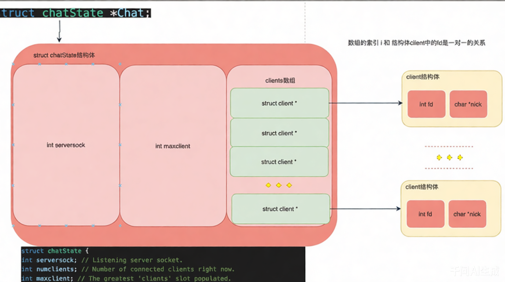

# smallchat

## 程序功能流程图:



## 运行结果:

server端:   
```shell
./output/main server
Server listening on 127.0.0.1:7711
Connected client fd=4
User4> hello

jzx> hello
```

client端:   
```shell
./output/main client localhost 7711
Welcome to Simple Chat! Use /nick <nick> to set your nick.
you> hello
you> /nick jzx
you> hello
```

