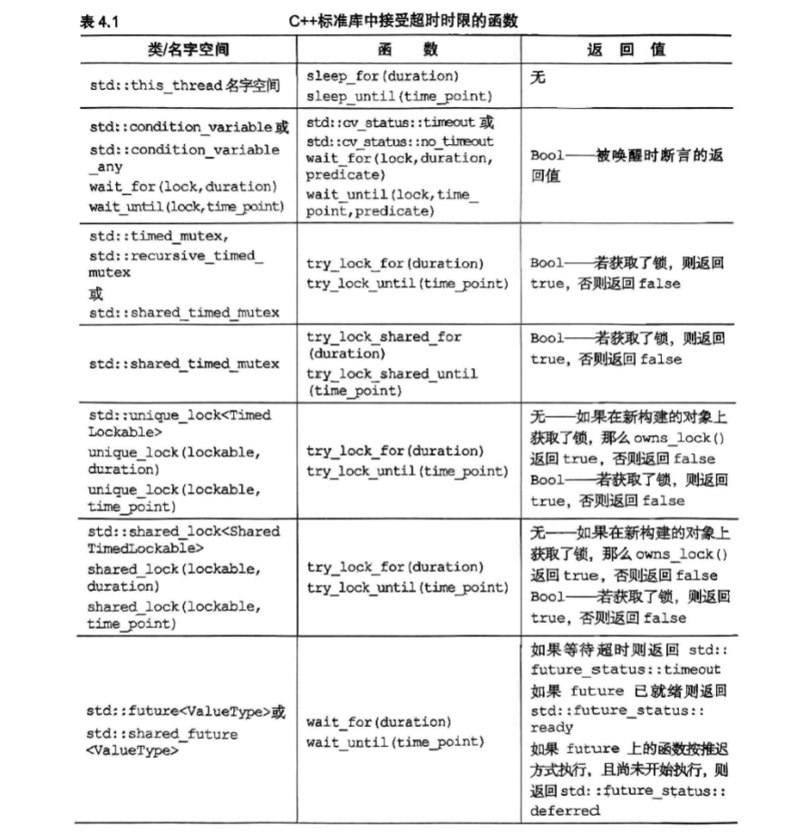

# c++ concurrency in action

## 线程管控
每个c++程序都含有至少一个线程,即运行main()的线程,这些新线程连同其实线程并发运行,当main()函数返回时,程序就会退出
```c++
#include <iostream>
#include "mingw.thread.h"
struct func{
    int & i;
    func(int & i_):i(i_){};
    void operator()(){
        for(int j=0;j<=10000;j++){
            i++;
            if(i%1000==0)
            {
                std::cout<<i<<std::endl;
            }
        }
    }
};
void test(){
    int state=0;
    func f(state);
    std::thread t(f);
    t.detach();
}
```

本例中,明确设定了不等待,于是在oops结束后，新线程可能继续运行,该线程可能访问已经被销毁的剧本变量,使线程错误

上述情形的处理方法是将数据完全复制给数据而不是共享
为了防止因抛出异常而导致的应用程序终结,我们决定如何处理这种情况,一般地，如果读者打算在没发生异常的情况下调用join(),发生异常同样需要调用join()来确保线程安全
```c++
struct func;
void f(){
    int some_local_state=0;
    func my_func(some_local_state);
    std::thread t(my_func);
    try{
        do_something_in_current_thread();
        
    }catch(...){
        t.join();
        throw;
    }
    t.join();
}
```
为了实现前面的目标
设计一个类,在标准类中运用RAII技术
在析构函数中调用join()
```c++
#include <iostream>
#include "mingw.thread.h"

class thread_guard
{
    std::thread& t;
    public:
    explicit thread_guard(std::thread& _t) : t(_t) {}
    ~thread_guard()
    {
        if (t.joinable())
        {
            t.join();
        }
    }
    thread_guard(const thread_guard&) = delete;
    thread_guard& operator=(const thread_guard&) = delete;
};
```

std::thread::id 实例常用线程,

## 在线程间共享数据

### 互斥锁
```c++
#include <iostream>
#include "mingw.thread.h"
#include "mingw.mutex.h"
#include<algorithm>
#include<list>
std::mutex some_mtx;
std::list<int> some_list;
void add_to_list(int new_value)
{
    std::lock_guard<std::mutex> guard(some_mtx);
    some_list.push_back(new_value);
}

bool list_contains(int value)
{
    std::lock_guard<std::mutex> guard(some_mtx);
    return std::find(some_list.begin(), some_list.end(), value) != some_list.end();
}
```
为了避免在buffer构造函数没有原样复制所提供的值,并未令其转换为预期的参数类型,解决方法是,在buffer传入std::thread的构造函数之前,就把它转化成std::string对象
```c++
void f(std::string const& s)
void not_oops(int some_param)
{
    char buffer[1024];
    sprintf(buffer,"%d",some_param);
    std::thread t(f,std::string(buffer));
    t.detach();
}
```
std::thread 的函数传入线程函数的参数时，线程库会把参数的引用传值当成move-only类型,并以右值传递,只要用std::ref()包装即可

std::thread t(update_data_for_widget,w,std::ref(data));

若要将某个类的成员函数设定为线程函数,我们则应该传入一个函数指针,指向该成员函数
```c++
class X
{
    public:
    void do_something();
};
X my_x;
std::thread t(&X::do_something,&my_x);
```

c++11引入了另一种传递参数的方式:参数只能移动但不能复制,即数据从某个对象转移到另一个对象时,原对象则被搬空。这种型别的其中一个例子是std::unique_ptr,它为动态分配的对象提供自动化的内存管理
在任何时候对于给定的对象,只可能存在唯一一个std::unique_ptr实例指向它;若实例被销毁,所指对象也被删除
通过移动构造move constructor和移动赋值运算符move assignment operator,可以将std::unique_ptr实例从一个对象转移到另一个对象,而不用复制对象,这种移动使源对象变成null指针.

```c++
void process_big_object(std::unique_ptr<BigObject> obj);
std::unique_ptr<BigObject> p(new BigObject);
p->prepare_data(42);
std::thread t(process_big_object,std::move(p));
```

std::move()转移big_object的归属权

虽然std::thread类并不拥有动态对象，但它们拥有另一种资源，每份实例都负责管控一个执行线程.因为std::thread类的实例能够被移动却不能复制，故线程的归属权可以在其实例之间转移

只要std::thread对象正在管控着一个线程,就不能简单地向它赋新值,否则该线程会因此被遗弃

```c++
void some_function();
void some_other_function();

std::thread t1(some_function);
std::thread t2=std::move(t1); 
t1=std::thread(some_other_function); 
std::thread t3(std::move(t2)); 
t1=std::thread(some_function); // 错误, t1正在运行线程
```
从函数内部返回std::thread对象
```c++
std::thread f()
{
    void some_function();
    return std::thread(some_function);
}
std::thread g()
{
    void some_other_function(int);
    std::thread t(some_other_function,42);
    return t;
}

//类似的,若归属权可以转移到函数内部,函数就能接受std::thread实例作为按右值传递的参数

void f(std::thread t);
void g()
{
    void some_function();
    f(std::thread(some_function));
    std::thread t(some_function);
    f(std::move(t)); 
}
```

```c++
#pragma once
#include <iostream>
#include "mingw.thread.h"

class scoped_thread{
    std::thread t;
    public:
    explicit scoped_thread(std::thread&& t_) : t(std::move(t_)){
        if(!t.joinable()){
            throw std::logic_error("No thread");
        }
    }
    ~scoped_thread(){
        if(t.joinable()){
            t.join();
        }
    }
    scoped_thread(const scoped_thread&) = delete;
    scoped_thread& operator=(const scoped_thread&) = delete;
};

class joining_thread{
    std::thread t;
    public:
    joining_thread() noexcept= default;
    template<typename Callable,typename...Args>
    explicit joining_thread(Callable&& func,Args&&...args):t(std::forward<Callable>(func),std::forward<Args>(args)...){};
    explicit joining_thread(std::thread&& t_):t(std::move(t_)){};
    explicit joining_thread(joining_thread&& other)noexcept:t(std::move(other.t)){};
    joining_thread& operator=(joining_thread&& other)noexcept{
        if(joinable())
            join();
        t=std::move(other.t);
        return *this;
    }
    ~joining_thread(){
        if(joinable())
            join();
    }
    void swap(joining_thread& other)noexcept{
        t.swap(other.t);
    }
    std::thread::id get_id()const noexcept{
        return t.get_id();
    }
    bool joinable()const noexcept{
        return t.joinable();
    }
    void join(){
        if(!t.joinable()){
            throw std::logic_error("No thread");
        }
        t.join();
    }
    void detach(){
        t.detach();
    }
    std::thread& as_thread() noexcept
    {
        return t;
    }
    const std::thread& as_thread()const noexcept{
        return t;
    }
};
```
生成多个线程,并等待它们完成运作
```c++
void do_work(unsigned id);
void f()
{
    std::vector<std::thread> threads;
    for(unsigned i=0;i<10;++i){
        threads.emplace_back(do_work,i);
    }
    for(auto& t:threads){
        t.join();
    }
}
```
线程安全的stack
```c++
#pragma once
#include <iostream>
#include "mingw.mutex.h"
#include <memory>
#include <stack>

struct empty_stack:std::exception{
    const char* what() const throw();
};

template<typename T>
class threadsafe_stack{
    private:
        std::stack<T> data;
        mutable std::mutex m;
    public:
        threadsafe_stack(){}
        threadsafe_stack(const threadsafe_stack& other)
        {
            std::lock_guard<std::mutex> lock(other.m);
            data=other.data;
        }
        threadsafe_stack& operator=(const threadsafe_stack& other)=delete;
        void push(T new_value)
        {
            std::lock_guard<std::mutex> lock(m);
            data.push(std::move(new_value));
        }
        std::shared_ptr<T> pop()
        {
            std::lock_guard<std::mutex> lock(m);
            if(data.empty())
                throw empty_stack();
            auto res=std::make_shared<T>(std::move(data.top()));
            data.pop();
        }
        bool empty() const{
            std::lock_guard<std::mutex> lock(m);
            return data.empty();
        }
};
```

条件竞争是两个线程同时抢先运行,死锁则是其反面,两个线程同时互相等待，停滞不前

c++提供std::lock()函数同时锁住多个互斥,而没有发生死锁的风险

```c++
class some_big_object;
void swap(some_big_objec& lhs,some_big_object& rhs);
class X{
    private:
        some_big_object some_detail;
        std::mutex mtx;
    public:
        X(some_big_object & sd)::some_detail(sd){}
        friend void swap(X& lhs,X& rhs){
            if(&lhs==&rhs)
                return;
            std::lock(lhs.m,rhs.m);
            std::lock_guard<std::mutex> lock_a(lhs.m,std::adopt_lock);
            std::lock_guard<std::mutex> lock_b(rhs.m,std::adopt_lock);
            swap(lhs.some_detail,rhs.some_detail);
        }
}
```

一开始对比两个参数,以确定它们指向不同实例,此项判断必不可少,原因是我们已经在std::mutex 上加锁,那么再次试图从该互斥锁将导致未定义的行为
代码调用std::lock锁定两个互斥,并根据它们分别构造std::lock_guard实例
我们除了使用互斥当这两个实例的构造参数,还额外提供了std::adopt_lock对象,以指明互斥已被锁住,即互斥上有锁的存在
std::lock函数在获取锁的过程中,如果有异常,会释放它的所获得的所有锁

针对以上场景,c++17引入了std::scoped_lock,它可以同时锁住多个互斥,并在析构时自动解锁,而不需要手动解锁
```c++
void swap(X& lhs,X& rhs)
{
    if(&lhs==&rhs)
        return;
    std::scoped_lock guard(lhs.m,rhs.m);
    swap(lhs.some_detail,rhs.some_detail);
}
```

虽然死锁的最常见诱因是锁操作,但即使没有牵涉锁,也会发生死锁操作.假定有两个线程,各自关联了std::thread实例,若它们同时在对方的std::thread实例上调用join(),就能制造死锁现象却不涉及锁操作

<mark>
防范死锁的准则最终可归纳成一个思想:只要另一线程有可能正在等待当前线程,那么当前线程不能反过来等待它
</mark>


1. 避免嵌套锁
2. 一但持锁,就必须避免调用由用户提供的程序接口
3. 依从固定顺序获取锁

假如A和B两个相邻节点,正向遍历进程先获取A锁再获取B锁，反向遍历进程先获取B锁再获取A锁,则会发生死锁

4. 按层级加锁

把应用程序分层,并且明确每个互斥位于哪个层级.若某线程以对低层级互斥加锁,则不准它再对高层级互斥加锁,具体做法是将顶层的编号赋予对应层级应用程序上的互斥,并记录各线程分别锁定了哪些互斥

下面这个例子示范了两个线程如何运用层级互斥
```c++
hierachical_mutex high_level_mutex(10000);
hierachical_mutex low_level_mutex(5000);
hierachical_mutex other_mutex(6000);

int do_low_level_stuff();
int low_level_func()
{
    std::lock_guard<hierachical_mutex> lk(low_level_mutex);
    return do_low_level_stuff();
}

void high_level_stuff(int some_param);
void high_level_func()
{   
    std::lock_guard<hierachical_mutex> lk(high_level_mutex);
    high_level_stuff(low_level_func());
}

void thread_a()
{
    high_level_func();
}

void do_other_stuff();
void other_func()
{
    std::lock_guard<hierachical_mutex> lk(other_mutex);
    do_other_stuff();
}

void thread_b()
{
    std::lock_guard<hierachical_mutex>lk(other_mutex);
    other_stuff();
}
```
上式中thread_b违反了规则,thread_b锁住了中层锁,但内部却索取了高级锁,会报错或发生异常
为自定义的hierarchical_mutex类实现层级互斥
为了使用lock_guard 锁住互斥，我们需要实现
lock(),unlock()函数,以及try_lock()函数
```c++
#include <iostream>
#include "mingw.thread.h"
#include "mingw.mutex.h"

class hierachical_mutex
{
    std::mutex internal_mutex;
    unsigned long const hierachy_value;
    unsigned long previous_hierachy_value;
    static thread_local unsigned long this_thread_hierachy_value;
    void check_for_hierarchy_violation() 
    {
        if (this_thread_hierachy_value <=hierachy_value)
        {
            throw std::logic_error("Hierachy violation");
        }
    }
    void update_hierachy_value()
    {
        previous_hierachy_value = this_thread_hierachy_value;
        this_thread_hierachy_value = hierachy_value;
    }
    public:
    explicit hierachical_mutex(unsigned long value):hierachy_value(value),previous_hierachy_value(0){}
    void lock(){
       check_for_hierarchy_violation();
       internal_mutex.lock();
       update_hierachy_value();
    }
    void unlock(){
        if(this_thread_hierachy_value != hierachy_value)
        {
            throw std::logic_error("Hierachy violation");
        }
        this_thread_hierachy_value = previous_hierachy_value;
        internal_mutex.unlock();
    }
    bool try_lock(){
        check_for_hierarchy_violation();
        if(!internal_mutex.try_lock())
        {
            return false;
        }
        update_hierachy_value();
        return true;
    }
};

thread_local unsigned long hierachical_mutex::this_thread_hierachy_value(ULLONG_MAX);

```

开始阶段,将层级编号定义为最大
任意hierachical_mutex互斥都能被加锁。因此声明由thread_local修饰,每个线程都具有自己的this_thread_hierachy_value副本,所以该变量在某个线程上的值与另一线程值完全无关,


运用std::unique_lock<>灵活加锁

构造函数接受第二参数,可以传入
例如:adopt_lock实例,以指明std::unique_lock对象管理互斥上的锁

传入std::defer_lock使互斥在完成构造时处于无锁状态

std::unique_lock对象可以不占有关联的互斥
但比std::lock_guard略慢且占用更多的空间

ock_guard 是基于互斥锁 std::mutex 实现的，unique_lock 是基于通用锁 std::unique_lock 实现的，unique_lock 可以实现比 lock_guard 更灵活的锁操作。
lock_guard 是不可移动的（moveable），即不能拷贝、赋值、移动，只能通过构造函数初始化和析构函数销毁，unique_lock 是可移动的，可以拷贝、赋值、移动。
unique_lock 提供了更多的控制锁的行为，比如锁超时、不锁定、条件变量等。
unique_lock 比 lock_guard 更重，因为它有更多的功能，更多的开销。如果只需要简单的互斥保护，使用 lock_guard 更好。

```c++
class some_big_object;
void swap(some_big_object& lhs,some_big_object& rhs);
class X{
    private:
        some_big_object some_detail;
        std::mutex mtx;
    public:
        X(some_big_object & sd):some_detail(sd){}
        friend void swap(X& lhs,X& rhs){
            if(&lhs==&rhs)
                return;
            std::unique_lock<std::mutex> lock_a(lhs.mtx,std::defer_lock);
            std::unique_lock<std::mutex> lock_b(rhs.mtx,std::defer_lock);
            std::lock(lock_a,lock_b);//此时才对互斥加锁
            swap(lhs.some_detail,rhs.some_detail);
        }
}
```

互斥的归属权可以在多个std::unique_lock实例之间转移,但不能复制
转移可以自动发生,譬如从函数返回实例时,但我们必须针对别的情形调用std::move()
std::unique_lock可转移不可复制
```c++
std::unique_lock<std::mutex> get_lock()
{
    extern std::mutex some_mutex;
    std::unique_lock<std::mutex> lk(some_mutex);
    prepare_data();
    return lk;
}

void process_data()
{
    std::unique_lock<std::mutex> lk(get_lock());
    do_something_with_data();
}
```

上面的模式主要在两种情形下使用:
1. 互斥加锁的时机取决于程序的当前状态;
2. 或者,某函数负责执行加锁操作并返回std::unique_lock对象,而互斥加锁时机则由传入的参数决定

锁的角色是其数据成员,用于保证只有正确加锁才能够访问受保护数据
所有数据通过通道类访问,若想访问数据,则需要先取得通道类的实例
再借它执行加锁操作,然后通过通道对象的成员函数才得以访问数据

我们在访问完成后销毁通道对象,锁随之释放
std::unique_lock类允许它的实例在被销毁前解锁
其成员函数unlock()负责解锁操作,这与互斥一致


持锁期间应避免任何耗时的操作,如读写文件
同样是读写文件总量相等的数据,文件操作会慢的多

```c++
void get_and_process_data()
{
    std::unique_lock<std::mutex> my_lock(the_mutex);
    some_class data_to_process = get_next_data_chunk();
    my_lock.unlock();//假定process无需加锁
    result_type result = process(data_to_process);
    my_lock.lock();
    write_result(data_to_process,result);
}
```
在比较运算的过程中,每次只锁住一个互斥
```c++
class Y
{
    private:
        int some_detail;
        mutable std::mutex m;
        int get_detail() const
        {
            std::lock_guard<std::mutex> lock(m);
            return some_detail;
        }
    public:
        Y(int sd):some_detail(sd){}
        friend bool operator==(const Y& lhs,const Y& rhs)
        {
            if(&lhs==&rhs) return true;
            int const lhs_detail = lhs.get_detail();
            int const rhs_detail = rhs.get_detail();
            return lhs_detail==rhs_detail;
        }
};
```
### 保护共享数据的其他工具

假设我们需要某个共享数据,而它创建起来开销不菲
所以等到必要时才真正着手创建,这种方式称为延迟初始化

用互斥实现线程安全的延迟初始化

```c++
std::shared_ptr<some_resource> resource_ptr;
std::mutex resource_mutex;
void foo()
{
    //此处,全部线程都被迫运行
    std::lock_guard<std::mutex> lk(resource_mutex);
    if(!resource_ptr)
    {
        resource_ptr.reset(new some_resource);
    }
    lk.unlock();
    resource_ptr->do_something();
}
```
必要的同步数据由std::once_flag实例存储
每个std::once_flag 实例对应一次不同的初始化

相比显式使用互斥,std::call_once()函数的额外开销往往更低

特别是在初始化已经完成的情况下,如果功能符合需求就应优先使用

```c++
std::shared_ptr<some_resource> resource_ptr;
std::once_flag resource_flag;
void init_resource()
{
    resource_ptr.reset(new some_resource);
}

void foo()
{
    //初始化函数准确地被唯一一次调用
    std::call_once(resource_flag,init_resource)
    resource_ptr->do_something();
}
```
```c++
class X
{
    private:
        connection_info connection_details;
        connection_handle connection;
        std::once_flag connection_init_flag;
        void open_connection()
        {
            connection = connection_manager.open(connection_details);
        }
    public:
        X(connection_info const& connection_details_):connection_details(connection_details_){}
        void send_data(data_packet const& data)
        {
            std::call_once(connection_init_flag,&X::open_connection,this);
            connection.send_data(data);
        }
        data_packet receive_data()
        {
            std::call_once(connection_init_flag,&X::open_connection,this);
            return connection.receive_data();
        }
};
```

c++11规定初始化只会在某一线程上单独发生,在初始化完成之前,
其他线程不会越过静态数据的声明而继续运行
```c++
class my_class;
my_class& get_my_class_instance()
{
    static my_class instance;
    return instance;
}
```

多个线程可以安全调用get_my_class_instance()函数,而无须担忧初始化条件的竞争

考虑一个存储着DNS条目的缓存表,它将域名解释成对应的IP地址
给定DNS条目通常在很长时间内都不会变化
DNS条目保持多年不变.尽管随着用户访问不同网站,缓存表会不时加入新条目,但在很大程度上
数据在整个生命期内将保持不变。为了判断数据是否有效,必须定期检查缓存表

std::mutex过于严苛,即使没有发生数据变动，照样会禁止并发访问，由于新的互斥具有两种不同的使用方式,因此通常被称为读写互斥

c++17提供,利用std::shared_mutex实施同步操作.更新操作可用std::lock_guard<std::shared_mutex>加锁,而读取操作可用std::shared_lock<std::shared_mutex>和std::unique_lock<std::shared_mutex>加锁

对于写看使用std::shared_lock<std::shared_mutex>实现共享访问


```c++
#include <iostream>
#include <mutex>
#include <shared_mutex>
class dns_entry;
class dns_cache
{
    std::map<std::string,dns_entry> cache;
    mutable std::shared_mutex cache_mutex;
    public:
    dns_entry const& get_entry(std::string const& domain) const
    {
        std::shared_lock<std::shared_mutex> lk(entry_mutex);
        std::map<std::string,dns_entry>::const_iterator it = cache.find(domain);
        return (it == entries.end())?dns_entry():it->second;
    }
    void update_or_add_entry(std::string const& domain,dns_entry const& dns_details)
    {
        std::lock_guard<std::shared_mutex> lk(entry_mutex);
        entries[domain]=dns_details;
    }
};
```
加入线程已经持有某个std::mutex实例,试图再次对其重新加锁就会出错,将导致未定义的行为。但在某些场景中,却有需要让线程在同一互斥上多次重复加锁,而无须解锁，c++标准库为此提供了std::recursive_mutex,其工作方式与std::mutex相似,不同之处，其允许同一线程对某互斥的同一实例多次加锁

比如当公有函数调用另一个公有函数
容许第二个公有函数成功地对递归互斥加锁
但一般更好的方法是根据这两个公有函数的共同部分,提取出一个新的私有函数

## 并发操作的同步

凭借条件变量等待条件成立
```c++
#include <iostream>
#include "mingw.thread.h"
#include "mingw.mutex.h"
#include "mingw.condition_variable.h"
#include <queue>
class data_chunk {
public:
    int data;
    data_chunk(int d) : data(d) {}
    
};
data_chunk prepare_data()
{
    return data_chunk(rand()%100);
}
std::mutex mut;
std::queue<data_chunk> data_queue;
std::condition_variable data_cond;
void data_preparation_thread() {
    while(true)
    {
       data_chunk const data = prepare_data();
       {
        std::lock_guard<std::mutex> lock(mut);
        data_queue.push(data);
       }
       data_cond.notify_one();
    }
}

void data_processing_thread() {
    while(true)
    {
        std::unique_lock<std::mutex> lk(mut);
        data_cond.wait(lk,[]{return!data_queue.empty();});
        data_chunk data = data_queue.front();
        data_queue.pop();
        lk.unlock();
        std::cout << "Processing data: " << data.data << std::endl;
    }
}
```

std::condition_variable实例上调用wait(),传入锁对象和一个lamda函数,后者用于表达需要等待成立的条件,lamda函数是c++11的新特性
wait()在内部调用传入的lamda函数,判断条件是否成立;若成立(lamda函数返回true)则wait()返回,否则wait()解锁互斥,并令线程进入阻塞状态或等待状态
数据准备线程调用notify_one()通知条件变量,线程甲随之从休眠中觉醒,重新在互斥上获取锁，再次查验条件;若条件成立,则从wait()函数返回,仍获取锁，而如果条件不成立，就解锁互斥继续等待

使用unique_lock就是为了让处理数据的线程甲能够释放互斥

利用条件变量构建线程安全的队列

```c++
#include <iostream>
#include "mingw.thread.h"
#include "mingw.mutex.h"
#include "mingw.condition_variable.h"
#include <queue>

template<typename T>
class threadsafe_queue
{
    private:
        mutable std::mutex mut;
        std::queue<T> data_queue;
        std::condition_variable data_cond;
    public:
        threadsafe_queue(){}
        threadsafe_queue(threadsafe_queue const& other)
        {
            std::lock_guard<std::mutex> lk(other.mut);
            data_queue = other.data_queue;
        }
        void push(T new_value)
        {
            std::lock_guard<std::mutex> lk(mut);
            data_queue.push(new_value);
            data_cond.notify_one();
        }
        void wait_and_pop(T& value)
        {
            std::unique_lock<std::mutex> lk(mut);
            data_cond.wait(lk,[this]{return!data_queue.empty();});
            value = data_queue.front();
            data_queue.pop();
        }
        std::shared_ptr<T> wait_and_pop()
        {
            std::unique_lock<std::mutex> lk(mut);
            data_cond.wait(lk,[this]{return!data_queue.empty();});
            std::shared_ptr<T> res(std::make_shared<T>(data_queue.front()));
            data_queue.pop();
            return res;
        }
        bool try_pop(T& value)
        {
            std::lock_gurad<std::mutex> lk(mut);
            if(data_queue.empty()) return false;
            value = data_queue.front();
            data_queue.pop();
            return true;
        
        }
        std::shared_ptr<T> try_pop()
        {
            std::lock_guard<std::mutex> lk(mut);
            if(data_queue.empty()) return std::shared_ptr<T>();
            std::shared_ptr<T> res(std::make_shared<T>(data_queue.front()));
            data_queue.pop();
            return res;
        }
        bool empty() const{
            std::lock_guard<std::mutex> lk(mut);
            return data_queue.empty();
        }
};

```
---
<mark>
在C++中，std::adopt_lock是一个锁定策略，它告诉lock_guard或unique_lock对象，互斥量在传递给锁定对象之前已经被当前线程锁定。这意味着锁定对象在构造时不会尝试锁定互斥量，而是“收养”已经存在的锁。
</mark>

---
<mark>
当你需要对多个互斥体进行操作时，使用std::defer_lock可以避免死锁的风险。例如，如果你创建了两个std::unique_lock对象并分别对两个互斥体上锁，如果两个线程中的一个先锁定了第一个互斥体，而另一个线程先锁定了第二个互斥体，就可能发生死锁。使用std::defer_lock，你可以延迟锁定操作，直到可以安全地同时锁定两个互斥体。
</mark>

---

### 使用future等待一次性事件发生

c++标准程序库使用future来模拟这类一次性事件:若线程需要等待某个特定的一次性事件发生,则会以恰当的方式取得一个future，它代表目标事件,接着，线程就能一边执行其他任务一边在future上等待；同时,它以短暂的间隔反复查验目标事件已经发生
该线程也可以转换运行模式,先不等目标事件发生，直接暂缓当前任务而切换到别的任务,及至必要时,才回头等待future准备就绪，future可能与数据相关也可能未相关
一旦目标事件发生,其future就进入就绪状态,无法重置


c++标准程序库有两种future,分别由两个类模板实现，其声明位于标准库的头文件<future>内，独占future(unique_future,即std::future<>)和共享fture(shared_future<>)

同一事件仅仅允许关联唯一一个std::future实例,但可以关联多个std::shared_future实例,只要目标事件发生,与后者关联的所有实例就会同步就绪，并且他们全都可以访问与该目标事件关联的任何数据，关联数据正是两种future以模板形式实现的原因

如果没有关联数据，我们应使用特化的模板std::future<void>和std::shared_future<void>


```c++
#include <future>
#include <iostream>
int find_the_answer_to_ltuae();
void do_other_stuff();
int main()
{
    std::future<int> the_answer = std::async(find_the_answer_to_ltuae);
    do_other_stuff();
    std::cout << "The answer to life, the universe, and everything is: " << the_answer.get() << std::endl;
}
```

std::async()和std::thread的构造函数相同，若要异步运行某个类的某成员函数,则std::async()的第一个参数应是一个函数指针，指向该类的目标成员函数,用作成员函数的参数

给std::async()补充一个参数,以指定采用哪种运行方式.参数类型为std::launch

<mark>1. std::launch::deferred:前者指定在当前线程上延后调用任务函数,等到future上调用了wait或get，任务函数才会执行;
2. std::launch::async:后者指定在一个新的线程上异步运行任务函数,future上调用wait或get时,任务函数已经完成,返回值也已经可用;
3. std::launch::async|std::launch::deferred:表示由std::async()选择运行方式,该项是默认项
</mark>

#### 关联future实例和任务

std::packaged_task<>连接了future对象与函数，其对象执行任务时会调用关联的函数(或可调用对象),把返回值保存为future的内部数据,并令future准备就绪.它可作为线程池的构建单元
std::packaged_task<>是类模板,其模板参数是函数签名，譬如void()表示一个函数,不接受参数，也没有返回值，int(std::string&,double*)代表某函数,它接收两个参数并返回int值,其中第一个参数是非const引用,指向std::string对象,第二个参数是double类型指针.
类模板std::packaged_task<>具有成员函数get_future(),它返回std::future<>实例，该future的特化类型取决于函数签名所指定的返回值
定义特化的std::packaged_task<>类模板
```c++
template<>
class packaged_task<std::vector<char>*,int>{
    public:
        template<typename Callable>
        explicit packaged_task(Callable&& func);
        std::future<std::string> get_future();
        void operator()(std::vector<char>* data,int size);
};
```

#### 在线程间传递任务
许多图形用户界面GUI框架都设立了专门的线程,作为更新界面的实际执行者.若别的线程需要更新界面,就必须向它发送消息,由它执行操作
```c++
#include<deque>
#include<mutex>
#include<future>
#include<thread>
#include<utility>

std::mutex m;
std::deque<std::packaged_task<void()>> tasks;
bool gui_shutdown_message_received();
void get_and_process_gui_message();
void gui_thread()
{
    while(!gui_shutdown_message_received())
    {
        get_and_process_gui_message();
        std::packaged_task<void()> task;
        {
            std::lock_guard<std::mutex> lk(m);
            if(!tasks.empty()) continue;
            task= std::move(tasks.front());
            tasks.pop_front();
        
        }
        task();
    }
}

std::thread gui_bg_thread(gui_thread);
template<typename Func>
std::future<void> post_task_for_gui_thread(Func f)
{
    std::packaged_task<void()> task(f);
    std::future<void> res= task.get_future();
    std::lock_guard<std::mutex> lk(m);
    tasks.push_back(std::move(task));
    return res;
}

```

#### 创建std::promise
std::promise和std::future组合使用,可以使：等待数据的线程在future上阻塞，而提供数据的线程利用相配的promise设定关联的值,使future准备就绪

```c++
#include <future>
void process_connections(connection_set& connections)
{
    while(!done(connections))
    {
        for(connection_set::iterator connection=connections.begin();connection!=connections.end();++connection)
        {
            if(connection->has_incoming_data())
            {
                data_packet data=connection->incoming();
                std::promise<payload_type>& p = it->get_promise(data.id);
                p.set_value(data.payload);
            }
            if(connection->has_outgoing_data())
            {
                outgoing_data data=connection->outgoing();
                std::promise<void>& p = it->get_promise(data.id);
                data.promise.set_value(true);
            }
        }
    }
}
```
#### 将异常保存到future中

async()抛出的异常只要调用get(),该异常就会再次被抛出

std::promise也具有同样的功能,它通过成员函数的显示调用实现,假如想保存异常
使用set_exception()
```c++
extern std::promise<double>some_promise;
try{
    some_promise.set_value(calculate_value());
}
catch()
{
    some_promise.set_exception(std::current_exception());
}

//此外还能用std::make_exception_ptr()保存新异常而不出发抛出
some_promise.set_exception(std::make_exception_ptr(my_exception("error message")));
```
#### 多个线程一起等待

当std::shared_future的实例依据std::future的实例构造而得,前者所指向的异步状态由后者决定.因为std::future对象独占异步状态，其归属权不为其他任何对象所共有,所以若要按默认方式构造std::shared_future对象，则必须用std::move向其默认构造函数传递归属权,这使std::future变为空状态

```c++
std::promise<std::string>p;
std::shared_future<std::string>sf(p.get_future());
//隐式归属权转移
```

std::future还具有可以根据初始化列表自动推断变量的类型从而使std::shared_future的实例化更加方便的特点
```c++
std::promise<std::map<someIndexType,SomeDataType,SomeComparator>::iterator> p;
auto sf=p.get_future().share();

std::promise<int> p;
    auto f = p.get_future().share();
    p.set_value(42);
    std::shared_future<int> sf = f;
    std::cout << f.get() << std::endl;
    std::cout << sf.get() << std::endl;
```
### 限时等待

有两种超时机制可以使用
1. 延迟超时:线程根据指定的时长而继续等待
2. 绝对超时:在某特定时间点来临之前,线程一直等待。

```c++
std::future<int> f=std::async(some_task);
if(f.wait_for(std::chrono::milliseconds(35))==std::future_status::ready)
do_something_with_result(f.get());
```

就变量进行限时等待
```c++
#include <condition_variable>
#include <mutex>
#include <chrono>
std::condition_variable cv;
bool done;
std::mutex m;
bool wait_loop()
{
    auto const timeout =std::chrono::steady_clock::now()+std::chrono::milliseconds(500);
    std::unique_lock<std::mutex>lk(m);
    while(!done)
    {
        if(cv.wait_until(lk,timeout)==std::cv_status::timeout)
            break;
    }
    return done;
}
```

超时时限的最简单用途是推迟特定线程的处理过程,若它不运行,就不会占用其他线程的处理时间,从而避免资源竞争

在给互斥加锁时,也能设定超时时限

使用<mark>std::timed_mutex</mark>和<mark>std::recursive_timed_mutex</mark>可以设定超时时限,这两种锁都含有成员函数try_lock_for()和try_lock_until()



快速排序的串行实现

```c++
template<typename T>
std::list<T> sequential_quick_sort(std::list<T> const& data)
{
    if(input.empty())
    {
        return input;
    }
    std::list<T> result;
    result.splice(result.begin()
    T const & pivot=*result.begin();
    auto divide=std::partition(input.begin(),input.end(),[&](T const& x){return x<pivot;});
    std::list<T> lower_part,higher_part;
    lower_part.splice(lower_part.end(),input,input.begin(),divide);
    higher_part.splice(higher_part.end(),input,lower_part.end());
    auto new_lower(sequential_quick_sort(lower_part));
    auto new_higher(sequential_quick_sort(higher_part));
    result.splice(result.end(),new_higher);
    result.splice(result.begin(),new_lower);
    return result;
}

//运用future实现并行快速排序
template<typename T>
std::list<T> parallel_quick_sort(std::list<T> input)
{
    if(input.empty()) return input;
    std::list<T> result;
    result.splice(result.begin(),input,input.begin());
    T const& pivot=*result.begin();
    auto divide=std::partition(input.begin(),input.end(),[&](T const& x){return x<pivot;});
    auto divide_point = std::partition(input.begin(),input.end(),[&](T const& x){return x<pivot;});
    std::list<T> lower_part;
    lower_part.splice(lower_part.end(),input,input.begin(),divide_point);
    std::future<std::list<T>>new_lower=std::async(parallel_quick_sort<T>,std::move(lower_part));
    auto new_higher=parallel_quick_sort(std::move(input));
    result.splice(result.end(),new_higher);
    result.splice(result.begin(),new_lower.get());
    return result;
}
```

最大的变化就是前半部分的排序不再由当前线程执行,而是通过std::async()在另一线程上操作

如果层数过高,可能会导致线程过多
除了使用std::async()之外

spawn_task()的简单实现

```c++
template<typename F,typename A>
std::future<std::result_of_t<F(A&&)>::type spawn_task(F&& f,A&& a)
{
    using result_type=std::result_of_t<F(A&&)>::type;
    std::packaged_task<result_type(A&&)> task(std::move(f));
    std::future<result_type>
    res(task.get_future());
    std::thread(std::move(task),std::move(a));
    task.detach();
    return res;
}
```

与std::async()等价的函数,其中运用了并发技术规约中的std::experimental
::future还具有可以根据初始化列表自动推断变量的类型从而使std

```c++
template<typename Func>
std::experimental::future<decltype(std::declval<Func>()())>
spawn_task(Func&& f)
{
    std::experimental::promise<decltype(std::declval<Func>()())>p;
    auto res  = p.get_future();
    std::thread t(
        [p=std::move(p),f=std::decay_t<Func>(f)]()
        mutable{
            try{
                p.set_value_at_thread_exit(f());
            }
            catch(...){
                p.set_exception_at_thread_exit(std::current_exception());
        }
        }
    );
    t.detach();
    return res;
}
```

#### 后续函数的连锁调用

假定有一系列耗时的任务需要执行,而且，为了让主线程抽身执行其他任务,我们想按异步方式执行这些任务
```c++
void  process_login(std::string const & username,std::string const& password)
{
    try{
        user_id const id = backend.authenticate_user(username,password);
        user_data const info_to_display = backend.request_current_info(id);
        update_display(info_to_display);
    }
    catch(std::exception& e)
    {
        display_error(e.what());
    }
}
```

使用后续函数处理用户登录

```c++
std::experimental::future<void> process_login(
    std::string const& username,std::string const& password
)
{
    return spawn_task([=](){
        return backend.authenticate_user(username,password);
    }).then([](std::experimental::future<user_id>id){
        return backend.request_current_info(id.get());
    }).then([](std::experimental::future<user_data>info_to_display){
        try{
            update_display(info_to_display.get());
        }catch(std::exception& e){
            display_error(e.what());
        }
    })
}
```

```c++
#include <iostream>
#include <future>
#include <thread>
#include <utility>
#include <functional>

// 定义一个支持 then 的 future 类模板
template<typename T>
class MyFuture {
public:
    MyFuture(std::future<T>&& future) : future_(std::move(future)) {}

    template<typename Func>
    auto then(Func&& func) {
        using ResultType = decltype(func(future_.get()));
        std::promise<ResultType> promise;
        auto resultFuture = promise.get_future();

        std::thread t([p = std::move(promise), f = std::move(func), future = std::move(future_)]() mutable {
            try {
                p.set_value_at_thread_exit(f(future.get()));
            }
            catch (...) {
                p.set_exception_at_thread_exit(std::current_exception());
            }
            });

        t.detach();
        return MyFuture<ResultType>(std::move(resultFuture));
    }

    std::future<T>&& get_future() {
        return std::move(future_);
    }

private:
    std::future<T> future_;
};

// 辅助函数，用于创建 MyFuture 对象
template<typename Func>
auto make_my_future(Func&& func) {
    using ResultType = decltype(func());
    std::promise<ResultType> promise;
    auto future = promise.get_future();

    std::thread t([p = std::move(promise), f = std::forward<Func>(func)]() mutable {
        try {
            p.set_value_at_thread_exit(f());
        }
        catch (...) {
            p.set_exception_at_thread_exit(std::current_exception());
        }
        });

    t.detach();
    return MyFuture<ResultType>(std::move(future));
}

int main() {
    auto future = make_my_future([]() {
        std::cout << "First task running..." << std::endl;
        return 42;
        });

    auto nextFuture = future.then([](int result) {
        std::cout << "Second task running with result: " << result << std::endl;
        return result * 2;
        });

    std::cout << "Main thread continues..." << std::endl;

    // 获取最终结果
    try {
        int finalResult = nextFuture.then([](int result) {
            std::cout << "Third task running with result: " << result << std::endl;
            return result + 10;
            }).get_future().get();
        std::cout << "Final result: " << finalResult << std::endl;
    }
    catch (const std::exception& e) {
        std::cerr << "Exception: " << e.what() << std::endl;
    }

    return 0;
}
```

使用std::async()从多个future收集结果
```c++
std::future<FinalResult> process_data(std::vector<MyData>& vec)
{
    size_t const chunk_size =whatever;
    std::vector<std::future<chunkResult>>results;
    for(auto begin=vec.begin(),end=vec.end();begin!=end)
    {
        size_t const remaining_size=end-begin;
        size_t const this_chunk_size=std::min(remaining_size,chunk_size);
        results.push_back(
            std::async(process_chunk,begin,begin+this_chunk_size));
            begin+=this_chunk_size;
    }
    return std::async([all_results=std::move(results)](){
        std::vector<chunkResult> all_chunks;
        v.reserve(results.size());
        for(auto& f:all_results)
        {
all_chunks.push_back(f.get());
        }
        return gather_results(v);
    })
};
```

上面的代码会在get()处反复被唤醒,不过,若它发现有任务尚未得出结果,旋即再次休眠
上述"等待-切换"的行为属实无用

采用std::experimental::when_all()函数从多个future收集结果

```c++
std::experimental::future<FinalResult> process_data(std::vector<MyData>& vec)
{
    size_t const chunk_size =whatever;
    std::vector<std::experimental::future<ChunkResult>>results;
    for(auto begin=vec.begin(),end=vec.end();begin!=end)
    {
        size_t const remaining_size=end-begin;
        size_t const this_chunk_size=std::min(remaining_size,chunk_size);
        results.push_back(
            spawn_async(process_chunk,begin,begin+this_chunk_size));
            begin+=this_chunk_size;
    }
    return std::experimental::when_all(results.begin(),results.end()).then([](std::future<std::vector<std::experimental::future<ChunkResult>>>ready_results)
    {
        std::vector<std::experimental::future<ChunkResult>>results=ready_results.get();
        std::vector<ChunkResult>v;
        v.rerserve(results.size());
        for(auto& f:results)
        {
            v.push_back(f.get());
        }
        return gather_results(v);
    })
}
```
<mark>
实验标头不是标准的一部分。实现可以提供它们，但不需要这样做。
它们是为C++委员会正在致力于将其纳入未来标准的特性定义的。
VisualStudio2019和2022都不提供<experimental/future></mark>

std::experimental::when_any()函数为当生成多个任务同时运行,但只要其中一个完成运行,我们就需要马上另外处理该项最先得出的结果
```c++
std::experimental::future<FinalResult>find_and_process_value(std::vector<MyData>& data)
{
    unsigned const concurrency=std::thread::hardware_concurrency();
    unsigned const num_tasks=(concurrency>0)?concurrency:2;
    std::vector<std::experimental::future<MyData*>>results;
    auto const chunk_size=(data.size()+num_tasks-1)/num_tasks;
    auto chunk_begin=data.begin();
    std::shared_ptr<std::atomic<bool>>done_flag=std::make_shared<std::atomic<bool>>(false);
    for(unsigned i=0;i<num_tasks;i++)
    {
        auto chunk_end =(i<(num_tasks-1)?chunk_begin+chunk_size:data.end());
        results.push_back(spawn_async([=]{
            for(auto it=chunk_begin;!*done_flag&&it!=chunk_end;it++)
            {
                if(matches_find_criteria(*it))
                {
                  *done_flag=true;
                  return &*entry;  
                }
            }
            return (MyData*)nullptr;
        }));
        chunk_begin=chunk_end;
    }
    std::shared_ptr<std::experimental::promise<FinalResult>>
    final_result = std::make_shared<std::experimental::promise<FinalResult>>();
    struct DoneCheck{
        std::shared_ptr<std::experimental::promise<FinalResult>>final_result;
        DoneCheck(std::shared_ptr<std::experimental::promise<FinalResult>>final_result):final_result(final_result){}
        void operator(){
            std::experimental::future<std::experimental::when_any_result<std::vector<std::experimental::future<MyData*>>>> results_param)
            {
                auto results = results_param.get();
                MyData* const ready_result=results.futures[results.index].get();
                if(ready_result)
                {
                    final_result->set_value(process_result(*ready_result));
                }
                else
                {
                    final_result->set_exception(std::make_exception_ptr(std::runtime_error("No matching value found")));
                }
            }
        }
    };
    std::experimental::when_any(results.begin(),results.end()).then(DoneCheck(final_result));
    return final_result->get_future();
}
```
#### 线程闩和线程卡

线程闩latch,是一个同步对象,内含计数器,一旦减到0,就会进入就绪状态

```c++
void foo(){
    unsigned const thread_count=...;
    latch done(thread_count);
    my_data data[thread_count];
    for(unsigned i =0;i<thread_count;i++)
    {
        threads.push_back(std::async(std::launch::async,[&,i]{
            data[i]=process_data(i);
            done.count_down();
            do_more_stuff();
        }));
    }
}
```

基本的线程卡类std::experimental::barrier
和std::experimental::flex_barrier
假定有一组线程在协同处理某些数据,各线程相互独立,分别处理数据,因此操作过程不必同步.但是只有在全部线程完成各自的处理后,才可以操作下一项数据或开始后续处理,std::experimental:: barrier针对的就是这种场景

创建线程卡,线程在完成自身的处理后,就运行到线程卡处,通过在线程卡对象上调用arrive_and_wait()等待同步组的其他线程,只要组内最后一个线程也运行至此,所有线程即被释放，线程卡会自我重置

只要线程卡上调用arrive_and_drop(),即可令线程显示脱离其同步组,那样,它就再也无法被阻拦,因而也不能等待线程卡进入就绪状态,并且,在下一个同步周期中,必须运行到线程卡处的线程将被减一


```c++
result_chunk process(data_chunk);
std::vector<data_chunk> divide_into_chunks(data_block data,unsigned chunk_size);

void process_data(data_block data,data_sink &sink){
    unsigned const concurrency = std::thread::hardware_concurrency();
    unsigned const num_tasks = (concurrency > 0)? concurrency : 2;
    std::experimental::barrier sync(num_tasks);
    std::vector<joining_thread> threads(num_tasks);
    std::vector<data_chunk> chunks;
    result_block results;
    for(unsigned i=0;i<num_threads;++i)
    {
        threads[i]=joining_thread([&,i]{
            while(!source.done())
            {
                if(!i)
                {
                    data_block current_block=source.get_next_block();
                    chunks=divide_into_chunks(current_block,num_threads);
                }
                sync.arrive_and_wait();
                result.set_chunk(i,num_threads,process(chunks[i]));
                sync.arrive_and_wait();
                if(!i){
                    sink.write_data(std::move(results));
                }
            }
        });
    }
}
```

#### std::experimental::flex_barrier

flex_barrier相比于barrier,还接受补全函数
只要全部线程都运行到线程卡处,该函数就会在其中一个线程上运行,它不但提供了机制,可以设定后续代码,令其必须按串行方式运行
还给出了方法,用于改变下一同步周期必须到达该处的线程数目,

```c++
void process_data(data_block data,data_sink & sink)
{
    unsigned const concurrency = std::thread::hardware_concurrency();
    unsigned const num_threads = (concurrency>0)?concurrency:2;
    std::vector<data_chunk>chunks;
    auto split_source=[&]{
        if(!source.done())
        {
            data_block current_block=source.get_next_data_block();
            chunks=divide_into_chunks(current_block,num_threads);
        }
    };
    split_source();
    result_block results;
    std::experimental::flex_barrier sync(num_threads,[&]{
        sink.write_data(std::move(results));
        split_source();
        return -1;
    });
    std::vector<joining_thread>threads(num_threads);
    for(unsigned i=0;i<num_threads;++i)
    {
        threads[i]=joining_thread([&,i]{
            while(!source.done())
            {
                result.set_chunk(i,num_threads,process(chunks[i]));
                sync.arrive_and_wait();
            }
        });
    }
}
```
std::experimental::flex_barrier 允许用户以一个函数对象控制完成阶段。若函数对象返回 -1，则不更改参与线程集合（而下个循环中同一参与线程集合必须抵达同步点）；否则参与线程集合变为拥有等于返回值 N 的新大小的集合，并由到达屏障同步点的下 N 个线程组成。


## c++内存模型和原子操作

原子操作是不可分割的操作,在系统的任一线程内,我们都不会观察到这种操作属于半完成状态

对于原子类型的上的每一种操作，可以提供额外的参数,从枚举类std::memory_order中取值

操作的类别决定了内存次序所准许的取值,若没有显示调用内存显示顺序,则默认使用最严
格的内存顺序,即std::memory_order_seq_cst

操作划分为三类:
1. 存储操作:可选用的内存次序有std::memory_order_relaxed,std::memory_order_release或std::memory_order_seq_cst
2. 载入操作:std::memory_order_relaxed,std::memory_order_consume，std::memory_order_acquire或std::memory_order_seq_cst
3. 度改写操作:std::memory_order_relaxed,std::memory_order_consume,std::memory_order_acquire，std::memory_order_release或std::memory_order_seq_cst


#### std::atomic_flag
是最简单的标准原子类型,表示一个布尔标志,该类型的对象只有两种状态成立或置零

std::atomic_flag类型的对象必须由宏ATOMIC_FLAG_INIT初始化

初始化后只能执行三种操作:
1. test_and_set()
2. clear()
3. 析构销毁

clear是存储操作,test_and_set是读改写操作

上面的代码中,clear()的调用显示地采用释放语义将标志清零

```c++
f.clear(std::memory_order_release);
bool x=f.test_and_set();
```

由于原子类型的操作都是原子化的,但拷贝赋值和拷贝构造都涉及两个对象
,而牵涉两个不同对象的单一操作却无法原子化,在拷贝构造或拷贝赋值的过程中,必须先从来源对象读取值,再将其写出到目标对象,这是在两个独立对象上的两个独立操作,其组合不可能是原子化的
所以原子对象禁止拷贝赋值和拷贝构造

采用std::atomic_flag实现自旋锁互斥
```c++
class spinlock_mutex{
    std::atomic_flag flag;
    public:
    spinlock_mutex():flag(ATOMIC_FLAG_INIT){};
    void lock(){
        while(flag.test_and_set(std::memory_order_acquire));
    }
    void unlock(){
        flag.clear(std::memory_order_release);
    }
}
```

#### std::atomic<bool>
该类型的实例能接受非原子布尔量的赋值
```c++
std::atomic<bool> b(true);
b=false;
```
```c++
std::atomic<bool> b;
bool x=b.load(std::memory_order_acquire);
b.store(true);
x=b.exchange(false,std::memory_oreder_acq_rel);
```
比较交换操作给定一个期望值,原子变量将它和自身比较,如果相等,就存入另一既定的值,否则更新期望值所属变量,向它赋予原子变量的值
原子值与期望值相等返回true,否则返回false
对于compare_exchange_weak(),即使原子变量的值等于期望值
保存动作仍有可能失败,在这种情形下,原子变量维持原值不变,compare_exchange_weak()返回false
由于操作中途因系统调度切出导致操作失败成为佯败
compare_exchange_weak()可能发生佯败,所以往往使用循环

```c++
bool expected = false;
extern atomic<bool> b;
while(!b.compare_exchange_weak(expected,true)&&(!expected));
```
只要expected变量还是false,就说明compare_exchange_weak()的调用发生佯败继续循环

比较交换函数可以接受两个内存次序参数,这使程序能够区分成功和失败
两种情况,采用不同的内存次序
合适的做法是:若操作成功,就采用std::memory_order_acq_rel内存次序
否则改用std::memory_order_relaxed内存次序
失败操作设定的内存次序不能比成功操作的更严格,若将失败操作的内存次序指定为std::memory_order_acquire或std::memory_order_seq_cst

#### std::atomic<T*> 算术类型的指针运算

fetch_add()等都是读改写操作,进行计算返回旧值

```c++
class Foo{};
Foo some_array[10];
std::atomic<Foo*> ptr(&some_array[0]);
ptr.fetch_add(2);
```
对于这些操作符的重载,总是服从std::memory_order_seq_cst内存次序

#### 泛化std::atomic<>类模板
对于自定义类型UDT,其原子化类型就是std::atomic<UDT>
所提供的接口与std::atomic<T>相同
不同之处在于函数中凡是涉及该类原子对象所表示的值,它的参数和返回值就要改成UDT类型

对于某个自定义类型UDT,其原子化类型需要具备平实拷贝赋值操作符
不含有任何虚函数,也不可以从虚基类派生出来,还必须由编译器代其隐式生成拷贝赋值操作符
另外,若定义类型具有基类或非静态数据,则其同样需要具备平时拷贝操作符

编译器借用memcpy()函数实现平实拷贝赋值操作符
比较交换操作符采用的是逐位比较,效果等同于memcmp()函数

如果自定义类型含有填充位,却不参与普通比较操作,那么即使UDT对象的值相等
比较-交换操作还是会失败

### 同步操作和强制顺序

#### 同步关系
基本思想:对变量x执行原子写操作W和原子读操作R，且两者都有适当的标记,只要满足下面其中一点,它们彼此同步

1. R读取了W直接存入的值
2. W所属线程随后还执行了另一原子写操作,R读取了后面存入的值
3. 任意线程执行一连串读改写操作,其中第一个操作读取的值都是W写的数据

#### 先行关系
先行关系和严格先行关系是清楚界定哪些操作呢能够顾看见其他哪些操作产生的结果

原子操作虽然有6种内存次序，但仅代表三种模式:
1. 先后一致次序:memory_order_seq_cst
2. 获取-释放次序:memory_order_acquire,memory_order_release,memory_order_acq_rel
memory_order_consume
3. 宽松次序:memory_order_relaxed

##### 先后一致顺序
如果在一个线程内,某项操作优先于另一项发生,那么其他线程所见的先后次序都必须如此
为了保持绝对先后一致,所有线程都必须采用保序原子操作
顺序一致性均保证所有线程的执行语句全局一致，不会存在重排。
```c++
#include<atomic>
#include "mingw.thread.h"
#include <assert.h>
#include<iostream>

std::atomic<bool> x,y;
std::atomic<int> z;

void write_x()
{
    x.store(true,std::memory_order_seq_cst);
}

void write_y()
{
    y.store(true,std::memory_order_seq_cst);
}

void read_x_then_y()
{
    while(!x.load(std::memory_order_seq_cst));
    if(y.load(std::memory_order_seq_cst)) ++z;
}

void read_y_then_x()
{
    while(!y.load(std::memory_order_seq_cst));
    if(x.load(std::memory_order_seq_cst)) ++z;
}

int main()
{
    x = false;
    y = false;
    z = 0;
    std::thread t1(write_x);
    std::thread t2(write_y);
    std::thread t3(read_x_then_y);
    std::thread t4(read_y_then_x);
    t1.join();
    t2.join();
    t3.join();
    t4.join();
    assert(z.load()!=0);
    std::cout<<"z = "<<z.load()<<std::endl;
    return 0;
}
```
关于上述代码利用上述解释可参考如下：

1. 首先随机选择一个线程b执行，此时y为true
2. 随机选择下一个线程a执行，此时x为true
3. 随机选择c线程执行，z为1
4. 随机选择d执行，z为2
这个过程是全局一致的，因此最后z为2

或者上述也可能存在其他的顺序，譬如：

1. 随机选择线程c执行，此时x为false，线程c一直循环
2. 随机选择线程d执行，此时y为fasle，线程d一直循环
3. 随机选择线程a执行，此时x为true
4. 随机选择线程c执行，此时y为false，x为true，z为0
5. 随机选择线程b执行，此时y为true，x为true
6. 随机选择线程d执行，此时z为1

##### 非先后一致顺序
在不同的cpu缓存和内部缓冲中,同一份内存数据可能具有不同的值

##### 宽松次序
原子类型上的操作不存在同步关系
宽松原子操作几乎不要求服从任何次序
```c++
#include <iostream>
#include "mingw.thread.h"
#include <atomic>
#include <assert.h>
std::atomic<bool> x,y;
std::atomic<int> z;

void write_x_then_y() {
    x.store(true,std::memory_order_relaxed);
    y.store(true,std::memory_order_relaxed);
}

void read_x_then_y() {
    while(!x.load(std::memory_order_relaxed));
    if(y.load(std::memory_order_relaxed)) {
        ++z;
    }
}

int main() {
    x=false;
    y=false;
    z=0;
    std::thread t1(write_x_then_y);
    std::thread t2(read_x_then_y);
    t1.join();
    t2.join();
    assert(z.load(std::memory_order_relaxed)==1);
    std::cout << "z=" << z.load(std::memory_order_relaxed) << std::endl;
    return 0;
}
```

此时断言可能发生报错

多个线程上的宽松原子操作
```c++
#include "mingw.thread.h"
#include <iostream>
#include <atomic>
std::atomic<int> x(0), y(0),z(0);
std::atomic<bool> go(false);

unsigned const loop_count = 10;
struct read_values
{
    int x,y,z;
};

read_values values[loop_count];
read_values values2[loop_count];
read_values values3[loop_count];
read_values values4[loop_count];
read_values values5[loop_count];

void increment(std::atomic<int>* var_to_inc,read_values* values)
{
    while(!go) std::this_thread::yield();
    for (size_t i = 0; i < loop_count; ++i)
    {
        values[i].x = x.load(std::memory_order_relaxed);
        values[i].y = y.load(std::memory_order_relaxed);
        values[i].z = z.load(std::memory_order_relaxed);
        var_to_inc->fetch_add(1, std::memory_order_relaxed);
        std::this_thread::yield();
    }
}

void read_vals(read_values* values)
{
    while(!go) std::this_thread::yield();
    for (size_t i = 0; i < loop_count; ++i)
    {
        values[i].x = x.load(std::memory_order_relaxed);
        values[i].y = y.load(std::memory_order_relaxed);
        values[i].z = z.load(std::memory_order_relaxed);
        std::this_thread::yield();// 允许其他线程推送工作到队列
    }
}

void print(read_values* v)
{
    for (size_t i = 0; i < loop_count; ++i)
    {
        if(i) std::cout << ", ";
        std::cout << "(" << v[i].x << "," << v[i].y << "," << v[i].z << ")";
    }
    std::cout << std::endl;
}

int main()
{
    std::thread t1(increment, &x, values);
    std::thread t2(increment, &y, values2);
    std::thread t3(increment, &z, values3);
    std::thread t4(read_vals, values4);
    std::thread t5(read_vals, values5);

    go = true;

    t1.join();
    t2.join();
    t3.join();
    t4.join();
    t5.join();

    print(values);
    print(values2);
    print(values3);
    print(values4);
    print(values5);

    return 0;
}
```

运用获取-释放次序,它避免了绝对先后一致次序的额外开销

##### 获取-释放顺序

其比宽松顺序严格一点可以产生一定程度的同步而不会形成服从先后一致次序的全局总操作序列

该模型中:原子化载入为获取操作
原子化存储为释放操作，而原子化读改写则为获取或释放操作

这种内存次序在成对的读写线程之间起到同步作用
释放与获取操作构成同步关系，前者写出的值由后者读取

```c++
#include<atomic>
#include "mingw.thread.h"
#include <assert.h>
#include<iostream>

std::atomic<bool> x,y;
std::atomic<int> z;

void write_x()
{
    x.store(true,std::memory_order_release);
}

void write_y()
{
    y.store(true,std::memory_order_release);
}

void read_x_then_y()
{
    while(!x.load(std::memory_order_acquire));
    if(y.load(std::memory_order_acquire)) ++z;
}

void read_y_then_x()
{
    while(!y.load(std::memory_order_acquire));
    if(x.load(std::memory_order_acquire)) ++z;
}


```

```c++
void write_x_then_y() {
    x.store(true,std::memory_order_relaxed);
    y.store(true,std::memory_order_release);
}

void read_y_then_x() {
    while(!y.load(std::memory_order_acquire));
    if(x.load(std::memory_order_relaxed)) {
        ++z;
    }
}
```
上面的代码中y的写与读相同步
此时由于x的写入先于y
所以y的读操作后再进行x的读操作一定成功
所以此处z的结果为1

但如果上面y的载入操作没放在while循环中,y的载入可能为false此时x则不再确定
获取和释放操作成对时才可以产生同步

运用获取释放次序传递同步
```c++  
std::atomic<int>data[5];
std::atomic<bool> sync1(false),sync2(false);
void thread_1()
{
    data[0].store(42,std::memory_order_relaxed);
    data[1].store(13,std::memory_order_relaxed);
    data[2].store(21,std::memory_order_relaxed);
    data[3].store(34,std::memory_order_relaxed);
    data[4].store(55,std::memory_order_relaxed);
    sync1.store(true,std::memory_order_release);

}
void thread_2()
{
    while(!sync1.load(std::memory_order_acquire));
    sync2.store(true,std::memory_order_release);
}

viid thread_3()
{
    while(!sync2.load(std::memory_order_acquire));
    assert(data[0].load(std::memory_order_relaxed)==42);
    assert(data[1].load(std::memory_order_relaxed)==13);
    assert(data[2].load(std::memory_order_relaxed)==21);
    assert(data[3].load(std::memory_order_relaxed)==34);
    assert(data[4].load(std::memory_order_relaxed)==55);
}
```

尽管thread_2只接触过sync1和sync2,但这足以同步线程thread_1和thread_3,从而保证每个断言都不会触发

上例中,我们还能进一步将变量sync1和sync2融合成单一变量,在线程thread_2上对其执行"读-改-写"操作
该操作采用memory_order_acq_rel次序
```c++
std::atomic<int>sync(0);
void thread_1()
{
    sync.store(1,std::memory_order_relaxed);
}
void thread_2()
{
    int expected = 1;
     //  原子的比较 *this  和 expect的值，若它们逐位相等，则以 desired 替换前者（进行读修改写操作）。否则，将 *this 中的实际值加载进 expected （进行加载操作）。
    std::atomic<int> counter(0);
    while(!sync.compare_exchange_strong(expected,2,std::memory_order_acq_rel));
    expected = 1;
}

void thread_3()
{
    while(sync.load(std::memory_order_acquire)<2);
}

```

##### 获取-释放次序和memory_order_consume
这种内存次序可以按原子化方式载入某份数据的指针,我们把存储操作设定成memory_order_release次序
而将后面的读取操作设定为memory_order_consume次序

即可保证所指向的目标数据得到正确同步而无须对任何非独立数据施加同步措施

```c++
struct X
{
    int i;
    std::string s;
};
std::atomic<X*> p;
std::atomic<int> a;

void create_x()
{
    X* x=new X;
    x->i=42;
    x->s="hello";
    a.store(99,std::memory_order_relaxed);
    p.store(x,std::memory_order_release);
}

void use_x()
{
    X* x;
    while(!(x=p.load(std::memory_order_consume)))
    {
        std::this_thread::sleep(std::chrono::milliseconds(100));
    }
    assert(x->i==42);
    assert(x->s=="hello");
    assert(a.load(std::memory_order_relaxed)==99);
}

```
上述代码结构的意义在于保证指针p的载入操作接受判别表达式带来依赖,
因此两个断言肯定都不会触发
而a的断言可能会触发

若代码有大量携带依赖,则会造成额外开销,我们并不想编译器面对依赖而束手无策
而希望它将值缓存在CPU寄存器中,并重新编排指令进行优化

这时,我们可以用std::kill_dependency()显式打断依赖链,假设有一个只读的全局数组
其索引值由其他线程给出,而我们采用std::memory_order_consume次序接受该值
那么可以用std::kill_dependency()告知编译器,无须重复读数组元素
```c++
int global_data[]={};
std::atomic<int> index(0);
void f()
{
    int i = index.load(std::memory_order_consume);
    do_something_with(global_data[std::kill_dependency(i)]);
}
```

<strong>如果存储操作的标记是memory_order_release,memory_order_acq_rel或memory
_order_seq_cst,而载入操作则以memory_order_consume,memory_order_acquire或memory_order_seq_cst
标记,那么操作链由一个释放序列组成
</strong>
<strong>若最后载入操作服从内存次序memory_order_acquire或memory_order_seq_cst与它构成同步关系,但如果该载入操作服从的内存次序是memory_order_consume那么两者构成前序依赖关系,操作链中,每个"读-改-写"操作都可以选用任意内存次序,甚至也能选用memory_order_relaxed次序
</strong>

```c++
#include<atomic>
#include<iostream>
#include<vector>
#include "mingw.thread.h"
std::atomic<int> count (0);
std::vector<int> queue_data;

void populate_queue()
{
    unsigned const number_of_items = 20;
    queue_data.clear();
    for(unsigned i=0;i<number_of_items;++i)
    {
        queue_data.push_back(i);
    }
    count.store(number_of_items,std::memory_order_release);
}

void consume_queue_items()
{
    while(true)
    {
        int item_index;
        if((item_index=count.fetch_sub(1,std::memory_order_acquire))<=0)
        {
            while(queue_data.empty());
            continue;
        }
        std::cout<<"Consumed item: "<<queue_data[item_index-1]<<std::endl;
    }
}

int main()
{
    std::thread t1(populate_queue);
    std::thread t2(consume_queue_items);
    std::thread t3(consume_queue_items);
    t1.join();
    t2.join();
    t3.join();
    return 0;   
}
```

count.fetch_sub(1,std::memory_order_acquire)表示向其他线程告知它会从容器取出一项数据,然后才真正读取共享缓冲,一旦计数值为0,即再无数据项可取,消费线程必须就此等待

上述代码中两个线程进行取操作,除非前一个线程也采用memory_order_release，但这样的同步过于严格


### 栅栏

栅栏具备多种操作,用途是强制施加内存次序
却无需改动任何数据
通常,它们与服从memory_order_relaxed次序的原子操作组合使用。栅栏操作全部通过全局函数执行。
当线程运行至栅栏处时,它便会对线程中其他原子操作的次序产生作用,栅栏也常常被称作内存卡,或内存屏障,原因是它们在代码中划出界限,限定某些操作不得通行
在一个多线程程序中，可能原来并非处处具备先行关系和同步关系,栅栏则在欠缺之处引入这两种关系

```c++
#include <atomic>
#include "mingw.thread.h"
#include <assert.h>
#include <iostream>
std::atomic<bool> x,y;
std::atomic<int> z;
void write_x_then_y()
{
    x.store(true,std::memory_order_relaxed);
    std::atomic_thread_fence(std::memory_order_release);
    y.store(true,std::memory_order_relaxed);
}

void read_y_then_x()
{
    while(!y.load(std::memory_order_relaxed));
    std::atomic_thread_fence(std::memory_order_acquire);
    if(x.load(std::memory_order_relaxed)) ++z;
}

int main()
{
    x=false;
    y=false;
    z=0;
    std::thread a(write_x_then_y);
    std::thread b(read_y_then_x);
    a.join();
    b.join();
    assert(z.load() != 0);
    std::cout << "z=" << z.load() << std::endl;
    return 0;
}
```
上面的例子通过加入栅栏实现了同步
加入栅栏使存储操作不再服从memory_order_relaxed次序,而是以memory_order_release次序进行,
而读取操作则以memory_order_acquire次序进行,这样就能确保读取操作先于写入操作进行,从而实现同步

尽管栅栏是让读写同步,但同步点是栅栏本身

```c++
void write_x_then_y()
{
    std::atomic_thread_fence(std::memory_order_release);
    x.store(true,std::memory_order_relaxed);
    y.store(true,std::memory_order_relaxed);
}
```
栅栏不再前后分隔这两个写出操作,因此它们之间原来的先后次序不复存在,栅栏只有放置在变量x和y的存储操作之间,才会强制这两个操作服从先后次序

### 凭借原子操作令非原子操作服从内存次序

向非原子操作强制施行内存次序
```c++
#include <atomic>
#include "mingw.thread.h"
#include <assert.h>
#include <iostream>
bool x=false;
std::atomic<bool> y;
std::atomic<int> z;

void write_x_then_y()
{
    x=true;
    std::atomic_thread_fence(std::memory_order_release);
    y.store(true, std::memory_order_relaxed);
}

void read_y_then_x()
{
    while(!y.load(std::memory_order_relaxed));
    std::atomic_thread_fence(std::memory_order_acquire);
    if(x) ++z;
}

int main()
{
    x=false;
    y=false;
    z=0;
    std::thread a(write_x_then_y);
    std::thread b(read_y_then_x);
    a.join();
    b.join();
    assert(z.load()!=0);
    std::cout<<"z="<<z.load()<<std::endl;
}
```
##### 强制非原子操作服从内存次序

lock()实现方式是在循环中反复调用flag.text_and_set()，其中所采用的次序为std::memory_order_acquire,unlock()
实质上是服从std::memory_order_release次序
的flag.clear()操作,第一个线程调用lock()时,标志flag处于置零状态,test_and_set()第一次调用会设置标志成立并返回false,表示负责执行的线程已获取了锁,遂循环结束,互斥随即生效,该线程可修改受其保护的数据而不受干扰,此时标志已设置成立,如果任何其他线程再调用lock()，都会在test_and_set()所在循环中阻塞

当持锁线程完成了受保护数据的改动,就调用unlock(),再进一步按std::memory_order_release次序语义执行了flag.clear()
若第二个线程因调用了lock()而反复执行flag.test_and_set(),又因该操作采用了std::memory_order_acquire次序语义,故标志上的这两项操作形成同步,根据互斥的使用规则,首先,受保护数据的改动须按流程顺序在调用 unlock()前完成,其次只有在解锁以后才能重新加锁；最后，第二个线程需要先获取锁,接着才可以访问目标数据,所以,改动先于unlock()发生,自然也先于第二个线程的lock()调用,进而更加先于第二个线程数据访问

前面章节介绍的同步机制如下:
1. std::thread
如果我们给出一个函数或可调用对象,凭借构造std::thread实例创建新线程并由它执行,那么该实例的构造函数的完成与前者的调用形成同步
若管控线程的std::thread对象上执行了join调用,而此函数返回成功,则该线程的运行完成与这一返回动作同步

2. std::mutex,std::timed_mutex,std::recursive_mutex和std::recursive_timed_mutex
给定一互斥对象,其上的lock()和unlock()的全部调用,以及try_lock()，try_lock_for()和try_lock_until()的调用会形成单一总序列,即对该互斥进行加锁和解锁的操作序列

给定一互斥对象,其上的lock()和unlock()的全部调用,以及try_lock(),try_lock_for()和try_lock_until()的成功调用会形成单一总序列,即对该互斥进行加锁和解锁的操作序列
给定一互斥对象,在其加锁和解锁的操作序列中，每个unlock()调用都与下一个lock()调用同步,或与下一个try_lock(),try_lock_for()或try_lock_until()的调用失败,则不构成同步关系

3. std::shared_mutex,std::shared_timed_mutex
给定一互斥对象,其上的lock(),unlock(),lock_shared()和unshared_shared()的全部调用以及try_lock(),try_lock_for()和try_lock_shared_until()的成功调用会形成单一总序列,即对该沪指进行加锁和解锁的操作序列

给定一互斥对象,在其加锁和解锁的操作序列中,每个unlock()调用都与下一个lock()调用同步,或与下一个try_lock(),try_lock_for(),try_lock_until(),try_lock_shared()或try_lock_shared_for()的成功调用同步,但如果调用失败则不构成任何同步关系

4. std::promise,std::future,std::shared_future
给定一std::promise对象,则我们由get_future()得到关联的std::future对象,我们共享异步状态,如果std::promise上的set_value()或set_exception()调用成功,又如果我们接着在该std::future对象上调用wait()或get(),wait_for()或wait_until()，成功返回std::future_status::ready,那么这两次调用的成功返回构成同步

给定一std::promise对象,则我们由get_future()得到关联的std::future对象,它们共享异步状态,如果出现异常,该异步状态就会存储一个std::future_error异常对象,又如果我们在关联的std::future对象上调用wait()...成功返回std::future_status::ready，那么std::promise对象的析构函数与该成功返回构成同步

5. std::packaged_task,std::future和std::shared_future
给定一std::packaged_task对象,则我们由get_future()得到关联的std::future对象,它们共享异步状态,如果包装的任务由std::packaged_task的函数调用操作符运行,我们关联的std::future对象上调用wait(),get(),wait_for()或wait_until()成功返回std::future_status::ready,那么这两次调用的成功返回构成同步

给定一std::packaged_task对象,则我们由get_future()得到关联的std::future对象,它们共享异步状态,如果包装的任务抛出异常,该异步状态就会存储一个std::future_error异常对象,又如果我们在关联的std::future对象上调用wait()...成功返回std::future_status::ready,那么std::packaged_task对象的析构函数与该成功返回构成同步

6. std::async，std::future和std::shared_futrure,如果一项任务通过调用std::launch::async方式在其他线程上异步运行,则该std::async调用会生成一个关联的std::future对象,它与启动的任务共享异步状态,若我们在该std::future对象上调用wait(),get()，wait_for()或wait_until()成功返回std::future_status::ready,那么任务的完成与该任务成功返回构成同步

如果以std::launch::deferred方式启动的任务,则该任务的运行与std::async调用的返回同步,若任务的运行完成,则该任务的结果与std::future对象上调用wait(),get()，wait_for()或wait_until()的成功返回同步,若任务抛出异常,则该异常与std::future对象上调用wait(),get()，wait_for()或wait_until()的异常返回同步

7. std::experimental::future，std::experimental::shared_future和后续函数
异步共享状态会因目标事件触发而变成就绪,共享状态上所编排的后续函数也随之运行,该事件与后续函数的启动构成同步，在起始future上调用then来编排后续函数,并由此生成另一个std::future对象,它与起始future共享异步状态,若我们在该新std::future对象上调用wait(),get(),wait_For()或wait_until(),成功返回std::future_status::ready那么后续函数的完成会与该成功返回构成同步,或与所编排的下一个后续函数的启动构成同步

8. std::latch 若在其上调用count_down(),或count_down_and_wait()，则每次调用的启动都与其自身的完成同步
9. std::barrier 若在其上调用arrive_and_wait()或arrive_and_drop(),则每次调用的启动都与其自身的完成同步
10. std::experimental::flex_barrier：给定一std::experimental::flex_barrier实例,若在其上调用arrive_and_wait()或arrive_and_drop(),则每次调用的启动都与其下一次arrive_and_wait()运行完成同步
给定一 std::experimental::flex_barrier实例,若在其上调用wait()或wait_for()或wait_until(),则每次调用的启动都与其补全函数的全部启动完成同步
给定一 std::experimental::flex_barrier实例,若在其上调用arrive_and_drop(),则这些调用会因等待补全函数的完成而发生阻塞,而补全函数的返回与这些调用的完成构成同步

11. std::condition_variable和std::condition_variable_any
条件变量并不提供任何同步关系,它们本质上是忙碌等循环的优化,其所有同步功能都由关联的互斥提供


## 设计基于锁的并发数据结构


