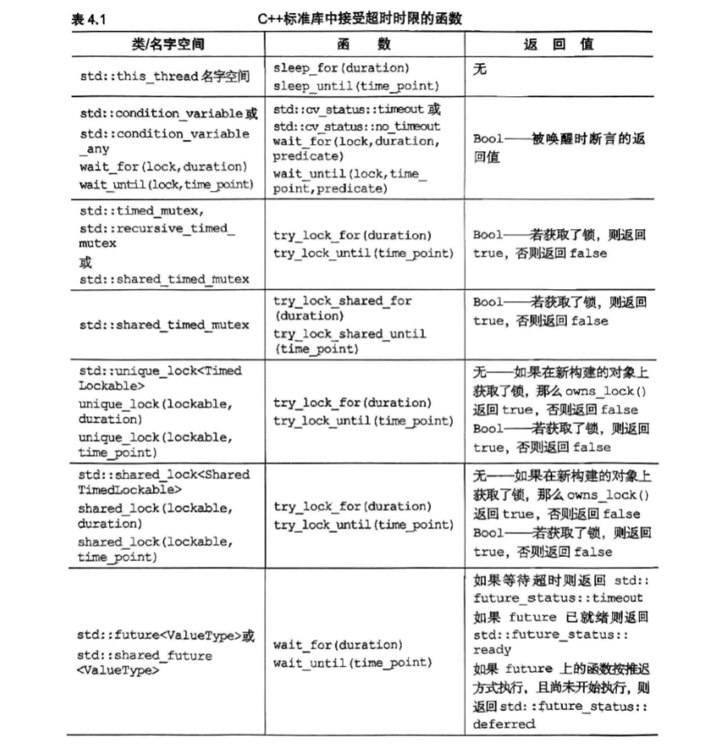

# c++ concurrency in action
[TOC]
## 线程管控
每个c++程序都含有至少一个线程,即运行main()的线程,这些新线程连同其实线程并发运行,当main()函数返回时,程序就会退出
```c++
#include <iostream>
#include "mingw.thread.h"
struct func{
    int & i;
    func(int & i_):i(i_){};
    void operator()(){
        for(int j=0;j<=10000;j++){
            i++;
            if(i%1000==0)
            {
                std::cout<<i<<std::endl;
            }
        }
    }
};
void test(){
    int state=0;
    func f(state);
    std::thread t(f);
    t.detach();
}
```

本例中,明确设定了不等待,于是在oops结束后，新线程可能继续运行,该线程可能访问已经被销毁的剧本变量,使线程错误

上述情形的处理方法是将数据完全复制给数据而不是共享
为了防止因抛出异常而导致的应用程序终结,我们决定如何处理这种情况,一般地，如果读者打算在没发生异常的情况下调用join(),发生异常同样需要调用join()来确保线程安全
```c++
struct func;
void f(){
    int some_local_state=0;
    func my_func(some_local_state);
    std::thread t(my_func);
    try{
        do_something_in_current_thread();
        
    }catch(...){
        t.join();
        throw;
    }
    t.join();
}
```
为了实现前面的目标
设计一个类,在标准类中运用RAII技术
在析构函数中调用join()
```c++
#include <iostream>
#include "mingw.thread.h"

class thread_guard
{
    std::thread& t;
    public:
    explicit thread_guard(std::thread& _t) : t(_t) {}
    ~thread_guard()
    {
        if (t.joinable())
        {
            t.join();
        }
    }
    thread_guard(const thread_guard&) = delete;
    thread_guard& operator=(const thread_guard&) = delete;
};
```

std::thread::id 实例常用线程,

## 在线程间共享数据

### 互斥锁
```c++
#include <iostream>
#include "mingw.thread.h"
#include "mingw.mutex.h"
#include<algorithm>
#include<list>
std::mutex some_mtx;
std::list<int> some_list;
void add_to_list(int new_value)
{
    std::lock_guard<std::mutex> guard(some_mtx);
    some_list.push_back(new_value);
}

bool list_contains(int value)
{
    std::lock_guard<std::mutex> guard(some_mtx);
    return std::find(some_list.begin(), some_list.end(), value) != some_list.end();
}
```
为了避免在buffer构造函数没有原样复制所提供的值,并未令其转换为预期的参数类型,解决方法是,在buffer传入std::thread的构造函数之前,就把它转化成std::string对象
```c++
void f(std::string const& s)
void not_oops(int some_param)
{
    char buffer[1024];
    sprintf(buffer,"%d",some_param);
    std::thread t(f,std::string(buffer));
    t.detach();
}
```
std::thread 的函数传入线程函数的参数时，线程库会把参数的引用传值当成move-only类型,并以右值传递,只要用std::ref()包装即可

std::thread t(update_data_for_widget,w,std::ref(data));

若要将某个类的成员函数设定为线程函数,我们则应该传入一个函数指针,指向该成员函数
```c++
class X
{
    public:
    void do_something();
};
X my_x;
std::thread t(&X::do_something,&my_x);
```

c++11引入了另一种传递参数的方式:参数只能移动但不能复制,即数据从某个对象转移到另一个对象时,原对象则被搬空。这种型别的其中一个例子是std::unique_ptr,它为动态分配的对象提供自动化的内存管理
在任何时候对于给定的对象,只可能存在唯一一个std::unique_ptr实例指向它;若实例被销毁,所指对象也被删除
通过移动构造move constructor和移动赋值运算符move assignment operator,可以将std::unique_ptr实例从一个对象转移到另一个对象,而不用复制对象,这种移动使源对象变成null指针.

```c++
void process_big_object(std::unique_ptr<BigObject> obj);
std::unique_ptr<BigObject> p(new BigObject);
p->prepare_data(42);
std::thread t(process_big_object,std::move(p));
```

std::move()转移big_object的归属权

虽然std::thread类并不拥有动态对象，但它们拥有另一种资源，每份实例都负责管控一个执行线程.因为std::thread类的实例能够被移动却不能复制，故线程的归属权可以在其实例之间转移

只要std::thread对象正在管控着一个线程,就不能简单地向它赋新值,否则该线程会因此被遗弃

```c++
void some_function();
void some_other_function();

std::thread t1(some_function);
std::thread t2=std::move(t1); 
t1=std::thread(some_other_function); 
std::thread t3(std::move(t2)); 
t1=std::thread(some_function); // 错误, t1正在运行线程
```
从函数内部返回std::thread对象
```c++
std::thread f()
{
    void some_function();
    return std::thread(some_function);
}
std::thread g()
{
    void some_other_function(int);
    std::thread t(some_other_function,42);
    return t;
}

//类似的,若归属权可以转移到函数内部,函数就能接受std::thread实例作为按右值传递的参数

void f(std::thread t);
void g()
{
    void some_function();
    f(std::thread(some_function));
    std::thread t(some_function);
    f(std::move(t)); 
}
```

```c++
#pragma once
#include <iostream>
#include "mingw.thread.h"

class scoped_thread{
    std::thread t;
    public:
    explicit scoped_thread(std::thread&& t_) : t(std::move(t_)){
        if(!t.joinable()){
            throw std::logic_error("No thread");
        }
    }
    ~scoped_thread(){
        if(t.joinable()){
            t.join();
        }
    }
    scoped_thread(const scoped_thread&) = delete;
    scoped_thread& operator=(const scoped_thread&) = delete;
};

class joining_thread{
    std::thread t;
    public:
    joining_thread() noexcept= default;
    template<typename Callable,typename...Args>
    explicit joining_thread(Callable&& func,Args&&...args):t(std::forward<Callable>(func),std::forward<Args>(args)...){};
    explicit joining_thread(std::thread&& t_):t(std::move(t_)){};
    explicit joining_thread(joining_thread&& other)noexcept:t(std::move(other.t)){};
    joining_thread& operator=(joining_thread&& other)noexcept{
        if(joinable())
            join();
        t=std::move(other.t);
        return *this;
    }
    ~joining_thread(){
        if(joinable())
            join();
    }
    void swap(joining_thread& other)noexcept{
        t.swap(other.t);
    }
    std::thread::id get_id()const noexcept{
        return t.get_id();
    }
    bool joinable()const noexcept{
        return t.joinable();
    }
    void join(){
        if(!t.joinable()){
            throw std::logic_error("No thread");
        }
        t.join();
    }
    void detach(){
        t.detach();
    }
    std::thread& as_thread() noexcept
    {
        return t;
    }
    const std::thread& as_thread()const noexcept{
        return t;
    }
};
```
生成多个线程,并等待它们完成运作
```c++
void do_work(unsigned id);
void f()
{
    std::vector<std::thread> threads;
    for(unsigned i=0;i<10;++i){
        threads.emplace_back(do_work,i);
    }
    for(auto& t:threads){
        t.join();
    }
}
```
线程安全的stack
```c++
#pragma once
#include <iostream>
#include "mingw.mutex.h"
#include <memory>
#include <stack>

struct empty_stack:std::exception{
    const char* what() const throw();
};

template<typename T>
class threadsafe_stack{
    private:
        std::stack<T> data;
        mutable std::mutex m;
    public:
        threadsafe_stack(){}
        threadsafe_stack(const threadsafe_stack& other)
        {
            std::lock_guard<std::mutex> lock(other.m);
            data=other.data;
        }
        threadsafe_stack& operator=(const threadsafe_stack& other)=delete;
        void push(T new_value)
        {
            std::lock_guard<std::mutex> lock(m);
            data.push(std::move(new_value));
        }
        std::shared_ptr<T> pop()
        {
            std::lock_guard<std::mutex> lock(m);
            if(data.empty())
                throw empty_stack();
            auto res=std::make_shared<T>(std::move(data.top()));
            data.pop();
        }
        bool empty() const{
            std::lock_guard<std::mutex> lock(m);
            return data.empty();
        }
};
```

条件竞争是两个线程同时抢先运行,死锁则是其反面,两个线程同时互相等待，停滞不前

c++提供std::lock()函数同时锁住多个互斥,而没有发生死锁的风险

```c++
class some_big_object;
void swap(some_big_objec& lhs,some_big_object& rhs);
class X{
    private:
        some_big_object some_detail;
        std::mutex mtx;
    public:
        X(some_big_object & sd)::some_detail(sd){}
        friend void swap(X& lhs,X& rhs){
            if(&lhs==&rhs)
                return;
            std::lock(lhs.m,rhs.m);
            std::lock_guard<std::mutex> lock_a(lhs.m,std::adopt_lock);
            std::lock_guard<std::mutex> lock_b(rhs.m,std::adopt_lock);
            swap(lhs.some_detail,rhs.some_detail);
        }
}
```

一开始对比两个参数,以确定它们指向不同实例,此项判断必不可少,原因是我们已经在std::mutex 上加锁,那么再次试图从该互斥锁将导致未定义的行为
代码调用std::lock锁定两个互斥,并根据它们分别构造std::lock_guard实例
我们除了使用互斥当这两个实例的构造参数,还额外提供了std::adopt_lock对象,以指明互斥已被锁住,即互斥上有锁的存在
std::lock函数在获取锁的过程中,如果有异常,会释放它的所获得的所有锁

针对以上场景,c++17引入了std::scoped_lock,它可以同时锁住多个互斥,并在析构时自动解锁,而不需要手动解锁
```c++
void swap(X& lhs,X& rhs)
{
    if(&lhs==&rhs)
        return;
    std::scoped_lock guard(lhs.m,rhs.m);
    swap(lhs.some_detail,rhs.some_detail);
}
```

虽然死锁的最常见诱因是锁操作,但即使没有牵涉锁,也会发生死锁操作.假定有两个线程,各自关联了std::thread实例,若它们同时在对方的std::thread实例上调用join(),就能制造死锁现象却不涉及锁操作

<mark>
防范死锁的准则最终可归纳成一个思想:只要另一线程有可能正在等待当前线程,那么当前线程不能反过来等待它
</mark>


1. 避免嵌套锁
2. 一但持锁,就必须避免调用由用户提供的程序接口
3. 依从固定顺序获取锁

假如A和B两个相邻节点,正向遍历进程先获取A锁再获取B锁，反向遍历进程先获取B锁再获取A锁,则会发生死锁

4. 按层级加锁

把应用程序分层,并且明确每个互斥位于哪个层级.若某线程以对低层级互斥加锁,则不准它再对高层级互斥加锁,具体做法是将顶层的编号赋予对应层级应用程序上的互斥,并记录各线程分别锁定了哪些互斥

下面这个例子示范了两个线程如何运用层级互斥
```c++
hierachical_mutex high_level_mutex(10000);
hierachical_mutex low_level_mutex(5000);
hierachical_mutex other_mutex(6000);

int do_low_level_stuff();
int low_level_func()
{
    std::lock_guard<hierachical_mutex> lk(low_level_mutex);
    return do_low_level_stuff();
}

void high_level_stuff(int some_param);
void high_level_func()
{   
    std::lock_guard<hierachical_mutex> lk(high_level_mutex);
    high_level_stuff(low_level_func());
}

void thread_a()
{
    high_level_func();
}

void do_other_stuff();
void other_func()
{
    std::lock_guard<hierachical_mutex> lk(other_mutex);
    do_other_stuff();
}

void thread_b()
{
    std::lock_guard<hierachical_mutex>lk(other_mutex);
    other_stuff();
}
```
上式中thread_b违反了规则,thread_b锁住了中层锁,但内部却索取了高级锁,会报错或发生异常
为自定义的hierarchical_mutex类实现层级互斥
为了使用lock_guard 锁住互斥，我们需要实现
lock(),unlock()函数,以及try_lock()函数
```c++
#include <iostream>
#include "mingw.thread.h"
#include "mingw.mutex.h"

class hierachical_mutex
{
    std::mutex internal_mutex;
    unsigned long const hierachy_value;
    unsigned long previous_hierachy_value;
    static thread_local unsigned long this_thread_hierachy_value;
    void check_for_hierarchy_violation() 
    {
        if (this_thread_hierachy_value <=hierachy_value)
        {
            throw std::logic_error("Hierachy violation");
        }
    }
    void update_hierachy_value()
    {
        previous_hierachy_value = this_thread_hierachy_value;
        this_thread_hierachy_value = hierachy_value;
    }
    public:
    explicit hierachical_mutex(unsigned long value):hierachy_value(value),previous_hierachy_value(0){}
    void lock(){
       check_for_hierarchy_violation();
       internal_mutex.lock();
       update_hierachy_value();
    }
    void unlock(){
        if(this_thread_hierachy_value != hierachy_value)
        {
            throw std::logic_error("Hierachy violation");
        }
        this_thread_hierachy_value = previous_hierachy_value;
        internal_mutex.unlock();
    }
    bool try_lock(){
        check_for_hierarchy_violation();
        if(!internal_mutex.try_lock())
        {
            return false;
        }
        update_hierachy_value();
        return true;
    }
};

thread_local unsigned long hierachical_mutex::this_thread_hierachy_value(ULLONG_MAX);

```

开始阶段,将层级编号定义为最大
任意hierachical_mutex互斥都能被加锁。因此声明由thread_local修饰,每个线程都具有自己的this_thread_hierachy_value副本,所以该变量在某个线程上的值与另一线程值完全无关,


运用std::unique_lock<>灵活加锁

构造函数接受第二参数,可以传入
例如:adopt_lock实例,以指明std::unique_lock对象管理互斥上的锁

传入std::defer_lock使互斥在完成构造时处于无锁状态

std::unique_lock对象可以不占有关联的互斥
但比std::lock_guard略慢且占用更多的空间

ock_guard 是基于互斥锁 std::mutex 实现的，unique_lock 是基于通用锁 std::unique_lock 实现的，unique_lock 可以实现比 lock_guard 更灵活的锁操作。
lock_guard 是不可移动的（moveable），即不能拷贝、赋值、移动，只能通过构造函数初始化和析构函数销毁，unique_lock 是可移动的，可以拷贝、赋值、移动。
unique_lock 提供了更多的控制锁的行为，比如锁超时、不锁定、条件变量等。
unique_lock 比 lock_guard 更重，因为它有更多的功能，更多的开销。如果只需要简单的互斥保护，使用 lock_guard 更好。

```c++
class some_big_object;
void swap(some_big_object& lhs,some_big_object& rhs);
class X{
    private:
        some_big_object some_detail;
        std::mutex mtx;
    public:
        X(some_big_object & sd):some_detail(sd){}
        friend void swap(X& lhs,X& rhs){
            if(&lhs==&rhs)
                return;
            std::unique_lock<std::mutex> lock_a(lhs.mtx,std::defer_lock);
            std::unique_lock<std::mutex> lock_b(rhs.mtx,std::defer_lock);
            std::lock(lock_a,lock_b);//此时才对互斥加锁
            swap(lhs.some_detail,rhs.some_detail);
        }
}
```

互斥的归属权可以在多个std::unique_lock实例之间转移,但不能复制
转移可以自动发生,譬如从函数返回实例时,但我们必须针对别的情形调用std::move()
std::unique_lock可转移不可复制
```c++
std::unique_lock<std::mutex> get_lock()
{
    extern std::mutex some_mutex;
    std::unique_lock<std::mutex> lk(some_mutex);
    prepare_data();
    return lk;
}

void process_data()
{
    std::unique_lock<std::mutex> lk(get_lock());
    do_something_with_data();
}
```

上面的模式主要在两种情形下使用:
1. 互斥加锁的时机取决于程序的当前状态;
2. 或者,某函数负责执行加锁操作并返回std::unique_lock对象,而互斥加锁时机则由传入的参数决定

锁的角色是其数据成员,用于保证只有正确加锁才能够访问受保护数据
所有数据通过通道类访问,若想访问数据,则需要先取得通道类的实例
再借它执行加锁操作,然后通过通道对象的成员函数才得以访问数据

我们在访问完成后销毁通道对象,锁随之释放
std::unique_lock类允许它的实例在被销毁前解锁
其成员函数unlock()负责解锁操作,这与互斥一致


持锁期间应避免任何耗时的操作,如读写文件
同样是读写文件总量相等的数据,文件操作会慢的多

```c++
void get_and_process_data()
{
    std::unique_lock<std::mutex> my_lock(the_mutex);
    some_class data_to_process = get_next_data_chunk();
    my_lock.unlock();//假定process无需加锁
    result_type result = process(data_to_process);
    my_lock.lock();
    write_result(data_to_process,result);
}
```
在比较运算的过程中,每次只锁住一个互斥
```c++
class Y
{
    private:
        int some_detail;
        mutable std::mutex m;
        int get_detail() const
        {
            std::lock_guard<std::mutex> lock(m);
            return some_detail;
        }
    public:
        Y(int sd):some_detail(sd){}
        friend bool operator==(const Y& lhs,const Y& rhs)
        {
            if(&lhs==&rhs) return true;
            int const lhs_detail = lhs.get_detail();
            int const rhs_detail = rhs.get_detail();
            return lhs_detail==rhs_detail;
        }
};
```
### 保护共享数据的其他工具

假设我们需要某个共享数据,而它创建起来开销不菲
所以等到必要时才真正着手创建,这种方式称为延迟初始化

用互斥实现线程安全的延迟初始化

```c++
std::shared_ptr<some_resource> resource_ptr;
std::mutex resource_mutex;
void foo()
{
    //此处,全部线程都被迫运行
    std::lock_guard<std::mutex> lk(resource_mutex);
    if(!resource_ptr)
    {
        resource_ptr.reset(new some_resource);
    }
    lk.unlock();
    resource_ptr->do_something();
}
```
必要的同步数据由std::once_flag实例存储
每个std::once_flag 实例对应一次不同的初始化

相比显式使用互斥,std::call_once()函数的额外开销往往更低

特别是在初始化已经完成的情况下,如果功能符合需求就应优先使用

```c++
std::shared_ptr<some_resource> resource_ptr;
std::once_flag resource_flag;
void init_resource()
{
    resource_ptr.reset(new some_resource);
}

void foo()
{
    //初始化函数准确地被唯一一次调用
    std::call_once(resource_flag,init_resource)
    resource_ptr->do_something();
}
```
```c++
class X
{
    private:
        connection_info connection_details;
        connection_handle connection;
        std::once_flag connection_init_flag;
        void open_connection()
        {
            connection = connection_manager.open(connection_details);
        }
    public:
        X(connection_info const& connection_details_):connection_details(connection_details_){}
        void send_data(data_packet const& data)
        {
            std::call_once(connection_init_flag,&X::open_connection,this);
            connection.send_data(data);
        }
        data_packet receive_data()
        {
            std::call_once(connection_init_flag,&X::open_connection,this);
            return connection.receive_data();
        }
};
```

c++11规定初始化只会在某一线程上单独发生,在初始化完成之前,
其他线程不会越过静态数据的声明而继续运行
```c++
class my_class;
my_class& get_my_class_instance()
{
    static my_class instance;
    return instance;
}
```

多个线程可以安全调用get_my_class_instance()函数,而无须担忧初始化条件的竞争

考虑一个存储着DNS条目的缓存表,它将域名解释成对应的IP地址
给定DNS条目通常在很长时间内都不会变化
DNS条目保持多年不变.尽管随着用户访问不同网站,缓存表会不时加入新条目,但在很大程度上
数据在整个生命期内将保持不变。为了判断数据是否有效,必须定期检查缓存表

std::mutex过于严苛,即使没有发生数据变动，照样会禁止并发访问，由于新的互斥具有两种不同的使用方式,因此通常被称为读写互斥

c++17提供,利用std::shared_mutex实施同步操作.更新操作可用std::lock_guard<std::shared_mutex>加锁,而读取操作可用std::shared_lock<std::shared_mutex>和std::unique_lock<std::shared_mutex>加锁

对于写看使用std::shared_lock<std::shared_mutex>实现共享访问


```c++
#include <iostream>
#include <mutex>
#include <shared_mutex>
class dns_entry;
class dns_cache
{
    std::map<std::string,dns_entry> cache;
    mutable std::shared_mutex cache_mutex;
    public:
    dns_entry const& get_entry(std::string const& domain) const
    {
        std::shared_lock<std::shared_mutex> lk(entry_mutex);
        std::map<std::string,dns_entry>::const_iterator it = cache.find(domain);
        return (it == entries.end())?dns_entry():it->second;
    }
    void update_or_add_entry(std::string const& domain,dns_entry const& dns_details)
    {
        std::lock_guard<std::shared_mutex> lk(entry_mutex);
        entries[domain]=dns_details;
    }
};
```
加入线程已经持有某个std::mutex实例,试图再次对其重新加锁就会出错,将导致未定义的行为。但在某些场景中,却有需要让线程在同一互斥上多次重复加锁,而无须解锁，c++标准库为此提供了std::recursive_mutex,其工作方式与std::mutex相似,不同之处，其允许同一线程对某互斥的同一实例多次加锁

比如当公有函数调用另一个公有函数
容许第二个公有函数成功地对递归互斥加锁
但一般更好的方法是根据这两个公有函数的共同部分,提取出一个新的私有函数

## 并发操作的同步

凭借条件变量等待条件成立
```c++
#include <iostream>
#include "mingw.thread.h"
#include "mingw.mutex.h"
#include "mingw.condition_variable.h"
#include <queue>
class data_chunk {
public:
    int data;
    data_chunk(int d) : data(d) {}
    
};
data_chunk prepare_data()
{
    return data_chunk(rand()%100);
}
std::mutex mut;
std::queue<data_chunk> data_queue;
std::condition_variable data_cond;
void data_preparation_thread() {
    while(true)
    {
       data_chunk const data = prepare_data();
       {
        std::lock_guard<std::mutex> lock(mut);
        data_queue.push(data);
       }
       data_cond.notify_one();
    }
}

void data_processing_thread() {
    while(true)
    {
        std::unique_lock<std::mutex> lk(mut);
        data_cond.wait(lk,[]{return!data_queue.empty();});
        data_chunk data = data_queue.front();
        data_queue.pop();
        lk.unlock();
        std::cout << "Processing data: " << data.data << std::endl;
    }
}
```

std::condition_variable实例上调用wait(),传入锁对象和一个lamda函数,后者用于表达需要等待成立的条件,lamda函数是c++11的新特性
wait()在内部调用传入的lamda函数,判断条件是否成立;若成立(lamda函数返回true)则wait()返回,否则wait()解锁互斥,并令线程进入阻塞状态或等待状态
数据准备线程调用notify_one()通知条件变量,线程甲随之从休眠中觉醒,重新在互斥上获取锁，再次查验条件;若条件成立,则从wait()函数返回,仍获取锁，而如果条件不成立，就解锁互斥继续等待

使用unique_lock就是为了让处理数据的线程甲能够释放互斥

利用条件变量构建线程安全的队列

```c++
#include <iostream>
#include "mingw.thread.h"
#include "mingw.mutex.h"
#include "mingw.condition_variable.h"
#include <queue>

template<typename T>
class threadsafe_queue
{
    private:
        mutable std::mutex mut;
        std::queue<T> data_queue;
        std::condition_variable data_cond;
    public:
        threadsafe_queue(){}
        threadsafe_queue(threadsafe_queue const& other)
        {
            std::lock_guard<std::mutex> lk(other.mut);
            data_queue = other.data_queue;
        }
        void push(T new_value)
        {
            std::lock_guard<std::mutex> lk(mut);
            data_queue.push(new_value);
            data_cond.notify_one();
        }
        void wait_and_pop(T& value)
        {
            std::unique_lock<std::mutex> lk(mut);
            data_cond.wait(lk,[this]{return!data_queue.empty();});
            value = data_queue.front();
            data_queue.pop();
        }
        std::shared_ptr<T> wait_and_pop()
        {
            std::unique_lock<std::mutex> lk(mut);
            data_cond.wait(lk,[this]{return!data_queue.empty();});
            std::shared_ptr<T> res(std::make_shared<T>(data_queue.front()));
            data_queue.pop();
            return res;
        }
        bool try_pop(T& value)
        {
            std::lock_gurad<std::mutex> lk(mut);
            if(data_queue.empty()) return false;
            value = data_queue.front();
            data_queue.pop();
            return true;
        
        }
        std::shared_ptr<T> try_pop()
        {
            std::lock_guard<std::mutex> lk(mut);
            if(data_queue.empty()) return std::shared_ptr<T>();
            std::shared_ptr<T> res(std::make_shared<T>(data_queue.front()));
            data_queue.pop();
            return res;
        }
        bool empty() const{
            std::lock_guard<std::mutex> lk(mut);
            return data_queue.empty();
        }
};

```
---
<mark>
在C++中，std::adopt_lock是一个锁定策略，它告诉lock_guard或unique_lock对象，互斥量在传递给锁定对象之前已经被当前线程锁定。这意味着锁定对象在构造时不会尝试锁定互斥量，而是“收养”已经存在的锁。
</mark>

---
<mark>
当你需要对多个互斥体进行操作时，使用std::defer_lock可以避免死锁的风险。例如，如果你创建了两个std::unique_lock对象并分别对两个互斥体上锁，如果两个线程中的一个先锁定了第一个互斥体，而另一个线程先锁定了第二个互斥体，就可能发生死锁。使用std::defer_lock，你可以延迟锁定操作，直到可以安全地同时锁定两个互斥体。
</mark>

---

### 使用future等待一次性事件发生

c++标准程序库使用future来模拟这类一次性事件:若线程需要等待某个特定的一次性事件发生,则会以恰当的方式取得一个future，它代表目标事件,接着，线程就能一边执行其他任务一边在future上等待；同时,它以短暂的间隔反复查验目标事件已经发生
该线程也可以转换运行模式,先不等目标事件发生，直接暂缓当前任务而切换到别的任务,及至必要时,才回头等待future准备就绪，future可能与数据相关也可能未相关
一旦目标事件发生,其future就进入就绪状态,无法重置


c++标准程序库有两种future,分别由两个类模板实现，其声明位于标准库的头文件<future>内，独占future(unique_future,即std::future<>)和共享fture(shared_future<>)

同一事件仅仅允许关联唯一一个std::future实例,但可以关联多个std::shared_future实例,只要目标事件发生,与后者关联的所有实例就会同步就绪，并且他们全都可以访问与该目标事件关联的任何数据，关联数据正是两种future以模板形式实现的原因

如果没有关联数据，我们应使用特化的模板std::future<void>和std::shared_future<void>


```c++
#include <future>
#include <iostream>
int find_the_answer_to_ltuae();
void do_other_stuff();
int main()
{
    std::future<int> the_answer = std::async(find_the_answer_to_ltuae);
    do_other_stuff();
    std::cout << "The answer to life, the universe, and everything is: " << the_answer.get() << std::endl;
}
```

std::async()和std::thread的构造函数相同，若要异步运行某个类的某成员函数,则std::async()的第一个参数应是一个函数指针，指向该类的目标成员函数,用作成员函数的参数

给std::async()补充一个参数,以指定采用哪种运行方式.参数类型为std::launch

<mark>1. std::launch::deferred:前者指定在当前线程上延后调用任务函数,等到future上调用了wait或get，任务函数才会执行;
2. std::launch::async:后者指定在一个新的线程上异步运行任务函数,future上调用wait或get时,任务函数已经完成,返回值也已经可用;
3. std::launch::async|std::launch::deferred:表示由std::async()选择运行方式,该项是默认项
</mark>

#### 关联future实例和任务

std::packaged_task<>连接了future对象与函数，其对象执行任务时会调用关联的函数(或可调用对象),把返回值保存为future的内部数据,并令future准备就绪.它可作为线程池的构建单元
std::packaged_task<>是类模板,其模板参数是函数签名，譬如void()表示一个函数,不接受参数，也没有返回值，int(std::string&,double*)代表某函数,它接收两个参数并返回int值,其中第一个参数是非const引用,指向std::string对象,第二个参数是double类型指针.
类模板std::packaged_task<>具有成员函数get_future(),它返回std::future<>实例，该future的特化类型取决于函数签名所指定的返回值
定义特化的std::packaged_task<>类模板
```c++
template<>
class packaged_task<std::vector<char>*,int>{
    public:
        template<typename Callable>
        explicit packaged_task(Callable&& func);
        std::future<std::string> get_future();
        void operator()(std::vector<char>* data,int size);
};
```

#### 在线程间传递任务
许多图形用户界面GUI框架都设立了专门的线程,作为更新界面的实际执行者.若别的线程需要更新界面,就必须向它发送消息,由它执行操作
```c++
#include<deque>
#include<mutex>
#include<future>
#include<thread>
#include<utility>

std::mutex m;
std::deque<std::packaged_task<void()>> tasks;
bool gui_shutdown_message_received();
void get_and_process_gui_message();
void gui_thread()
{
    while(!gui_shutdown_message_received())
    {
        get_and_process_gui_message();
        std::packaged_task<void()> task;
        {
            std::lock_guard<std::mutex> lk(m);
            if(!tasks.empty()) continue;
            task= std::move(tasks.front());
            tasks.pop_front();
        
        }
        task();
    }
}

std::thread gui_bg_thread(gui_thread);
template<typename Func>
std::future<void> post_task_for_gui_thread(Func f)
{
    std::packaged_task<void()> task(f);
    std::future<void> res= task.get_future();
    std::lock_guard<std::mutex> lk(m);
    tasks.push_back(std::move(task));
    return res;
}

```

#### 创建std::promise
std::promise和std::future组合使用,可以使：等待数据的线程在future上阻塞，而提供数据的线程利用相配的promise设定关联的值,使future准备就绪

```c++
#include <future>
void process_connections(connection_set& connections)
{
    while(!done(connections))
    {
        for(connection_set::iterator connection=connections.begin();connection!=connections.end();++connection)
        {
            if(connection->has_incoming_data())
            {
                data_packet data=connection->incoming();
                std::promise<payload_type>& p = it->get_promise(data.id);
                p.set_value(data.payload);
            }
            if(connection->has_outgoing_data())
            {
                outgoing_data data=connection->outgoing();
                std::promise<void>& p = it->get_promise(data.id);
                data.promise.set_value(true);
            }
        }
    }
}
```
#### 将异常保存到future中

async()抛出的异常只要调用get(),该异常就会再次被抛出

std::promise也具有同样的功能,它通过成员函数的显示调用实现,假如想保存异常
使用set_exception()
```c++
extern std::promise<double>some_promise;
try{
    some_promise.set_value(calculate_value());
}
catch()
{
    some_promise.set_exception(std::current_exception());
}

//此外还能用std::make_exception_ptr()保存新异常而不出发抛出
some_promise.set_exception(std::make_exception_ptr(my_exception("error message")));
```
#### 多个线程一起等待

当std::shared_future的实例依据std::future的实例构造而得,前者所指向的异步状态由后者决定.因为std::future对象独占异步状态，其归属权不为其他任何对象所共有,所以若要按默认方式构造std::shared_future对象，则必须用std::move向其默认构造函数传递归属权,这使std::future变为空状态

```c++
std::promise<std::string>p;
std::shared_future<std::string>sf(p.get_future());
//隐式归属权转移
```

std::future还具有可以根据初始化列表自动推断变量的类型从而使std::shared_future的实例化更加方便的特点
```c++
std::promise<std::map<someIndexType,SomeDataType,SomeComparator>::iterator> p;
auto sf=p.get_future().share();

std::promise<int> p;
    auto f = p.get_future().share();
    p.set_value(42);
    std::shared_future<int> sf = f;
    std::cout << f.get() << std::endl;
    std::cout << sf.get() << std::endl;
```
### 限时等待

有两种超时机制可以使用
1. 延迟超时:线程根据指定的时长而继续等待
2. 绝对超时:在某特定时间点来临之前,线程一直等待。

```c++
std::future<int> f=std::async(some_task);
if(f.wait_for(std::chrono::milliseconds(35))==std::future_status::ready)
do_something_with_result(f.get());
```

就变量进行限时等待
```c++
#include <condition_variable>
#include <mutex>
#include <chrono>
std::condition_variable cv;
bool done;
std::mutex m;
bool wait_loop()
{
    auto const timeout =std::chrono::steady_clock::now()+std::chrono::milliseconds(500);
    std::unique_lock<std::mutex>lk(m);
    while(!done)
    {
        if(cv.wait_until(lk,timeout)==std::cv_status::timeout)
            break;
    }
    return done;
}
```

超时时限的最简单用途是推迟特定线程的处理过程,若它不运行,就不会占用其他线程的处理时间,从而避免资源竞争

在给互斥加锁时,也能设定超时时限

使用<mark>std::timed_mutex</mark>和<mark>std::recursive_timed_mutex</mark>可以设定超时时限,这两种锁都含有成员函数try_lock_for()和try_lock_until()


<!DOCTYPE html>
<html lang="en">
<head>
    <meta charset="UTF-8">
    <meta name="viewport" content="width=device-width, initial-scale=1.0">
    <title>C++ Standard Library Functions</title>
    <style>
        table {
            width: 100%;
            border-collapse: collapse;
        }
        th, td {
            border: 1px solid black;
            padding: 8px;
            text-align: left;
        }
        th {
            background-color: #f2f2f2;
        }
    </style>
</head>
<body>

<h1>C++ Standard Library Functions with Timeout</h1>
<table>
    <thead>
        <tr>
            <th>类/命名空间</th>
            <th>C++标准库中接收超时的函数</th>
            <th>返回值</th>
        </tr>
    </thead>
    <tbody>
        <tr>
            <td>std::this_thread</td>
            <td>sleep_for(duration)<br>sleep_until(time_point)</td>
            <td>无</td>
        </tr>
        <tr>
            <td>std::condition_variable或std::condition_variable_any</td>
            <td>wait_for(lock, duration)<br>wait_until(lock, time_point, predicate)</td>
            <td>Bool - 被唤醒时的返回值</td>
        </tr>
        <tr>
            <td>std::timed_mutex<br>std::recursive_timed_mutex<br>std::shared_timed_mutex</td>
            <td>try_lock_for(duration)<br>try_lock_until(time_point)</td>
            <td>Bool - 若获得锁，则返回true，否则返回false</td>
        </tr>
        <tr>
            <td>std::unique_lock<Timed Lockable></td>
            <td>try_lock_for(duration)<br>try_lock_until(time_point)</td>
            <td>无 - 如果在新构建的对象上获得锁，则返回true，否则返回false</td>
        </tr>
        <tr>
            <td>std::shared_lock<Shared TimedLockable></td>
            <td>try_lock_for(duration)<br>try_lock_until(time_point)</td>
            <td>Bool - 若获得锁，则返回true，否则返回false</td>
        </tr>
        <tr>
            <td>std::future<ValueType>或std::shared_future<ValueType></td>
            <td>wait_for(duration)<br>wait_until(time_point)</td>
            <td>如果等待超时返回std::future_status::timeout<br>如果准备则返回std::future_status::ready<br>如果被延迟则返回std::future_status::deferred</td>
        </tr>
    </tbody>
</table>

</body>
</html>


快速排序的串行实现

```c++
template<typename T>
std::list<T> sequential_quick_sort(std::list<T> const& data)
{
    if(input.empty())
    {
        return input;
    }
    std::list<T> result;
    result.splice(result.begin()
    T const & pivot=*result.begin();
    auto divide=std::partition(input.begin(),input.end(),[&](T const& x){return x<pivot;});
    std::list<T> lower_part,higher_part;
    lower_part.splice(lower_part.end(),input,input.begin(),divide);
    higher_part.splice(higher_part.end(),input,lower_part.end());
    auto new_lower(sequential_quick_sort(lower_part));
    auto new_higher(sequential_quick_sort(higher_part));
    result.splice(result.end(),new_higher);
    result.splice(result.begin(),new_lower);
    return result;
}

//运用future实现并行快速排序
template<typename T>
std::list<T> parallel_quick_sort(std::list<T> input)
{
    if(input.empty()) return input;
    std::list<T> result;
    result.splice(result.begin(),input,input.begin());
    T const& pivot=*result.begin();
    auto divide=std::partition(input.begin(),input.end(),[&](T const& x){return x<pivot;});
    auto divide_point = std::partition(input.begin(),input.end(),[&](T const& x){return x<pivot;});
    std::list<T> lower_part;
    lower_part.splice(lower_part.end(),input,input.begin(),divide_point);
    std::future<std::list<T>>new_lower=std::async(parallel_quick_sort<T>,std::move(lower_part));
    auto new_higher=parallel_quick_sort(std::move(input));
    result.splice(result.end(),new_higher);
    result.splice(result.begin(),new_lower.get());
    return result;
}
```

最大的变化就是前半部分的排序不再由当前线程执行,而是通过std::async()在另一线程上操作

如果层数过高,可能会导致线程过多
除了使用std::async()之外

spawn_task()的简单实现

```c++
template<typename F,typename A>
std::future<std::result_of_t<F(A&&)>::type spawn_task(F&& f,A&& a)
{
    using result_type=std::result_of_t<F(A&&)>::type;
    std::packaged_task<result_type(A&&)> task(std::move(f));
    std::future<result_type>
    res(task.get_future());
    std::thread(std::move(task),std::move(a));
    task.detach();
    return res;
}
```

与std::async()等价的函数,其中运用了并发技术规约中的std::experimental
::future还具有可以根据初始化列表自动推断变量的类型从而使std

```c++
template<typename Func>
std::experimental::future<decltype(std::declval<Func>()())>
spawn_task(Func&& f)
{
    std::experimental::promise<decltype(std::declval<Func>()())>p;
    auto res  = p.get_future();
    std::thread t(
        [p=std::move(p),f=std::decay_t<Func>(f)]()
        mutable{
            try{
                p.set_value_at_thread_exit(f());
            }
            catch(...){
                p.set_exception_at_thread_exit(std::current_exception());
        }
        }
    );
    t.detach();
    return res;
}
```

#### 后续函数的连锁调用

假定有一系列耗时的任务需要执行,而且，为了让主线程抽身执行其他任务,我们想按异步方式执行这些任务
```c++
void  process_login(std::string const & username,std::string const& password)
{
    try{
        user_id const id = backend.authenticate_user(username,password);
        user_data const info_to_display = backend.request_current_info(id);
        update_display(info_to_display);
    }
    catch(std::exception& e)
    {
        display_error(e.what());
    }
}
```

使用后续函数处理用户登录

```c++
std::experimental::future<void> process_login(
    std::string const& username,std::string const& password
)
{
    return spawn_task([=](){
        return backend.authenticate_user(username,password);
    }).then([](std::experimental::future<user_id>id){
        return backend.request_current_info(id.get());
    }).then([](std::experimental::future<user_data>info_to_display){
        try{
            update_display(info_to_display.get());
        }catch(std::exception& e){
            display_error(e.what());
        }
    })
}
```

```c++
#include <iostream>
#include <future>
#include <thread>
#include <utility>
#include <functional>

// 定义一个支持 then 的 future 类模板
template<typename T>
class MyFuture {
public:
    MyFuture(std::future<T>&& future) : future_(std::move(future)) {}

    template<typename Func>
    auto then(Func&& func) {
        using ResultType = decltype(func(future_.get()));
        std::promise<ResultType> promise;
        auto resultFuture = promise.get_future();

        std::thread t([p = std::move(promise), f = std::move(func), future = std::move(future_)]() mutable {
            try {
                p.set_value_at_thread_exit(f(future.get()));
            }
            catch (...) {
                p.set_exception_at_thread_exit(std::current_exception());
            }
            });

        t.detach();
        return MyFuture<ResultType>(std::move(resultFuture));
    }

    std::future<T>&& get_future() {
        return std::move(future_);
    }

private:
    std::future<T> future_;
};

// 辅助函数，用于创建 MyFuture 对象
template<typename Func>
auto make_my_future(Func&& func) {
    using ResultType = decltype(func());
    std::promise<ResultType> promise;
    auto future = promise.get_future();

    std::thread t([p = std::move(promise), f = std::forward<Func>(func)]() mutable {
        try {
            p.set_value_at_thread_exit(f());
        }
        catch (...) {
            p.set_exception_at_thread_exit(std::current_exception());
        }
        });

    t.detach();
    return MyFuture<ResultType>(std::move(future));
}

int main() {
    auto future = make_my_future([]() {
        std::cout << "First task running..." << std::endl;
        return 42;
        });

    auto nextFuture = future.then([](int result) {
        std::cout << "Second task running with result: " << result << std::endl;
        return result * 2;
        });

    std::cout << "Main thread continues..." << std::endl;

    // 获取最终结果
    try {
        int finalResult = nextFuture.then([](int result) {
            std::cout << "Third task running with result: " << result << std::endl;
            return result + 10;
            }).get_future().get();
        std::cout << "Final result: " << finalResult << std::endl;
    }
    catch (const std::exception& e) {
        std::cerr << "Exception: " << e.what() << std::endl;
    }

    return 0;
}
```

使用std::async()从多个future收集结果
```c++
std::future<FinalResult> process_data(std::vector<MyData>& vec)
{
    size_t const chunk_size =whatever;
    std::vector<std::future<chunkResult>>results;
    for(auto begin=vec.begin(),end=vec.end();begin!=end)
    {
        size_t const remaining_size=end-begin;
        size_t const this_chunk_size=std::min(remaining_size,chunk_size);
        results.push_back(
            std::async(process_chunk,begin,begin+this_chunk_size));
            begin+=this_chunk_size;
    }
    return std::async([all_results=std::move(results)](){
        std::vector<chunkResult> all_chunks;
        v.reserve(results.size());
        for(auto& f:all_results)
        {
all_chunks.push_back(f.get());
        }
        return gather_results(v);
    })
};
```

上面的代码会在get()处反复被唤醒,不过,若它发现有任务尚未得出结果,旋即再次休眠
上述"等待-切换"的行为属实无用

采用std::experimental::when_all()函数从多个future收集结果

```c++
std::experimental::future<FinalResult> process_data(std::vector<MyData>& vec)
{
    size_t const chunk_size =whatever;
    std::vector<std::experimental::future<ChunkResult>>results;
    for(auto begin=vec.begin(),end=vec.end();begin!=end)
    {
        size_t const remaining_size=end-begin;
        size_t const this_chunk_size=std::min(remaining_size,chunk_size);
        results.push_back(
            spawn_async(process_chunk,begin,begin+this_chunk_size));
            begin+=this_chunk_size;
    }
    return std::experimental::when_all(results.begin(),results.end()).then([](std::future<std::vector<std::experimental::future<ChunkResult>>>ready_results)
    {
        std::vector<std::experimental::future<ChunkResult>>results=ready_results.get();
        std::vector<ChunkResult>v;
        v.rerserve(results.size());
        for(auto& f:results)
        {
            v.push_back(f.get());
        }
        return gather_results(v);
    })
}
```
<mark>
实验标头不是标准的一部分。实现可以提供它们，但不需要这样做。
它们是为C++委员会正在致力于将其纳入未来标准的特性定义的。
VisualStudio2019和2022都不提供<experimental/future></mark>

std::experimental::when_any()函数为当生成多个任务同时运行,但只要其中一个完成运行,我们就需要马上另外处理该项最先得出的结果
```c++
std::experimental::future<FinalResult>find_and_process_value(std::vector<MyData>& data)
{
    unsigned const concurrency=std::thread::hardware_concurrency();
    unsigned const num_tasks=(concurrency>0)?concurrency:2;
    std::vector<std::experimental::future<MyData*>>results;
    auto const chunk_size=(data.size()+num_tasks-1)/num_tasks;
    auto chunk_begin=data.begin();
    std::shared_ptr<std::atomic<bool>>done_flag=std::make_shared<std::atomic<bool>>(false);
    for(unsigned i=0;i<num_tasks;i++)
    {
        auto chunk_end =(i<(num_tasks-1)?chunk_begin+chunk_size:data.end());
        results.push_back(spawn_async([=]{
            for(auto it=chunk_begin;!*done_flag&&it!=chunk_end;it++)
            {
                if(matches_find_criteria(*it))
                {
                  *done_flag=true;
                  return &*entry;  
                }
            }
            return (MyData*)nullptr;
        }));
        chunk_begin=chunk_end;
    }
    std::shared_ptr<std::experimental::promise<FinalResult>>
    final_result = std::make_shared<std::experimental::promise<FinalResult>>();
    struct DoneCheck{
        std::shared_ptr<std::experimental::promise<FinalResult>>final_result;
        DoneCheck(std::shared_ptr<std::experimental::promise<FinalResult>>final_result):final_result(final_result){}
        void operator(){
            std::experimental::future<std::experimental::when_any_result<std::vector<std::experimental::future<MyData*>>>> results_param)
            {
                auto results = results_param.get();
                MyData* const ready_result=results.futures[results.index].get();
                if(ready_result)
                {
                    final_result->set_value(process_result(*ready_result));
                }
                else
                {
                    final_result->set_exception(std::make_exception_ptr(std::runtime_error("No matching value found")));
                }
            }
        }
    };
    std::experimental::when_any(results.begin(),results.end()).then(DoneCheck(final_result));
    return final_result->get_future();
}
```
#### 线程闩和线程卡

线程闩latch,是一个同步对象,内含计数器,一旦减到0,就会进入就绪状态

```c++
void foo(){
    unsigned const thread_count=...;
    latch done(thread_count);
    my_data data[thread_count];
    for(unsigned i =0;i<thread_count;i++)
    {
        threads.push_back(std::async(std::launch::async,[&,i]{
            data[i]=process_data(i);
            done.count_down();
            do_more_stuff();
        }));
    }
}
```

基本的线程卡类std::experimental::barrier
和std::experimental::flex_barrier
假定有一组线程在协同处理某些数据,各线程相互独立,分别处理数据,因此操作过程不必同步.但是只有在全部线程完成各自的处理后,才可以操作下一项数据或开始后续处理,std::experimental:: barrier针对的就是这种场景

创建线程卡,线程在完成自身的处理后,就运行到线程卡处,通过在线程卡对象上调用arrive_and_wait()等待同步组的其他线程,只要组内最后一个线程也运行至此,所有线程即被释放，线程卡会自我重置

只要线程卡上调用arrive_and_drop(),即可令线程显示脱离其同步组,那样,它就再也无法被阻拦,因而也不能等待线程卡进入就绪状态,并且,在下一个同步周期中,必须运行到线程卡处的线程将被减一


```c++
result_chunk process(data_chunk);
std::vector<data_chunk> divide_into_chunks(data_block data,unsigned chunk_size);

void process_data(data_block data,data_sink &sink){
    unsigned const concurrency = std::thread::hardware_concurrency();
    unsigned const num_tasks = (concurrency > 0)? concurrency : 2;
    std::experimental::barrier sync(num_tasks);
    std::vector<joining_thread> threads(num_tasks);
    std::vector<data_chunk> chunks;
    result_block results;
    for(unsigned i=0;i<num_threads;++i)
    {
        threads[i]=joining_thread([&,i]{
            while(!source.done())
            {
                if(!i)
                {
                    data_block current_block=source.get_next_block();
                    chunks=divide_into_chunks(current_block,num_threads);
                }
                sync.arrive_and_wait();
                result.set_chunk(i,num_threads,process(chunks[i]));
                sync.arrive_and_wait();
                if(!i){
                    sink.write_data(std::move(results));
                }
            }
        });
    }
}
```

#### std::experimental::flex_barrier

flex_barrier相比于barrier,还接受补全函数
只要全部线程都运行到线程卡处,该函数就会在其中一个线程上运行,它不但提供了机制,可以设定后续代码,令其必须按串行方式运行
还给出了方法,用于改变下一同步周期必须到达该处的线程数目,

```c++
void process_data(data_block data,data_sink & sink)
{
    unsigned const concurrency = std::thread::hardware_concurrency();
    unsigned const num_threads = (concurrency>0)?concurrency:2;
    std::vector<data_chunk>chunks;
    auto split_source=[&]{
        if(!source.done())
        {
            data_block current_block=source.get_next_data_block();
            chunks=divide_into_chunks(current_block,num_threads);
        }
    };
    split_source();
    result_block results;
    std::experimental::flex_barrier sync(num_threads,[&]{
        sink.write_data(std::move(results));
        split_source();
        return -1;
    });
    std::vector<joining_thread>threads(num_threads);
    for(unsigned i=0;i<num_threads;++i)
    {
        threads[i]=joining_thread([&,i]{
            while(!source.done())
            {
                result.set_chunk(i,num_threads,process(chunks[i]));
                sync.arrive_and_wait();
            }
        });
    }
}
```
std::experimental::flex_barrier 允许用户以一个函数对象控制完成阶段。若函数对象返回 -1，则不更改参与线程集合（而下个循环中同一参与线程集合必须抵达同步点）；否则参与线程集合变为拥有等于返回值 N 的新大小的集合，并由到达屏障同步点的下 N 个线程组成。


## c++内存模型和原子操作

原子操作是不可分割的操作,在系统的任一线程内,我们都不会观察到这种操作属于半完成状态

对于原子类型的上的每一种操作，可以提供额外的参数,从枚举类std::memory_order中取值

操作的类别决定了内存次序所准许的取值,若没有显示调用内存显示顺序,则默认使用最严
格的内存顺序,即std::memory_order_seq_cst

操作划分为三类:
1. 存储操作:可选用的内存次序有std::memory_order_relaxed,std::memory_order_release或std::memory_order_seq_cst
2. 载入操作:std::memory_order_relaxed,std::memory_order_consume，std::memory_order_acquire或std::memory_order_seq_cst
3. 度改写操作:std::memory_order_relaxed,std::memory_order_consume,std::memory_order_acquire，std::memory_order_release或std::memory_order_seq_cst


#### std::atomic_flag
是最简单的标准原子类型,表示一个布尔标志,该类型的对象只有两种状态成立或置零

std::atomic_flag类型的对象必须由宏ATOMIC_FLAG_INIT初始化

初始化后只能执行三种操作:
1. test_and_set()
2. clear()
3. 析构销毁

clear是存储操作,test_and_set是读改写操作

上面的代码中,clear()的调用显示地采用释放语义将标志清零

```c++
f.clear(std::memory_order_release);
bool x=f.test_and_set();
```

由于原子类型的操作都是原子化的,但拷贝赋值和拷贝构造都涉及两个对象
,而牵涉两个不同对象的单一操作却无法原子化,在拷贝构造或拷贝赋值的过程中,必须先从来源对象读取值,再将其写出到目标对象,这是在两个独立对象上的两个独立操作,其组合不可能是原子化的
所以原子对象禁止拷贝赋值和拷贝构造

采用std::atomic_flag实现自旋锁互斥
```c++
class spinlock_mutex{
    std::atomic_flag flag;
    public:
    spinlock_mutex():flag(ATOMIC_FLAG_INIT){};
    void lock(){
        while(flag.test_and_set(std::memory_order_acquire));
    }
    void unlock(){
        flag.clear(std::memory_order_release);
    }
}
```

#### std::atomic<bool>
该类型的实例能接受非原子布尔量的赋值
```c++
std::atomic<bool> b(true);
b=false;
```
```c++
std::atomic<bool> b;
bool x=b.load(std::memory_order_acquire);
b.store(true);
x=b.exchange(false,std::memory_oreder_acq_rel);
```
比较交换操作给定一个期望值,原子变量将它和自身比较,如果相等,就存入另一既定的值,否则更新期望值所属变量,向它赋予原子变量的值
原子值与期望值相等返回true,否则返回false
对于compare_exchange_weak(),即使原子变量的值等于期望值
保存动作仍有可能失败,在这种情形下,原子变量维持原值不变,compare_exchange_weak()返回false
由于操作中途因系统调度切出导致操作失败成为佯败
compare_exchange_weak()可能发生佯败,所以往往使用循环

```c++
bool expected = false;
extern atomic<bool> b;
while(!b.compare_exchange_weak(expected,true)&&(!expected));
```
只要expected变量还是false,就说明compare_exchange_weak()的调用发生佯败继续循环

比较交换函数可以接受两个内存次序参数,这使程序能够区分成功和失败
两种情况,采用不同的内存次序
合适的做法是:若操作成功,就采用std::memory_order_acq_rel内存次序
否则改用std::memory_order_relaxed内存次序
失败操作设定的内存次序不能比成功操作的更严格,若将失败操作的内存次序指定为std::memory_order_acquire或std::memory_order_seq_cst

#### std::atomic<T*> 算术类型的指针运算

fetch_add()等都是读改写操作,进行计算返回旧值

```c++
class Foo{};
Foo some_array[10];
std::atomic<Foo*> ptr(&some_array[0]);
ptr.fetch_add(2);
```
对于这些操作符的重载,总是服从std::memory_order_seq_cst内存次序

#### 泛化std::atomic<>类模板
对于自定义类型UDT,其原子化类型就是std::atomic<UDT>
所提供的接口与std::atomic<T>相同
不同之处在于函数中凡是涉及该类原子对象所表示的值,它的参数和返回值就要改成UDT类型

对于某个自定义类型UDT,其原子化类型需要具备平实拷贝赋值操作符
不含有任何虚函数,也不可以从虚基类派生出来,还必须由编译器代其隐式生成拷贝赋值操作符
另外,若定义类型具有基类或非静态数据,则其同样需要具备平时拷贝操作符

编译器借用memcpy()函数实现平实拷贝赋值操作符
比较交换操作符采用的是逐位比较,效果等同于memcmp()函数

如果自定义类型含有填充位,却不参与普通比较操作,那么即使UDT对象的值相等
比较-交换操作还是会失败

### 同步操作和强制顺序

#### 同步关系
基本思想:对变量x执行原子写操作W和原子读操作R，且两者都有适当的标记,只要满足下面其中一点,它们彼此同步

1. R读取了W直接存入的值
2. W所属线程随后还执行了另一原子写操作,R读取了后面存入的值
3. 任意线程执行一连串读改写操作,其中第一个操作读取的值都是W写的数据

#### 先行关系
先行关系和严格先行关系是清楚界定哪些操作呢能够顾看见其他哪些操作产生的结果

原子操作虽然有6种内存次序，但仅代表三种模式:
1. 先后一致次序:memory_order_seq_cst
2. 获取-释放次序:memory_order_acquire,memory_order_release,memory_order_acq_rel
memory_order_consume
3. 宽松次序:memory_order_relaxed

##### 先后一致顺序
如果在一个线程内,某项操作优先于另一项发生,那么其他线程所见的先后次序都必须如此
为了保持绝对先后一致,所有线程都必须采用保序原子操作
顺序一致性均保证所有线程的执行语句全局一致，不会存在重排。
```c++
#include<atomic>
#include "mingw.thread.h"
#include <assert.h>
#include<iostream>

std::atomic<bool> x,y;
std::atomic<int> z;

void write_x()
{
    x.store(true,std::memory_order_seq_cst);
}

void write_y()
{
    y.store(true,std::memory_order_seq_cst);
}

void read_x_then_y()
{
    while(!x.load(std::memory_order_seq_cst));
    if(y.load(std::memory_order_seq_cst)) ++z;
}

void read_y_then_x()
{
    while(!y.load(std::memory_order_seq_cst));
    if(x.load(std::memory_order_seq_cst)) ++z;
}

int main()
{
    x = false;
    y = false;
    z = 0;
    std::thread t1(write_x);
    std::thread t2(write_y);
    std::thread t3(read_x_then_y);
    std::thread t4(read_y_then_x);
    t1.join();
    t2.join();
    t3.join();
    t4.join();
    assert(z.load()!=0);
    std::cout<<"z = "<<z.load()<<std::endl;
    return 0;
}
```
关于上述代码利用上述解释可参考如下：

1. 首先随机选择一个线程b执行，此时y为true
2. 随机选择下一个线程a执行，此时x为true
3. 随机选择c线程执行，z为1
4. 随机选择d执行，z为2
这个过程是全局一致的，因此最后z为2

或者上述也可能存在其他的顺序，譬如：

1. 随机选择线程c执行，此时x为false，线程c一直循环
2. 随机选择线程d执行，此时y为fasle，线程d一直循环
3. 随机选择线程a执行，此时x为true
4. 随机选择线程c执行，此时y为false，x为true，z为0
5. 随机选择线程b执行，此时y为true，x为true
6. 随机选择线程d执行，此时z为1

##### 非先后一致顺序
在不同的cpu缓存和内部缓冲中,同一份内存数据可能具有不同的值

##### 宽松次序
原子类型上的操作不存在同步关系
宽松原子操作几乎不要求服从任何次序
```c++
#include <iostream>
#include "mingw.thread.h"
#include <atomic>
#include <assert.h>
std::atomic<bool> x,y;
std::atomic<int> z;

void write_x_then_y() {
    x.store(true,std::memory_order_relaxed);
    y.store(true,std::memory_order_relaxed);
}

void read_x_then_y() {
    while(!x.load(std::memory_order_relaxed));
    if(y.load(std::memory_order_relaxed)) {
        ++z;
    }
}

int main() {
    x=false;
    y=false;
    z=0;
    std::thread t1(write_x_then_y);
    std::thread t2(read_x_then_y);
    t1.join();
    t2.join();
    assert(z.load(std::memory_order_relaxed)==1);
    std::cout << "z=" << z.load(std::memory_order_relaxed) << std::endl;
    return 0;
}
```

此时断言可能发生报错

多个线程上的宽松原子操作
```c++
#include "mingw.thread.h"
#include <iostream>
#include <atomic>
std::atomic<int> x(0), y(0),z(0);
std::atomic<bool> go(false);

unsigned const loop_count = 10;
struct read_values
{
    int x,y,z;
};

read_values values[loop_count];
read_values values2[loop_count];
read_values values3[loop_count];
read_values values4[loop_count];
read_values values5[loop_count];

void increment(std::atomic<int>* var_to_inc,read_values* values)
{
    while(!go) std::this_thread::yield();
    for (size_t i = 0; i < loop_count; ++i)
    {
        values[i].x = x.load(std::memory_order_relaxed);
        values[i].y = y.load(std::memory_order_relaxed);
        values[i].z = z.load(std::memory_order_relaxed);
        var_to_inc->fetch_add(1, std::memory_order_relaxed);
        std::this_thread::yield();
    }
}

void read_vals(read_values* values)
{
    while(!go) std::this_thread::yield();
    for (size_t i = 0; i < loop_count; ++i)
    {
        values[i].x = x.load(std::memory_order_relaxed);
        values[i].y = y.load(std::memory_order_relaxed);
        values[i].z = z.load(std::memory_order_relaxed);
        std::this_thread::yield();// 允许其他线程推送工作到队列
    }
}

void print(read_values* v)
{
    for (size_t i = 0; i < loop_count; ++i)
    {
        if(i) std::cout << ", ";
        std::cout << "(" << v[i].x << "," << v[i].y << "," << v[i].z << ")";
    }
    std::cout << std::endl;
}

int main()
{
    std::thread t1(increment, &x, values);
    std::thread t2(increment, &y, values2);
    std::thread t3(increment, &z, values3);
    std::thread t4(read_vals, values4);
    std::thread t5(read_vals, values5);

    go = true;

    t1.join();
    t2.join();
    t3.join();
    t4.join();
    t5.join();

    print(values);
    print(values2);
    print(values3);
    print(values4);
    print(values5);

    return 0;
}
```

运用获取-释放次序,它避免了绝对先后一致次序的额外开销

##### 获取-释放顺序

其比宽松顺序严格一点可以产生一定程度的同步而不会形成服从先后一致次序的全局总操作序列

该模型中:原子化载入为获取操作
原子化存储为释放操作，而原子化读改写则为获取或释放操作

这种内存次序在成对的读写线程之间起到同步作用
释放与获取操作构成同步关系，前者写出的值由后者读取

```c++
#include<atomic>
#include "mingw.thread.h"
#include <assert.h>
#include<iostream>

std::atomic<bool> x,y;
std::atomic<int> z;

void write_x()
{
    x.store(true,std::memory_order_release);
}

void write_y()
{
    y.store(true,std::memory_order_release);
}

void read_x_then_y()
{
    while(!x.load(std::memory_order_acquire));
    if(y.load(std::memory_order_acquire)) ++z;
}

void read_y_then_x()
{
    while(!y.load(std::memory_order_acquire));
    if(x.load(std::memory_order_acquire)) ++z;
}


```

```c++
void write_x_then_y() {
    x.store(true,std::memory_order_relaxed);
    y.store(true,std::memory_order_release);
}

void read_y_then_x() {
    while(!y.load(std::memory_order_acquire));
    if(x.load(std::memory_order_relaxed)) {
        ++z;
    }
}
```
上面的代码中y的写与读相同步
此时由于x的写入先于y
所以y的读操作后再进行x的读操作一定成功
所以此处z的结果为1

但如果上面y的载入操作没放在while循环中,y的载入可能为false此时x则不再确定
获取和释放操作成对时才可以产生同步

运用获取释放次序传递同步
```c++  
std::atomic<int>data[5];
std::atomic<bool> sync1(false),sync2(false);
void thread_1()
{
    data[0].store(42,std::memory_order_relaxed);
    data[1].store(13,std::memory_order_relaxed);
    data[2].store(21,std::memory_order_relaxed);
    data[3].store(34,std::memory_order_relaxed);
    data[4].store(55,std::memory_order_relaxed);
    sync1.store(true,std::memory_order_release);

}
void thread_2()
{
    while(!sync1.load(std::memory_order_acquire));
    sync2.store(true,std::memory_order_release);
}

viid thread_3()
{
    while(!sync2.load(std::memory_order_acquire));
    assert(data[0].load(std::memory_order_relaxed)==42);
    assert(data[1].load(std::memory_order_relaxed)==13);
    assert(data[2].load(std::memory_order_relaxed)==21);
    assert(data[3].load(std::memory_order_relaxed)==34);
    assert(data[4].load(std::memory_order_relaxed)==55);
}
```

尽管thread_2只接触过sync1和sync2,但这足以同步线程thread_1和thread_3,从而保证每个断言都不会触发

上例中,我们还能进一步将变量sync1和sync2融合成单一变量,在线程thread_2上对其执行"读-改-写"操作
该操作采用memory_order_acq_rel次序
```c++
std::atomic<int>sync(0);
void thread_1()
{
    sync.store(1,std::memory_order_relaxed);
}
void thread_2()
{
    int expected = 1;
     //  原子的比较 *this  和 expect的值，若它们逐位相等，则以 desired 替换前者（进行读修改写操作）。否则，将 *this 中的实际值加载进 expected （进行加载操作）。
    std::atomic<int> counter(0);
    while(!sync.compare_exchange_strong(expected,2,std::memory_order_acq_rel));
    expected = 1;
}

void thread_3()
{
    while(sync.load(std::memory_order_acquire)<2);
}

```

##### 获取-释放次序和memory_order_consume
这种内存次序可以按原子化方式载入某份数据的指针,我们把存储操作设定成memory_order_release次序
而将后面的读取操作设定为memory_order_consume次序

即可保证所指向的目标数据得到正确同步而无须对任何非独立数据施加同步措施

```c++
struct X
{
    int i;
    std::string s;
};
std::atomic<X*> p;
std::atomic<int> a;

void create_x()
{
    X* x=new X;
    x->i=42;
    x->s="hello";
    a.store(99,std::memory_order_relaxed);
    p.store(x,std::memory_order_release);
}

void use_x()
{
    X* x;
    while(!(x=p.load(std::memory_order_consume)))
    {
        std::this_thread::sleep(std::chrono::milliseconds(100));
    }
    assert(x->i==42);
    assert(x->s=="hello");
    assert(a.load(std::memory_order_relaxed)==99);
}

```
上述代码结构的意义在于保证指针p的载入操作接受判别表达式带来依赖,
因此两个断言肯定都不会触发
而a的断言可能会触发

若代码有大量携带依赖,则会造成额外开销,我们并不想编译器面对依赖而束手无策
而希望它将值缓存在CPU寄存器中,并重新编排指令进行优化

这时,我们可以用std::kill_dependency()显式打断依赖链,假设有一个只读的全局数组
其索引值由其他线程给出,而我们采用std::memory_order_consume次序接受该值
那么可以用std::kill_dependency()告知编译器,无须重复读数组元素
```c++
int global_data[]={};
std::atomic<int> index(0);
void f()
{
    int i = index.load(std::memory_order_consume);
    do_something_with(global_data[std::kill_dependency(i)]);
}
```

<strong>如果存储操作的标记是memory_order_release,memory_order_acq_rel或memory
_order_seq_cst,而载入操作则以memory_order_consume,memory_order_acquire或memory_order_seq_cst
标记,那么操作链由一个释放序列组成
</strong>
<strong>若最后载入操作服从内存次序memory_order_acquire或memory_order_seq_cst与它构成同步关系,但如果该载入操作服从的内存次序是memory_order_consume那么两者构成前序依赖关系,操作链中,每个"读-改-写"操作都可以选用任意内存次序,甚至也能选用memory_order_relaxed次序
</strong>

```c++
#include<atomic>
#include<iostream>
#include<vector>
#include "mingw.thread.h"
std::atomic<int> count (0);
std::vector<int> queue_data;

void populate_queue()
{
    unsigned const number_of_items = 20;
    queue_data.clear();
    for(unsigned i=0;i<number_of_items;++i)
    {
        queue_data.push_back(i);
    }
    count.store(number_of_items,std::memory_order_release);
}

void consume_queue_items()
{
    while(true)
    {
        int item_index;
        if((item_index=count.fetch_sub(1,std::memory_order_acquire))<=0)
        {
            while(queue_data.empty());
            continue;
        }
        std::cout<<"Consumed item: "<<queue_data[item_index-1]<<std::endl;
    }
}

int main()
{
    std::thread t1(populate_queue);
    std::thread t2(consume_queue_items);
    std::thread t3(consume_queue_items);
    t1.join();
    t2.join();
    t3.join();
    return 0;   
}
```

count.fetch_sub(1,std::memory_order_acquire)表示向其他线程告知它会从容器取出一项数据,然后才真正读取共享缓冲,一旦计数值为0,即再无数据项可取,消费线程必须就此等待

上述代码中两个线程进行取操作,除非前一个线程也采用memory_order_release，但这样的同步过于严格


### 栅栏

栅栏具备多种操作,用途是强制施加内存次序
却无需改动任何数据
通常,它们与服从memory_order_relaxed次序的原子操作组合使用。栅栏操作全部通过全局函数执行。
当线程运行至栅栏处时,它便会对线程中其他原子操作的次序产生作用,栅栏也常常被称作内存卡,或内存屏障,原因是它们在代码中划出界限,限定某些操作不得通行
在一个多线程程序中，可能原来并非处处具备先行关系和同步关系,栅栏则在欠缺之处引入这两种关系

```c++
#include <atomic>
#include "mingw.thread.h"
#include <assert.h>
#include <iostream>
std::atomic<bool> x,y;
std::atomic<int> z;
void write_x_then_y()
{
    x.store(true,std::memory_order_relaxed);
    std::atomic_thread_fence(std::memory_order_release);
    y.store(true,std::memory_order_relaxed);
}

void read_y_then_x()
{
    while(!y.load(std::memory_order_relaxed));
    std::atomic_thread_fence(std::memory_order_acquire);
    if(x.load(std::memory_order_relaxed)) ++z;
}

int main()
{
    x=false;
    y=false;
    z=0;
    std::thread a(write_x_then_y);
    std::thread b(read_y_then_x);
    a.join();
    b.join();
    assert(z.load() != 0);
    std::cout << "z=" << z.load() << std::endl;
    return 0;
}
```
上面的例子通过加入栅栏实现了同步
加入栅栏使存储操作不再服从memory_order_relaxed次序,而是以memory_order_release次序进行,
而读取操作则以memory_order_acquire次序进行,这样就能确保读取操作先于写入操作进行,从而实现同步

尽管栅栏是让读写同步,但同步点是栅栏本身

```c++
void write_x_then_y()
{
    std::atomic_thread_fence(std::memory_order_release);
    x.store(true,std::memory_order_relaxed);
    y.store(true,std::memory_order_relaxed);
}
```
栅栏不再前后分隔这两个写出操作,因此它们之间原来的先后次序不复存在,栅栏只有放置在变量x和y的存储操作之间,才会强制这两个操作服从先后次序

### 凭借原子操作令非原子操作服从内存次序

向非原子操作强制施行内存次序
```c++
#include <atomic>
#include "mingw.thread.h"
#include <assert.h>
#include <iostream>
bool x=false;
std::atomic<bool> y;
std::atomic<int> z;

void write_x_then_y()
{
    x=true;
    std::atomic_thread_fence(std::memory_order_release);
    y.store(true, std::memory_order_relaxed);
}

void read_y_then_x()
{
    while(!y.load(std::memory_order_relaxed));
    std::atomic_thread_fence(std::memory_order_acquire);
    if(x) ++z;
}

int main()
{
    x=false;
    y=false;
    z=0;
    std::thread a(write_x_then_y);
    std::thread b(read_y_then_x);
    a.join();
    b.join();
    assert(z.load()!=0);
    std::cout<<"z="<<z.load()<<std::endl;
}
```
##### 强制非原子操作服从内存次序

lock()实现方式是在循环中反复调用flag.text_and_set()，其中所采用的次序为std::memory_order_acquire,unlock()
实质上是服从std::memory_order_release次序
的flag.clear()操作,第一个线程调用lock()时,标志flag处于置零状态,test_and_set()第一次调用会设置标志成立并返回false,表示负责执行的线程已获取了锁,遂循环结束,互斥随即生效,该线程可修改受其保护的数据而不受干扰,此时标志已设置成立,如果任何其他线程再调用lock()，都会在test_and_set()所在循环中阻塞

当持锁线程完成了受保护数据的改动,就调用unlock(),再进一步按std::memory_order_release次序语义执行了flag.clear()
若第二个线程因调用了lock()而反复执行flag.test_and_set(),又因该操作采用了std::memory_order_acquire次序语义,故标志上的这两项操作形成同步,根据互斥的使用规则,首先,受保护数据的改动须按流程顺序在调用 unlock()前完成,其次只有在解锁以后才能重新加锁；最后，第二个线程需要先获取锁,接着才可以访问目标数据,所以,改动先于unlock()发生,自然也先于第二个线程的lock()调用,进而更加先于第二个线程数据访问

前面章节介绍的同步机制如下:
1. std::thread
如果我们给出一个函数或可调用对象,凭借构造std::thread实例创建新线程并由它执行,那么该实例的构造函数的完成与前者的调用形成同步
若管控线程的std::thread对象上执行了join调用,而此函数返回成功,则该线程的运行完成与这一返回动作同步

2. std::mutex,std::timed_mutex,std::recursive_mutex和std::recursive_timed_mutex
给定一互斥对象,其上的lock()和unlock()的全部调用,以及try_lock()，try_lock_for()和try_lock_until()的调用会形成单一总序列,即对该互斥进行加锁和解锁的操作序列

给定一互斥对象,其上的lock()和unlock()的全部调用,以及try_lock(),try_lock_for()和try_lock_until()的成功调用会形成单一总序列,即对该互斥进行加锁和解锁的操作序列
给定一互斥对象,在其加锁和解锁的操作序列中，每个unlock()调用都与下一个lock()调用同步,或与下一个try_lock(),try_lock_for()或try_lock_until()的调用失败,则不构成同步关系

3. std::shared_mutex,std::shared_timed_mutex
给定一互斥对象,其上的lock(),unlock(),lock_shared()和unshared_shared()的全部调用以及try_lock(),try_lock_for()和try_lock_shared_until()的成功调用会形成单一总序列,即对该沪指进行加锁和解锁的操作序列

给定一互斥对象,在其加锁和解锁的操作序列中,每个unlock()调用都与下一个lock()调用同步,或与下一个try_lock(),try_lock_for(),try_lock_until(),try_lock_shared()或try_lock_shared_for()的成功调用同步,但如果调用失败则不构成任何同步关系

4. std::promise,std::future,std::shared_future
给定一std::promise对象,则我们由get_future()得到关联的std::future对象,我们共享异步状态,如果std::promise上的set_value()或set_exception()调用成功,又如果我们接着在该std::future对象上调用wait()或get(),wait_for()或wait_until()，成功返回std::future_status::ready,那么这两次调用的成功返回构成同步

给定一std::promise对象,则我们由get_future()得到关联的std::future对象,它们共享异步状态,如果出现异常,该异步状态就会存储一个std::future_error异常对象,又如果我们在关联的std::future对象上调用wait()...成功返回std::future_status::ready，那么std::promise对象的析构函数与该成功返回构成同步

5. std::packaged_task,std::future和std::shared_future
给定一std::packaged_task对象,则我们由get_future()得到关联的std::future对象,它们共享异步状态,如果包装的任务由std::packaged_task的函数调用操作符运行,我们关联的std::future对象上调用wait(),get(),wait_for()或wait_until()成功返回std::future_status::ready,那么这两次调用的成功返回构成同步

给定一std::packaged_task对象,则我们由get_future()得到关联的std::future对象,它们共享异步状态,如果包装的任务抛出异常,该异步状态就会存储一个std::future_error异常对象,又如果我们在关联的std::future对象上调用wait()...成功返回std::future_status::ready,那么std::packaged_task对象的析构函数与该成功返回构成同步

6. std::async，std::future和std::shared_futrure,如果一项任务通过调用std::launch::async方式在其他线程上异步运行,则该std::async调用会生成一个关联的std::future对象,它与启动的任务共享异步状态,若我们在该std::future对象上调用wait(),get()，wait_for()或wait_until()成功返回std::future_status::ready,那么任务的完成与该任务成功返回构成同步

如果以std::launch::deferred方式启动的任务,则该任务的运行与std::async调用的返回同步,若任务的运行完成,则该任务的结果与std::future对象上调用wait(),get()，wait_for()或wait_until()的成功返回同步,若任务抛出异常,则该异常与std::future对象上调用wait(),get()，wait_for()或wait_until()的异常返回同步

7. std::experimental::future，std::experimental::shared_future和后续函数
异步共享状态会因目标事件触发而变成就绪,共享状态上所编排的后续函数也随之运行,该事件与后续函数的启动构成同步，在起始future上调用then来编排后续函数,并由此生成另一个std::future对象,它与起始future共享异步状态,若我们在该新std::future对象上调用wait(),get(),wait_For()或wait_until(),成功返回std::future_status::ready那么后续函数的完成会与该成功返回构成同步,或与所编排的下一个后续函数的启动构成同步

8. std::latch 若在其上调用count_down(),或count_down_and_wait()，则每次调用的启动都与其自身的完成同步
9. std::barrier 若在其上调用arrive_and_wait()或arrive_and_drop(),则每次调用的启动都与其自身的完成同步
10. std::experimental::flex_barrier：给定一std::experimental::flex_barrier实例,若在其上调用arrive_and_wait()或arrive_and_drop(),则每次调用的启动都与其下一次arrive_and_wait()运行完成同步
给定一 std::experimental::flex_barrier实例,若在其上调用wait()或wait_for()或wait_until(),则每次调用的启动都与其补全函数的全部启动完成同步
给定一 std::experimental::flex_barrier实例,若在其上调用arrive_and_drop(),则这些调用会因等待补全函数的完成而发生阻塞,而补全函数的返回与这些调用的完成构成同步

11. std::condition_variable和std::condition_variable_any
条件变量并不提供任何同步关系,它们本质上是忙碌等循环的优化,其所有同步功能都由关联的互斥提供


## 设计基于锁的并发数据结构

```c++
#ifndef THREADSAFE_QUEUE_HPP
#define THREADSAFE_QUEUE_HPP

#include <iostream>
#include "mingw.shared_mutex.h"
#include "mingw.thread.h"
#include "mingw.condition_variable.h"
#include "mingw.mutex.h"
#include <atomic>
#include <queue>

template<typename T>
class threadsafe_queue {
    public:
        mutable std::mutex mut;
        std::queue<T> data_queue;
        std::condition_variable data_cond;
    public:
        threadsafe_queue(){};
        void push(T new_value)
        {
            std::lock_guard<std::mutex> lk(mut);
            data_queue.push(std::move(new value));
            data_cond.notify_one();
        }
        void wait_and_pop(T& value)
        {
            std::unique_lock<std::mutex> lk(mut);
            data_cond.wait(lk,[this]{return !data_queue.empty()});
            value = std::move(data_queue.front());
            data_queue.pop();
        }
        std::shared_ptr<T> wait_and_pop()
        {
            std::unique_lock<std::mutex> lk(mut);
            data_cond.wait(lk,[this]{return !data_queue.empty();});
            std::shared_ptr<T> res(std::make_shared<T>(std::move(data_queue.front())));
            data_queue.pop();
            return res;
        }
        bool try_pop(T& value)
        {
            std::lock_guard<std::mutex> lk(mut);
            if(data_queue.empty()) return false;
            value = std::move(data_queue.front());
            data_queue.pop();
            return true;
        }
        std::shared_ptr<T> try_pop()
        {
            std::lock_guard<std::mutex> lk(mut);
            if(data_queue.empty()) return std::shared_ptr<T>();
            std::shared_ptr<T> res(std::make_shared<T>(std::move(data_queue.front())));
            data_queue.pop();
            return res;
        }
        bool empty() const
        {
            std::lock_guard<std::mutex> lk(mut);
            return data_queue.empty();
        }
};


#endif // THREADSAFE_QUEUE_HPP

```
本例与栈容器有所不同:假定在数据入队的过程中,有多个线程同时在等待,那么data_cond.notify_one()的调用只会唤醒一个,然而若该觉醒的线程在wait_and_pop()时抛出异常,就不会有任何其他线程被唤醒,如果希望所有等待线程都被唤醒,使用data_cond.notify_all()即可，但会大大增加开销
改善方法是为了不抛出异常,队列容器改为存储std::shared_ptr<>
```c++
#ifndef THREADSAFE_QUEUE_HPP
#define THREADSAFE_QUEUE_HPP

#include <iostream>
#include "mingw.shared_mutex.h"
#include "mingw.thread.h"
#include "mingw.condition_variable.h"
#include "mingw.mutex.h"
#include <atomic>
#include <queue>

template<typename T>
class threadsafe_queue 
{
    private:
        mutable std::mutex mut;
        std::queue<std::shared_ptr<T>> data_queue;
        std::condition_variable data_cond;
    public:
        threadsafe_queue(){};
        void wait_and_pop(T& value)
        {
            std::unique_lock<std::mutex> lk(mut);
            data_cond.wait(lk,[this]{return !data_queue.empty();});
            value = std::move(*data_queue.front());
            data_queue.pop();
        }
        bool try_pop(T& value)
        {
            std::lock_guard<std::mutex> lk(mut);
            if(data_queue.empty()) return false;
            value = std::move(*data_queue.front());
            data_queue.pop();
            return true;
        }
        std::shared_ptr<T> wait_and_pop()
        {
            std::unique_lock<std::mutex> lk(mut);
            if(data_queue.empty()) return std::shared_ptr<T>();
            std::shared_ptr<T> res = data_queue.front();
            data_queue.pop();
            return res;
        }
        void push(T new_value)
        {
            std::shared_ptr<T> data(std::make_shared<T>(std::move(new_value)));
            std::lock_guard<std::mutex> lk(mut);
            data_queue.push(data);
            data_cond.notify_one();
        }
        bool empty() const
        {
            std::lock_guard<std::mutex> lk(mut);        
            return data_queue.empty();
        }
        
};

#endif // THREADSAFE_QUEUE_HPP
```

```c++
#ifndef THREAD_SAFE_STACK_HPP
#define THREAD_SAFE_STACK_HPP

#include <iostream>
#include "mingw.shared_mutex.h"
#include "mingw.mutex.h"
#include "mingw.thread.h"
#include <stack>
#include <atomic>
#include <exception>

struct empty_stack:std::exception{
    const char* what() const throw();
};

template<typename T>
class threadsafe_stack
{
    private:
        std::stack<T> stack;
        mutable std::mutex m;
    public:
        threadsafe_stack(){}
        threadsafe_stack(const threadsafe_stack& other)
        {
            std::lock_guard<std::mutex> lock(other.m);
            data = other.data;
        }
        threadsafe_stack& operator=(const threadsafe_stack& )=delete;
        void push(T new_value)
        {
            std::lock_guard<std::mutex> lock(m);
            stack.push(new_value);
        }

        std::shared_ptr<T> pop()
        {
            std::lock_guard<std::mutex> lock(m);
            if(data.empty()) throw empty_stack();
            std::shared_ptr<T> const res(std::make_shared<T>(std::move(data.top())));
            data.pop();
            return res;
        }

        void pop(T& value)
        {
            std::lock_guard<std::mutex> lock(m);
            if(data.empty())throw empty_stack();
            value = std::move(data.top());
            data.pop();
        }

        bool empty()const{
            std::lock_guard<std::mutex> lock(m);
            return data.empty();
        }
};

#endif // THREAD_SAFE_STACK_HPP
```

#### 采用细粒度的锁和条件变量实现线程安全的队列容器
单线程队列的简单实现
```c++
template <typename T>
class queue
{
    private:
        struct node
        {
            T data;
            std::unique_ptr<node>next;
            node(T data_):data(std::move(data_)){}
        };
        std::unique_ptr<node> head;
        node* tail;
    public:
        queue():tail(nullptr){}
        queue(const queue& other)=delete;
        queue& operator=(const queue&)=delete;
        std::shared_ptr<T> try_pop()
        {
            if(!head)
            {
                return std::shared_ptr<T>();
            }
            std::shared_ptr<T> const res(std::make_shared<T>(std::move(head->data)));
            head = std::move(head->next);
            if(!head)
            {
                tail = nullptr;
            }
            return res;
        
        }
        void push(T new_value)
        {
            std::unique_ptr<node> p(new node(std::move(new_value)));
            node* const new_tail = p.get();
            if(tail)
            {
                tail->next = std::move(p);
            }
            else
            {
                head=std::move(p);
            }
            tail = new_tail;
        }
}
```

1. 通过分离数据而实现并发
   我们可以预先设置一个不含数据的虚位节点
   从而保证至少存在一个节点,以区别头尾两个节点的访问,如果队列为空,head和tail两个指针都不再是NULL值,而是同时指向虚位节点
   若我们向队列添加数据,则head和tail指针会分别指向不同的节点,在head->next和tail->next上不会出现竞争,但其缺点是,为了容纳虚位节点,我们需要通过指针间接存储数据,额外增加了一个访问层级

   带有虚位节点的简单队列
   ```c++
   template <typename T>
   class queue
   {
    private:
        struct node
        {
            std::shared_ptr<T> data;
            std::unique_ptr<node>next;
        };
        std::unique_ptr<node> head;
        node* tail;
    public:
        queue():head(new node),tail(head.get()){};
        queue&(const queue& other)=delete;
        queue& operator=(const queue&)=delete;
        std::shared_ptr<T> try_pop()
        {
            if(head.get()==tail)
            {
                return std::shared_ptr<T>();
            }
            std::shared_ptr<T> const res(head->data);
            std::unique_ptr<node> old_head = std::move(head);
            head = std::move(old_head->next);
            return res;
        }
        void push(T new_value)
        {
            std::shared_ptr<T> data(std::make_shared<T>(std::move(new_value)));
            std::unique_ptr<node> p(new node);
            tail->data = data;
            node* const new_tail = p.get();
            tail->next = std::move(p);
            tail = new_tail;
        }
   }
    ```
引入虚位节点,head指针不再取值NULL,改为比较head和tail是否重叠

push只访问tail指针而不再触及head指针，虽然try_pop()既访问head指针又访问tail指针,但tail指针只用于函数中最开始的比较运算，所以只需短暂持锁

push在新节点创建完成就锁住,在数据赋予当前尾节点之前也要锁住互斥
try_pop首先需要为head锁住互斥并一直持锁,等待使用完再解锁，余下只有tail
需要在对应的互斥上加锁,最好在临近访问再加锁,所以可以将加锁和访问封装成一个函数

```c++
#ifndef THREAD_SAFE_QUEUE_FINEGRAIN_HPP
#define THREAD_SAFE_QUEUE_FINEGRAIN_HPP

#include <iostream>
#include "mingw.shared_mutex.h"
#include "mingw.thread.h"
#include "mingw.condition_variable.h"
#include "mingw.mutex.h"
#include <atomic>
#include <queue>

template<typename T>
class threadsafe_queue
{
    private:
        struct node
        {
            std::shared_ptr<T> data;
            std::unique_ptr<node> next;
        };
        std::mutex head_mutex;
        std::unique_ptr<node> head;
        std::mutex tail_mutex;
        node* tail;
        node* get_tail()
        {
            std::lock_guard<std::mutex> tail_lock(tail_mutex);
            return tail;
        }
        std::unique_ptr<node>pop_head()
        {
            std::lock_guard<std::mutex> head_lock(head_mutex);
            if (head.get() == get_tail())
            {
                return nullptr;
            }
            std::unique_ptr<node> old_head = std::move(head);
            head = std::move(old_head->next);
            return old_head;
        }

        public:
        threadsafe_queue():head(new node),tail(head.get()){};
        threadsafe_queue(const threadsafe_queue& other) = delete;
        threadsafe_queue& operator=(const threadsafe_queue& other) = delete;
        std::shared_ptr<T> try_pop()
        {
            std::unique_ptr,node> old_head = pop_head();
           return old_head ? old_head->data : std::shared_ptr<T>();
        }

        void push(T new_value)
        {
            std::unique_ptr<node> new_node(std::make_shared<T>(std::move(new_value)));
            std::unique_ptr<node> p(new node);
            node* const new_tail = p.get();
            std::lock_guard<std::mutex> tail_lock(tail_mutex);
            tail->data = new_data;
            tail->next = std::move(p);
            tail = new_tail;
        }

};

#endif
```
```c++
#ifndef THREADSAFE_QUEUE_WAIT_HPP
#define THREADSAFE_QUEUE_WAIT_HPP
#include<iostream>
#include "mingw.thread.h"
#include "mingw.mutex.h"
#include "mingw.condition_variable.h"

template<typename T>
class threadsafe_queue
{
    private:
        struct node
        {
            std::shared_ptr<T> data;
            std::unique_ptr<node> next;
        };
        std::mutex head_mutex;
        std::unique_ptr<node> head;
        std::mutex tail_mutex;
        node* tail;
        std::condition_variable data_cond;
    public:
        threadsafe_queue():head(new node),tail(head.get()){}
        threadsafe_queue(const threadsafe_queue&) = delete;
        threadsafe_queue& operator=(const threadsafe_queue&) = delete;
        std::shared_ptr<T> try_pop();
        bool try_pop(T& value);
        void wait_and_pop(T& value);
        std::shared_ptr<T> wait_and_pop();
        void push(T new_value);
        bool empty();
    private:
        node* get_tail()
        {
            std::lock_guard<std::mutex> tail_lock(tail_mutex);
            return tail;
        }
        std::unique_ptr<node> pop_head()
        {
            std::unique_lock<node> old_head=std::move(head);
            head = std::move(old_head->next);
            return old_head;
        }
        std::unique_lock<std::mutex> wait_for_data()
        {
            std::unique_lock<std::mutex> head_lock(head_mutex);
            data_cond.wait(head_lock,[&]{return head.get()!= get_tail();});
            return std::move(head_lock);
        }
        std::unique_lock<node> wait_pop_head()
        {
            std::unique_lock<std::mutex> head_lock(wait_for_data());
            return pop_head();
        }
        std::unique_lock<node> wait_pop_head(T &value)
        {
            std::unique_lock<std::mutex> head_lock(wait_for_data());
            value = std::move(*head->data);
            return pop_head();
        }
        std::unique_ptr<node> try_pop_head()
        {
            std::lock_guard<std::mutex> head_lock(head_mutex);
            if (head.get() == get_tail())
            {
                return std::unique_ptr<node>();
            }
            return pop_head();
        }
        std::unique_ptr<node> try_pop_head(T &value)
        {
            std::lock_guard<std::mutex> head_lock(head_mutex);
            if (head.get() == get_tail())
            {
                return std::unique_ptr<node>();
            }
            value = std::move(*head->data);
            return pop_head();
        }
};

template<typename T>
void threadsafe_queue<T>::push(T new_value)
{
    std::shared_ptr<T> new_data(std::make_shared<T>(std::move(new_value)));
    std::unique_ptr<node> p(new node);
    {
        std::lock_guard<std::mutex> tail_lock(tail_mutex);
        tail->data = new_data;
        tail->next = std::move(p);
        node* const new_tail = p.get();
        tail = new_tail;
    }
    data_cond.notify_one();
}

template<typename T>
std::shared_ptr<T> threadsafe_queue<T>::wait_and_pop()
{
    std::unique_ptr<node> const old_head = wait_pop_head();
    return old_head->data;
}

template<typename T>
void threadsafe_queue<T>::wait_and_pop(T& value)
{
    std::unique_lock<node> old_head = wait_pop_head(value);
}
template<typename T>
std::shared_ptr<T> threadsafe_queue<T>::try_pop()
{
    std::unique_ptr<node> const old_head = try_pop_head();
    return old_head? old_head->data : std::shared_ptr<T>();
}

template<typename T>
bool threadsafe_queue<T>::try_pop(T& value)
{
    std::unique_ptr<node> const old_head = try_pop_head(value);
    return old_head;
}

template<typename T>
bool threadsafe_queue<T>::empty()
{
    std::lock_guard<std::mutex> head_lock(head_mutex);
    return head.get() == get_tail();
}


#endif // THREADSAFE_QUEUE_WAIT_HPP
```

### 设计更复杂的基于锁的并发数据结构

```c++
#ifndef THREADSAFE_LIST_HPP
#define THREADSAFE_LIST_HPP

#include <iostream>
#include "mingw.shared_mutex.h"
#include "mingw.thread.h"
#include "mingw.condition_variable.h"
#include "mingw.mutex.h"
#include <hash_map>
#include <list>
#include <utility>

template<typename T>
class threadsafe_list
{
    struct node
    {
        std::mutex m;
        std::shared_ptr<T> data;
        std::unique_ptr<node> next;
        node():next(){}
        node(T const& value):data(std::make_shared<T>(value)){}
    };
    node head;
    public: 
        threadsafe_list(){}
        ~threadsafe_list(){
            remove_if([](node const&){return true;});
        }
        threadsafe_list(threadsafe_list const& other)=delele;
        threadsafe_list& operator=(threadsafe_list const& other)=delete;
        template<typename Function>
        void for_each(Function f)
        {
            node* current=&head;
            std::unique_lock<std::mutex> lk(head.m);
            while(node* const next=current->next.get())
            {
                std::unique_lock<std::mutex> next_lk(next->m);
                lk.unlock();
                f(*next->data);
                current=next;
                lk = std::move(next_lk);
            }
        }

        template<typename Predicate>
        std::shared_ptr<T> find_first_if(Predicate p)
        {
            node* current =&head;
            std::unique_lock<std::mutex> lk(head.m);
            while(node* const next=current->next.get())
            {
                std::unique_lock<std::mutex> next_lk(next->m);
                lk.unlock();
                if(p(*next->data))
                {
                    return next->data;
                }
                current=next;
                lk = std::move(next_lk);
            }
            return std::shared_ptr<T>();
        }

        template<typename Predicate>
        bool remove_if(Predicate p)
        {
            node* current=&head;
            std::unique_lock<std::mutex> lk(head.m);
            while(node* const next= current->next.get())
            {
                std::unique_lock<std::mutex> next_lk(next->m);
                if(p(*next->data))
                {
                    std::unique_lock<std::mutex> next_lk(next->m);
                    if(p(*next->data))
                    {
                        std::unique_ptr<node> old_next = std::move(current->next);
                        current->next = std::move(next->next);
                        next_lk.unlock();
                    }
                    else 
                    {
                        lk.unlock();
                        current = next;
                        lk = std::move(next_lk);
                    }
                }
            }
        }
};

#endif // THREADSAFE_LIST_HPP
```

## 设计无锁数据结构

算法和数据结构中只要采用了互斥,条件变量或future进行同步操作,就称之为阻塞型算法和阻塞型数据结构,如果应用程序调用某些库函数,发起调用的线程便会暂停运行,即在函数的调用点阻塞,等到另一线程完成某项相关操作,阻塞才会解除,前者才会继续运行。
这些库函数的调用被命名为阻塞型调用,操作系统往往会把被阻塞的线程彻底暂停,并将其时间片分给其他线程,等到有线程执行了恰当的操作,阻塞方被解除,恰当的操作可能是释放互斥,知会条件变量,或是未future对象装填结果值而令其就绪

没有采用上述阻塞型库函数的调用的称为非阻塞型算法和非阻塞型数据结构

```c++
class spinlock_mutex
{
    std::atomic_flag flag;
    public:
    spinlock_mutex():flag(ATOMIC_FLAG_INIT){}
    void lock()
    {
        while(flag.test_and_set(std::memory_order_acquire));
    }

    void unlock()
    {
        flag.clear(std::memory_order_release);
    }
};
```
实践中,我们需要参考下列详细定义,根据适用的条款,分辨该型别/函数属于哪一类

1. 无阻碍:假定其他线程全部暂停,则目标线程将在有限步骤内完成自己的操作
2. 无锁:如果多个线程共同操作同一份数据,那么在有限步骤内,其中某一线程能够完成自己的操作
3. 免等:在某份数据上,每个线程经过有限步骤就能完成自己的操作,即便该份数据同时被其他多个线程操作

### 无需等待的数据结构
如果它被多个线程访问,不论其他线程上发生什么,每个线程都能在有限步骤内完成自己的操作,
若多个线程之间存在冲突,导致某算法无限制的反复尝试执行操作,那它就是免等算法

```c++
#ifndef LOCK_FREE_STACK_HPP
#define LOCK_FREE_STACK_HPP

#include <atomic>
#include <memory>

template<typename T>
class lock_free_stack
{
    private:
        struct node
        {
            T data;
            node* next;
            node(const T& data_):data(data_){};
        };
        std::atomic<node*> head;
    public:
        void push(T const& data)
        {
            node* const new_node = new node(data);
            new_node->next = head.load();
            while(!head.compare_exchange_weak(new_node->next, new_node));
        //首先不等,new_node->next = head;然后相等head=new_node，退出循环
        }
        void pop(T& result)
        {
            node* old_head=head.load();
            while(!head.compare_exchange_weak(old_head,old_head->next));
            result=old_head->data;
        }//一旦比较交换操作成功,说明只有当前线程在改动栈容器,从栈顶弹出节点
        //该段代码未处理空栈情况,以及安全异常处理
};

template<typename T>
class lock_free_stack_sptr
{
    private:
    struct node{
        std::shared_ptr<T> data;
        node* next;
        node(T const& data_):data(std::make_shared<T>(data)){}
    };
    std::atomic<node*> head;
    public:
        void push(T const& data)
        {
            node* const new_node = new node(data);
            new_node->next = head.load();
            while(!head.compare_exchange_weak(new_node->next, new_node));
        }
        std::shared_ptr<T> pop()
        {
            node* old_head=head.load();
            while(old_head && !head.compare_exchange_weak(old_head,old_head->next));
            return old_head? old_head->data : std::shared_ptr<T>();
        }
        //这段代码虽然是无锁实现,却非免等实现,原因在于若compare_exchange_weak()的结果总是false,理论上会导致push()和pop()中的while循环持续进行
    //只有等到没有线程调用pop()时才删除链表中的节点
    private:
        std::atomic<node*> to_be_deleted;
        static void delete_nodes(node* nodes)
        {
            while(nodes)
            {
                node* next = nodes->next;
                delete nodes;
                nodes = next;
            }
        }
        void try_reclaim(node* old_head)
        {
            if(threads_in_pop==1)
            {
                node* nodes_to_delete = to_be_deleted.exchange(nullptr);//当前线程把候删链表收归己有
                if(!--threads_in_pop)//判断pop()是否仅仅正被当前线程唯一调用
                {
                    delete_nodes(nodes_to_delete);
                }
                else if(nodes_to_delete)
                {
                    chain_pending_nodes(nodes_to_delete);
                }
                delete old_head;
            }
            else{
                chain_pending_node(old_head);
                --threads_in_pop;
            }
        }

        void chain_pending_nodes(node* nodes)
        {
            node* last=nodes;
            while(node* const next=last->next)
            {
                last=next;
            }
            chain_pending_nodes(nodes,last);
        }

        void chain_pending_nodes(node* first, node* last)
        {
            last->next = to_be_deleted;
            while(!to_be_deleted.compare_exchane_weak(last->next,first));//借循环保证last->next指向正确
        }

        void chain_pending_node(node* n)
        {
            chain_pending_nodes(n,n);
        }
    
    private:    
        std::atomic<unsigned> threads_in_pop;
        void try_reclaim(node* old_head);
    public:
        std::shared_ptr<T> pop_safe()
        {
            ++threads_in_pop;
            node* old_head = head.load();
            while(old_head&&!head.compare_exchange_weak(old_head,old_head->next));
            //此处head已经指向下一个节点,所以不会有线程再访问old_head
            std::shared_ptr<T> res;
            if(old_head)
            {
                res.swap(old_head->data);
            }
            try_reclaim(old_head);
            return res;
        }
        //原子变量threads_in_pop记录目前正有多少线程试图从栈容器弹出数据
        //它在pop()函数的最开始处自增,在try_reclaim()内部自减,每当有节点被删除,程序就调用try_reclaim()一次
        //由于可能延后删除节点,所以暂时只用swap将数据置换出来,而先不删除地址
};

#endif // LOCK_FREE_STACK_HPP
```
采用风险指针实现的pop()函数

```c++
std::shared_ptr<T> pop()
{
    std::atomic<void*> &hp=get_hazard_pointer_for_current_thread();
    node* old_head=head.load();
    do{
        node* temp=old_head;
        do{//反复循环直到风险指针被设置为head才停止
            temp=old_head;
            hp.store(old_head);
            old_head=head.load();
        }while(old_head1!=temp);
    }while(!head.compare_exchange_weak(old_head,old_head->next));
    hp.store(nullptr);
    if(old_head)
    {
        res.swap(old_head->data);
        if(outstanding_hazard_pointers_for(old_head))
        {//删除旧有头结点之前,先检查它是否正在被风险指针所指涉
        //若被指涉,该节点就不能马上删除,我们调用delete_nodes_with_no_hazards()，以检查reclaim_later()回收所有节点,如果其中有一些节点不再被任何指针所指涉,即可安全删除
            reclaim_later(old_head);
        }
        else
        {
            delete old_head;
        }
        delete_nodes_with_no_hazards();
    }
    return res;
}

//get_hazard_pointer_for_current_thread()的简单实现
unsigned const max_hazard_pointers=100;
struct hazard_pointer
{
    std::atomic<std::thread::id>id;
    std::atomic<void*> pointer;
};
hazard_pointer hazard_pointers[max_hazard_pointers];
class hp_owner
{
    hazard_pointer * hp;
    public:
    hp_owner(hp_owner const&)=delete;
    hp_owner& operator=(hp_owner const&)=delete;
    hp_owner():hp(nullptr)
    {
        for(unsigned i=0;i<max_hazard_pointers;++i)
        {
            std::tread::id old_id;
            if(hazard_pointers[i].id.compare_exchange_strong(old_id,std::this_thread::get_id()))
            {
                hp=&hazard_pointers[i];
                break;
            }
        }
        if(!hp)
        {
            throw std::runtime_error("No hazard pointers available");
        }
    }
    std::atomic<void*>& get_pointer(){
        return hp->pointer;
    }
    ~hp_owner()
    {
        hp->pointer.store(nullptr);
        hp->id.store(std::thread::id());
    }
};

std::atomic<void*>& get_hazard_pointer_for_current_thread()
{
    thread_local static hp_owner hazard;
    return hazard.get_pointer();
}

bool outstanding_hazard_pointers_for(node* p)
{
    for(unsigned i=0;i<max_hazard_pointers;++i)
    {
        if(hazard_pointers[i].pointer.load()==p)
        {
            return true;
        }
    }
    return false;
}

//节点回收函数的一种简单实现
template<typename T>
void do_delete(void* p)
{
    delete static_cast<T*>(p);
}

struct data_to_reclaim
{
    void* data;
    std::function<void(void*)> deleter;
    data_to_reclaim* next;
    template<typename T>
    data_to_reclaim* next;
    data_to_reclaim(T* p):data(p),deleter(&do_delete<T>),next(0){}
    ~data_to_reclaim(){
        deleter(data);
    }
};

std::atomic<data_to_reclaim*> nodes_to_reclaim;
void add_to_reclaim_list(data_to_reclaim* node)
{
    node->next = nodes_to_reclaim.load();
    while(!nodes_to_reclaim.compare_exchange_weak(node->next,node));
}

template<typename T>
void reclaim_later(T* data)
{
    add_to_reclaim_list(new data_to_reclaim(data));
}

void delete_nodes_with_no_hazards()
{
    data_to_reclaim * current = 
    nodes_to_reclaim.exchange(nullptr);
    while(current)
    {
        data_to_reclaim * const next = current->next;
        if(!outstanding_hazard_pointers_for(current->data))
        {
            delete current;
        }
        else
        {
            add_to_reclaim_list(current);
        }
        current = next;
    }
}
```
```c++
template<typename T>
class lock_free_stack
{
    private:
        struct node
        {
            std::shared_ptr<T> data;
            std::shared_ptr<node> next;
            node(T const& data_):
            data(std::make_shared<T>(data_)){}
        };
    public:
        void push(T const& data)
        {
            std::shared_ptr<node>
            const new_node=std::make_shared<node>(data);
            new_node->next=std::atomic_load(&head);
            while(!std::atomic_compare_exchange_weak(&head,
            &new_node->next,new_node));
        }

        std::shared_ptr<T> pop()
        {
            std::shared_ptr<node> old_head=std::atomic_load(&head);
            while(old_head && !std::atomic_compare_exchange_weak(&head,
            &old_head,old_head->next));
            if(old_head)
            {
                std::atomic_store(&old_head->next,std::shared_ptr<node>());
            }
            return std::shared_ptr<T>();
        }
        ~lock_free_stack(){
            while(pop());
        }
};
```

按分离引用计数的方式向无锁栈容器压入节点
内外两个计数器之和即为节点的总引用数目
外部计数器每当指针被读取时自增,内部计数器每当读取操作完成而自减
```c++
template<typename T>
class lock_free_stack
{
    private:
        struct node;
        struct counted_node_ptr
        {
            int external_count;
            node* ptr;
        };
        struct node
        {
            std::shared_ptr<T> data;
            std::atomic<int> internal_count;
            counted_node_ptr next;
            node(T const& data_):
            data(std::make_shared<T>(data_)),internal_count(0){}
        };
        std::atomic<counted_node_ptr> head;

        void increase_head_count(counted_node_ptr& old_counter)
        {
            counted_node_ptr new_counter;
            do{
                new_counter = old_counter;
                ++new_counter.external_count;
            }while(!head.compare_exchange_strong(old_counter,new_counter));//对比两个机构体,二者ptr均指向头结点,但external_count不同,判定head指针是否同时被别的线程改动过,如果两个结构体相等,就把计数器自增后的新值赋予head
            old_counter.external_count=new_counter.external_count;
        }
    public:
        ~lock_free_stack()
        {
            while(pop());
        }

        void push(T const& data)
        {
            counted_node_ptr new_node;
            new_node.ptr=new node(data);
            new_node.external_count=1;
            new_node.ptr->next=head.load();
            while(!head.compare_exchange_weak(new_node.ptr->next,new_node));
        }

        std::shared_ptr<T> pop()
        {
            counted_node_ptr old_head=head.load();
            for(;;){
                increase_head_count(old_head);
                node* const ptr=old_head.ptr;
                if(!ptr)
                {
                    return std::shared_ptr<T>();
                }
                if(head.compare_exchange_strong(old_head,ptr->next))//若失败,则表明此时有另一线程同时弹出节点,且先于本线程完成,或有另一线程同时向栈容器压入新节点,也先于本线程完成,此时old_head指向的节点已经被其他线程删除,所以需要重新读取head指针
                {
                    std::shared_ptr<T> res;
                    res.swap(ptr->data);//通过swap将数据从节点中提取出来,从而确保在弹出完成后数据项无法被其他线程指涉
                    int const count_increase=old_head.external_count-2;
                    //内部计数器的增量是外部计数器的旧值减2,头节点弹出栈容器，此时-1，而当前线程不再访问该节点,所以外部计数器再-1
                    if(ptr->internal_count.fetch_add(count_increase)==-count_increase)//fetch_add将节点外部引用计数器的新值加到内部引用计数上,若内部引用计数值变为0,则其原值的返回值是新的外部引用计数值的相反数,遂可删除节点
                    {
                        delete ptr;
                    }
                    return res;
                }
                else if(ptr->internal_count.fetch_add(1)==1)//若当前线程弹出节点失败,则它不会再访问该节点,我们遂令其引用计数自减,如果当前线程试图弹出这个节点却操作失败,则它不会再访问该节点,我们就令其引用计数自减
                //如果当前线程是最后一个持有指针的线程,则其内部引用计数会变为1,再减1会使计数清零所以删除节点再继续循环
                {
                    delete ptr;
                }
            }
        }
};

```
只要我们载入head指针,就必须首先令头节点的外部引用计数自增,以表明它正在被指涉//内部计数器的增量是外部计数器的旧值减2,头节点弹出栈容器，此时-1，而当前线程不再访问该节点,所以外部计数器再-1

#### 实现线程安全的无锁队列

仅能服务单一生产者和单一消费者的无锁队列

```c++
template<typename T>
class lock_free_queue
{
    private:
        struct node
        {
            std::shared_ptr<T> data;
            node* next;
            node():next(nullptr){}
        };

        std::atomic<node*> head;
        std::atomic<node*> tail;
        node* pop_head()
        {
            node* const old_head=head.load();
            if(old_head==tail.load())
            {
                return nullptr;
            }
            head.store(old_head->next);
            return old_head;
        }
        public:
        lock_free_queue():head(new node),tail(head.load()){}
        lock_free_queue(const lock_free_queue& other)=delete;
        lock_free_queue& operator=(const lock_free_queue& other)=delete;
        ~lock_free_queue()
        {
            while(node* const old_head=head.load())
            {
                head.store(old_head->next);
                delete old_head;
            }
        }
        std::shared_ptr<T> pop()
        {
            node* old_head=pop_head();
            if(!old_head)
            {
                return std::shared_ptr<T>();
            }
            std::shared_ptr<T>res(std::make_shared<T>(old_head->data));
            delete old_head;
            return res
        }
        void push(T new_value)
        {
            std::shared_ptr<T> new_data(std::make_shared<T>(new_value));
            node* p=new node;
            node* const old_tail=tail.load();
            old_tail->data=new_data;
            old_tail->next=p;
            tail.store(p);
        }
};
```

上面的代码仅支持单生产者和单消费者模式,若要支持多生产者和多消费者模式则需进一步修改

```c++
void push(T new_value)
{
    std::unique_ptr<T> new_data(new T(new_value));
    counted_node_ptr new_next;
    new_next.ptr=new node;
    new_next.external_count = 1;
    for(;;)
    {
        node* const old_tail= tail.load();
        T* old_data=nullptr;
        if(old_tail->data.compare_exchange_strong(old_data,new_data.get()))//若尾节点没有数据,则将新数据放入尾节点
        {
            old_tail->next=new_next;
            tail.store(new_next.ptr);
            new_data.release();
            break;
        }
    }
}
```
实现无锁队列的push()功能,其中对尾节点进行引用计数
```c++
template<typename T>
class lock_free_queue
{
    private:
        struct node;
        struct counted_node_ptr
        {
            int external_count;
            node* ptr;
        };
        std::atomic<counted_node_ptr>head;
        std::atomic<counted_node_ptr>tail;
        struct node_counter
        {
            unsigned internal_count:30;
            unsigned external_counters:2;
        };
//         位域（bit field）:

// 冒号（:）后面的数字表示该变量占用的位数。
// internal_count:30 表示 internal_count 占用 30 位。
// external_count:2 表示 external_count 占用 2 位。
        struct node
        {
            std::atomic<T*> data;
            std::atomic<node_counter> count;
            counted_node_ptr next;
            node()
            {
                node_counter new_count;
                new_count.internal_count=0;
                new_count.external_counters=2;
                count.store(new_count);
                next.ptr=nullptr;
                next.external_count=0;
            }
        };
        public:
            void push(T new_value)
            {
                std::unique_ptr<T> new_data(new T(new_value));
                counted_node_ptr new_next;
                new_next.node_ptr new_next;
                new_next.ptr = new node;
                new_next.external_count=1;
                for(;;)
                {
                    increase_external_count(tail);
                    T* old_data=nullptr;
                    if(old_tail.ptr->data.compare_exchange_strong(old_data,new_data.get()))
                    {
                        old_tail.ptr->next=new_next;
                        old_tail=tail.exchange(new_next);
                        free_external_counter(old_tail);
                        new_data.release();
                        break;
                    
                    }
                    old_tail.ptr->release_ref();
                }
            }
    
};
```
从无锁队列弹出尾节点,该尾节点采取了引用计数
```c++
template<typename T>
class lock_free_queue
{
    private:
        struct node{
            void release_ref();
        }
    public:
        std::unique_ptr<T> pop()
        {
            counted_node_ptr old_head=head.load(std::memory_order_relaxed);
            for(;;)
            {
                increase_external_count(head,old_head);
                node* const ptr=old_head.ptr;
                if(ptr==tail.load().ptr)
                {
                    ptr->release_ref();
                    return std::unique_ptr<T>();
                }
                if(head.compare_exchange_strong(old_head,ptr->next))
                {
                    T* const res=ptr->data.exchange(nullptr);
                    free_external_counter(ptr);
                    return std::unique_ptr<T>(res);
                }
                ptr->release_ref();
            }
        }
};
```
在无锁队列中针对某节点的释放引用
```c++
template<typename T>
class lock_free_queue
{
    private:
        struct node
        {
            void release_ref()
            {
                node_counter old_count=count.load(std::memory_order_relaxed);
                node_counter new_count;
                do{
                    new counter=old_count;
                    --new_counter.internal_count;
                }while(!count.compare_exchange_strong(old_count,new_counter,std::memory_order_acquire,std::memory_order_relaxed));
                if(!new_counter.internal_count&&!new_counter.external_counters)
                {
                    delete this;
                }
            }
        };
};
```

在无锁队列中针对某节点获取新引用
```c++
template<typename T>
class lock_free_queue
{
    private:
        static void increase_external_count(std::atomic<counted_node_ptr>& counter,counted_node_ptr& old_counter)
        {
            counted_node_ptr new_counter;
            do{
                new_counter=old_counter;
                ++new_counter.external_count;
            }while(!counter.compare_exchange_strong(old_counter,new_counter,std::memory_order_acquire,std::memory_order_relaxed));
            old_counter.external_count=new_counter.external_count;
        
        }
};
```
针对无锁队列的节点释放其外部计数器
```c++
template<typename T>
class lock_free_queue
{
    private:
        static void free_external_counter(counted_node_ptr& old_node_ptr)
        {
            node* const ptr=old_node_ptr.ptr;
            int const count_increase=old_node_ptr.external_count-2;
            node_counter new_counter;
            do{
                new_counter = old_counter;
                --new_counter.external_counters;
                new_counter.internal_count+=count_increase;
            }while(!ptr->count.compare_exchange_strong(old_counter,new_counter,std::memory_order_relaxed);
            if(!new_counter.internal_count&&!new_counter.external_counters)
            {
                delete ptr;
            }
        }
};
```
经过修改的pop()可以协助队列的push()操作
```c++
template<typename T>
class lock_free_queue
{
    private:
        struct node
        {
            std::atomic<T*> data;
            std::atomic<node_counter> count;
            std::atomic<counted_node_ptr> next;
        };
    public:
        std::unique_ptr<T> pop()
        {
            counted_node_ptr old_head=head.load(std::memory_order_relaxed);
            for(;;)
            {
                increase_external_count(head,old_head);
                node* const ptr=old_head.ptr;
                if(ptr==tail.load().ptr)
                {
                    return std::unique_ptr<T>();
                }
                counted_node_ptr next=ptr->next.load();
                if(head.compare_exchange_strong(old_head,next))
                {
                    T* const res=ptr->data.exchange(nullptr);
                    free_external_counter(old_head);
                    return std::unique_ptr<T>(res);
                }
                ptr->release_ref();
            }
        }
};
```
无锁队列中的push()范例,它能接受另一线程的协助
```c++
template<typename T>
class lock_free_queue
{
    private:
        void set_new_tail(counted_node_ptr&old_tail,counted_node_ptr &new_tail)
        {
            node* const current_tail_ptr=old_tail.ptr;
            while(!tail.compare_exchange_weak(old_tail,new_tail)&&old_tail.ptr==current_tail_ptr);
            if(old_tail.ptr!=current_tail_ptr)
            {
                free_external_counter(old_tail);
            }
            else
            {
                current_tail_ptr->release_ref();
            }
        }
    public:
        void push(T new_value)
        {
            std::unique_ptr<T> new_data(new T(new_value));
            counted_node_ptr new_next;
            new_next.ptr=new node;
            new_next.external_count=1;
            counted_node_ptr old_tail=tail.load();
            for(;;)
            {
                increase_external_count(tail,old_tail);
                T * old_data=nullptr;
                if(old_tail.ptr->data.compare_exchange_strong(old_data,new_data.get()))
                {
                    counted_node_ptr old_next={0};
                    if(!old_tail.ptr->next.compare_exchange_strong(old_next,new_next))
                    {
                        delete new_next.ptr;
                        new_next=old_next;
                    }
                    set_new_tail(old_tail,new_next);
                    new_data.release();
                    break;
                }
                else
                {
                    counted_node_ptr old_next={0};
                    if(!old_tail.ptr->next.compare_exchange_strong(old_next,new_next))
                    {
                        old_next=new_next;
                        new_next.ptr=new node;
                    }
                    set_new_tail(old_tail,old_next);
                }
            }
        }
};
```

### 实现无锁数据结构的原则

#### 原则1：在原型设计中使用std::memory_order_seq_cst次序
若代码服从std::memory_order_seq_cst次序,会令全部操作形成一个确定的总序列。
#### 原则2：使用无锁的内存回收方案
1. 暂缓全部删除对象的动作,等到没有线程访问数据结构的时候,才删除待销毁的对象
2. 采用风险指针,以辨识特定对象是否正在被某线程访问,就对象进行引用计数,只要外部环境正在指涉目标对象,它就不会被删除
3. 就对象进行引用计数,只要外部环境仍在指涉目标对象,它就不会被删除

#### 原则3: 防范ABA问题
问题产生过程如下:
1. 线程甲读取原子变量x,得知其值为A
2. 线程甲根据A执行某项操作,比如查找,或如果x是指针，则依据它提取出相关值(称为ov)
3. 线程甲因操作系统调度而发生阻塞
4. 另一线程对原子变量x执行别的操作,将其值改成B
5. 又有线程改变了与A相关的数据,是的线程甲原本持有的值失效,（这种情形肯呢个为A表示某内存地址，而改动操作则是释放指针的目标内存，或变更目标数据，最后将产生严重后果
6. 原子变量x再次被某线程改动，重新变回A,若x属于指针型别,其指向目标可能在步骤5被改换成一个新对象
7. 线程甲继续运行,在原子变量x上执行比较交换操作,与A进行对比，因此比较操作成功（因x的值依然为A），但步骤2中的ov已经失效,而线程甲却无从分辨,这将破坏数据结构

#### 原则4：找出忙等循环,协助其他线程
阻塞型操作与使用互斥和锁一样,三者均有可能以忙等循环的方式循环
假设按照调度安排,某线程先开始执行,却因另一线程的操作而暂停等待,那么只要我们修改操作的算法,就能让前者先完成全部步骤,从而避免忙等：这要求将非原子变量的数据成员改为原子变量,并采用比较-交换操作设置其值

---

## 设计并发代码


### 在线程间切分任务的方法
1. 先在线程间切分数据,再开始处理

2. 以递归方式划分数据
```c++
#ifndef Parallel_Quick_Sort_HPP
#define Parallel_Quick_Sort_HPP

#include <iostream>
#include "mingw.shared_mutex.h"
#include "mingw.thread.h"
#include "mingw.condition_variable.h"
#include "mingw.mutex.h"
#include "mingw.future.h"
#include <list>
#include "thread_safe_stack.hpp"
#include <memory>
#include <vector>
#include <algorithm>


template<typename T>
struct sorter
{
    struct chunk_to_sort
    {
        std::list<T> data;
        std::promise<std::list<T>> promise;
    };
    thread_safe_stack<chunk_to_sort> chunks;
    std::vector<std::thread> threads;
    unsigned const max_thread_count;
    std::atomic<bool> end_of_data;
    sorter():max_thread_count(std::thread::hardware_concurrency()-1),end_of_data(false){}
    ~sorter(){
        end_of_data = true;
        for(unsigned i=0;i<threads.size();++i)
        {
            threads[i].join();
        }
    }
    void try_sort_chunk()
    {
        std::shared_ptr<chunk_to_sort> chunk = chunks.pop();
        if(chunk)
        {
            sort_chunk(chunk);
        }
    }

    std::list<T> do_sort(std::list<T> &chunk_data)
    {
        if(chunk_data.empty())
        {
            return chunk_data;
        }
        std::list<T> result;
        result.splice(result.begin(),chunk_data,chunk_data.begin());
        T const& partition_val = *result.begin();
        typename std::list<T>::iterator divide_point=std::partition(chunk_data.begin(),chunk_data.end(),[&](T const& val){return val<partition_val;});
        chunk_to_sort new_lower_chunk;
        new_lower_chunk.data.splice(new_lower_chunk.data.end(),chunk_data,chunk_data.begin(),divide_point);
        std::future<std::list<T>> lower_future = new_lower_chunk.promise.get_future();
        chunks.push(std::move(new_lower_chunk));
        if(threads.size()<max_thread_count)
        {
            threads.push_back(std::thread(&sorter<T>::sort_thread,this));
        }
        std::list<T> new_higher(do_sort(chunk_data));
        result.splice(result.end(),new_higher);
        while(new_lower.wait_for(std::chrono::milliseconds(0))!=std::future_status::ready)
        {
            try_sort_chunk();
        }
        result.splice(result.begin(),new_lower.get());
        return result;
    }
    void sort_chunk(std::shared_ptr<chunk_to_sort> const& chunk)
    {
        chunk->promise.set_value(do_sort(chunk->data));
    }
    void sort_thread()
    {
        while(!end_of_data)
        {
            try_sort_chunk();
            std::this_thread::yield();
        }
    }
};

template<typename T>
std::list<T> parallel_quick_sort(std::list<T> data)
{
    
   if(data.empty())
   {
    return data;
   }
   sorter<T> sorter;
   return sorter.do_sort(data);
}


#endif // Parallel_Quick_Sort_HPP
```

3. 依据工作类别划分任务

### 影响并发代码性能的因素
1. 处理器数量
2. 数据竞争和缓存乒乓：
   例如fetch_and_add操作,并采用了std::memory_order_relaxed内存次序,如果俩个线程在两个处理器上运行相同的代码,两个处理器的缓存中将分别形成变量counter的副本,它们必须在两个处理器之间来回传递,两者所含的counter值才可以保持最新,从而正确执行自增操作,如果运行上述代码的处理器数量过多,或者数据处理过快,各处理器可能彼此等待
   ```c++
   std::mutex m;
   my_data data;
   void processing_loop_with_mutex()
   {
      while(true)
      {
        std::lock_guard<std::mutex> lk(m);
        if(done_processing(data)) break;
      }
   }
   ```
 假定多个线程要访问数据data和互斥m,那么,若系统具有越多核心或处理器,高度争夺就越可能发生,即处理器可能相互等待

3. 不经意共享
   假定多个线程要访问一个整型数组,其中各线程都具有专属的元素,且只反复读写自己的元素,由于整型变量的尺寸往往比换存款小很多,因此同一缓存快能够容纳多个数组元素,结果,尽管个线程仅访问数组中属于自己的元素,但仍会让硬件产生缓存乒乓问题,原因是一个缓存块内可能包含了两个线程所需要的元素集合,而数据以缓存块形式传递

4. 数据的紧凑程度
   太紧凑会发生上述的不经意共享问题,而太稀疏则会导致闲散数据远多于有用数据造成缓存浪费

5. 过度任务切换与线程过饱和
   
### 设计数据结构以提升多线程程序的性能

1. 针对复杂操作的数据划分
2. 其他数据结构的访问模式
如果互斥与受保护的数据位于同一缓存块中,此时其他线程再试图加锁,那么在互斥上持锁的线程就会遭受性能损失,要确定这种不经意共享是否真的构成问题,其中一种测试方法是针对不同线程并发访问的各项数据,在它们之间加入巨大的填充块
```c++
struct protected_data
{
    std::mutex m;
    char padding[std::hardware_destructive_interference_size];
    my_data data;
}
```
或者,采用下面的代码进行测试,判定数组元素之间是否存在不经意的共享
```c++
struct protected_data
{
    data_item1 d1;
    data_item2 d2;
    char padding[std::hardware_destructive_interference_size];
};
my_data some_array[256];
```

### 设计并发代码时额外要考虑的因素
1. 并行算法代码中的异常安全
```c++
template<typename T>
struct accumulate_block
{
    void operator()(Iterator first,Iterator last,T& result)
    {
        result=std::accumulate(first,last,result);
    }
};

template<typename Iterator,typename T>
T parallel_accumulate(Iterator first,Iterator last,T init)
{
    unsigned long const length=std::distance(first,last);
    if(!length) return init;
    unsigned long const min_per_thread=25;
    unsigned long const max_threads=(length+min_per_thread-1)/min_per_thread;
    unsigned long const hardware_threads=std::thread::hardware_concurrency();
    unsigned long const num_threads=std::min(hardware_threads!=0?hardware_threads:2,max_threads);
    unsigned long const block_size=length/num_threads;    
    std::vector<T> results(num_threads);
    std::vector<std::thread> threads(num_threads-1);
    Iterator block_start=first;
    for(unsigned long i=0;i<(num_threads-1);++i)
    {
        Iterator block_end=block_start;
        std::advance(block_end,block_size);
        threads[i]=std::thread(accumulate_block<Iterator,T>(),block_start,block_end,std::ref(results[i]));
        block_start=block_end;
    }

    accumulate_block<Iterator,T>()(block_start,last,results[num_threads-1]);
    std::for_each(threads.begin(),threads.end(),std::mem_fn(&std::thread::join));
    return std::accumulate(results.begin(),results.end(),init);
}
```
算法需要计算出一个值并将其返回,同时允许相关代码抛出异常
采用std::packaged_task和std::future改写算法
```c++
template<typename Iterator, typename T>
class accumulate_block  
{
    T operator()(Iterator first, Iterator last) 
    {
        return std::accumulate(first, last, T{});
    }
};

template <typename Iterator,typename T>
T parallel_accumulate(Iterator first,Iterator last,T init)
{
    unsigned long const length=std::distance(first,last);
    if(!length) return init;
    unsigned long const min_per_thread=25;
    unsigned long const max_threads=(length+min_per_thread-1)/min_per_thread;
    unsigned long const hardware_threads=std::thread::hardware_concurrency();
    unsigned long const num_threads=std::min(hardware_threads!=0?hardware_threads:2,max_threads);
    unsigned long const block_size=length/num_threads; 
    std::vector<std::future<T>> futures(num_threads-1);
    std::vector<std::thread> threads(num_threads-1);
    Iterator block_start=first;
    for(unsigned long i=0;i<num_threads-1;++i)
    {
        Iterator block_end=block_start;
        std::advance(block_end,block_size);
        std::packaged_task<T(Iterator,Iterator)> task(accumulate_block<Iterator,T>{});
        futures[i]=task.get_future();
        threads[i]=std::thread(std::move(task),block_start,block_end);
        block_start=block_end;
    }
    T last_result = accumulate_block<Iterator,T>{}(block_start,last);
    std::for_each(threads.begin(),threads.end(),std::mem_fn(&std::thread::join));
    T result=init;
    for(unsigned long i=0;i<num_threads-1;++i)
    {
        result+=futures[i].get();
    }
    result+ = last_result;
    return result;
}  
```
上面的修改解决了一个潜在问题:工作线程所抛出的异常会被future捕获，转而在主线程上重新抛出,假设抛出的异常不止一个,那就只有一个异常能够向上传递

从第一个线程创建开始,直到全部汇合完成再有异常可能会导致线程泄露,解决方法是
```c++
try{
    for(unsigned long i=0;i<(num_threads-1);++i)
    {
        Iterator block_end=block_start;
        std::advance(block_end,block_size);
        threads[i]=std::thread(accumulate_block<Iterator,T>(),block_start,block_end,std::ref(results[i]));
        block_start=block_end;
    }

    accumulate_block<Iterator,T>()(block_start,last,results[num_threads-1]);
    std::for_each(threads.begin(),threads.end(),std::mem_fn(&std::thread::join));
    }
    catch(...)
    {
        for(unsigned long i=0;i<num_threads;++i)
        {
            if(threads[i].joinable()) threads[i].join();
        }
        throw;
    }
```

更好的解决办法是设计一个类,提取出重复代码
```c++
class join_threads
{
    std::vector<std::thread>& threads;
    public:
    explicit join_threads(std::vector<std::thread>& threads_):threads(threads_){}
    ~join_threads()
    {
        for(unsigned long i=0;i<threads.size();++i)
        {
            if(threads[i].joinable()) threads[i].join();
        }
    }
};
```

2. std::async的线程安全
std::async会让线程库替我们管控线程,任何生成的线程一但运行完成,对应的future即进入就绪状态,如果不等future进入就绪状态就将其销毁,future对象的析构函数依然会等待期线程运行结束,否则,线程仍会运行，上面的等待巧妙的避免了线程持有指向局部数据的引用导致线程资源丢失的问题

```c++
template<typename Iterator,typename T>
T parallel_accumulate(Iterator first,Iterator last,T init)
{
    unsigned long const length=std::distance(first,last);
    unsigned long const max_chunk_size=25;
    if(length<=max_chunk_size)
    {
        return std::accumulate(first,last,init);
    }
    else{
        Iterator mid_point=first;
        std::advance(mid_point,length/2);
        std::future<T> first_half_result=std::async(parallel_accumulate<Iterator,T>,first,mid_point,init);
        T second_half_result=parallel_accumulate(mid_point,last,init);
        return first_half_result.get()+second_half_result;
    }
}
```

借并发特性改进相应能力
分离GUI线程和任务线程
```c++
std::thread task_thread;
std::atomic<bool>task_cancelled(false);
void gui_thread()
{
    while(true)
    {
        event_data event=get_event();
        if(event.type==quit) break;
        process_event(event);
    }
}

void task()
{
    while(!task_completed()&&!task_cancelled)
    {
        do_task_work();
    }
    if(task_cancelled)
    {
        perform_cleanup();
    }
    else
    {
        post_gui_event(task_complete);
    }
}
void process(event_data const& event)
{
    switch(event.type)
    {
        case start_task:
            task_thread=std::thread(task);
            break;
        case cancel_task:
            task_cancelled=true;
            task_thread.join();
            break;
        default:
            break;
    }
}
```

### 并发代码的设计实践

并行版std::for_each
```c++
template<typename Iterator,typename Func>
void paralllel_for_each(Iterator first,Iterator last,Func f)
{
    unsigned long const length=std::distance(first,last);
    if(length==0) return;
    unsigned long const min_per_thread=25;
    unsigned long const max_threads=(length+min_per_thread-1)/min_per_thread;
    unsigned long const hardware_threads=std::thread::hardware_concurrency();
    unsigned long const num_threads=std::min(hardware_threads!=0?hardware_threads:2,max_threads);
    unsigned long const block_size=length/num_threads;
    std::vector<std::future<void>> futures(num_threads-1);
    Iterator block_start=first;
    for (unsigned long i=0;i<num_threads-1;++i)
    {
        Iterator block_end=block_start;
        std::advance(block_end,block_size);
        std::packaged_task<void(Iterator,Iterator,Func)> task([=](){
            std::for_each(block_start,block_end,f);
        });
        futures[i]=task.get_future();
        threads[i]=std::thread(std::move(task));
        block_start=block_end;
    }
    std::for_each(block_start,last,f);
    for(unsigned long i=0;i<num_threads-1;++i)
    {
        futures[i].get();
    }
}
```

采用std::async改写parallel_for_each
```c++
template<typename Iterator,typename Func>
void parallel_for_each(Iterator first,Iterator last,func f)
{
    unsigned long const length=std::distance(first,last);
    if(length==0) return;
    unsigned long const min_per_thread=25;
    if(length<2*min_per_thread)
    {
        std::for_each(first,last,f);
    }
    else
    {
        Iterator const mid_point=first+length/2;
        std::future<void> first_half_result=std::async(parallel_for_each<Iterator,Func>,first,mid_point,f);
        parallel_for_each(mid_point,last,f);
        first_half_result.get();
    }
}
``` 

```c++
template<typename Iterator,typename Func>
void parallel_for_each(Iterator first,Iterator last,Func f)
{
    unsigned long const length=std::distance(first,last);
    if(length==0) return;
    unsigned long const min_per_thread=25;
    if(length<2*min_per_thread)
    {
        std::for_each(first,last,f);
    }
    else
    {
        Iterator const mid_point=first+length/2;
        std::future<void> first_half_result=std::async(parallel_for_each<Iterator,Func>,first,mid_point,f);
        parallel_for_each(mid_point,last,f);
        first_half_result.get();
    }
    unsigned long const length=std::distance(first,last);
    if(length==0) return;
    unsigned long const min_per_thread=25;
    unsigned long const max_threads=(length+min_per_thread-1)/min_per_thread;
    unsigned long const hardware_threads=std::thread::hardware_concurrency();
    unsigned long const num_threads=std::min(hardware_threads!=0?hardware_threads:2,max_threads);
    unsigned long const block_size=length/num_threads;
    std::promise<Iterator> result;
    std::atomic<bool> done{false};
    std::vector<std::thread>threads(num_threads-1);
    {
        join_threads joiner(threads);
        Iterator block_start = first;
        for (size_t i = 0; i < count; i++)
        {
           Iterator block_end = block_start;
           std::advance(block_end,block_size);
           threads[i]=std::thread(find_element(),block_start,block_end,match,&result,&done);
        }
        find_element(first,last,match,&result,&done);
    }
    if(!done_result.load())
    {
        return last;
    }
    return result.get_future().get();
};
```

```c++

template<typename Iterator,typename MatchType>
Iterator parallel_find_impl(Iterator begin, Iterator end, MatchType match, std::atomic<bool>& done)
{
    try{
        unsigned long const length = std::distance(first,last);
        unsigned long const min_per_thread = 25;
        if(length < 2*min_per_thread)
        {
            for(;first!=last &&!done.load();++first)
            {
                done = true;
                return first;
            }
            return last;
        }
        else{
            Iterator const mid_point = first+(length/2);
            std::future<Iterator> async_result = std::async(&parallel_find_impl<Iterator,MatchType>,mid_point,last,match,std::ref(done));
            Iterator const direct_result=parallel_find_impl(first,mid_point,match,done);
            return direct_result!=last?direct_result:async_result.get();
        
        }
    }
    catch(...){
        done = true;
        throw;
    
    }
}

template<typename Iterator,typename MatchType>
Iterator parallel_find(Iterator first, Iterator last, MatchType match)
{
    std::atomic<bool> done(false);
    return parallel_find_impl(first,last,match,done);
}
```

并行化std::partial_sum
以划分数据段计算前缀和
```c++
template<typename Iterator>
void parallel_partial_sum(Iterator first, Iterator last)
{
    typedef typename Iterator::value_type value_type;
    struct process_chunk
    {
        void operator()(Iterator begin,Iterator last,std::future<value_type>* previous_end_value,std::promise<value_type>*end_value)
        {
            try
            {
                Iterator end = last;
                ++end;
                std::partial_sum(begin, end, begin);
                if(previous_end_value)
                {
                    value_type& addend = previous_end_value->get();
                    *last+=addend;
                    if(end_value)
                    {
                        end_value->set_value(*last);
                    }
                    std::for_each(begin,last,[addend](value_type& item){
                        item+=addend;
                    });
                }
                else if(end_value)
                {
                    end_value->set_value(*last);
                }
                                                                                                                            
            }
            catch(...)
            {
                if(end_value) end_value->set_exception(std::current_exception());
                else throw;
            }
        };
    };
    unsigned long const length=std::distance(first,last);
    if(length==0) return;
    unsigned long const min_per_thread=25;
    unsigned long const max_threads=(length+min_per_thread-1)/min_per_thread;
    unsigned long const hardware_threads=thread::hardware_concurrency();
    unsigned long const num_threads=std::min(hardware_threads!=0?hardware_threads:2,max_threads);
    unsigned long const chunk_size=length/num_threads;
    typedef typename Iterator::value_type value_type;
    std::vector<std::thread> threads(num_threads-1);
    std::vector<std::future<value_type> > previous_end_values(num_threads-1);
    std::vector<std::promise<value_type> > end_values(num_threads-1);
    previout_end_values.reserve(num_threads-1);
    join_threads joiner(threads);
    Iterator block_start=first;
    for(unsigned long i=0;i<(num_threads-1);++i)
    {
        Iterator block_last=block_start;
        std::advance(block_last,block_size-1);
        threads[i] = std::thread(process_chunk(),block_start,block_last,(i!=0)?&previous_end_values[i-1]:0,&end_values[i]);
        block_start=block_last;
        ++block_start;
        previous_end_values[i].push_back(end_values[i].get_future());
    }
    Iterator final_element = block_start;
    std::advance(final_element,std::distance(block_start,last)-1);
    process_chunk()(block_start,final_element,(num_threads>1)?&previous_end_values.back():0,0);
}
```
上面的代码通过分段计算前缀和,再分批加上前一段的末尾和来计算
别计算出{1,3,6} 、 {4,9,15} 、 {7,15,24} 。第一段的末项值
为 6, 我们将它与第二段的结果逐项相加，得到 {1, 3, 6} 、 {10 , 15, 21} 、 {7, 15 , 24 } 。 第
二段的末项值是 21, 它接着与第三段（也是最后的数据段）的结果依次相加 ， 产生最终
结果 {l, 3, 6} 、 {10, 15, 21} 、 {28,36,45} 。

```c++
struct barrier
{
    std::atomic<unsigned> count;
    std::atomic<unsigned> spaces;
    std::atomic<unsigned> generation;
    public:
    explicit barrier(unsigned count):count(count),spaces(count),generation(0){}
    void wait()
    {
        unsigned const my_generation=generation;
        if(!--spaces)//当空座递减为0时，说明所有线程都已经到达线程卡,generation才更新
        {
            spaces=count.load();
            ++generation;
        }
        else{
            while(generation==my_generation)
                std::this_thread::yield();
        }
    }
    void done_waiting()//减少线程,剔除线程卡
    {
        --count;        
        if(!--spaces)
        {
            spaces=count.load();
            ++generation;
        }
    }
};

template<typename Iterator>
void parallel_partial_sum(Iterator first,Iterator last)
{
    typedef typename Iterator::value_type value_type;
    struct process_element
    {
        void operator()(Iterator first,Iterator last,std::vector<value_type>&buffer,unsigned i,barrier&b)
        {
            value_type& ith_element=*(first+i);
            bool update_source = false;
            for(unsigned step=0,stride=1;stride<=i;++step,stride*=2)
            {
                value_type const& source = (step%2)? buffer[i]:ith_element;
                value_type & dest = (step%2)? itehr_element:buffer[i];
                value_type const& addend = (step%2)? buffer[i-stride]:*(first+i-stride);
                dest=source+addend;
                update_source = !(step%2);
                b.wait();
            }
            if(update_source)
            {
                ith_element = buffer[i];
            }
            b.done_waiting();
        }
    };
    unsigned long const length=std::distance(first,last);
    if(length<=1) return;
    std::vector<value_type> buffer(length);
    barrier b(length);
    std::vector<std::thread> threads(length-1);
    join_threads joiner(threads);
    Iterator block_start=first;
    for(unsigned long i=0;i<length-1;++i)
    {
        threads[i]=std::thread(process_element(),first,last,std::ref(buffer),i,std::ref(b));
    }
    process_element()(first,last,std::ref(buffer),length-1,std::ref(b));
}
```
上面的代码通过逐轮计算前缀和,并通过栅栏同步线程,减少线程卡
以2的次幂进行划分数据段,并行计算前缀和
假设我们还是计算序列{1,2,3,4,5,6,7,8,9}的前缀和，那么第一轮操作便会得出 {l, 3, 5, 7, 9, 11, 13, 15, 17}, 其中前两个元素即为最终结果。第二轮操作会得到 {1, 3, 6, 10, 14, 18, 22, 26, 30}, 这时前 4 项元素已完成计算。第三轮如乍后我们求出 {1, 3, 6, 10, 15, 21, 28, 36, 44}, 其中前 8 项元素都是正确结果，最后一轮会产生 {l, 3, 6, 10, 15 ,21, 28, 36, 45}

---

## 高级线程管理
### 线程池
线程池的最简单实现是,采用数目固定的工作线程,每当有任务需要处理时,调用函数让它放在任务队列中
等待,各工作线程从队列中领取指定的任务并运行,然后再回到队列领取其他任务
```c++
class thread_pool
{
    std::atomic_bool done;
    threadsafe_queue<std::function<void() >> work_queue;
    std::vector<std::thread> threads;
    join_threads joiner;
    void worker_thread()
    {
        while(!done)
        {
            std::function<void()>task;
            if(work_queue.try_pop(task))
            {
                task();
            }
            else
            {
                std::this_thread::yield();
            }
        }
    }
    public:
    thread_pool():done(false),joiner(threads)
    {
        unsigned const thread_count= std::thread::hardware_concurrency();
        try{
            for(unsigned i=0;i<thread_count;++i)
            {
                threads.push_back(std::thread(&thread_pool::worker_thread,this));
            }
        }
        catch(...)
        {
            done=true;
            throw;
        
        }
    }
    ~thread_pool()
    {
        done=true;
    }
    template<typename FunctionType>
    void submit(FunctionType f)
    {
        work_queue.push(std::function<void() > (f));
    }

};
```

一个线程池,使用者可以等待池内任务完成
```c++
class function_wrapper{
    struct impl_base{
        virtual void call()=0;
        virtual ~impl_base(){}
    };
    std::unique_ptr<impl_base> impl;
    template<typename F>
    struct impl_type:impl_base
    {
        F f;
        impl_type(F f_):f(std::move(f_)){}
        void call(){F();}
    };
    public:
    template<typename F>
    function_wrapper(F &&f):impl(new impl_type<F>(std::move<F>(f))){}
    void operator()()
    {
        impl->call();
    }
    function_wrapper()=default;
    function_wrapper(function_wrapper && other)
    {
        impl = std::move(other.impl);
    }
    function_wrapper & operator=(function_wrapper && other)
    {
        impl = std::move(other.impl);
        return *this;
    }
    function_wrapper(const function_wrapper & other) = delete;
    function_wrapper(function_wrapper && other) = delete;
    function_wrapper& operator=(const function_wrapper & other) = delete;
};
class thread_pool{
    threadsafe_queue<function_wrapper> work_queue;
    std::atomic_bool done;

    void worker_thread()
    {
        while(!done)
        {
            function_wrapper task;
            if(work_queue.try_pop(task))
            {
                task();
            }
            else
            {
                std::this_thread::yield();
            }
        }
        
    }
    public:
    template<typename FunctionType>
    std::future<typename std::result_of<FunctionType()>::type> submit(FunctionType f)
    {
        typedef typename std::result_of<FunctionType()>::type result_type;
        std::packaged_task<result_type()> task(std::move(f));
        std::future<result_type> res(task.get_future());
        work_queue.push(std::move(task));
        return res;
    }
    ~thread_pool()
    {
        done=true;
    }
};
```
我们把函数f 包装在 std: :packaged_task<result_type()>中，因为句是函数或可调用对象，不接收参数，返回值是 result_type 型别的实例。根据推导 ，两者彼此相
符。接着，我们从 std: :packaged_tas k<> 取得对应的futur忒趴然后将任务压入队列 ，
再向 submit的调用者返回future）。请注意，由于 std: :packaged_tas k<>不可复制 ，因此
一定要通过 std::move 把任务压入队列。照此修改，任务队列存储的元素是function_wrapper 对象，而不再是 std::function<void>对象。现在，线程池遂能够依从前文的新
方式处理任务 


采用线程池实现的parallel_accumulate()函数,运算过程及等待池内任务完成
```c++
template<typename Iterator,typename T>
T parallel_accumulate(Iterator first,Iterator last,T init)
{
    unsigned long const length=std::distance(first,last);
    if(!length) return init;
    unsigned long const block_size=25;
    unsigned long const num_blocks= (length+block_size-1)/block_size;
    thread_pool pool;
    std::vector<std::future<T>> futures(num_blocks-1);
    Iterator block_start=first;
for(unsigned long i=0;i<num_blocks-1;++i)
    {
        Iterator block_last=block_start;
        std::advance(block_last,block_size);
        futures[i]=pool.submit([=]{
            accumulate_block(block_start,block_last);
        });
        block_start=block_last;
    }
    T last_result=accumulate_block<Iterator,T>(block_start,last);
    T result = init;
    for(unsigned long i=0;i<num_blocks-1;++i)
    {
        result+=futures[i].get();
    }
    result+=last_result;
    return result;
}
```

线程数目有限,若耗尽了空闲线程,就可能令他们全都停滞不前,空等哪些尚待调度执行的任务
因此,我们需要采用的解决办法与第8章相似,在等待目标数据块完成操作的过程中,主动处理相关的还未排序的数据块
若采用线程池管理任务列表及其关联线程,则完全不必直接访问任务列表就能达到目的,这正是线程池的意义

``` c++
void thread_pool::run_pending_task()
{
    function_wrapper task;
    if(work_queue.try_pop(task))
    {
        task();
    }
    else
    {
        std::this_thread::yield();
    }
}
```
这个实现原样提取了worker_thread()函数的主循环,并作为run_pending_task()函数而被调用
基于线程池的快速排序实现
```c++
template<typename T>
struct sorter
{
    thread_pool pool;
    std::list<T> do_sort(std::list<T>& chunk_data)
    {
        if(chunk_data.empty())
        {
            return chunk_data;
        }
        std::list<T> result;
        result.splice(result.begin(),chunk_data,chunk_data.begin());//将划分点提前存入result
        T const& partition_val=*result.begin();
        Typename std::list<T>::iterator divide_point=std::partition(chunk_data.begin(),chunk_data.end(),[&](T const& val){return val<partition_val;});
        std::list<T> new_lower_chunk;
        new_lower_chunk.splice(new_lower_chunk.end(),chunk_data,chunk_data.begin(),divide_point);
        std::future<std::list<T>> new_higher(do_sort(chunk_data));
        result.splice(result.end(),new_higher.get());
        while(new_lower.wait_for(std::chrono::milliseconds(0))==std::future_status::timeout)
        {
            pool.run_pending_task();
        }
        result.splice(result.begin(),new_lower.get());
        return result;
    }
};

template<typename T>
std::list<T> parallel_quick_sort(std::list<T> input)
{
    if(input.empty())
    {
        return input;
    }
    sorter<T> s;
    return s.do_sort(input);
}
```

线程池仅具备一个任务队列供多线程共用,在同一个线程池实例上,每当有线程调用submit()函数,就把新任务压入该队列,类似地,为了执行任务,工作线程不断从这一队列弹出任务

为了解决缓存乒乓问题,为每个线程配备独立的任务队列,各线程只在自己的队列上发布新任务,仅当线程自身的队列没有任务时,才会从全局队列领取任务、

```c++
class thread_pool
{
    threadsafe_queue<function_wrapper> pool_work_queue;
    typedef std::queue<function_wrapper> local_queue_type;
    static thread_local std::unique_ptr<local_queue_type> local_work_queue;
    
    void worker_thread()
    {
        local_work_queue.reset(new local_queue_type);
        while(true)
        {
            run_pending_task();
        }
    }
    public:
    template<typename FunctionType>
    std::future<typename std::result_of<FunctionType()>::type>submit(FunctionType f)
    {
        typedef typename std::result_of<FunctionType()>::type result_type;
        std::packaged_task<result_type()> task(f);
        std::future<result_type> res(task.get_future());
        if(local_work_queue)
        {
            local_work_queue->emplace(std::move(task));
        }
        else
        {
            pool_work_queue.push(std::move(task));
        }
        return res;
    }
    void run_pending_task()
    {
        function_wrapper task;
        if(local_work_queue && !local_work_queue->empty())
        {
            task = std::move(local_work_queue->front());
            local_work_queue->pop();
            task();
        }
        else if(pool_work_queue.try_pop(task))
        {
            task();
        }
        else
        {
            std::this_thread::yield();
        }
    }
    
};
```
当线程自身的队列没有任务时,才会从全局队列领取任务,其中采用了thread_local变量,从而令每个线程都具有自己的任务队列,线程池本身则再维护一全局队列

#### 任务窃取
有且只有 thread_local 关键字修饰的变量具有线程（thread）周期，这些变量在线程开始的时候被生成，在线程结束的时候被销毁，并且每一个线程都拥有一个独立的变量实例。
thread_local 一般用于需要保证线程安全的函数中。

需要注意的一点是，如果类的成员函数内定义了 thread_local 变量，则对于同一个线程内的该类的多个对象都会共享一个变量实例，并且只会在第一次执行这个成员函数时初始化这个变量实例，这一点是跟类的静态成员变量类似的。
```c++
#ifndef STEALING_THREAD_POOL_HPP
#define STEALING_THREAD_POOL_HPP
#include <iostream>
#include "mingw.shared_mutex.h"
#include "mingw.thread.h"
#include "mingw.condition_variable.h"
#include "mingw.mutex.h"
#include "mingw.future.h"
#include <list>
#include "thread_safe_stack.hpp"
#include <memory>
#include <vector>
#include <algorithm>
#include <atomic>
#include <queue>
#include "join_threads.hpp"
#include "threadsafe_queue.hpp"
class function_wrapper{
    struct impl_base{
        virtual void call()=0;
        virtual ~impl_base(){}
    };
    std::unique_ptr<impl_base> impl;
    template<typename F>
    struct impl_type:impl_base
    {
        F f;
        impl_type(F f_):f(std::move(f_)){}
        void call(){F();}
    };
    public:
    template<typename F>
    function_wrapper(F &&f):impl(new impl_type<F>(std::move<F>(f))){}
    void operator()()
    {
        impl->call();
    }
    function_wrapper()=default;
    function_wrapper(function_wrapper && other)
    {
        impl = std::move(other.impl);
    }
    function_wrapper & operator=(function_wrapper && other)
    {
        impl = std::move(other.impl);
        return *this;
    }
    function_wrapper(const function_wrapper & other) = delete;
    function_wrapper(function_wrapper && other) = delete;
    function_wrapper& operator=(const function_wrapper & other) = delete;
};
class work_stealing_queue
{
    private:
        typedef function_wrapper data_type;
        std::deque<data_type> the_queue;
        mutable std::mutex the_mutex;
    public:
        work_stealing_queue(){}
        work_stealing_queue(const work_stealing_queue& other)=delete;
        work_stealing_queue& operator=(const work_stealing_queue& other)=delete;
        void push(data_type data)
        {
            std::lock_guard<std::mutex> lock(the_mutex);
            the_queue.push_front(std::move(data));
        }
        bool empty() const
        {
            std::lock_guard<std::mutex> lock(the_mutex);
            return the_queue.empty();
        }
        bool try_pop(data_type& res)
        {
            std::lock_guard<std::mutex> lock(the_mutex);
            if(the_queue.empty())
            {
                return false;
            }
            res = std::move(the_queue.front());
            the_queue.pop_front();
            return true;
        }
        bool try_steal(data_type& res)
        {
            std::lock_guard<std::mutex> lock(the_mutex);
            if(the_queue.empty()){return false;}
            res = std::move(the_queue.back());
            the_queue.pop_back();
            return true;
        }
};

class thread_pool
{
    typedef function_wrapper task_type;
    std::atomic_bool done;
    threadsafe_queue<task_type> pool_work_queue;
    std::vector<std::unique_ptr<work_stealing_queue>> queues;
    std::vector<std::thread> threads;
    join_threads joiner;
    static thread_local work_stealing_queue* local_work_queue;
    static thread_local unsigned my_index;
    void worker_thread(unsigned my_index_)
    {
        my_index = my_index_;
        local_work_queue= queues[my_index].get();
        while (!done)
        {
            run_pending_task();
        }   
    }
    bool pop_task_from_local_queue(task_type& task)
    {
       return local_work_queue&& local_work_queue->try_pop(task); 
    }
    bool pop_task_from_pool_queue(task_type& task)
    {
        return pool_work_queue.try_pop(task);
    }
    bool pop_task_from_other_queue(unsigned index, task_type& task)
    {
        for(unsigned i=0;i<queues.size();++i)
        {
            unsigned const index = (my_index+i+1)%queues.size();
            if(queues[index]->try_steal(task))
            {
                return true;
            }
        }
        return false;
    }
    public:
    thread_pool():done(false),joiner(threads)
    {
        unsigned const thread_count=std::thread::hardware_concurrency();
        try{
            for(unsigned i=0;i<thread_count;++i)
            {
                queues.push_back(std::unique_ptr<work_stealing_queue>(new work_stealing_queue));
            }
            for (unsigned i = 0; i < thread_count; ++i)
            {
                threads.push_back(std::thread(&thread_pool::worker_thread, this, i));
            }
        }
        catch(...)
        {
            done=true;
            throw;
        }
    }
    ~thread_pool()
    { done=true; }
    template<typename FunctionType>
    std::future<typename std::result_of<FunctionType()>::type_result_type> submit(FunctionType f){
        typedef typename std::result_of<FunctionType()>::type result_type;
        std::packaged_task<result_type()> task(f);
        std::future<result_type> res(task.get_future());
        if(local_work_queue)
        {
            local_work_queue->push(std::move(task));
        }
        else{
            pool_work_queue.push(std::move(task));
        }
        return res;
    }
    void run_pending_task()
    {
        task_type task;
        if(pop_task_from_local_queue(task)|| pop_task_from_pool_queue(task)||pop_task_from_other_queue(my_index,task))
        {
            task();
        }
        else{
            std::this_thread::yield();
        }
    }
};


#endif // STEALING_THREAD_POOL_HPP
```
若线程池内某线程无事可做,就会范文众线程的专属队列,试图为该线程窃取任务,这样,run_pending_task()就会尝试从线程自己的队列领取任务,也会尝试从线程池的全局队列领取任务,还会尝试从其他线程的队列窃取任务

---

### 中断线程
```c++
class interrupt_flag
{
    public:
        void set();
        bool is_set() const;
};
thread_local interrupt_flag this_thread_interrupt_flag;
class interruptible_thread
{
    std::thread internal_thread;
    interrupt_flag* flag;
    public:
        template<typename FunctionType>
        interruptible_thread(FunctionType f)
        {
            std::promise<interrupt_flag*> p;
            internal_thread = std::thread([f,&p]{
                p.set_value(&this_thread_interrupt_flag);
                f();
            });
            flag = p.get_future().get();
        }
        //中断异常传递版本的初始化
        interruptible_thread(FunctionType f)
        {
            std::promise<interrupt_flag*> p;
            internal_thread = std::thread([f,&p]{
                p.set_value(&this_thread_interrupt_flag);
            try{
                f();
            }
            catch(thread_interrupted const& e)
            {
                handle_interruption();
            }
            });
            flag = p.get_future().get();
        }
         
        void interrupt()
        {
            if(flag)
            {
                flag->set();
            }
        };
        void interruption_point()
        {
            if(this_thread_interrupt_flag.is_set())
            {
                throw thread_interrputed();
            }
        }
        void foo()
        {
            while(!done)
            {
                interruption_point();
                process_next_item();
            }
        }
};
```
上面的代码如果使用wait就无法进入interruption_point()函数,因为wait会一直阻塞,直到线程结束,而interruption_point()函数需要在线程阻塞时检测中断标志,如果中断标志被设置,则抛出异常
针对条件变量std::condition_variable的interruptble_wait()函数,但存在瑕疵
```c++
void interruptible_wait(std::condition_variable& cv,std::unique_lock<std::mutex>& lk)
{
    interruption_point();
    this_thread_interrupt_flag.set_condition_variable(cv);
    cv.wait(lk);
    this_thread_interrupt_flag.clear_condition_variable();
    interruption_point();
}
```
函数先检测中断是否发生,再把条件变量与当前线程的中断标志关联起来,接着在条件变量上等待,继而解除关联,最后再次检测中断.
在目标线程等待条件变量期间,若需要它中断,引发中断的线程就向条件变量广播,唤醒正在其上等待的全部线程

上面的代码如果在wait处抛出异常,函数会直接退出而中断标志和条件变量之间的关联没有被解除——可以通过中断标志的析构函数解除关联

另一个问题为条件竞争,如果在wait之前就被中断那么条件变量是否关联中断标志就无所谓了,但是如果在wait之后被中断如果不是进入interruption_point()函数,那么条件变量关联的中断标志就不会被解除,导致线程无法正常退出,因此需要在wait之后解除关联
我们需要保证之间目标线程不会被唤醒,利用锁lk同时保护上述两个动作,但同时可能发生锁是否成功锁住和死锁的问题
另一方法是调用wait_for替代wait,但超时时间难以设计,会出现反复唤醒的问题

针对条件变量std::condition_variable的interruptible_wait()函数,它支持超时就停止
```c++
class interrupt_flag
{
    std::atomic<bool> flag;
    std::condition_variable* thread_cond;
    public:
    interrupt_flag():thread_cond(0){};
    void set()
    {
        flag.store(true,std::memory_order_relaxed);
        std::lock_guard<std::mutex> lk(set_clear_mutex);
        if(thread_cond)
        {
            thread_cond->notify_all();
        }
    }
    bool is_set() const
    {
        return flag.load(std::memory_order_relaxed);
    }
    void set_condition_variable(std::condition_variable& cv)
    {
        std::lock_guard<std::mutex> lk(set_clear_mutex);
        thread_cond=&cv;
    }
    void clear_condition_variable()
    {
        std::lock_guard<std::mutex> lk(set_clear_mutex);
        thread_cond=0;
    
    }
    struct clear_cv_on_destruct
    {
        ~clear_cv_on_destruct()
        {
            this_thread_interrupt_flag.clear_condition_variable();
        }
    };
};

void interruptible_wait(std::condition_variable& cv,std::unique_lock<std::mutex>& lk)
{
    interruption_point();
    this_thread_interrupt_flag.set_condition_variable(cv);
    interrupt_flag::clear_cv_on_destruct guard;
    interruption_point();
    cv.wait_for(lk,std::chrono::milliseconds(1));
    interruption_point();
}
```
如果我们需要等待某个断言成立,那么就可以把1ms的时限完全融合到断言循环之中
```c++
template<typename Predicate>
void interruptible_wait_for(std::condition_variable& cv,std::unique_lock<std::mutex>& lk,Predicate pred)
{
    interruption_point();
    this_thread_interrupt_flag.set_condition_variable(cv);
    interrupt_flag::clear_cv_on_destruct guard;
    while(!this_thread_interrupt_flag.is_set()&&!pred())
    {
        cv.wait_for(lk,std::chrono::milliseconds(1));
    }
    interruption_point();
}

```

##### 中断条件变量std::condition_variable_any上的等待

std::condition_variable_any与std::condition_variable的区别在于前者可以配合任意型别的锁,而后者仅限于std::unique
_lock<std::mutex> 

std::condition_variable_any适配任意的锁，所以效果更好,interrupt_flag标志中内涵的互斥set_clear_mutex也可以传给wait
```c++
class  interrupt_flag
{
    std::atomic<bool> flag;
    std::condition_variable* thread_cond;
    std::condition_variable_any* thread_cond_any;
    std::mutex set_clear_mutex;
    public:
    interrupt_flag():thread_cond(0),thread_cond_any(0){};
    void set()
    {
        flag.store(true,std::memory_order_relaxed);
        std::lock_guard<std::mutex>lk(set_clear_mutex);
        if(thread_cond)
        {
            thread_cond->notify_all();
        }
        else if(thread_cond_any)
        {
            thread_cond_any->notify_all();
        }
    }
    template<typename Lockable>
    void wait(std::condition_variable_any& cv,Lockable& lk)
    {
        struct custom_lock
        {
            interrupt_flag* self;
            Lockable& lk;
            custom_lock(interrupt_flag* self_,
            std::condition_variable_any& cond,Lockable& lk_):self(self_),lk(lk_)
            {
                self->set_clear_mutex.lock();
                self->thread_cond_any=&cond;
            }
            void unlock()
            {
                lk.unlock();
                self->set_clear_mutex.unlock();
            }
            void lock()
            {
                std::lock(self->set_clear_mutex,lk);
            }
        };
        custom_lock cl(this,cv,lk);
        interruption_point();
        cv.wait(cl);
        interruption_point();
    }  
};

template<typename Lockable>
void interruptible_wait(std::condition_variable_any& cv,Lockable& lk)
{
    this_thread_interrupt_flag.wait(cv,lk);
}
```
余下代码与std::condition_variable时的interrupt_flag 相同


##### 中断其他阻塞型等待
上面的代码补全了条件变量上的等待,但和存在包括互斥锁,future等等的等待
一般的方法是借助std::condition_variable所用到的限时功能
```c++
template<typename T>
void interruptible_wait(std::future<T>& uf)
{
    while(!this_thread_flag.is_set())
    {
        if(uf.wait_for(lk,std::chrono::milliseconds(1))==std::future_status::ready)
        break;
    }
    interruption_point();
}
```
该函数一直等待,直到中断标志被设置为成立才停止,或等到future准备就绪才停止,但函数内部以1ms为时限,在future上反复进行阻塞型等待
wait_for()往往会至少等待一个完整的计时单元,因此,如果所用时钟的计时单元是15ms,我们就得等待15ms才会检测到中断,这会导致效率低下


##### 处理中断
从上述代码中interruption_point()函数的作用是检测中断标志,如果中断标志被设置,则抛出异常,但该函数的实现依赖于具体的平台,因此,我们需要自己实现该函数
可以用try/catch捕获
```c++
try{
    do_something();
}
catch(thread_interrupted const& e)
{
    handle_interruption();//处理中断
}
```
我们通常希望让中断直接终结线程,故可让中断异常向上传播,但是
std::thread在构造时设定了线程函数,一旦异常传播到函数外,std::terminate()就会被调用,从而终止整个程序

由于interrupt_thread是thread的包装类,所以初始化时同样需要传入线程函数并加上catch块,为了防止忘记这么做,可以在类的初始化代码中防止catch块,通过上述操作中断只会终止一个线程

```c++
class interruptible_thread
{
    std::thread internal_thread;
    interruptibale_thread(...)
    {
        internal_thread = std::thread([f,&p]{
            p.set_value(&this_thread_interrupt_flag);
            try{
                f();
            }
            catch(thread_interrupted const& e)
            {
                handle_interruption();
            }
        });
    }
};
```

##### 在应用程序退出时中断后台任务
为了使文件索引及时更新总是维持最新状态,ing哟个程序需要不听运行,而当应用程序关闭时,我们需要依次结束后台程序，其中一种做法就是中断
在后台监控文件系统
```c++
std::mutex config_mutex;
std::vector<interruptible_thread> background_threads;
void background_task(int disk_id)
{
    while(true)
    {
        interruption_point();
        fs_change fsc=get_fs_change(disk_id);
        if(fsc.has_changes())
        {
            update_index(fsc);
        }
    }
}

void start_background_processing()
{
    background_threads.push_back(interruptible_thread(background_thread,disk_1));
    background_threads.push_back(interruptible_thread(background_thread,disk_2));
}

int main()
{
    start_background_processing();
    process_gui_until_exit();
    std::unique_lock<std::mutex> lk(config_mutex);
    for(unsigned i=0;i<background_threads.size();++i)
    {
        background_threads[i].interrupt();
    }
    for(unsigned i=0;i<background_threads.size();++i)
    {
        background_threads[i].join();
    }
    return 0;
}
```
因为一个线程不会因为中断立即结束,所以选择先中断所有线程,再等待所有线程结束

---

## 并行算法函数
c++17引入了并行算法函数,它们是新引入的多个函数重载
std::execution::par向标准库示意,允许调用采用多线程,按并行算法的形式执行
其制定了三种策略:
- std::execution::sequenced_policy: 串行执行
- std::execution::parallel_policy: 并行执行
- std::execution::parallel_unsequenced_policy: 并行执行,但不保证顺序
它们是三个类,由头文件execution定义,分别对应三个策略,该头文件还定义了三个对应的策略对象,作为参数向算法传递
std::execution::seq
std::execution::par
std::execution::par_unseq

#### 因指定执行策略而普遍产生的作用
1. 异常行为:如果按某种执行策略调用算法,而期间有异常抛出,则后果取决于所选用的执行策略
std::for_each(std::execution::par,v.begin(),v.end(),[](auto x){throw my_exception();});
普通版本异常std::bad_alloc会抛出向外传播,而重载版本则会令整个程序终止

2. 算法中间步骤的执行起点和时机
执行策略指定了算法函数的中间步骤的执行主体

#### std::execution::sequenced_policy
顺序策略与并行无关,它令算法函数在发起调用的线程上执行 全部操作,所有操作都由同一个线程执行,还必须服从一定的次序

#### std::execution::parallel_policy

函数的内部操作可以在发起调用的线程上执行,也可以由程序库另外创建线程执行,给定一项操作,它会固定在一个线程上完整执行到底
std::for_each(std::execution::parallel,v.begin(),v.end(),[](int& x){x+=count;});

而std::for_each(std::execution::par,v.begin(),v.end(),[](int& x){x+=++count;});则会因为发生数据竞争而存在问题

一个具有内部同步功能的类,以及作用在其上的并行算法函数操作
```c++
class X
{
    mutable std::mutex m;
    int data;
    public:
    X():data(0){};
    int get_value() const{
        std::lock_guard<std::mutex> guard(m);
        return data;
    
    }
    void increment()
    {
        std::lock_guard<std::mutex> guard(m);
        ++data;
    }
    
};
void increment_all(std::vector<X>& v)
{
    std::for_each(std::execution::par,v.begin(),v.end(),[](X& x){
        x.increment();
    });
}
```

上面的代码可以采用std::execution::par_unseq，因为每个元素都具备一个互斥

#### 访问计数
```c++
#include <vector>
#include <iostream>
#include <unordered_map>
#include <numeric>

struct log_info{
    std::string page;
    time_t visit_time;
    std::string browser;
};

extern log_info parse_log_line(std::string const&line);

using visit_map_type = std::unordered_map<std::string,unsigned long long>;

visit_map_type count_visits_per_page(std::vector<std::string> const&log_lines)
{
    struct combine_visits{
        visit_map_type operator()(visit_map_type lhs,visit_map_type rhs)const{
            if(lhs.size()<rhs.size()) std::swap(lhs,rhs);
            for(auto& entry:rhs){
                lhs[entry.first]+=entry.second;
            }
            return lhs;
        }
    }
    visit_map_type operator()(log_info log,visit_map_type visits)const{
        ++map[log.page];
        return map;
    }
    visit_map_type operator()(visit_map_type map,log_info log)const{
        ++map[log.page];
        return map;
    }
    visit_map_type operator()(log_info log1,log_info log2) const{
        visit_map_type map;
        ++map[log1.page];
        ++map[log2.page];
        return map;
    };
    return std::transform_reduce(std::execution::par_unseq,log_lines.begin(),log_lines.end(),visit_map_type(),combine_visits(),parse_log_line);
};

```
std::for_each 仅遍历元素
std::transform 遍历元素并将返回值放入容器
```c++
std::for_each(nums.begin(), nums.end(), [](int &i) { i *= 2; });
std::transform(nums.begin(), nums.end(), nums.begin(), [](int i) { return i * 2; });
```
---

## 多线程应用的测试和除错

与并发相关联的错误分为两大类:
1. 多余的阻塞
2. 条件竞争

 

