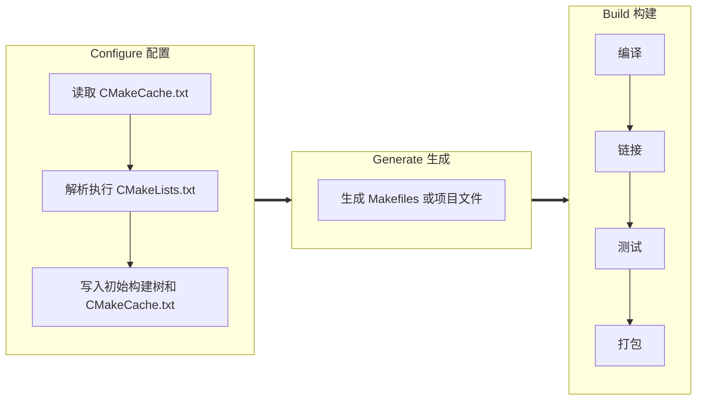

# CMake 现代构建系统笔记

> 基于《Modern CMake for C++ - Second Edition》(Rafał Świdziński 著, 陈晓伟 译)

[TOC]

---

## 第1章：CMake 基础

### 1.1 什么是CMake？

CMake是一个构建系统生成器，支持跨平台构建C++项目。它通过 `CMakeLists.txt` 文件描述项目结构，生成平台相关的构建文件（Makefiles、Ninja、Visual Studio项目等）。

### 1.2 构建三阶段



### 1.3 命令行使用

**生成构建系统：**
```bash
cmake -S <source tree> -B <build tree>
cmake -G <generator> -S <source tree> -B <build tree>
cmake -T <toolset> -A <platform> -S <source tree> -B <build tree>
```

**缓存变量操作：**
```bash
cmake -D <var>[:<type>]=<value> -S <source tree> -B <build tree>  # 设置变量
cmake -L -S <source tree> -B <build tree>                          # 列出缓存变量
cmake -LH -S <source tree> -B <build tree>                         # 含帮助信息
cmake -U <globbing_expr> -S <source tree> -B <build tree>          # 删除变量
cmake --fresh -S <source tree> -B <build tree>                     # 清理缓存
```

**构建项目：**
```bash
cmake --build <build tree> --parallel [<jobs>]
cmake --build <build tree> --target <target>
cmake --build <build tree> -t clean
cmake --build <build tree> --clean-first
cmake --build <build tree> --config <cfg>     # 多配置生成器
cmake --build <build tree> --verbose
```

**安装项目：**
```bash
cmake --install <build tree> --prefix <prefix>
cmake --install <build tree> --config <cfg>
cmake --install <build tree> --component <comp>
```

**调试与日志：**
```bash
cmake --log-level=TRACE           # ERROR|WARNING|NOTICE|STATUS|VERBOSE|DEBUG|TRACE
cmake --trace                     # 跟踪模式：打印每个执行的命令
cmake --system-information [file] # 系统信息
```

**脚本模式：**
```bash
cmake -P <script.cmake>           # 执行CMake脚本
cmake -E <command> [<options>]    # 跨平台命令行工具
```

**预设与工作流：**
```bash
cmake --list-presets
cmake --preset=<preset> -S <source> -B <build tree>
cmake --workflow --list-presets
cmake --workflow --preset <name>
```

### 1.4 项目文件结构

| 文件类型 | 说明 |
|---------|------|
| `CMakeLists.txt` | 项目文件（必须），定义目标、依赖、属性 |
| `*.cmake` | CMake脚本/模块文件 |
| `CMakeCache.txt` | 缓存变量存储 |
| `CMakePresets.json` | 预设配置（用户级：`CMakeUserPresets.json`） |
| `compile_commands.json` | 编译数据库（用于IDE/tools） |

---

## 第2章：CMake 语言

### 2.1 参数类型

CMake命令参数有三种形式：

| 类型 | 语法 | 特点 |
|-----|------|------|
| 括号参数 | `message([[multiline\n bracket\n argument]])` | 支持多行，不转义 |
| 引号参数 | `message("Hello ${name}")` | 支持变量替换和转义 |
| 无引号参数 | `set(var value)` | 不能含空格或特殊字符 |

```cmake
message([[multiline bracket argument]])
message([==[because we used two equal-signs "==" this command receives only a single argument]==])
```

### 2.2 变量

**变量引用：**
```cmake
set(myVar "Hello, World!")
message("value: ${myVar}")        # 普通变量/缓存变量
message("env: $ENV{HOME}")        # 环境变量
message("cache: $CACHE{MY_VAR}")  # 缓存变量
```

**作用域：** 文件变量作用域通过 `block()`/`endblock()` 和 `function()`/`endfunction()` 展开和关闭。

### 2.3 列表

```cmake
set(myList "a;list;of;five;elements")
set(myList a list "of;five;elements")
```

常用列表操作：
```cmake
list(LENGTH <list> <out-var>)
list(GET <list> <index> [<index> ...] <out-var>)
list(JOIN <list> <glue> <out-var>)
list(APPEND <list> [<element>...])
list(FILTER <list> {INCLUDE | EXCLUDE} REGEX <regex>)
list(TRANSFORM <list> <ACTION> [...])
list(SORT <list> [...])
```

### 2.4 控制结构

**条件判断：**
```cmake
if(<condition>)
    <commands>
elseif(<condition>)
    <commands>
else()
    <commands>
endif()
```

CMake 将以下值计算为假：`OFF`、`NO`、`FALSE`、`N`、`IGNORE`、`NOTFOUND`、以 `-NOTFOUND` 结尾的字符串、空字符串、`0`。

**比较操作符：** `EQUAL`、`LESS`、`LESS_EQUAL`、`GREATER`、`GREATER_EQUAL`
```cmake
if(${FOO} EQUAL 1)
```

**循环：**
```cmake
while(<condition>)
    <commands>
endwhile()

foreach(<variable> <list>)
    <commands>
endforeach()

foreach(<loop_var> RANGE <min> <max> [<step>])
endforeach()

foreach(<loop_variable> IN [LISTS <lists>] [ITEMS <items>])
endforeach()
```

**ZIP_LISTS（并行遍历）：**
```cmake
set(L1 "one;two;three;four")
set(L2 "1;2;3;4;5")
foreach(num IN ZIP_LISTS L1 L2)
    message("word=${num_0}, num=${num_1}")
endforeach()
```

### 2.5 宏与函数

| 特性 | 宏 (`macro`) | 函数 (`function`) |
|-----|-------------|------------------|
| 变量作用域 | 与调用者共享 | 独立作用域 |
| 参数传递 | 字符串替换 | 传值调用 |
| return() | 返回到调用者上层 | 返回到调用者 |

**函数定义：**
```cmake
function(<name> [<argument>…])
    <commands>
endfunction()
```

**参数变量：** `${ARGC}`（参数计数）、`${ARGV}`（所有参数）、`${ARGV<n>}`（特定参数）、`${ARGN}`（匿名参数列表）。

**程序化入口模式（解决自顶向下问题）：**
```cmake
macro(main)
    first_step()
    second_step()
    third_step()
endmacro()

function(first_step) ... endfunction()
function(second_step) ... endfunction()
function(third_step) ... endfunction()

main()
```

### 2.6 实用命令

**message() 模式：**
```cmake
message(FATAL_ERROR "stop")  # 停止处理和生成
message(SEND_ERROR "skip")   # 继续处理，跳过生成
message(WARNING "warn")      # 继续处理
message(STATUS "info")       # 推荐用于主消息
message(DEBUG "detail")      # 详细信息
message(TRACE "dev")         # 开发期间消息
```

**include()：**
```cmake
include(<file|module> [OPTIONAL] [RESULT_VARIABLE <var>])
include("${CMAKE_CURRENT_LIST_DIR}/<filename>.cmake")  # 相对于脚本路径
```

**include_guard()：**
```cmake
include_guard([DIRECTORY|GLOBAL])  # 防止重复包含
```

**file() 基本操作：**
```cmake
file(READ <filename> <out-var> [...])
file({WRITE | APPEND} <filename> <content>...)
file(DOWNLOAD <url> [<file>] [...])
```

**execute_process()：**
```cmake
execute_process(COMMAND <cmd> [<arguments>...]
    [TIMEOUT <seconds>]
    [WORKING_DIRECTORY <dir>]
    [OUTPUT_VARIABLE <var>]
    [ERROR_VARIABLE <var>])
```

### 2.7 命名约定

- 函数名使用小写+下划线（`snake_case`）
- 变量名使用大写+下划线（`UPPER_CASE`）
- 目标名使用小写+下划线
- 缓存变量使用 `CMAKE_` 或 `PROJECT_` 前缀

---

## 第4章：设置第一个 CMake 项目

### 4.1 基本结构

```cmake
cmake_minimum_required(VERSION 3.26)
project(MyProject VERSION 1.0.0
    DESCRIPTION "My Project"
    HOMEPAGE_URL "https://example.com"
    LANGUAGES CXX)
```

**project() 设置的变量：**
- `PROJECT_NAME`、`CMAKE_PROJECT_NAME`
- `PROJECT_SOURCE_DIR`、`<PROJECT-NAME>_SOURCE_DIR`
- `PROJECT_BINARY_DIR`、`<PROJECT-NAME>_BINARY_DIR`
- `PROJECT_IS_TOP_LEVEL`、`<PROJECT-NAME>_IS_TOP_LEVEL`

### 4.2 子目录管理

```cmake
add_subdirectory(source_dir [binary_dir] [EXCLUDE_FROM_ALL])
```

子目录提供：
- 变量隔离到嵌套作用域
- 嵌套工件可以独立配置
- 修改嵌套 CMakeLists.txt 不需要重新构建不相关的目标
- 路径定位到目录，可添加到父级包含路径

### 4.3 项目结构模式

```
/
├── CMakeLists.txt          # 顶层：策略、项目设置、全局变量
├── cmake/                  # CMake 模块
├── src/
│   ├── CMakeLists.txt      # 添加子目录
│   ├── app1/               # 可执行文件
│   ├── app2/
│   ├── lib1/               # 静态库
│   └── lib2/               # 动态库
└── test/
    ├── CMakeLists.txt      # 配置 CTest
    ├── app1/
    └── app2/
```

### 4.4 检测系统信息

```cmake
if(CMAKE_SYSTEM_NAME STREQUAL "Linux")
    message(STATUS "Doing things the usual way")
elseif(CMAKE_SYSTEM_NAME STREQUAL "Windows")
    message(STATUS "I'm supported here too.")
endif()
```

**主机系统信息：**
```cmake
cmake_host_system_information(RESULT <VARIABLE> QUERY <KEY>...)
```
可用查询：`HOSTNAME`、`TOTAL_VIRTUAL_MEMORY`、`NUMBER_OF_LOGICAL_CORES`、`NUMBER_OF_PHYSICAL_CORES`、`PROCESSOR_NAME`、`IS_64BIT` 等。

### 4.5 配置工具链

**设置 C++ 标准：**
```cmake
set(CMAKE_CXX_STANDARD 20)           # 全局
set(CMAKE_CXX_STANDARD_REQUIRED ON)  # 强制要求
set(CMAKE_CXX_EXTENSIONS OFF)        # 禁用编译器扩展

set_target_properties(<target> PROPERTIES CXX_STANDARD 20)  # 按目标
```

**检查编译器特性：**
```cmake
list(FIND CMAKE_CXX_COMPILE_FEATURES cxx_variable_templates result)
```

**try_run() 验证编译+运行：**
```cmake
try_run(run_result compile_result
    ${CMAKE_BINARY_DIR}/test_output
    ${CMAKE_SOURCE_DIR}/main.cpp
    RUN_OUTPUT_VARIABLE output)
```

---

## 第5章：与目标一起工作

### 5.1 目标类型

```cmake
# 可执行文件
add_executable(<name> [WIN32] [MACOSX_BUNDLE] [EXCLUDE_FROM_ALL] [source...])

# 库
add_library(<name> [STATIC | SHARED | MODULE] [EXCLUDE_FROM_ALL] [source...])

# 自定义目标
add_custom_target(Name [ALL] [COMMAND command [args...] ...])
```

### 5.2 传播属性（PUBLIC/PRIVATE/INTERFACE）

这是现代 CMake 的核心概念：

| 关键字 | 源目标 | 使用者目标 | 场景 |
|--------|--------|----------|------|
| **PRIVATE** | ✓ | ✗ | 仅在 `.cpp` 中使用 |
| **INTERFACE** | ✗ | ✓ | 仅在 `.h` 头文件中使用 |
| **PUBLIC** | ✓ | ✓ | 同时在 `.cpp` 和 `.h` 中使用 |

**可传播的属性：**
- `COMPILE_DEFINITIONS`（编译定义）
- `COMPILE_OPTIONS`（编译选项）
- `INCLUDE_DIRECTORIES`（包含目录）
- `LINK_LIBRARIES`（链接库）
- `LINK_OPTIONS`（链接选项）
- `POSITION_INDEPENDENT_CODE`（位置无关代码）
- `PRECOMPILE_HEADERS`（预编译头）
- `SOURCES`（源文件）

### 5.3 目标链接

```cmake
target_link_libraries(<target>
    <PRIVATE|PUBLIC|INTERFACE> <item>...
    [<PRIVATE|PUBLIC|INTERFACE> <item>...]...)
```

### 5.4 伪目标

| 类型 | 用途 | 语法 |
|------|------|------|
| **IMPORTED 目标** | 引用外部已构建的库 | `add_library(<name> UNKNOWN IMPORTED)` |
| **ALIAS 目标** | 为目标创建别名 | `add_library(<name> ALIAS <target>)` |
| **INTERFACE 库** | 纯头文件库/属性容器 | `add_library(<name> INTERFACE)` |
| **OBJECT 库** | 编译为 `.o` 对象文件 | `add_library(<name> OBJECT <sources>)` |

**接口库示例——打包传播属性：**
```cmake
add_library(warning_properties INTERFACE)
target_compile_options(warning_properties INTERFACE -Wall -Wextra -Wpedantic)
target_link_libraries(executable warning_properties)
```

**接口库示例——头文件库：**
```cmake
add_library(Eigen INTERFACE src/eigen.h src/vector.h src/matrix.h)
target_include_directories(Eigen INTERFACE
    $<BUILD_INTERFACE:${CMAKE_CURRENT_SOURCE_DIR}/src>
    $<INSTALL_INTERFACE:include/Eigen>)
```

### 5.5 自定义命令

**作为生成器使用：**
```cmake
add_custom_command(OUTPUT person.pb.h person.pb.cc
    COMMAND protoc --cpp_out=. person.proto
    DEPENDS person.proto)
add_executable(serializer serializer.cpp person.pb.cc)
```

**绑定到目标构建事件：**
```cmake
add_custom_command(TARGET <target>
    PRE_BUILD | PRE_LINK | POST_BUILD
    COMMAND command [ARGS] [args...])
```

### 5.6 冲突属性处理

```cmake
set_property(TARGET source1 APPEND PROPERTY
    COMPATIBLE_INTERFACE_STRING LIB_VERSION)
```

CMake 提供四个兼容性列表来检测传播属性冲突：
- `COMPATIBLE_INTERFACE_BOOL`（必须相同布尔值）
- `COMPATIBLE_INTERFACE_STRING`（必须相同字符串）
- `COMPATIBLE_INTERFACE_NUMBER_MAX`（取最大值）
- `COMPATIBLE_INTERFACE_NUMBER_MIN`（取最小值）

---

## 第6章：生成器表达式

### 6.1 基本语法

```
$<EXPRESSION:arg1,arg2,arg3>
```

生成器表达式在**生成阶段**（配置完成之后）求值。

### 6.2 条件扩展

```cmake
$<IF:condition,true_string,false_string>
$<condition:true_string>  # 条件为假时跳过（简略版）
```

### 6.3 布尔逻辑

**逻辑运算符：**
- `$<NOT:arg>`：否定
- `$<AND:arg1,arg2,...>`：逻辑与
- `$<OR:arg1,arg2,...>`：逻辑或
- `$<BOOL:string_arg>`：字符串转布尔

**比较：**
- `$<STREQUAL:arg1,arg2>`：字符串比较（区分大小写）
- `$<EQUAL:arg1,arg2>`：数值比较
- `$<IN_LIST:arg,list>`：检查元素是否在列表中
- `$<VERSION_EQUAL:v1,v2>`：版本比较
- `$<PATH_EQUAL:path1,path2>`：路径比较

**查询：**
```cmake
$<TARGET_EXISTS:arg>    # 目标是否存在
$<CONFIG:configs>        # 构建配置匹配
$<PLATFORM_ID:platform>  # 平台匹配
$<COMPILE_FEATURES:features>  # 编译器特性支持
```

### 6.4 字符串、列表和路径转换

```cmake
$<LOWER_CASE:string>
$<UPPER_CASE:string>
$<JOIN:list,d>
$<REMOVE_DUPLICATES:list>
$<FILTER:list,INCLUDE|EXCLUDE,regex>
```

从 CMake 3.27 起支持 `$<LIST:...>` 操作（`LENGTH`、`GET`、`JOIN`、`APPEND`、`SORT` 等）。

路径操作（CMake 3.24+）：
```cmake
$<PATH:APPEND,path...,input,...>
$<PATH:REMOVE_FILENAME,path...>
$<PATH:REPLACE_FILENAME,path...,input>
$<PATH:NORMAL_PATH,path...>
```

### 6.5 配置与平台

```cmake
$<CONFIG>             # Debug / Release
$<CONFIG:Debug>       # 条件检查
$<PLATFORM_ID>        # Linux / Windows / Darwin
$<PLATFORM_ID:Linux>  # 条件检查
```

### 6.6 工具链查询

```cmake
$<CXX_COMPILER_ID>           # GNU / Clang / MSVC / AppleClang
$<CXX_COMPILER_VERSION>      # 编译器版本号
$<CXX_COMPILER_ID:GNU,Clang> # 条件检查
$<COMPILE_FEATURES:cxx_std_17>  # 特性支持检查
```

### 6.7 目标信息查询

```cmake
$<TARGET_FILE:target>       # 完整路径
$<TARGET_FILE_NAME:target>  # 文件名
$<TARGET_FILE_DIR:target>   # 目录
$<TARGET_OBJECTS:target>    # 对象文件列表
$<TARGET_PROPERTY:target,prop>  # 目标属性
```

### 6.8 实用示例

**根据构建类型选择编译选项：**
```cmake
target_compile_options(tgt $<$<CONFIG:DEBUG>:-ginline-points>)
```

**平台特定定义：**
```cmake
target_compile_definitions(myProject PRIVATE
    $<$<CMAKE_SYSTEM_NAME:LINUX>:LINUX=1>)
```

**编译器特定接口库：**
```cmake
add_library(enable_rtti INTERFACE)
target_compile_options(enable_rtti INTERFACE
    $<$<OR:$<COMPILER_ID:GNU>,$<COMPILER_ID:Clang>>:-rtti>)
```

**转义特殊字符：** `$<ANGLE-R>`（`>`）、`$<COMMA>`（`,`）、`$<SEMICOLON>`（`;`）

---

## 第7章：编译 C++ 源代码

### 7.1 编译阶段

```
预处理 → 语法语义分析 → 汇编 → 优化 → 代码生成
```

### 7.2 编译相关命令

```cmake
target_compile_features(<target> <PRIVATE|PUBLIC|INTERFACE> <feature> [...])
target_sources(<target> <PRIVATE|PUBLIC|INTERFACE> [source...])
target_include_directories(<target> [SYSTEM] <PRIVATE|PUBLIC|INTERFACE> [dir...])
target_compile_definitions(<target> <PRIVATE|PUBLIC|INTERFACE> [def...])
target_compile_options(<target> <PRIVATE|PUBLIC|INTERFACE> [options...])
target_precompile_headers(<target> <PRIVATE|PUBLIC|INTERFACE> [headers...])
```

### 7.3 指定编译器特性

```cmake
target_compile_features(my_target PUBLIC cxx_std_20)
# 等价于 set(CMAKE_CXX_STANDARD 20) + set(CMAKE_CXX_STANDARD_REQUIRED ON)，但是按目标
```

### 7.4 管理源文件

```cmake
add_executable(main main.cpp)
if(CMAKE_SYSTEM_NAME STREQUAL "Linux")
    target_sources(main PRIVATE gui_linux.cpp)
elseif(CMAKE_SYSTEM_NAME STREQUAL "Windows")
    target_sources(main PRIVATE gui_windows.cpp)
endif()
```

**不推荐 `file(GLOB ...)`**：变更检测不可靠，影响 IDE 代码检查。

### 7.5 预处理配置

**包含目录：**
```cmake
target_include_directories(<target> [SYSTEM] [AFTER|BEFORE]
    <INTERFACE|PUBLIC|PRIVATE> [item...])
```
- `BEFORE`：前置目录
- `AFTER`：追加目录
- `SYSTEM`：标记为系统目录（`-isystem`，抑制警告）

**预处理器定义：**
```cmake
target_compile_definitions(hello PRIVATE ABC "DEF=${VAR}")
# 等价于 -DABC -DDEF=12
```

**配置头文件模板：**
```cmake
# configure.h.in
#cmakedefine FOO_ENABLE
#cmakedefine FOO_STRING "@FOO_STRING@"

# CMakeLists.txt
set(FOO_ENABLE ON)
configure_file(configure.h.in configured/configure.h)
```

### 7.6 优化器配置

```cmake
target_compile_options(<target> [BEFORE] <PRIVATE|PUBLIC|INTERFACE> [items...])
```

**优化级别：** `-O0`（无优化）、`-O2`（完全优化）、`-O3`（最大优化）

**函数内联：**
- GCC: `-finline-functions-called-once`
- Clang: `-finline-functions` / `-finline-hint-functions`
- 禁用：`-fno-inline-*`

**循环展开：**
- GCC: `-floop-unroll`
- Clang: `-funroll-loops`

**循环向量化：**
- GCC: `-ftree-vectorize -ftree-slp-vectorize`
- Clang: `-fno-vectorize -fno-slp-vectorize`

### 7.7 预编译头文件

```cmake
target_precompile_headers(<target>
    <INTERFACE|PUBLIC|PRIVATE> [header...])
```

**重用预编译头：**
```cmake
target_precompile_headers(<target> REUSE_FROM <other_target>)
```

### 7.8 统一构建（Unity Build）

```cmake
set_target_properties(<target> PROPERTIES UNITY_BUILD true)
```

从 CMake 3.18 起支持显式分组：
```cmake
set_target_properties(<target> PROPERTIES UNITY_BUILD_MODE GROUP)
set_property(SOURCE <src> PROPERTY UNITY_GROUP "GroupA")
```

### 7.9 调试构建

```cmake
# 保存中间文件
target_compile_options(debug PRIVATE -save-temps=obj)
# 调试头文件包含
target_compile_options(debug PRIVATE -H)
```

- `CMAKE_CXX_FLAGS_DEBUG` 包含 `-g`
- `CMAKE_CXX_FLAGS_RELEASE` 包含 `-DNDEBUG`

---

## 第8章：链接可执行文件和库

### 8.1 ELF 文件结构

```
ELF Header → .text (代码) → .data (已初始化数据) → .bss (未初始化数据)
→ .rodata (只读数据) → .strtab (字符串表) → Section Headers
```

### 8.2 库类型

| 类型 | Linux | macOS | Windows | CMake |
|------|-------|-------|---------|-------|
| 静态库 | `.a` | `.a` | `.lib` | `STATIC` |
| 共享库 | `.so` | `.dylib` | `.dll` | `SHARED` |
| 共享模块 | `.so` | `.so` | `.dll` | `MODULE` |

**静态库：**
```cmake
add_library(<name> STATIC [<source>...])
```

**共享库：**
```cmake
add_library(<name> SHARED [<source>...])
```
- SONAME 管理版本号（`libfoo.so.1.2.3` → soname: `libfoo.so.1`）
- 查询：`$<TARGET_SONAME_FILE:target>`、`$<TARGET_SONAME_FILE_NAME:target>`

**共享模块（插件）：**
```cmake
add_library(<name> MODULE [<source>...])
```
通过 `dlopen()`（Linux/macOS）或 `LoadLibrary`（Windows）加载。

### 8.3 位置无关代码（PIC）

PIC 通过**全局偏移表（GOT）**实现符号重定位。

```cmake
set_target_properties(dependency PROPERTIES POSITION_INDEPENDENT_CODE ON)
```

共享库自动启用 PIC；依赖的静态库/对象库也需要显式设置。

### 8.4 ODR 问题与命名空间

```cpp
// 使用命名空间避免重复符号问题
namespace mylib {
    void duplicated() { /* ... */ }
}
```

### 8.5 链接顺序

```cmake
target_link_libraries(main nested outer nested)  # 解决循环依赖
```

链接器从左到右处理，会将嵌套的未定义引用累积后再解析。

### 8.6 强制包含所有符号

```cmake
# 使用生成器表达式（跨平台）
target_link_options(tgt INTERFACE
    "$<LINK_LIBRARY:WHOLE_ARCHIVE,lib1>")
```

### 8.7 分离 main() 用于测试

```cpp
// bootstrap.cpp
extern int start_program(int, const char**);
int main(int argc, const char** argv) {
    return start_program(argc, argv);
}
```

```cmake
add_library(program program.cpp)
add_executable(test test.cpp)
target_link_libraries(test program)
```

---

## 第9章：管理依赖关系

### 9.1 find_package()

```cmake
find_package(<Name> [version] [EXACT] [QUIET] [REQUIRED])
```

CMake 搜索两种文件模式：
- `<PackageName>Config.cmake`（CamelCase）
- `<package-name>-config.cmake`（kebab-case）

**Protobuf 示例：**
```cmake
find_package(Protobuf REQUIRED)
protobuf_generate_cpp(GENERATED_SRC GENERATED_HEADER message.proto)
add_executable(main main.cpp ${GENERATED_SRC} ${GENERATED_HEADER})
target_link_libraries(main PRIVATE protobuf::libprotobuf)
target_include_directories(main PRIVATE ${CMAKE_CURRENT_BINARY_DIR})
```

**成功找到后设置的变量：**
- `<PKG_NAME>_FOUND`
- `<PKG_NAME>_INCLUDE_DIRS` / `<PKG_NAME>_INCLUDES`
- `<PKG_NAME>_LIBRARIES` / `<PKG_NAME>_LIBS`
- `<PKG_NAME>_DEFINITIONS`

### 9.2 编写自定义 Find 模块

**使用 `find_package_handle_standard_args()`：**
```cmake
include(FindPackageHandleStandardArgs)
find_package_handle_standard_args(PQXX
    REQUIRED_VARS PQXX_LIBRARY_PATH PQXX_HEADER_PATH)
```

**定义 IMPORTED 目标：**
```cmake
add_library(PQXX::PQXX UNKNOWN IMPORTED)
set_target_properties(PQXX::PQXX PROPERTIES
    IMPORTED_LOCATION ${library}
    INTERFACE_INCLUDE_DIRECTORIES ${headers})
```

### 9.3 FindPkgConfig（遗留包）

```cmake
find_package(PkgConfig REQUIRED)
pkg_check_modules(PQXX REQUIRED IMPORTED_TARGET libpqxx)
target_link_libraries(main PRIVATE PkgConfig::PQXX)
```

### 9.4 FetchContent

**三步使用：**
1. `include(FetchContent)`
2. `FetchContent_Declare()` 配置依赖
3. `FetchContent_MakeAvailable()` 下载并构建

```cmake
include(FetchContent)
FetchContent_Declare(external-yaml-cpp
    GIT_REPOSITORY https://github.com/jbeder/yaml-cpp.git
    GIT_TAG 0.8.0)
FetchContent_MakeAvailable(external-yaml-cpp)
target_link_libraries(welcome PRIVATE yaml-cpp::yaml-cpp)
```

**使用已安装包（CMake 3.24+）：**
```cmake
FetchContent_Declare(external-yaml-cpp
    GIT_REPOSITORY https://github.com/jbeder/yaml-cpp.git
    GIT_TAG 0.8.0
    FIND_PACKAGE_ARGS NAMES yaml-cpp)
```

### 9.5 ExternalProject

与 FetchContent 的区别：`ExternalProject` 在**构建阶段**下载依赖。

```cmake
include(ExternalProject)
ExternalProject_Add(external-yaml-cpp
    GIT_REPOSITORY https://github.com/jbeder/yaml-cpp.git
    GIT_TAG 0.8.0)
```

执行步骤：`mkdir → download → update → patch → configure → build → install → test`

---

## 第10章：C++20 模块

### 10.1 版本兼容性

```cmake
if(CMAKE_VERSION VERSION_GREATER_EQUAL 3.28.0)
    cmake_policy(SET CMP0155 NEW)        # 正式支持
elseif(CMAKE_VERSION VERSION_GREATER_EQUAL 3.27.0)
    set(CMAKE_EXPERIMENTAL_CXX_MODULE_CMAKE_API "aa17df0-...")  # 实验性 API
elseif(CMAKE_VERSION VERSION_GREATER_EQUAL 3.26.0)
    set(CMAKE_EXPERIMENTAL_CXX_MODULE_CMAKE_API "2182bf5c-...")  # 早期实验
    set(CMAKE_EXPERIMENTAL_CXX_MODULE_DYNDEP 1)
else()
    message(FATAL_ERROR "CMake 3.26+ required for C++20 modules")
endif()
```

### 10.2 声明 C++ 模块

```cmake
add_library(math)
target_sources(math
    PUBLIC FILE_SET CXX_MODULES FILES math.cppm)
target_compile_features(math PUBLIC cxx_std_20)
set_target_properties(math PROPERTIES CXX_EXTENSIONS OFF)

add_executable(main main.cpp)
target_link_libraries(main PRIVATE math)
```

### 10.3 工具链要求

| 组件 | 要求 |
|------|------|
| 构建系统 | Ninja 1.11+ 或 Visual Studio 2022+ |
| 编译器 | Clang 16+ / MSVC 19.34+ / GCC 14+ |

---

## 第11章：测试框架

### 11.1 CTest 命令行

```bash
ctest -N                         # 列出测试（不执行）
ctest -R <regex>                 # 仅运行匹配的测试
ctest -E <regex>                 # 跳过匹配的测试
ctest -L <label-regex>           # 按标签过滤
ctest -j <jobs>                  # 并行执行
ctest --timeout <seconds>        # 设置超时
ctest --repeat until-fail:<n>    # 重复直到失败
ctest --output-log <file>        # 输出到日志
```

### 11.2 项目结构

```cmake
# 顶层 CMakeLists.txt
cmake_minimum_required(VERSION 3.26)
project(MyProject CXX)
include(CTest)
add_subdirectory(src bin)
add_subdirectory(test)
```

```cmake
# test/CMakeLists.txt
add_executable(unit_tests unit_tests.cpp calc_test.cpp ../src/calc.cpp)
add_test(NAME SumAddsTwoInts COMMAND unit_tests 1)
add_test(NAME MultiplyMultipliesTwoInts COMMAND unit_tests 2)
```

### 11.3 分离 SUT 用于测试

```cmake
add_library(sut STATIC calc.cpp run.cpp)
target_include_directories(sut PUBLIC .)
add_executable(bootstrap bootstrap.cpp)
target_link_libraries(bootstrap PRIVATE sut)
```

### 11.4 GoogleTest 集成

```cmake
# 使用 FetchContent
include(FetchContent)
FetchContent_Declare(googletest
    GIT_REPOSITORY https://github.com/google/googletest.git
    GIT_TAG v1.14.0)
set(gtest_force_shared_crt ON CACHE BOOL "" FORCE)

add_executable(unit_tests test_main.cpp calc_test.cpp)
target_link_libraries(unit_tests PRIVATE sut gtest_main)
include(GoogleTest)
gtest_discover_tests(unit_tests)
```

### 11.5 Catch2 集成

```cmake
include(FetchContent)
FetchContent_Declare(Catch2
    GIT_REPOSITORY https://github.com/catchorg/Catch2.git
    GIT_TAG v3.4.0)
FetchContent_MakeAvailable(Catch2)

add_executable(unit_tests test_main.cpp calc_test.cpp)
target_link_libraries(unit_tests PRIVATE sut Catch2::Catch2WithMain)
include(Catch)
catch_discover_tests(unit_tests)
```

### 11.6 LCOV 覆盖率

```cmake
function(AddCoverage target)
    find_program(LCOV_PATH lcov REQUIRED)
    find_program(GENHTML_PATH genhtml REQUIRED)
    add_custom_target(coverage
        COMMAND ${LCOV_PATH} -d . --zerocounters
        COMMAND $<TARGET_FILE:${target}>
        COMMAND ${LCOV_PATH} -d . --capture -o coverage.info
        COMMAND ${LCOV_PATH} -r coverage.info '/usr/include/*' -o filtered.info
        COMMAND ${GENHTML_PATH} -o coverage filtered.info --legend
        COMMAND rm -rf coverage.info filtered.info
        WORKING_DIRECTORY ${CMAKE_BINARY_DIR})
endfunction()
```

---

## 第12章：程序分析工具

### 12.1 ClangFormat

```cmake
function(format_target target directory)
    find_program(CLANG_FORMAT_PATH clang-format REQUIRED)
    set(EXPRESSION h hpp hh c cc cxx cpp)
    list(TRANSFORM EXPRESSION PREPEND "${directory}/*.")
    file(GLOB_RECURSE SOURCE_FILES FOLLOW_SYMLINKS
         LIST_DIRECTORIES false ${EXPRESSION})
    add_custom_command(TARGET ${target} PRE_BUILD
        COMMAND ${CLANG_FORMAT_PATH} -i --style=file ${SOURCE_FILES}
        COMMENT "Formatting source files in ${directory}...")
endfunction()
```

### 12.2 静态分析器

CMake 通过目标属性启用：

| 属性 | 工具 |
|------|------|
| `<LANG>_CLANG_TIDY` | clang-tidy |
| `<LANG>_CPPCHECK` | Cppcheck |
| `<LANG>_CPPLINT` | Cpplint |
| `<LANG>_INCLUDE_WHAT_YOU_USE` | include-what-you-use |
| `LINK_WHAT_YOU_USE` | link-what-you-use |

```cmake
function(AddClangTidy target)
    find_program(CLANG-TIDY_PATH clang-tidy REQUIRED)
    set_target_properties(${target} PROPERTIES CXX_CLANG_TIDY
        "${CLANG-TIDY_PATH};-checks=*;--warnings-as-errors=*")
endfunction()
```

### 12.3 Valgrind Memcheck

```cmake
function(AddValgrind target)
    find_program(VALGRIND_PATH valgrind REQUIRED)
    add_custom_target(valgrind
        COMMAND ${VALGRIND_PATH} --leak-check=yes $<TARGET_FILE:${target}>
        WORKING_DIRECTORY ${CMAKE_BINARY_DIR})
endfunction()
```

Valgrind 工具集：Memcheck（内存）、Cachegrind（缓存）、Callgrind（调用图）、Massif（堆分析）、Helgrind/DRD（线程）。

---

## 第13章：生成文档

### 13.1 Doxygen 集成

```cmake
function(Doxygen input output)
    find_package(Doxygen)
    if (NOT DOXYGEN_FOUND)
        add_custom_target(doxygen COMMAND false
            COMMENT "Doxygen not found")
        return()
    endif()
    set(DOXYGEN_GENERATE_HTML YES)
    set(DOXYGEN_HTML_OUTPUT ${PROJECT_BINARY_DIR}/${output})
    doxygen_add_docs(doxygen
        ${PROJECT_SOURCE_DIR}/${input}
        COMMENT "Generate HTML documentation")
endfunction()
```

### 13.2 现代化主题

```cmake
macro(UseDoxygenAwesomeCss)
    include(FetchContent)
    FetchContent_Declare(doxygen-awesome-css
        GIT_REPOSITORY https://github.com/jothepro/doxygen-awesome-css.git
        GIT_TAG V2.3.1)
    FetchContent_MakeAvailable(doxygen-awesome-css)
    set(DOXYGEN_GENERATE_TREEVIEW YES)
    set(DOXYGEN_HAVE_DOT YES)
    set(DOXYGEN_DOT_IMAGE_FORMAT svg)
    set(DOXYGEN_HTML_EXTRA_STYLESHEET
        ${doxygen-awesome-css_SOURCE_DIR}/doxygen-awesome.css)
endmacro()
```

---

## 第14章：安装与打包

### 14.1 install() 命令

| 模式 | 用途 |
|------|------|
| `install(TARGETS)` | 安装库和可执行文件 |
| `install(FILES)` | 安装单个文件 |
| `install(PROGRAMS)` | 安装并设置可执行权限 |
| `install(DIRECTORY)` | 安装整个目录 |
| `install(SCRIPT\|CODE)` | 运行 CMake 脚本 |
| `install(EXPORT)` | 生成目标导出文件 |

**通用选项：**
- `DESTINATION`：安装路径（相对路径以 `CMAKE_INSTALL_PREFIX` 为前缀）
- `PERMISSIONS`：文件权限
- `CONFIGURATIONS`：构建配置（Debug/Release）
- `COMPONENT`：组件分组

**安装目标导出文件：**
```cmake
install(EXPORT CalcTargets DESTINATION ${CMAKE_INSTALL_LIBDIR}/calc/cmake
    NAMESPACE Calc::)
```

### 14.2 创建可重用包

**步骤：**
1. 使目标可重定位
2. 安装目标导出文件
3. 创建包配置文件
4. 生成包版本文件

**构建/安装路径分离：**
```cmake
target_include_directories(calc INTERFACE
    "$<BUILD_INTERFACE:${CMAKE_CURRENT_SOURCE_DIR}/include>"
    "$<INSTALL_INTERFACE:${CMAKE_INSTALL_INCLUDEDIR}>")
```

**配置文件模板：**
```cmake
include(CMakePackageConfigHelpers)
configure_package_config_file(
    ${CMAKE_CURRENT_SOURCE_DIR}/CalcConfig.cmake.in
    "${CMAKE_CURRENT_BINARY_DIR}/CalcConfig.cmake"
    INSTALL_DESTINATION ${CMAKE_INSTALL_LIBDIR}/calc/cmake
    PATH_VARS LIB_INSTALL_DIR)
```

**版本文件：**
```cmake
write_basic_package_version_file(
    "${CMAKE_CURRENT_BINARY_DIR}/CalcConfigVersion.cmake"
    COMPATIBILITY AnyNewerVersion)  # ExactVersion | SameMajorVersion | SameMinorVersion
```

### 14.3 组件管理

```cmake
install(TARGETS calc EXPORT CalcTargets
    ARCHIVE COMPONENT lib
    FILE_SET HEADERS COMPONENT headers)
```

### 14.4 CPack

```bash
cpack -G "TGZ;DEB" -C Release --verbose
```

---

## 第15章：构建专业项目

### 15.1 规划要点

一个专业 CMake 项目应考虑：
- 目录结构（`src/`、`test/`、`cmake/`）
- 目标架构（库+可执行+测试+文档）
- 依赖管理（FetchContent vs find_package）
- 工具链集成（格式化、静态分析、动态分析、覆盖率）
- 安装与打包策略

### 15.2 对象库双重构建模式

```cmake
# 一次编译，生成静态库和共享库
add_library(calc_obj OBJECT basic.cpp)
target_sources(calc_obj PUBLIC FILE_SET HEADERS
    BASE_DIRS include FILES include/calc/basic.h)
set_target_properties(calc_obj PROPERTIES POSITION_INDEPENDENT_CODE 1)

add_library(calc_shared SHARED)
target_link_libraries(calc_shared calc_obj)

add_library(calc_static STATIC)
target_link_libraries(calc_static calc_obj)
```

### 15.3 构建信息嵌入

```cmake
# buildinfo.h.in
struct BuildInfo {
    static inline const std::string CommitSHA = "@COMMIT_SHA@";
    static inline const std::string Timestamp = "@TIMESTAMP@";
    static inline const std::string Version = "@PROJECT_VERSION@";
};

# BuildInfo.cmake
string(TIMESTAMP TIMESTAMP)
execute_process(COMMAND git log --pretty=format:'%h' -n 1
    OUTPUT_VARIABLE COMMIT_SHA)
configure_file(buildinfo.h.in buildinfo/buildinfo.h @ONLY)

function(BuildInfo target)
    target_include_directories(${target} PRIVATE ${DESTINATION})
endfunction()
```

---

## 第16章：CMake 预设

### 16.1 预设文件结构

```json
{
    "version": 6,
    "cmakeMinimumRequired": {"major": 3, "minor": 26, "patch": 0},
    "include": ["other_presets.json"],
    "configurePresets": [...],
    "buildPresets": [...],
    "testPresets": [...],
    "packagePresets": [...],
    "workflowPresets": [...]
}
```

### 16.2 预设通用字段

| 字段 | 说明 |
|------|------|
| `name` | 预设唯一名称 |
| `displayName` | 显示名称 |
| `inherits` | 继承其他预设（字符串或数组） |
| `hidden` | 是否隐藏 |
| `environment` | 环境变量 |
| `condition` | 条件表达式 |
| `vendor` | 供应商自定义字段 |

### 16.3 配置预设

```json
{
    "name": "default",
    "generator": "Ninja",
    "binaryDir": "${sourceDir}/build/${presetName}",
    "cacheVariables": {
        "CMAKE_BUILD_TYPE": "Release",
        "CMAKE_CXX_COMPILER": "clang++"
    }
}
```

**宏变量：** `${sourceDir}`、`${sourceParentDir}`、`${sourceDirName}`、`${presetName}`、`${hostSystemName}`、`$env{VAR}`、`$penv{VAR}`

### 16.4 条件表达式

```json
{
    "condition": {
        "type": "anyOf",
        "conditions": [
            {"type": "equals", "lhs": "${hostSystemName}", "rhs": "Windows"},
            {"type": "equals", "lhs": "${hostSystemName}", "rhs": "Linux"}
        ]
    }
}
```

条件运算符：`not`、`anyOf`、`allOf`、`equals`、`notEquals`、`matches`（正则）、`notMatches`、`inList`、`notInList`

### 16.5 工作流预设

```json
{
    "name": "full-build",
    "steps": [
        {"type": "configure", "name": "default"},
        {"type": "build", "name": "default"},
        {"type": "test", "name": "default"},
        {"type": "package", "name": "default"}
    ]
}
```

---

## 附录：常用命令参考

### string() 操作

| 类别 | 子命令 |
|------|--------|
| 搜索替换 | `FIND`, `REPLACE`, `REGEX MATCH`, `REGEX REPLACE` |
| 操作 | `APPEND`, `PREPEND`, `CONCAT`, `JOIN`, `TOLOWER`, `TOUPPER`, `LENGTH`, `SUBSTRING`, `STRIP`, `GENEX_STRIP`, `REPEAT` |
| 比较 | `STREQUAL`, `LESS`, `GREATER`, `VERSION_EQUAL` |
| 哈希 | `MD5`, `SHA1`, `SHA256`, `SHA512` |
| 生成 | `ASCII`, `HEX`, `CONFIGURE`, `MAKE_C_IDENTIFIER`, `RANDOM`, `TIMESTAMP`, `UUID` |
| JSON | `JSON` |

### file() 操作

| 类别 | 子命令 |
|------|--------|
| 读取 | `READ`, `STRINGS`, `HASH`, `TIMESTAMP`, `GET_RUNTIME_DEPENDENCIES` |
| 写入 | `WRITE`, `APPEND`, `TOUCH`, `TOUCH_NOCREATE`, `GENERATE`, `CONFIGURE` |
| 文件系统 | `GLOB`, `GLOB_RECURSE`, `RENAME`, `REMOVE`, `REMOVE_RECURSE`, `MAKE_DIRECTORY`, `COPY`, `INSTALL`, `SIZE`, `READ_SYMLINK`, `CREATE_LINK`, `CHMOD`, `CHMOD_RECURSE` |
| 路径 | `REAL_PATH`, `RELATIVE_PATH`, `TO_CMAKE_PATH`, `TO_NATIVE_PATH` |
| 传输 | `DOWNLOAD`, `UPLOAD` |
| 锁定 | `LOCK` |
| 归档 | `ARCHIVE_CREATE`, `ARCHIVE_EXTRACT` |

---

## 关键原则总结

1. **目标驱动**：优先使用 `target_*()` 命令而非全局 `set()`
2. **传播属性**：正确使用 PUBLIC/PRIVATE/INTERFACE 控制依赖传递
3. **生成器表达式**：用于推迟求值到生成阶段
4. **IMPORTED 目标**：统一处理本地构建和外部依赖
5. **对象库**：避免静态库和共享库的重复编译
6. **FetchContent**：现代依赖管理首选
7. **预设文件**：标准化构建配置
8. **命名空间**：所有公开目标使用命名空间前缀
