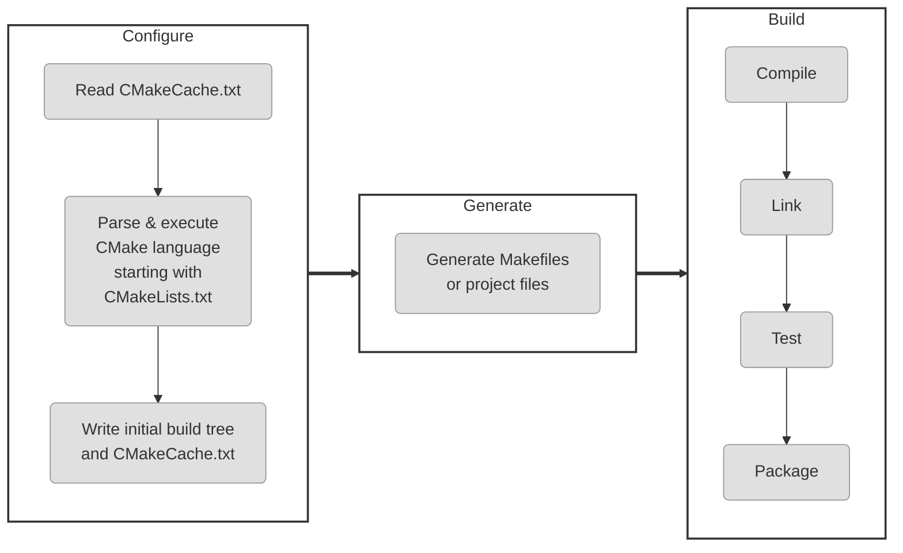
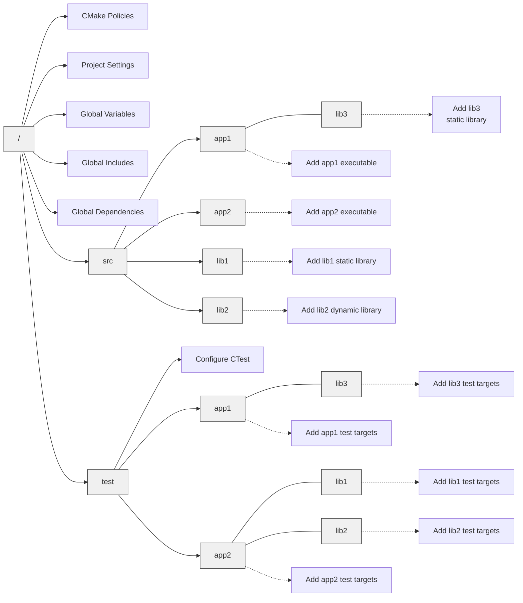
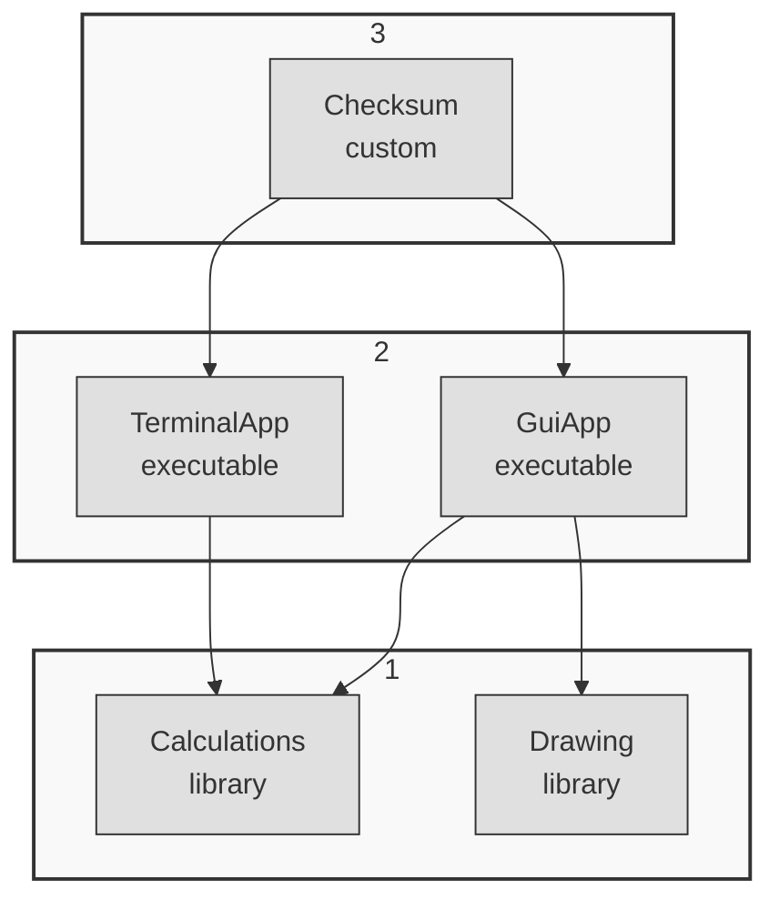

# Modern CMake

[TOC]



生成项目构建系统

构建项目的第一步就是生成构建系统,以下是执行CMake生成项目构建系统操作的三种命令形式

```sh
cmake [<options>] -S <source tree> -B <build tree>
cmake [<options>] <source tree>
cmake [<options>] <build tree>
```

CMake 的一个重要特性是支持源外构建或支持,将构建工件存储在与源树不同的目录中

```sh
cmake -S <source tree> -B <build tree>
```
从 source tree 读取项目文件,使用build目录中生成构建系统

选择生成器

```sh
cmake -G <generator name> -S <source tree> -B <build tree>
```
CMake 在许多平台上支持多种本地构建系统,CMake会选择一个,通过设置CMAKE_GENERATOR环境变量或直接在命令行上指定生成器来覆盖

```sh
cmake -G <generator name> -S <source tree> -B <build tree>
```
```sh
cmake -G <generator name>
-T <toolset spec>
-A <platform name>
-S <source tree> -B <build tree>
```

-T 指定工具集(编译器)和平台(编译器 SDK) 进行更深入的指定

此外,CMake将扫描环境变量以覆盖默认值:CMAKE_GENERATOR_TOOLSET和CMAKE_GENERATOR_PLATFORM

使用预填充缓存信息的能力:

```sh
cmake -C <initial cache script> -S <source tree> -B <build tree>
```

现有缓存变量的初始化和修改可以用另一种方式完成（当创建一个文件仅为设置几个变量有些过于繁琐时），可以直接在命令行中设置：

```sh
cmake -D <var>[:<type>]=<value> -S <source tree> -B <build tree>
```

:<type> 部分可选（由 GUI 使用）并且接受以下类型：BOOL，FILEPATH，PATH，STRING或 INTERNAL。如果省略类型，CMake 会检查变量是否存在于 CMakeCache.txt 文件中并使用其类型；否则，将设置为 UNINITIALIZED

为了debug,还可以使用 - L 选项列出缓存变量

```sh
cmake -L -S <source tree> -B <build tree>

# 同时打印变量帮助信息
cmake -LH -S <source tree> -B <build tree>
cmake -LAH -S <source tree> -B <build tree>
```


使用 -D 选项手动添加的自定义变量不会在这个打印输出中显示

可以使用以下选项删除一个或多个变量：
```sh
cmake -U <globbing_expr> -S <source tree> -B <build tree>
```

使用通配表达式支持 *（通配符）和?（任意字符）符号时要小心，因为很容易意外删除比预期更多的变量

Cmake 命令可以使用多种选项来让了解其内部工作,要获取变量,命令和其他设置的通用信息,请运行以下命令:

```sh
cmake --system-information [file]
```

可选的file参数允许将输出存储在文件中,在构建树目录中,将打印有关缓存变量和日志文件中的构建消息的相关信息

以下行指定了感兴趣的日志级别：
```sh
cmake --log-level=<level>
```

级别可以是以下任意一项:ERROR,WARNING,NOTICE,STATUS,VERBOSE,DEBUG或TRACE
也可以在CMAKE_MESSAGE_LOG_LEVEL缓存变量中指定此设置

CMAKE_MESSAGE_CONTEXT变量可以像栈一样使用

每当代码进入一个有趣的上下文时,就可以给它一个描述性的名称

这样做之后,消息将使用CMAKE_MESSAGE_CONTEXT变量装饰

```sh
[some.context.example] Debug message
```

启用这种日志输出的选项如下：
```sh
cmake --log-context <source tree>
```

如果其他所有方法都失败了,就需要使用重型武器——跟踪模式,它会打印每个执行的命令及其文件名,调用它的行号,以及传递的参数列表

```sh
cmake --trace
```

要列出所有可能的预设,执行以下命令:
```sh
cmake --list-presets
```

可以使用其中一个可用的预设：
```sh
cmake --preset=<preset> -S <source> -B <build tree>
```

清理构建树

```sh
cmake --fresh -S <source tree> -B <build tree>
```

构建项目
在生成构建树之后就可以进行项目构建操作,CMake 不仅知道如何为许多不同的构建工具生成输入文件,还可以根据项目需求为运行这些工具提供适当 参数

运行并构建: 使用多核

```sh
cmake --build <build tree> --parallel [<number of jobs>]
cmake --build <build tree> -j [<number of jobs>]
```

选择要构建和清理的目标
```sh
cmake --build <build tree> --target <target name1> --target <target name2> ...
```

清理构建树

```sh
cmake --build <build tree> -t clean
```

如果想先清理再执行正常的构建：
```sh
cmake --build <build tree> --clean-first
```
我们已经对生成器有了一定的了解：它们有不同的类型和功能。其中一些生成器能够在一
个构建树中同时构建 Debug 和 Release 构建类型，支持此功能的生成器包括 Ninja
Multi-Config、Xcode 和 Visual Studio。其他每个生成器都是单一配置生成器，需要
为每种配置类型单独构建树。
选择 Debug、Release、MinSizeRel 或 RelWithDebInfo 并指定如下：
为多配置生成器配置构建类型
```sh
cmake --build <build tree> --config <cfg>
```

调试构建过程

出现问题时,应该首先检查输出信息,打印所有细节会困惑,当需要查看底层情况时,可以要求CMake打印详细信息
```sh
cmake --build <build tree> --verbose
cmake --build <build tree> -v
```

同样的效果可以通过设置CMAKE_VERBOSE_OUTPUT缓存变量实现

安装项目
 当构建产物完成后,用户可以将它们安装到系统中,这意味这将文件复制到正确的目录,安装库或者运行CMake脚本中的自定义安装逻辑

 安装项目

 当构建产物完成后,用户可以将它们安装到系统中

```sh
cmake --install <build tree> [<options>]
```

像其他操作一样,需要生成的构建树的路径

```sh
cmake --install <build tree>
```

选择安装目录

```sh
cmake --install <build tree> --install-prefix <prefix>

cmake --install <build tree> --prefix <prefix>
```

多配置生成器

可用类型包括 Debug,Release，MinSizeRel 和 RelWithDebInfo

```sh
cmake --install <build tree> --config <cfg>
```

选择组件:

作为开发者，可能会选择将项目拆分为可以独立安装的组件。现在，假设有一组不需要在所有情况下使用的产物。这可能类似于 application、docs 和 extra-tools。
要安装单个组件，使用以下选项：

```sh
cmake --install <build tree> --component <component>
```

权限设置 ，如果 安装 在类 Unix 平台上，可以使用以下选项指定安装目录的默认权限，格式为u=rwx,g=rx,o=rx

```sh
cmake --install <build tree>
--default-directory-permissions <permissions>
```

与构建阶段类似，也可以选择查看安装阶段的详细输出：
```sh
cmake --install <build tree> --verbose
cmake --install <build tree> -v
```

执行脚本

```sh
cmake [{-D <var>=<value>}...] -P <cmake script file>
[-- <unparsed options>...]
```

* 通过使用 -D 选项定义的变量
* 通过可以在 -- 符号后传递的参数
CMake 将为传递给脚本的所有参数 (包括--) 创建 CMAKE_ARGV<n> 变量。

命令行工具


少数情况下,我们需要以平台无关的方式运行单个命令——例如复制文件或计算校验和,并非所有的平台都完全相同

Make 提供了一种模式，大多数常见命令都可以跨平台地以相同方式执行。其语法如下：
```sh
cmake -E <command> [<options>]
```

工作流预设

使用 CMake 构建项目分为三个阶段：配置、生成和构建。此外，还可以使用 CMake 运行
自动化测试，甚至创建可重分配的包。通常，用户需要通过命令行单独手动执行每一个步骤。但是，
高级项目可以指定工作流预设，将多个步骤捆绑成单一动作，只需一个命令即可执行。目前，只需
知道用户可以通过运行以下命令，获取可用预设的列表：


```sh
cmake ––workflow --list-presets
```

可以执行一个工作流预设：

```sh
cmake --workflow --preset <name>
```

为了生产高质量的代码并维护其质量，自动化测试是非常重要的。CMake 套件包含了一个用于此目的的命令行工具 CTest，旨在标准化测试的执行和报告方式。作为 CMake 用户，不需要了解特定项目测试的详细信息：使用了哪个框架或如何运行。CTest 提供了一个方便的接口来列出、过滤、随机化、重试和限制测试运行的时间

## CMake 语言

以下是与 message() 命令一起使用此类参数的示例，该命令将所有传递的参数输出到屏幕上：

```sh
message([[multiline
 bracket
 argument ]])
 message([==[
 because we used two equal-signs "=="
 this command receives only a single argument
 even if it includes two square brackets in a row
 { "petsArray" = [["mouse","cat"],["dog"]] }
 ]==])
```

使用变量

```cmake
set(myVar "Hello, World!")
message("The value of myVar is: ${myVar}")
```

变量引用在变量类别方面的工作方式:

* ${} 语法用于引用普通变量或缓存变量
* $ENV{}用于引用环境变量
* $CACHE{}用于引用缓存变量

文件变量作用域通过block() 和 function() 命令展开并通过endblock() 和 endfunction() 命令结束

列表

```cmake
set(myList "a;list;of;five;elements")
set(myList a list "of;five;elements")
```

list 子命令摘要:
```cmake 
list(LENGTH <list> <out-var>)
list(GET <list> <element index> [<index> ...] <out-var>)
list(JOIN <list> <glue> <out-var>)
list(SUBLIST <list> <begin> <length> <out-var>)
list(FIND <list> <value> <out-var>)
list(APPEND <list> [<element>...])
list(FILTER <list> {INCLUDE | EXCLUDE} REGEX <regex>)
list(INSERT <list> <index> [<element>...])
list(POP_BACK <list> [<out-var>...])
list(POP_FRONT <list> [<out-var>...])
list(PREPEND <list> [<element>...])
list(REMOVE_ITEM <list> <value>...)
list(REMOVE_AT <list> <index>...)
list(REMOVE_DUPLICATES <list>)
list(TRANSFORM <list> <ACTION> [...])
list(REVERSE <list>)
list(SORT <list> [...])
```

### 控制结构

条件块:

```cmake 
if(<condition>)
<commands>
elseif(<condition>) # optional block, can be repeated
<commands>
else() # optional block
<commands>
endif()

<!-- 嵌套条件 -->
(<condition>) AND (<condition> OR (<condition>))
```

```cmake
set(BAZ FALSE)
set(QUX "BAZ")
if(${QUX})
```
这里先求值变量后发现是一个已经识别的变量,进而解析为了一个包含五个字符的字符串FALSE 进而解析为假


CMake 只有在以下情况下，才会将
if(FOO) 计算为假：
• OFF, NO, FALSE, N, IGNORE 或 NOTFOUND
• 以-NOTFOUND 结尾的字符串
• 空字符串
• 零

简单地判断一个未定义的变量，将为假：
1 if (CORGE)
当变量事先定义后，情况就改变了，条件计算为真：
1 set(CORGE "A VALUE")
2 if (CORGE)

比较值
支持以下操作符进行比较操作：
EQUAL, LESS, LESS_EQUAL, GREATER 和 GREATER_EQUAL
其他语言中常见的比较操作符，在 CMake 中不起作用。
它们可以用来比较数值：
```cmake
if(${FOO} EQUAL 1)
```

还可以检查以下内容：
• 值是否在列表中：<VARIABLE|STRING> IN_LIST <VARIABLE>
• 此版本的 CMake 中是否可以调用某个命令：COMMAND <command-name>
• 是否存在一个 CMake 策略：POLICY <policy-id>
• 是否使用 add_test() 添加了 CTest 测试：TEST <test-name>
• 是否定义了一个构建目标：TARGET <target-name>


• EXISTS <path-to-file-or-directory>: 检查文件或目录是否存在。
也会符号链接进行解析（如果符号链接的目标存在，则返回真）。
• <file1> IS_NEWER_THAN <file2>: 检查哪个文件修改时间更晚。
如果文件 1 比文件 2 修改时间更晚（或等于）或者两个文件中有一个不存在，则返回真。
• IS_DIRECTORY <path-to-directory>: 检查路径是否为目录。
• IS_SYMLINK <file-name>: 检查路径是否为符号链接。
• IS_ABSOLUTE <path>: 检查路径是否为绝对路径。

使用 while() 循环或 foreach() 循环，来重复执行同一
组命令。这两个命令都支持循环控制机制：
• break() 循环将停止执行剩余的块，并跳出包围的循环。
• continue() 循环将停止当前迭代的执行，并从下一个迭代的开头开始。


```cmake
 while(<condition>)
 <commands>
endwhile()
```

foreach()
foreach() 块有几种变体，为给定列表中的每个值执行封闭的命令。像其他块一样，有打开
和关闭命令：foreach() 和 endforeach()。
foreach() 的最简单形式类似 C++ 的 for 循环：
```cmake
foreach(<variable> <list>)
<commands>
endforeach()
```

CMake 将从 0 迭代到 <max>（包括）。如果需要更多控制，可以使用第二个变体，提供
<min>，<max>，以及可选的 <step>。所有参数都必须是非负整数，且 <min> 必须小于 <max>：
```cmake
foreach(<loop_var> RANGE <min> <max> [<step>])
```

当 foreach() 处理列表时，才是彰显特色的时候：\
```cmake
foreach(<loop_variable> IN [LISTS <lists>] [ITEMS <items>])
```

```cmake
set(L1 "one;two;three;four")
 set(L2 "1;2;3;4;5")
 foreach(num IN ZIP_LISTS L1 L2)
 message("word=${num_0}, num=${num_1}")
 endforeach()
```

### 自定义命令

macro() 查找替换命令,function()进行函数调用
宏中调用return()将返回比使用点各更高一层的调用语句已经在顶层作用域中可能会终止执行

CMake 提供了以下变量来访问与调用相关的参数值：
• ${ARGC}: 参数计数
• ${ARGV}: 参数列表 (所有参数)
• ${ARGV<index>}: 特定索引（从 0 开始）处的参数值
• ${ARGN}: 调用者在最后一个参数后传递的匿名参数列表


宏与其他块定义类似：
```cmake
macro(<name> [<argument>…])
<commands>
endmacro()
```

```cmake
macro(MyMacro myVar)
    set(myVar "new value")
    message("argument: ${myVar}")
endmacro()

set(myVar "first value")
message("myVar is now: ${myVar}")
MyMacro("called value")
message("myVar is now: ${myVar}")
```

```cmake
function(<name> [<argument>…])
    <commands>
endfunction()
```

函数遵循调用堆栈的规则，允许使用 return() 命令返回到调用作用域。从 CMake 3.25开始，return() 命令允许一个可选的 PROPAGATE 关键字，后跟一系列变量名称。其目的与block() 命令类似——指定变量的值从局部作用域传递到调用作用域。

```cmake
function(MyFunction FirstArg)
 message("Function: ${CMAKE_CURRENT_FUNCTION}")
 message("File: ${CMAKE_CURRENT_FUNCTION_LIST_FILE}")
 message("FirstArg: ${FirstArg}")
 set(FirstArg "new value")
 message("FirstArg again: ${FirstArg}")
 message("ARGV0: ${ARGV0} ARGV1: ${ARGV1} ARGC: ${ARGC}")
 endfunction()
 set(FirstArg "first value")
 MyFunction("Value1" "Value2")
 message("FirstArg in global scope: ${FirstArg}")
```

运行结果如下
```sh
Function: MyFunction
File: /root/examples/ch02/08-definitions/function.cmake
FirstArg: Value1
FirstArg again: new value
ARGV0: Value1 ARGV1: Value2 ARGC: 2
FirstArg in global scope: first value
```

解决多个函数声明结构难以阅读的方法:将命令移动到其他文件中,并在目录之间划分作用域, 还有一个简单而优雅的方法----在文件顶部声明一个入口点宏,并在文件末尾调用:

```cmake
macro(main)
    first_step()
    second_step()
    third_step()
endmacro()

function(first_step)
function(second_step)
function(third_step)

main()
```

关于命名约定

message() 命令，将文本输出到标准输出，但其功能远不止于此。其有一个 MODE 参数，可
以定义命令的行为，如下所示：message(<MODE> ”text to print”)。
可用的 MODE 如下所示：
• FATAL_ERROR: 停止处理和生成。
• SEND_ERROR: 继续处理，但跳过生成。
• WARNING: 继续处理。
• AUTHOR_WARNING: 输出警告，但继续处理。
• DEPRECATION: 如 果 启 用 了 CMAKE_ERROR_DEPRECATED 或
CMAKE_WARN_DEPRECATED，则输出相应地信息。
• NOTICE 或省略模式（默认）: 输出消息到 stderr，以吸引使用者的注意。
• STATUS: 继续处理，推荐用于向用户显示的主要消息。
• VERBOSE: 继续处理，应用于更详细的信息，通常不是非常必要。
• DEBUG: 继续处理，应包含项目出现问题时，对处理问题有帮助的详细信息。
• TRACE: 继续处理，建议在项目开发期间输出消息。通常，这类消息会在发布项目之前移除。

```cmake
message(FATAL_ERROR "stop processing")
message("This won't be printed. ")
```

```cmake
function(foo)
    list(APPEND CMAKE_MESSAGE_CONTEXT "foo")
    message("foo message")
endfunction()

list(APPEND CMAKE_MESSAGE_CONTEXT "top")
message("Before foo")
foo()
message("After foo")
```

1. 首先，将 top 追加到上下文跟踪变量 CMAKE_MESSAGE_CONTEXT，然后打印最初的“Before ’foo’ ”，匹配的前缀 [top] 将添加到输出中。
2. 接下来，进入 foo() 函数时，我们在属于该函数的列表后，追加一个名为 foo 的新上下文，并输出另一个消息，该消息在输出中显示扩展的 [top.foo] 前缀。
3. 最后，在函数执行完成后，我们打印“After ’foo’”。消息以原始的 [foo] 作用域打印。
为什么？因为变量作用域规则：更改的 CMAKE_MESSAGE_CONTEXT 变量只在函数作用域结束前有效，然后恢复为原始未更改的版本

include 

```cmake
include(<file|module> [OPTIONAL] [RESULT_VARIABLE <var>])
```

如果提供一个文件名(带有.cmake 扩展名的路径),CMake 将尝试打开并执行
如果文件不存在，CMake 将报错，除非使用 OPTIONAL 关键字指定相应文件为“可选的”。当需要知道 include() 是否成功时，可以提供 RESULT_VARIABLE 关键字以及变量的名称。在成功时，它的内容为文件的完整路径；在失败时，则为 NOTFOUND

使用脚本模式下运行时，相对路径都将以当前工作目录解析相对路径。要强制相对于脚本本身进行搜索，请提供绝对路径：

```cmake
include("${CMAKE_CURRENT_LIST_DIR}/<filename>.cmake")
```

如果不提供路径，但提供了模块的名称（不带.cmake 或其他），CMake 将尝试找到一个模块
并包含它。CMake 将在 CMAKE_MODULE_PATH 中搜索名为 < 模块 >.cmake 的文件，然后是
在 CMake 模块目录中搜索。
当 CMake 遍历源树，并包含了不同的列表文件时，将设置以下变量：
• CMAKE_CURRENT_LIST_DIR
• CMAKE_CURRENT_LIST_FILE
• CMAKE_PARENT_LIST_FILE
• CMAKE_CURRENT_LIST_LINE

include_guard()

对于有些文件，我们只希望包含一次，这时 include_guard([DIRECTORY|GLOBAL]) 就
可以使用了。
将 include_guard() 放在包含文件的顶部。当 CMake 第一次遇到它时，将在当前作用
域中进行记录。如果文件再次包含，CMake 就不会再对该文件进行处理了。

file()

```cmake
file(READ <filename> <out-var> [...])
file({WRITE | APPEND} <filename> <content>...)
file(DOWNLOAD <url> [<file>] [...])
```

使用execute_process() 来运行其他进程,并收集输出

```cmake
execute_process(COMMAND <cmd1> [<arguments>]... [OPTIONS])
```

可选地 TIMEOUT 参数，用来在进程未在所需限制内完成任务时终止该进程，并且可以根据需要设置 WORKING_DIRECTORY 。

为了收集输出，CMake 提供了两个参数：OUTPUT_VARIABLE 和 ERROR_VARIABLE（用法类似）。如果想合并 stdout 和 stderr，请为这两个参数使用相同的变量。


## 设置你的第一个CMake项目


建议在 cmake_minimum_required() 之后立即放置 project() 命令，这样做将确保在配置项目时使用正确的策略。可以使用以下两种形式之一：
```cmake
project(<PROJECT-NAME> [<language-name>...])
```

或者

```cmake
project(<PROJECT-NAME>
[VERSION <major>[.<minor>[.<patch>[.<tweak>]]]]
[DESCRIPTION <project-description-string>]
[HOMEPAGE_URL <url-string>]
[LANGUAGES <language-name>...])
```

```cmake
PROJECT_NAME
CMAKE_PROJECT_NAME (only in the top-level CMakeLists.txt)
PROJECT_IS_TOP_LEVEL, <PROJECT-NAME>_IS_TOP_LEVEL
PROJECT_SOURCE_DIR, <PROJECT-NAME>_SOURCE_DIR
PROJECT_BINARY_DIR, <PROJECT-NAME>_BINARY_DIR
```

```cmake
  <!-- cars.cmake -->
set(sources
  cars/car.cpp
  )

  <!-- cmakelists.txt -->
cmake_minimum_required(VERSION 3.10)
project(MyProject)

include(cars.cmake)
add_executable(MyProject main.cpp   ${sources})
```

使用子目录管理作用域

add_subdirectory() 将计算 source_dir 路径（相对于当前目录）并解析其中的
CMakeLists.txt 文件。这个文件在目录作用域内解析，消除了前一种方法中提到的问题：
• 变量隔离到嵌套作用域。
• 嵌套工件可以独立配置。
• 修改嵌套的 CMakeLists.txt 文件不需要重新构建不相关的目标。
• 路径定位到目录，并且可以添加到父级包含路径。

```cmake
add_subdirectory(source_dir [binary_dir] [EXCLUDE_FROM_ALL])
```

subdirectory下的cmakelists.txt为
```cmake
cmake_minimum_required(VERSION 3.10)
project(MyProject)
add_executable(MyProject main.cpp)
add_subdirectory(cars)
target_link_libraries(MyProject cars)
```

嵌套的列表文件什么样;

```cmake
add_libary(cars OBJECT
  car.cpp)
target_include_directories(cars PUBLIC .)
```

在这个例子中,使用add_library()来生成一个全局可见的目标


当使用target_link_libraries()时,main.cpp文件可以在不提供相对路径的情况下使用该头文件




1. 执行从项目的根开始——即源树顶层的 CMakeLists.txt 列表文件。该文件将设置所需的
最低 CMake 版本和相应的策略，设置项目名称、支持的语言和全局变量，并包含 cmake
目录中的文件，以便内容全局可用。
2. 下一步是调用 add_subdirectory(src bin) 命令进入 src 目录的范围（希望将编译
后的工件放在 <binary_tree>/bin，而不是/bin 中）。
3. CMake 读取 src/CMakeLists.txt 文件，并发现其唯一目的是添加四个嵌套子目录：
app1、app2、lib1 和 lib2。
4. CMake 进 入 app1 的 变 量 范 围， 并 了 解 到 另 一 个 嵌 套 库 lib3， 它 有 自 己 的
CMakeLists.txt 文件；然后进入 lib3 的范围，这是对目录结构的深度优先遍历。
5. lib3 库添加了一个同名静态库目标，CMake 返回到 app1 的父范围。
6. app1 子目录添加了一个依赖于 lib3 的可执行文件。CMake 返回到 src 的父范围。
7. CMake 进入剩余的嵌套范围，并执行列表文件，直到所有 add_subdirectory() 调用完
成。
8. CMake 返回到顶层范围，并执行剩余的命令 add_subdirectory(test)。CMake 每次
都会进入新的范围，并执行相应列表文件中的命令。
9. 收集并检查所有目标的正确性。CMake 现在有了生成构建系统所需的所有信息。

检测操作系统

```cmake
if(CMAKE_SYSTEM_NAME STREQUAL "Linux")
    message(STATUS "Doing things the usual way")
elseif(CMAKE_SYSTEM_NAME STREQUAL "Darwin")
    message(STATUS "Thinking differently")
elseif(CMAKE_SYSTEM_NAME STREQUAL "Windows")
    message(STATUS "I'm supported here too.")
elseif(CMAKE_SYSTEM_NAME STREQUAL "AIX")
    message(STATUS "I buy mainframes.")
else()
    message(STATUS "This is ${CMAKE_SYSTEM_NAME} speaking.")
endif()
```

交叉编译是指在一个机器上编译代码在另一个目标平台上执行的过程

无 论 配 置 如 何， 主 机 系 统 的 信 息 总 是 可 以 在 带 有 HOST 关 键 字 的 变 量 名 称 中 访 问：CMAKE_HOST_SYSTEM, CMAKE_HOST_SYSTEM_NAME, CMAKE_HOST_SYSTEM_PROCESSOR
和 CMAKE_HOST_SYSTEM_VERSION。

主机系统信息
```cmake
cmake_host_system_information(RESULT <VARIABLE> QUERY <KEY>...)
```

| 关键字 | 描述 |
| :--- | :--- |
| HOSTNAME | 主机名 |
| FQDN | 完全限定域名 |
| TOTAL_VIRTUAL_MEMORY | 以 MiB 为单位的虚拟内存总量 |
| AVAILABLE_VIRTUAL_MEMORY | 以 MiB 为单位的可用虚拟内存 |
| TOTAL_PHYSICAL_MEMORY | 以 MiB 为单位的总物理内存 |
| AVAILABLE_PHYSICAL_MEMORY | 以 MiB 为单位的可用物理内存 |
| OS_NAME | 如果存在，则输出 uname -s；<br>无论是 Windows、Linux，还是 Darwin |
| OS_RELEASE | 操作系统子类型，如 Windows Professional |
| OS_VERSION | 操作系统构建 ID |
| OS_PLATFORM | 在 Windows 上和  $ ENV{PROCESSOR_ARCHITECTURE} 的值一样。在 Unix/macOS 上和 uname -m 一样 |


| 关键字 | 描述 |
| :--- | :--- |
| NUMBER_OF_LOGICAL_CORES | 逻辑核数 |
| NUMBER_OF_PHYSICAL_CORES | 物理核数 |
| HAS_SERIAL_NUMBER | 如果处理器有序列号，则为 1 |
| PROCESSOR_SERIAL_NUMBER | 处理器序列号 |
| PROCESSOR_NAME | 可读的处理器名称 |
| PROCESSOR_DESCRIPTION | 可读的完整处理器描述 |
| IS_64BIT | 如果处理器是 64 位的为 1 |
| HAS_FPU | 如果处理器有浮点单元为 1 |
| HAS_MMX | 如果处理器支持 MMX 指令为 1 |
| HAS_MMX_PLUS | 如果处理器支持 Ext. MMX 指令为 1 |
| HAS_SSE | 如果处理器支持 SSE 指令为 1 |
| HAS_SSE2 | 如果处理器支持 SSE2 指令为 1 |
| HAS_SSE_FP | 如果处理器支持 SSE FP 指令为 1 |
| HAS_SSE_MMX | 如果处理器支持 SSE MMX 指令为 1 |
| HAS_AMD_3DNOW | 如果处理器支持 3DNow 指令为 1 |
| HAS_AMD_3DNOW_PLUS | 如果处理器支持 3DNow+ 指令为 1 |
| HAS_IA64 | 如果 IA64 处理器模拟 x86，则为 1 |

设置C++标准

```cmake
set(CMAKE_CXX_STANDARD 17)
```
如果需要可以对每个目标进行重写：
```cmake
set_property(TARGET my_target PROPERTY CXX_STANDARD <version>)
```
或者
```cmake
set_target_properties(<targets> PROPERTIES CXX_STANDARD <version>)
```

```cmake
set(CMAKE_CXX_EXTENSIONS OFF)
```
 
检查支持的编译器特性

```cmake
list(FIND CMAKE_CXX_COMPILE_FEATURES cxx_variable_templates result)
if(result EQUAL -1)
    message(STATUS "C++ variable templates are not supported")
endif()
```

try_run() 命令会给予更多的自由，因为它可以确保代码不仅编译成功，而且执行也正确（可能想要测试正则表达式是否工作）。当然，这不会在交叉编译场景中工作（因为主机无法运行为不同目标构建的可执行文件），这个检查的目的是向用户提供快速反馈 (能正常编译)，所以它不是用来运行单元测试或任何复杂的东西——文件尽可能简单：

```cmake
set(CMAKE_CXX_STANDARD 20)
set(CMAKE_CXX_STANDARD_REQUIRED ON)
set(CMAKE_CXX_EXTENSIONS OFF)

try_run(run_result compile_result
        ${CMAKE_BINARY_DIR}/test_output
        ${CMAKE_SOURCE_DIR}/main.cpp
        RUN_OUTPUT_VARIABLE output)

message("run_result: ${run_result}")
message("compile_result: ${compile_result}")
message("output:\n" "${output}")
```

## 与目标一起工作

定义可执行目标的命令
```cmake
add_executable(<name> [WIN32] [MACOSX_BUNDLE]
[EXCLUDE_FROM_ALL]
[source1] [source2 ...])
```

定义库目标

```cmake
add_library(<name> [STATIC | SHARED | MODULE]
[EXCLUDE_FROM_ALL]
[<source>...])
```

自定义目标

使用以下语法自定义目标
• 计算其他二进制文件的校验和。
• 运行代码消毒器并收集结果。
• 将编译报告发送到指标通道。

```cmake
add_custom_target(Name [ALL] [COMMAND command2 [args2...] ...])
```


这个项目有两个库，两个可执行文件和一个自定义目标。用例是提供一个带有 GUI 的银行应用程序（GuiApp），以及一个作为自动化脚本一部分使用的命令行版本（TerminalApp）。两个可执行文件都依赖于相同的 Calculations 库，但只有一个需要 Drawing 库。为了确保应用程序二进制文件的完整性，我们还将计算一个校验和，并通过单独的安全渠道分发它CMake 在编写此类解决方案的列表文件时非常灵活：

```cmake
cmake_minimum_required(VERSION 3.26)
project(BankApp CXX)

add_executable(terminal_app terminal_app.cpp)
add_executable(gui_app gui_app.cpp)
target_link_libraries(terminal_app calculations)
target_link_libraries(gui_app calculations drawing)

add_library(calculations calculation.cpp)

add_library(drawing drawing.cpp)

add_custom_target(checksum ALL
        COMMAND sh -c "cksum terminal_app> terminal.ck"
        COMMAND sh -c "cksum gui_app> gui.ck"
        BYPRODUCTS terminal.ck gui.ck
        COMMENT "Calculating checksums..."
)
```

这段 CMake 代码定义了一个名为 **BankApp** 的项目，包含两个可执行程序、两个静态库以及一个用于生成校验和的自定义目标。以下是逐行解析：

项目基础设置
- `cmake_minimum_required(VERSION 3.26)`：指定构建该项目所需的最低 CMake 版本为 3.26。如果用户的 CMake 版本低于此，配置过程将报错停止。
- `project(BankApp CXX)`：定义项目名称为 `BankApp`，并指定主要编程语言为 C++（`CXX`）。这会自动初始化一些与 C++ 相关的变量（如 `CMAKE_CXX_COMPILER`）。

定义库
虽然代码中先定义了可执行文件，但在逻辑上，库通常是作为依赖存在的。
- `add_library(calculations calculation.cpp)`：创建一个名为 `calculations` 的库目标（默认为静态库），源文件为 `calculation.cpp`。这个库通常包含核心的业务逻辑或数学计算功能。
- `add_library(drawing drawing.cpp)`：创建一个名为 `drawing` 的库目标，源文件为 `drawing.cpp`。这个库可能包含图形绘制或界面渲染相关的功能。

定义可执行文件与链接
- `add_executable(terminal_app terminal_app.cpp)`：定义一个名为 `terminal_app` 的可执行文件目标，由 `terminal_app.cpp` 编译而成。这是终端版本的入口程序。
- `add_executable(gui_app gui_app.cpp)`：定义一个名为 `gui_app` 的可执行文件目标，由 `gui_app.cpp` 编译而成。这是图形用户界面版本的入口程序。
- `target_link_libraries(terminal_app calculations)`：将 `terminal_app` 与 `calculations` 库链接。这意味着终端程序可以使用计算库中的函数。
- `target_link_libraries(gui_app calculations drawing)`：将 `gui_app` 同时与 `calculations` 和 `drawing` 两个库链接。这意味着 GUI 程序既需要计算功能，也需要绘图功能。

自定义构建步骤
- `add_custom_target(checksum ALL ...)`：定义一个名为 `checksum` 的自定义目标。
    - `ALL`：表示这个目标会被添加到默认构建目标中。也就是说，当你运行 `cmake --build .` 时，这个步骤也会自动执行，不需要单独调用 `make checksum`。
    - `COMMAND sh -c "cksum terminal_app> terminal.ck"`：执行 shell 命令，对生成的 `terminal_app` 二进制文件进行校验和计算（使用 `cksum` 工具），并将结果重定向写入到 `terminal.ck` 文件中。
    - `COMMAND sh -c "cksum gui_app> gui.ck"`：同上，对 `gui_app` 进行校验和计算并保存到 `gui.ck`。
    - `BYPRODUCTS terminal.ck gui.ck`：告诉 CMake 这两个文件是该命令产生的产物。这有助于 CMake 正确处理增量构建（即如果源文件没变，就不需要重新计算校验和）。
    - `COMMENT "Calculating checksums..."`：在构建过程中打印提示信息，让用户知道正在做什么。

总结
这是一个典型的 C++ 多目标项目结构：
1. **分层架构**：将通用功能（计算、绘图）封装为库，将具体应用（终端、GUI）作为可执行文件，实现了代码复用。
2. **自动化后处理**：利用 `add_custom_target` 在每次编译完成后自动检查二进制文件的完整性（通过校验和），这在软件发布或安全敏感的场景中很有用。

前面的解决方案不能保证校验和目标会在可执行文件之后构建,CMake不知道校验和依赖于可执行二进制文件的存在,所以它可以自由地首先开始构建它
```cmake
add_dependencies(checksum terminal_app gui_app)
```

可视化依赖关系

```cmake
cmake --graphviz=test.dot .
```

该模块将生成一个文本文件，可以将其导入到 Graphviz 可视化软件中，该软件可以渲染图像或生成 PDF 或 SVG 文件，可以作为软件文档的一部分存储

```cmake
set(GRAPHVIZ_CUSTOM_TARGETS TRUE)
```

设置目标的属性:目标具有类似CPP对象字段的属性,其中一些属性为了修改而设计,而有些只是只读CMake定义了大量的"已知属性",这些属性取决于目标的类型,也可以添加自己的属性

设置目标属性允许我们同时为多个目标指定多个属性


```cmake
get_target_property(<var> <target> <property-name>)
set_target_properties(<target1> <target2> ...
PROPERTIES <prop1-name> <value1>
<prop2-name> <value2> ...)
```
属性的概念不仅适用于目标；CMake 支持为其他范围设置属性：GLOBAL、DIRECTORY、SOURCE、INSTALL、TEST 和 CACHE。 为 了 操 作 所 有 类 型 的 属 性， 有 通 用 的get_property() 和 set_property() 命令。在某些项目中，会看到这些低层命令用来精确地完成 set_target_properties() 命令所做的事情：

```cmake
set_property(TARGET <target> PROPERTY <name> <value>)
```

```cmake
target_compile_definitions(<source> <INTERFACE|PUBLIC|PRIVATE> [items1...])
```

这个目标命令将填充一个 <source> 目标的 COMPILE_DEFINITIONS 属性。编译定义就是传递给编译器的-Dname=definition 标志，用于配置 C++ 预处理器定义这里有趣的部分是第二个参数，需要指定三个值中的一个，INTERFACE、PUBLIC 或
PRIVATE，以控制属性应该传递给哪个目标。现在，不要将这些与 C++ 访问修饰符混淆——这是一个全新的概念。传播关键字的工作方式如下：
• PRIVATE 设置源目标的属性。
• INTERFACE 设置使用目标的目标属性。
• PUBLIC 设置源目标和使用目标的目标属性。
当属性不应传递给其他目标时，将其设置为 PRIVATE。当需要这样的传递时，选择 PUBLIC。如果处于一个源目标在其实现（.cpp 文件）中就不使用该属性，而在头文件中使用，并且这些属性传递给使用目标的目标，则应使用 INTERFACE 关键字。

为 了 管 理 这 些 属 性，CMake 提 供 了 一 些 命 令， 例 如 之 前 提 到 的target_compile_definitions()。当指定 PRIVATE 或 PUBLIC 关键字时，CMake 将在目标的属性中存储提供的值，COMPILE_DEFINITIONS。此外，关键字是 INTERFACE 或 PUBLIC，将在具有 INTERFACE_前缀的属性中存储值——INTERFACE_COMPILE_DEFINITIONS。配置阶段，CMake 将读取源目标的接口属性，并将其内容附加到目标目标。就这样传播属性，或 CMake
所说的传递目标的使用要求。

PRIVATE（私有）：只有我自己用
含义：这个宏定义只用于编译 LibA 自己的源文件（.cpp）。
场景：你在 LibA.cpp 里写了 #ifdef SOME_MACRO，但在 LibA.h（公开头文件）里完全没提这个宏。
结果：
LibA 编译时：带有 -DSOME_MACRO。
AppB 编译时：没有 -DSOME_MACRO。
比喻：这是 LibA 的“内部机密”，AppB 不需要知道，也不应该知道。
INTERFACE（接口）：只有别人用，我自己不用
含义：这个宏定义不用于编译 LibA 的源文件，但任何链接了 LibA 的目标都必须拥有这个定义。
场景：LibA.cpp 里根本没用到这个宏，但是 LibA.h（公开头文件）里写了 #ifdef SOME_MACRO。因为 AppB 会 #include "LibA.h"，所以 AppB 必须定义这个宏才能通过编译。
结果：
LibA 编译时：没有 -DSOME_MACRO。
AppB 编译时：带有 -DSOME_MACRO。
比喻：这是 LibA 给 AppB 的“使用说明书”或“入场券”。LibA 自己不需要这张票，但想用它的人必须有。
PUBLIC（公开）：大家都要用
含义：既用于编译 LibA，也传递给链接它的 AppB。它是 PRIVATE + INTERFACE 的结合体。
场景：LibA.cpp 用到了这个宏，同时 LibA.h 也用到了这个宏。
结果：
LibA 编译时：带有 -DSOME_MACRO。
AppB 编译时：带有 -DSOME_MACRO。
比喻：这是“通用语言”。LibA 内部交流用它，跟 AppB 交流也用它。

• COMPILE_DEFINITIONS
• COMPILE_FEATURES
• COMPILE_OPTIONS
• INCLUDE_DIRECTORIES
• LINK_DEPENDS
• LINK_DIRECTORIES
• LINK_LIBRARIES
• LINK_OPTIONS
• POSITION_INDEPENDENT_CODE
• PRECOMPILE_HEADERS
• SOURCES

我们将在接下来的页面中讨论大多数这些选项

为了在目标之间创建依赖关系,使用targette
 
为了在目标之间创建依赖关系,使用target_link_libraries()命令
```cmake
target_link_libraries(<target>
<PRIVATE|PUBLIC|INTERFACE> <item>...
[<PRIVATE|PUBLIC|INTERFACE> <item>...]...)
```

传播关键字的工作方式：
• PRIVATE 将源值添加到源目标的私有属性。
• INTERFACE 将源值添加到源目标的接口属性。
• PUBLIC 将值添加到源目标的两个属性。
INTERFACE 属性仅用于将属性进一步传播到链中的下一个目标，而源目标在其构建过程中不会使用。


处理冲突的传播属性


当一个目标依赖于多个目标时，可能存在传播属性之间直接冲突的情况
例如,一个使用的目标将 POSITION_INDEPENDENT_CODE 属性设置为 true,而另一个设置为false , CMake将这种冲突理解为错误,并打印出类似下面的错误信息:

```cmake
CMake Error: The INTERFACE_POSITION_INDEPENDENT_CODE property of "source_ target" does not
agree with the value of POSITION_INDEPENDENT_CODE already determined for
"destination_target".
```

为了确保只使用特定版本的库,可以创建一个自定义接口属性,INTERFACE_LIB_VERSION,并在其中存储版本

CMake不会传播自定义属性,必须明确地将自定义属性添加到兼容属性列表中

每个目标都有四个这样的列表

• COMPATIBLE_INTERFACE_BOOL
• COMPATIBLE_INTERFACE_STRING
• COMPATIBLE_INTERFACE_NUMBER_MAX
• COMPATIBLE_INTERFACE_NUMBER_MIN


