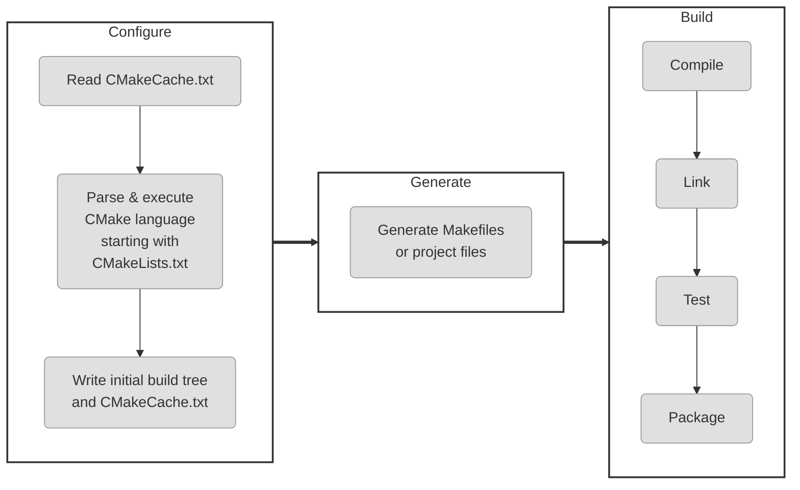
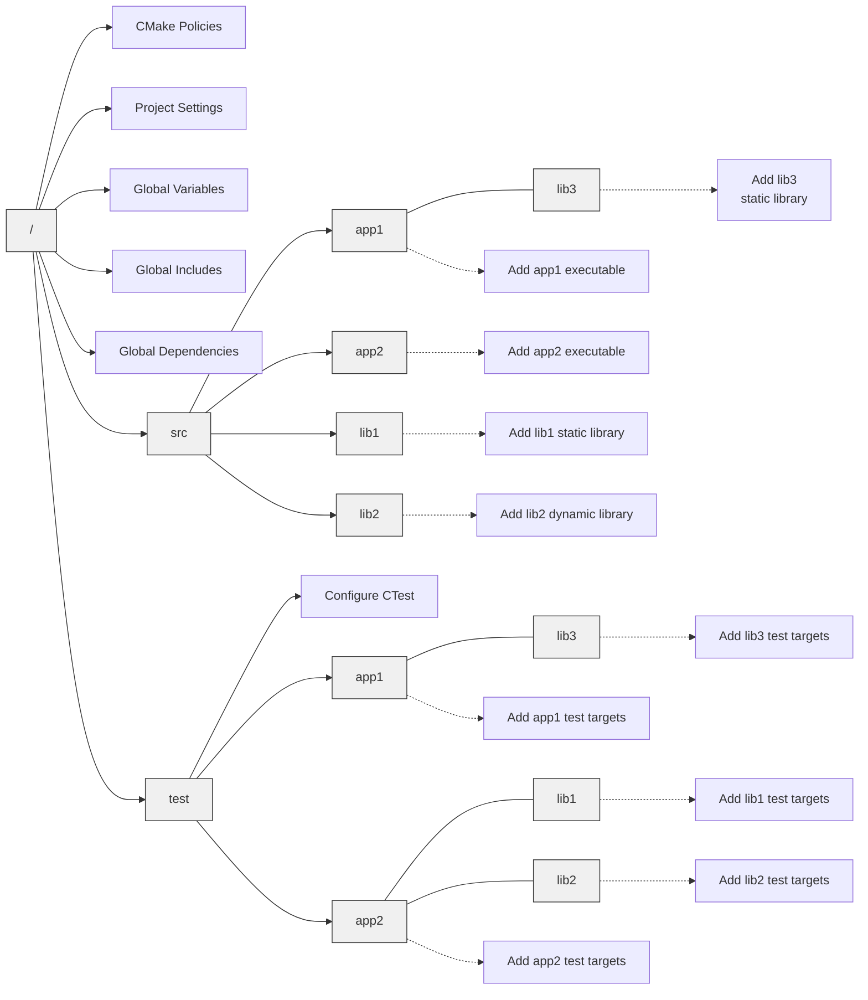
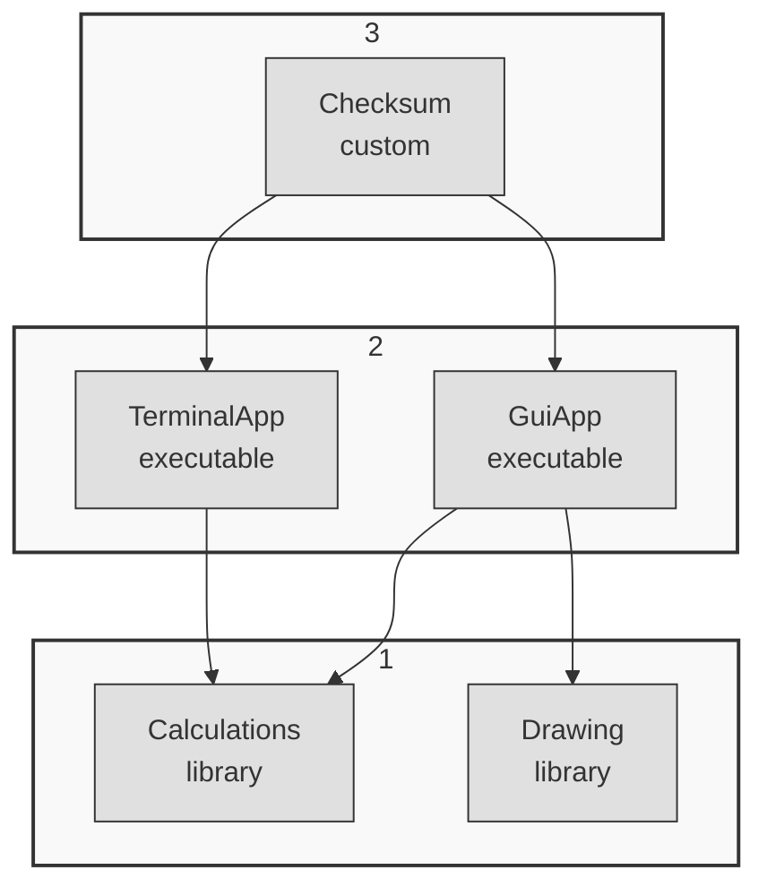
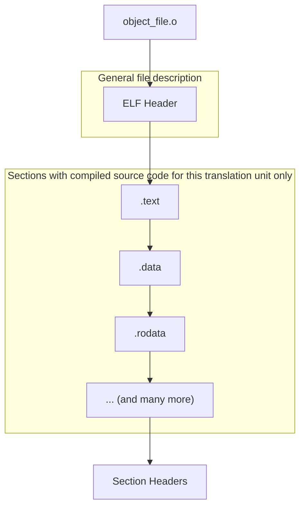
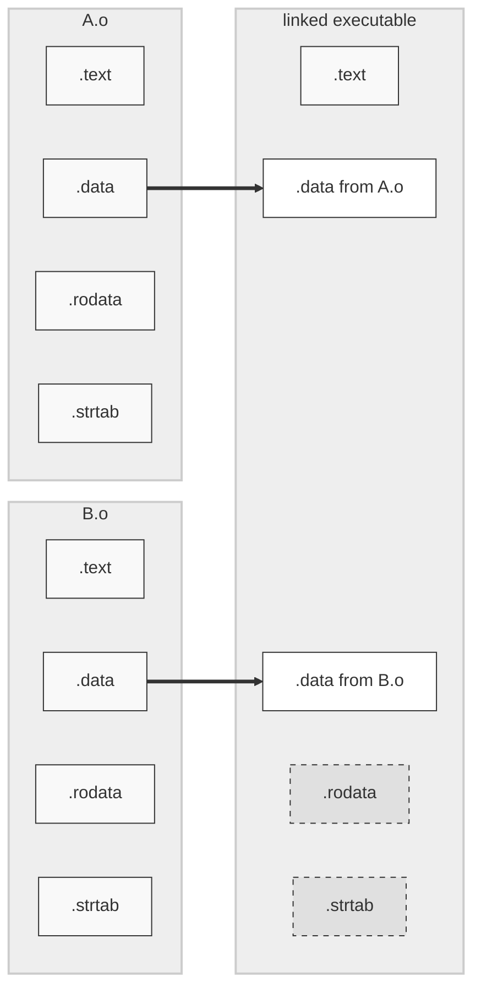

# Modern CMake

[TOC]



生成项目构建系统

构建项目的第一步就是生成构建系统,以下是执行CMake生成项目构建系统操作的三种命令形式

```sh
cmake [<options>] -S <source tree> -B <build tree>
cmake [<options>] <source tree>
cmake [<options>] <build tree>
```

CMake 的一个重要特性是支持源外构建或支持,将构建工件存储在与源树不同的目录中

```sh
cmake -S <source tree> -B <build tree>
```
从 source tree 读取项目文件,使用build目录中生成构建系统

选择生成器

```sh
cmake -G <generator name> -S <source tree> -B <build tree>
```
CMake 在许多平台上支持多种本地构建系统,CMake会选择一个,通过设置CMAKE_GENERATOR环境变量或直接在命令行上指定生成器来覆盖

```sh
cmake -G <generator name> -S <source tree> -B <build tree>
```
```sh
cmake -G <generator name>
-T <toolset spec>
-A <platform name>
-S <source tree> -B <build tree>
```

-T 指定工具集(编译器)和平台(编译器 SDK) 进行更深入的指定

此外,CMake将扫描环境变量以覆盖默认值:CMAKE_GENERATOR_TOOLSET和CMAKE_GENERATOR_PLATFORM

使用预填充缓存信息的能力:

```sh
cmake -C <initial cache script> -S <source tree> -B <build tree>
```

现有缓存变量的初始化和修改可以用另一种方式完成（当创建一个文件仅为设置几个变量有些过于繁琐时），可以直接在命令行中设置：

```sh
cmake -D <var>[:<type>]=<value> -S <source tree> -B <build tree>
```

:<type> 部分可选（由 GUI 使用）并且接受以下类型：BOOL，FILEPATH，PATH，STRING或 INTERNAL。如果省略类型，CMake 会检查变量是否存在于 CMakeCache.txt 文件中并使用其类型；否则，将设置为 UNINITIALIZED

为了debug,还可以使用 - L 选项列出缓存变量

```sh
cmake -L -S <source tree> -B <build tree>

# 同时打印变量帮助信息
cmake -LH -S <source tree> -B <build tree>
cmake -LAH -S <source tree> -B <build tree>
```


使用 -D 选项手动添加的自定义变量不会在这个打印输出中显示

可以使用以下选项删除一个或多个变量：
```sh
cmake -U <globbing_expr> -S <source tree> -B <build tree>
```

使用通配表达式支持 *（通配符）和?（任意字符）符号时要小心，因为很容易意外删除比预期更多的变量

Cmake 命令可以使用多种选项来让了解其内部工作,要获取变量,命令和其他设置的通用信息,请运行以下命令:

```sh
cmake --system-information [file]
```

可选的file参数允许将输出存储在文件中,在构建树目录中,将打印有关缓存变量和日志文件中的构建消息的相关信息

以下行指定了感兴趣的日志级别：
```sh
cmake --log-level=<level>
```

级别可以是以下任意一项:ERROR,WARNING,NOTICE,STATUS,VERBOSE,DEBUG或TRACE
也可以在CMAKE_MESSAGE_LOG_LEVEL缓存变量中指定此设置

CMAKE_MESSAGE_CONTEXT变量可以像栈一样使用

每当代码进入一个有趣的上下文时,就可以给它一个描述性的名称

这样做之后,消息将使用CMAKE_MESSAGE_CONTEXT变量装饰

```sh
[some.context.example] Debug message
```

启用这种日志输出的选项如下：
```sh
cmake --log-context <source tree>
```

如果其他所有方法都失败了,就需要使用重型武器——跟踪模式,它会打印每个执行的命令及其文件名,调用它的行号,以及传递的参数列表

```sh
cmake --trace
```

要列出所有可能的预设,执行以下命令:
```sh
cmake --list-presets
```

可以使用其中一个可用的预设：
```sh
cmake --preset=<preset> -S <source> -B <build tree>
```

清理构建树

```sh
cmake --fresh -S <source tree> -B <build tree>
```

构建项目
在生成构建树之后就可以进行项目构建操作,CMake 不仅知道如何为许多不同的构建工具生成输入文件,还可以根据项目需求为运行这些工具提供适当 参数

运行并构建: 使用多核

```sh
cmake --build <build tree> --parallel [<number of jobs>]
cmake --build <build tree> -j [<number of jobs>]
```

选择要构建和清理的目标
```sh
cmake --build <build tree> --target <target name1> --target <target name2> ...
```

清理构建树

```sh
cmake --build <build tree> -t clean
```

如果想先清理再执行正常的构建：
```sh
cmake --build <build tree> --clean-first
```
我们已经对生成器有了一定的了解：它们有不同的类型和功能。其中一些生成器能够在一
个构建树中同时构建 Debug 和 Release 构建类型，支持此功能的生成器包括 Ninja
Multi-Config、Xcode 和 Visual Studio。其他每个生成器都是单一配置生成器，需要
为每种配置类型单独构建树。
选择 Debug、Release、MinSizeRel 或 RelWithDebInfo 并指定如下：
为多配置生成器配置构建类型
```sh
cmake --build <build tree> --config <cfg>
```

调试构建过程

出现问题时,应该首先检查输出信息,打印所有细节会困惑,当需要查看底层情况时,可以要求CMake打印详细信息
```sh
cmake --build <build tree> --verbose
cmake --build <build tree> -v
```

同样的效果可以通过设置CMAKE_VERBOSE_OUTPUT缓存变量实现

安装项目
 当构建产物完成后,用户可以将它们安装到系统中,这意味这将文件复制到正确的目录,安装库或者运行CMake脚本中的自定义安装逻辑

 安装项目

 当构建产物完成后,用户可以将它们安装到系统中

```sh
cmake --install <build tree> [<options>]
```

像其他操作一样,需要生成的构建树的路径

```sh
cmake --install <build tree>
```

选择安装目录

```sh
cmake --install <build tree> --install-prefix <prefix>

cmake --install <build tree> --prefix <prefix>
```

多配置生成器

可用类型包括 Debug,Release，MinSizeRel 和 RelWithDebInfo

```sh
cmake --install <build tree> --config <cfg>
```

选择组件:

作为开发者，可能会选择将项目拆分为可以独立安装的组件。现在，假设有一组不需要在所有情况下使用的产物。这可能类似于 application、docs 和 extra-tools。
要安装单个组件，使用以下选项：

```sh
cmake --install <build tree> --component <component>
```

权限设置 ，如果 安装 在类 Unix 平台上，可以使用以下选项指定安装目录的默认权限，格式为u=rwx,g=rx,o=rx

```sh
cmake --install <build tree>
--default-directory-permissions <permissions>
```

与构建阶段类似，也可以选择查看安装阶段的详细输出：
```sh
cmake --install <build tree> --verbose
cmake --install <build tree> -v
```

执行脚本

```sh
cmake [{-D <var>=<value>}...] -P <cmake script file>
[-- <unparsed options>...]
```

* 通过使用 -D 选项定义的变量
* 通过可以在 -- 符号后传递的参数
CMake 将为传递给脚本的所有参数 (包括--) 创建 CMAKE_ARGV<n> 变量。

命令行工具


少数情况下,我们需要以平台无关的方式运行单个命令——例如复制文件或计算校验和,并非所有的平台都完全相同

Make 提供了一种模式，大多数常见命令都可以跨平台地以相同方式执行。其语法如下：
```sh
cmake -E <command> [<options>]
```

工作流预设

使用 CMake 构建项目分为三个阶段：配置、生成和构建。此外，还可以使用 CMake 运行
自动化测试，甚至创建可重分配的包。通常，用户需要通过命令行单独手动执行每一个步骤。但是，
高级项目可以指定工作流预设，将多个步骤捆绑成单一动作，只需一个命令即可执行。目前，只需
知道用户可以通过运行以下命令，获取可用预设的列表：


```sh
cmake ––workflow --list-presets
```

可以执行一个工作流预设：

```sh
cmake --workflow --preset <name>
```

为了生产高质量的代码并维护其质量，自动化测试是非常重要的。CMake 套件包含了一个用于此目的的命令行工具 CTest，旨在标准化测试的执行和报告方式。作为 CMake 用户，不需要了解特定项目测试的详细信息：使用了哪个框架或如何运行。CTest 提供了一个方便的接口来列出、过滤、随机化、重试和限制测试运行的时间

## CMake 语言

以下是与 message() 命令一起使用此类参数的示例，该命令将所有传递的参数输出到屏幕上：

```sh
message([[multiline
 bracket
 argument ]])
 message([==[
 because we used two equal-signs "=="
 this command receives only a single argument
 even if it includes two square brackets in a row
 { "petsArray" = [["mouse","cat"],["dog"]] }
 ]==])
```

使用变量

```cmake
set(myVar "Hello, World!")
message("The value of myVar is: ${myVar}")
```

变量引用在变量类别方面的工作方式:

* ${} 语法用于引用普通变量或缓存变量
* $ENV{}用于引用环境变量
* $CACHE{}用于引用缓存变量

文件变量作用域通过block() 和 function() 命令展开并通过endblock() 和 endfunction() 命令结束

列表

```cmake
set(myList "a;list;of;five;elements")
set(myList a list "of;five;elements")
```

list 子命令摘要:
```cmake 
list(LENGTH <list> <out-var>)
list(GET <list> <element index> [<index> ...] <out-var>)
list(JOIN <list> <glue> <out-var>)
list(SUBLIST <list> <begin> <length> <out-var>)
list(FIND <list> <value> <out-var>)
list(APPEND <list> [<element>...])
list(FILTER <list> {INCLUDE | EXCLUDE} REGEX <regex>)
list(INSERT <list> <index> [<element>...])
list(POP_BACK <list> [<out-var>...])
list(POP_FRONT <list> [<out-var>...])
list(PREPEND <list> [<element>...])
list(REMOVE_ITEM <list> <value>...)
list(REMOVE_AT <list> <index>...)
list(REMOVE_DUPLICATES <list>)
list(TRANSFORM <list> <ACTION> [...])
list(REVERSE <list>)
list(SORT <list> [...])
```

### 控制结构

条件块:

```cmake 
if(<condition>)
<commands>
elseif(<condition>) # optional block, can be repeated
<commands>
else() # optional block
<commands>
endif()

<!-- 嵌套条件 -->
(<condition>) AND (<condition> OR (<condition>))
```

```cmake
set(BAZ FALSE)
set(QUX "BAZ")
if(${QUX})
```
这里先求值变量后发现是一个已经识别的变量,进而解析为了一个包含五个字符的字符串FALSE 进而解析为假


CMake 只有在以下情况下，才会将
if(FOO) 计算为假：
• OFF, NO, FALSE, N, IGNORE 或 NOTFOUND
• 以-NOTFOUND 结尾的字符串
• 空字符串
• 零

简单地判断一个未定义的变量，将为假：
1 if (CORGE)
当变量事先定义后，情况就改变了，条件计算为真：
1 set(CORGE "A VALUE")
2 if (CORGE)

比较值
支持以下操作符进行比较操作：
EQUAL, LESS, LESS_EQUAL, GREATER 和 GREATER_EQUAL
其他语言中常见的比较操作符，在 CMake 中不起作用。
它们可以用来比较数值：
```cmake
if(${FOO} EQUAL 1)
```

还可以检查以下内容：
• 值是否在列表中：<VARIABLE|STRING> IN_LIST <VARIABLE>
• 此版本的 CMake 中是否可以调用某个命令：COMMAND <command-name>
• 是否存在一个 CMake 策略：POLICY <policy-id>
• 是否使用 add_test() 添加了 CTest 测试：TEST <test-name>
• 是否定义了一个构建目标：TARGET <target-name>


• EXISTS <path-to-file-or-directory>: 检查文件或目录是否存在。
也会符号链接进行解析（如果符号链接的目标存在，则返回真）。
• <file1> IS_NEWER_THAN <file2>: 检查哪个文件修改时间更晚。
如果文件 1 比文件 2 修改时间更晚（或等于）或者两个文件中有一个不存在，则返回真。
• IS_DIRECTORY <path-to-directory>: 检查路径是否为目录。
• IS_SYMLINK <file-name>: 检查路径是否为符号链接。
• IS_ABSOLUTE <path>: 检查路径是否为绝对路径。

使用 while() 循环或 foreach() 循环，来重复执行同一
组命令。这两个命令都支持循环控制机制：
• break() 循环将停止执行剩余的块，并跳出包围的循环。
• continue() 循环将停止当前迭代的执行，并从下一个迭代的开头开始。


```cmake
 while(<condition>)
 <commands>
endwhile()
```

foreach()
foreach() 块有几种变体，为给定列表中的每个值执行封闭的命令。像其他块一样，有打开
和关闭命令：foreach() 和 endforeach()。
foreach() 的最简单形式类似 C++ 的 for 循环：
```cmake
foreach(<variable> <list>)
<commands>
endforeach()
```

CMake 将从 0 迭代到 <max>（包括）。如果需要更多控制，可以使用第二个变体，提供
<min>，<max>，以及可选的 <step>。所有参数都必须是非负整数，且 <min> 必须小于 <max>：
```cmake
foreach(<loop_var> RANGE <min> <max> [<step>])
```

当 foreach() 处理列表时，才是彰显特色的时候：\
```cmake
foreach(<loop_variable> IN [LISTS <lists>] [ITEMS <items>])
```

```cmake
set(L1 "one;two;three;four")
 set(L2 "1;2;3;4;5")
 foreach(num IN ZIP_LISTS L1 L2)
 message("word=${num_0}, num=${num_1}")
 endforeach()
```

### 自定义命令

macro() 查找替换命令,function()进行函数调用
宏中调用return()将返回比使用点各更高一层的调用语句已经在顶层作用域中可能会终止执行

CMake 提供了以下变量来访问与调用相关的参数值：
• ${ARGC}: 参数计数
• ${ARGV}: 参数列表 (所有参数)
• ${ARGV<index>}: 特定索引（从 0 开始）处的参数值
• ${ARGN}: 调用者在最后一个参数后传递的匿名参数列表


宏与其他块定义类似：
```cmake
macro(<name> [<argument>…])
<commands>
endmacro()
```

```cmake
macro(MyMacro myVar)
    set(myVar "new value")
    message("argument: ${myVar}")
endmacro()

set(myVar "first value")
message("myVar is now: ${myVar}")
MyMacro("called value")
message("myVar is now: ${myVar}")
```

```cmake
function(<name> [<argument>…])
    <commands>
endfunction()
```

函数遵循调用堆栈的规则，允许使用 return() 命令返回到调用作用域。从 CMake 3.25开始，return() 命令允许一个可选的 PROPAGATE 关键字，后跟一系列变量名称。其目的与block() 命令类似——指定变量的值从局部作用域传递到调用作用域。

```cmake
function(MyFunction FirstArg)
 message("Function: ${CMAKE_CURRENT_FUNCTION}")
 message("File: ${CMAKE_CURRENT_FUNCTION_LIST_FILE}")
 message("FirstArg: ${FirstArg}")
 set(FirstArg "new value")
 message("FirstArg again: ${FirstArg}")
 message("ARGV0: ${ARGV0} ARGV1: ${ARGV1} ARGC: ${ARGC}")
 endfunction()
 set(FirstArg "first value")
 MyFunction("Value1" "Value2")
 message("FirstArg in global scope: ${FirstArg}")
```

运行结果如下
```sh
Function: MyFunction
File: /root/examples/ch02/08-definitions/function.cmake
FirstArg: Value1
FirstArg again: new value
ARGV0: Value1 ARGV1: Value2 ARGC: 2
FirstArg in global scope: first value
```

解决多个函数声明结构难以阅读的方法:将命令移动到其他文件中,并在目录之间划分作用域, 还有一个简单而优雅的方法----在文件顶部声明一个入口点宏,并在文件末尾调用:

```cmake
macro(main)
    first_step()
    second_step()
    third_step()
endmacro()

function(first_step)
function(second_step)
function(third_step)

main()
```

关于命名约定

message() 命令，将文本输出到标准输出，但其功能远不止于此。其有一个 MODE 参数，可
以定义命令的行为，如下所示：message(<MODE> ”text to print”)。
可用的 MODE 如下所示：
• FATAL_ERROR: 停止处理和生成。
• SEND_ERROR: 继续处理，但跳过生成。
• WARNING: 继续处理。
• AUTHOR_WARNING: 输出警告，但继续处理。
• DEPRECATION: 如 果 启 用 了 CMAKE_ERROR_DEPRECATED 或
CMAKE_WARN_DEPRECATED，则输出相应地信息。
• NOTICE 或省略模式（默认）: 输出消息到 stderr，以吸引使用者的注意。
• STATUS: 继续处理，推荐用于向用户显示的主要消息。
• VERBOSE: 继续处理，应用于更详细的信息，通常不是非常必要。
• DEBUG: 继续处理，应包含项目出现问题时，对处理问题有帮助的详细信息。
• TRACE: 继续处理，建议在项目开发期间输出消息。通常，这类消息会在发布项目之前移除。

```cmake
message(FATAL_ERROR "stop processing")
message("This won't be printed. ")
```

```cmake
function(foo)
    list(APPEND CMAKE_MESSAGE_CONTEXT "foo")
    message("foo message")
endfunction()

list(APPEND CMAKE_MESSAGE_CONTEXT "top")
message("Before foo")
foo()
message("After foo")
```

1. 首先，将 top 追加到上下文跟踪变量 CMAKE_MESSAGE_CONTEXT，然后打印最初的“Before ’foo’ ”，匹配的前缀 [top] 将添加到输出中。
2. 接下来，进入 foo() 函数时，我们在属于该函数的列表后，追加一个名为 foo 的新上下文，并输出另一个消息，该消息在输出中显示扩展的 [top.foo] 前缀。
3. 最后，在函数执行完成后，我们打印“After ’foo’”。消息以原始的 [foo] 作用域打印。
为什么？因为变量作用域规则：更改的 CMAKE_MESSAGE_CONTEXT 变量只在函数作用域结束前有效，然后恢复为原始未更改的版本

include 

```cmake
include(<file|module> [OPTIONAL] [RESULT_VARIABLE <var>])
```

如果提供一个文件名(带有.cmake 扩展名的路径),CMake 将尝试打开并执行
如果文件不存在，CMake 将报错，除非使用 OPTIONAL 关键字指定相应文件为“可选的”。当需要知道 include() 是否成功时，可以提供 RESULT_VARIABLE 关键字以及变量的名称。在成功时，它的内容为文件的完整路径；在失败时，则为 NOTFOUND

使用脚本模式下运行时，相对路径都将以当前工作目录解析相对路径。要强制相对于脚本本身进行搜索，请提供绝对路径：

```cmake
include("${CMAKE_CURRENT_LIST_DIR}/<filename>.cmake")
```

如果不提供路径，但提供了模块的名称（不带.cmake 或其他），CMake 将尝试找到一个模块
并包含它。CMake 将在 CMAKE_MODULE_PATH 中搜索名为 < 模块 >.cmake 的文件，然后是
在 CMake 模块目录中搜索。
当 CMake 遍历源树，并包含了不同的列表文件时，将设置以下变量：
• CMAKE_CURRENT_LIST_DIR
• CMAKE_CURRENT_LIST_FILE
• CMAKE_PARENT_LIST_FILE
• CMAKE_CURRENT_LIST_LINE

include_guard()

对于有些文件，我们只希望包含一次，这时 include_guard([DIRECTORY|GLOBAL]) 就
可以使用了。
将 include_guard() 放在包含文件的顶部。当 CMake 第一次遇到它时，将在当前作用
域中进行记录。如果文件再次包含，CMake 就不会再对该文件进行处理了。

file()

```cmake
file(READ <filename> <out-var> [...])
file({WRITE | APPEND} <filename> <content>...)
file(DOWNLOAD <url> [<file>] [...])
```

使用execute_process() 来运行其他进程,并收集输出

```cmake
execute_process(COMMAND <cmd1> [<arguments>]... [OPTIONS])
```

可选地 TIMEOUT 参数，用来在进程未在所需限制内完成任务时终止该进程，并且可以根据需要设置 WORKING_DIRECTORY 。

为了收集输出，CMake 提供了两个参数：OUTPUT_VARIABLE 和 ERROR_VARIABLE（用法类似）。如果想合并 stdout 和 stderr，请为这两个参数使用相同的变量。


## 设置你的第一个CMake项目


建议在 cmake_minimum_required() 之后立即放置 project() 命令，这样做将确保在配置项目时使用正确的策略。可以使用以下两种形式之一：
```cmake
project(<PROJECT-NAME> [<language-name>...])
```

或者

```cmake
project(<PROJECT-NAME>
[VERSION <major>[.<minor>[.<patch>[.<tweak>]]]]
[DESCRIPTION <project-description-string>]
[HOMEPAGE_URL <url-string>]
[LANGUAGES <language-name>...])
```

```cmake
PROJECT_NAME
CMAKE_PROJECT_NAME (only in the top-level CMakeLists.txt)
PROJECT_IS_TOP_LEVEL, <PROJECT-NAME>_IS_TOP_LEVEL
PROJECT_SOURCE_DIR, <PROJECT-NAME>_SOURCE_DIR
PROJECT_BINARY_DIR, <PROJECT-NAME>_BINARY_DIR
```

```cmake
  <!-- cars.cmake -->
set(sources
  cars/car.cpp
  )

  <!-- cmakelists.txt -->
cmake_minimum_required(VERSION 3.10)
project(MyProject)

include(cars.cmake)
add_executable(MyProject main.cpp   ${sources})
```

使用子目录管理作用域

add_subdirectory() 将计算 source_dir 路径（相对于当前目录）并解析其中的
CMakeLists.txt 文件。这个文件在目录作用域内解析，消除了前一种方法中提到的问题：
• 变量隔离到嵌套作用域。
• 嵌套工件可以独立配置。
• 修改嵌套的 CMakeLists.txt 文件不需要重新构建不相关的目标。
• 路径定位到目录，并且可以添加到父级包含路径。

```cmake
add_subdirectory(source_dir [binary_dir] [EXCLUDE_FROM_ALL])
```

subdirectory下的cmakelists.txt为
```cmake
cmake_minimum_required(VERSION 3.10)
project(MyProject)
add_executable(MyProject main.cpp)
add_subdirectory(cars)
target_link_libraries(MyProject cars)
```

嵌套的列表文件什么样;

```cmake
add_libary(cars OBJECT
  car.cpp)
target_include_directories(cars PUBLIC .)
```

在这个例子中,使用add_library()来生成一个全局可见的目标


当使用target_link_libraries()时,main.cpp文件可以在不提供相对路径的情况下使用该头文件




1. 执行从项目的根开始——即源树顶层的 CMakeLists.txt 列表文件。该文件将设置所需的
最低 CMake 版本和相应的策略，设置项目名称、支持的语言和全局变量，并包含 cmake
目录中的文件，以便内容全局可用。
2. 下一步是调用 add_subdirectory(src bin) 命令进入 src 目录的范围（希望将编译
后的工件放在 <binary_tree>/bin，而不是/bin 中）。
3. CMake 读取 src/CMakeLists.txt 文件，并发现其唯一目的是添加四个嵌套子目录：
app1、app2、lib1 和 lib2。
4. CMake 进 入 app1 的 变 量 范 围， 并 了 解 到 另 一 个 嵌 套 库 lib3， 它 有 自 己 的
CMakeLists.txt 文件；然后进入 lib3 的范围，这是对目录结构的深度优先遍历。
5. lib3 库添加了一个同名静态库目标，CMake 返回到 app1 的父范围。
6. app1 子目录添加了一个依赖于 lib3 的可执行文件。CMake 返回到 src 的父范围。
7. CMake 进入剩余的嵌套范围，并执行列表文件，直到所有 add_subdirectory() 调用完
成。
8. CMake 返回到顶层范围，并执行剩余的命令 add_subdirectory(test)。CMake 每次
都会进入新的范围，并执行相应列表文件中的命令。
9. 收集并检查所有目标的正确性。CMake 现在有了生成构建系统所需的所有信息。

检测操作系统

```cmake
if(CMAKE_SYSTEM_NAME STREQUAL "Linux")
    message(STATUS "Doing things the usual way")
elseif(CMAKE_SYSTEM_NAME STREQUAL "Darwin")
    message(STATUS "Thinking differently")
elseif(CMAKE_SYSTEM_NAME STREQUAL "Windows")
    message(STATUS "I'm supported here too.")
elseif(CMAKE_SYSTEM_NAME STREQUAL "AIX")
    message(STATUS "I buy mainframes.")
else()
    message(STATUS "This is ${CMAKE_SYSTEM_NAME} speaking.")
endif()
```

交叉编译是指在一个机器上编译代码在另一个目标平台上执行的过程

无 论 配 置 如 何， 主 机 系 统 的 信 息 总 是 可 以 在 带 有 HOST 关 键 字 的 变 量 名 称 中 访 问：CMAKE_HOST_SYSTEM, CMAKE_HOST_SYSTEM_NAME, CMAKE_HOST_SYSTEM_PROCESSOR
和 CMAKE_HOST_SYSTEM_VERSION。

主机系统信息
```cmake
cmake_host_system_information(RESULT <VARIABLE> QUERY <KEY>...)
```

| 关键字 | 描述 |
| :--- | :--- |
| HOSTNAME | 主机名 |
| FQDN | 完全限定域名 |
| TOTAL_VIRTUAL_MEMORY | 以 MiB 为单位的虚拟内存总量 |
| AVAILABLE_VIRTUAL_MEMORY | 以 MiB 为单位的可用虚拟内存 |
| TOTAL_PHYSICAL_MEMORY | 以 MiB 为单位的总物理内存 |
| AVAILABLE_PHYSICAL_MEMORY | 以 MiB 为单位的可用物理内存 |
| OS_NAME | 如果存在，则输出 uname -s；<br>无论是 Windows、Linux，还是 Darwin |
| OS_RELEASE | 操作系统子类型，如 Windows Professional |
| OS_VERSION | 操作系统构建 ID |
| OS_PLATFORM | 在 Windows 上和  $ ENV{PROCESSOR_ARCHITECTURE} 的值一样。在 Unix/macOS 上和 uname -m 一样 |


| 关键字 | 描述 |
| :--- | :--- |
| NUMBER_OF_LOGICAL_CORES | 逻辑核数 |
| NUMBER_OF_PHYSICAL_CORES | 物理核数 |
| HAS_SERIAL_NUMBER | 如果处理器有序列号，则为 1 |
| PROCESSOR_SERIAL_NUMBER | 处理器序列号 |
| PROCESSOR_NAME | 可读的处理器名称 |
| PROCESSOR_DESCRIPTION | 可读的完整处理器描述 |
| IS_64BIT | 如果处理器是 64 位的为 1 |
| HAS_FPU | 如果处理器有浮点单元为 1 |
| HAS_MMX | 如果处理器支持 MMX 指令为 1 |
| HAS_MMX_PLUS | 如果处理器支持 Ext. MMX 指令为 1 |
| HAS_SSE | 如果处理器支持 SSE 指令为 1 |
| HAS_SSE2 | 如果处理器支持 SSE2 指令为 1 |
| HAS_SSE_FP | 如果处理器支持 SSE FP 指令为 1 |
| HAS_SSE_MMX | 如果处理器支持 SSE MMX 指令为 1 |
| HAS_AMD_3DNOW | 如果处理器支持 3DNow 指令为 1 |
| HAS_AMD_3DNOW_PLUS | 如果处理器支持 3DNow+ 指令为 1 |
| HAS_IA64 | 如果 IA64 处理器模拟 x86，则为 1 |

设置C++标准

```cmake
set(CMAKE_CXX_STANDARD 17)
```
如果需要可以对每个目标进行重写：
```cmake
set_property(TARGET my_target PROPERTY CXX_STANDARD <version>)
```
或者
```cmake
set_target_properties(<targets> PROPERTIES CXX_STANDARD <version>)
```

```cmake
set(CMAKE_CXX_EXTENSIONS OFF)
```
 
检查支持的编译器特性

```cmake
list(FIND CMAKE_CXX_COMPILE_FEATURES cxx_variable_templates result)
if(result EQUAL -1)
    message(STATUS "C++ variable templates are not supported")
endif()
```

try_run() 命令会给予更多的自由，因为它可以确保代码不仅编译成功，而且执行也正确（可能想要测试正则表达式是否工作）。当然，这不会在交叉编译场景中工作（因为主机无法运行为不同目标构建的可执行文件），这个检查的目的是向用户提供快速反馈 (能正常编译)，所以它不是用来运行单元测试或任何复杂的东西——文件尽可能简单：

```cmake
set(CMAKE_CXX_STANDARD 20)
set(CMAKE_CXX_STANDARD_REQUIRED ON)
set(CMAKE_CXX_EXTENSIONS OFF)

try_run(run_result compile_result
        ${CMAKE_BINARY_DIR}/test_output
        ${CMAKE_SOURCE_DIR}/main.cpp
        RUN_OUTPUT_VARIABLE output)

message("run_result: ${run_result}")
message("compile_result: ${compile_result}")
message("output:\n" "${output}")
```

## 与目标一起工作

定义可执行目标的命令
```cmake
add_executable(<name> [WIN32] [MACOSX_BUNDLE]
[EXCLUDE_FROM_ALL]
[source1] [source2 ...])
```

定义库目标

```cmake
add_library(<name> [STATIC | SHARED | MODULE]
[EXCLUDE_FROM_ALL]
[<source>...])
```

自定义目标

使用以下语法自定义目标
• 计算其他二进制文件的校验和。
• 运行代码消毒器并收集结果。
• 将编译报告发送到指标通道。

```cmake
add_custom_target(Name [ALL] [COMMAND command2 [args2...] ...])
```


这个项目有两个库，两个可执行文件和一个自定义目标。用例是提供一个带有 GUI 的银行应用程序（GuiApp），以及一个作为自动化脚本一部分使用的命令行版本（TerminalApp）。两个可执行文件都依赖于相同的 Calculations 库，但只有一个需要 Drawing 库。为了确保应用程序二进制文件的完整性，我们还将计算一个校验和，并通过单独的安全渠道分发它CMake 在编写此类解决方案的列表文件时非常灵活：

```cmake
cmake_minimum_required(VERSION 3.26)
project(BankApp CXX)

add_executable(terminal_app terminal_app.cpp)
add_executable(gui_app gui_app.cpp)
target_link_libraries(terminal_app calculations)
target_link_libraries(gui_app calculations drawing)

add_library(calculations calculation.cpp)

add_library(drawing drawing.cpp)

add_custom_target(checksum ALL
        COMMAND sh -c "cksum terminal_app> terminal.ck"
        COMMAND sh -c "cksum gui_app> gui.ck"
        BYPRODUCTS terminal.ck gui.ck
        COMMENT "Calculating checksums..."
)
```

这段 CMake 代码定义了一个名为 **BankApp** 的项目，包含两个可执行程序、两个静态库以及一个用于生成校验和的自定义目标。以下是逐行解析：

项目基础设置
- `cmake_minimum_required(VERSION 3.26)`：指定构建该项目所需的最低 CMake 版本为 3.26。如果用户的 CMake 版本低于此，配置过程将报错停止。
- `project(BankApp CXX)`：定义项目名称为 `BankApp`，并指定主要编程语言为 C++（`CXX`）。这会自动初始化一些与 C++ 相关的变量（如 `CMAKE_CXX_COMPILER`）。

定义库
虽然代码中先定义了可执行文件，但在逻辑上，库通常是作为依赖存在的。
- `add_library(calculations calculation.cpp)`：创建一个名为 `calculations` 的库目标（默认为静态库），源文件为 `calculation.cpp`。这个库通常包含核心的业务逻辑或数学计算功能。
- `add_library(drawing drawing.cpp)`：创建一个名为 `drawing` 的库目标，源文件为 `drawing.cpp`。这个库可能包含图形绘制或界面渲染相关的功能。

定义可执行文件与链接
- `add_executable(terminal_app terminal_app.cpp)`：定义一个名为 `terminal_app` 的可执行文件目标，由 `terminal_app.cpp` 编译而成。这是终端版本的入口程序。
- `add_executable(gui_app gui_app.cpp)`：定义一个名为 `gui_app` 的可执行文件目标，由 `gui_app.cpp` 编译而成。这是图形用户界面版本的入口程序。
- `target_link_libraries(terminal_app calculations)`：将 `terminal_app` 与 `calculations` 库链接。这意味着终端程序可以使用计算库中的函数。
- `target_link_libraries(gui_app calculations drawing)`：将 `gui_app` 同时与 `calculations` 和 `drawing` 两个库链接。这意味着 GUI 程序既需要计算功能，也需要绘图功能。

自定义构建步骤
- `add_custom_target(checksum ALL ...)`：定义一个名为 `checksum` 的自定义目标。
    - `ALL`：表示这个目标会被添加到默认构建目标中。也就是说，当你运行 `cmake --build .` 时，这个步骤也会自动执行，不需要单独调用 `make checksum`。
    - `COMMAND sh -c "cksum terminal_app> terminal.ck"`：执行 shell 命令，对生成的 `terminal_app` 二进制文件进行校验和计算（使用 `cksum` 工具），并将结果重定向写入到 `terminal.ck` 文件中。
    - `COMMAND sh -c "cksum gui_app> gui.ck"`：同上，对 `gui_app` 进行校验和计算并保存到 `gui.ck`。
    - `BYPRODUCTS terminal.ck gui.ck`：告诉 CMake 这两个文件是该命令产生的产物。这有助于 CMake 正确处理增量构建（即如果源文件没变，就不需要重新计算校验和）。
    - `COMMENT "Calculating checksums..."`：在构建过程中打印提示信息，让用户知道正在做什么。

总结
这是一个典型的 C++ 多目标项目结构：
1. **分层架构**：将通用功能（计算、绘图）封装为库，将具体应用（终端、GUI）作为可执行文件，实现了代码复用。
2. **自动化后处理**：利用 `add_custom_target` 在每次编译完成后自动检查二进制文件的完整性（通过校验和），这在软件发布或安全敏感的场景中很有用。

前面的解决方案不能保证校验和目标会在可执行文件之后构建,CMake不知道校验和依赖于可执行二进制文件的存在,所以它可以自由地首先开始构建它
```cmake
add_dependencies(checksum terminal_app gui_app)
```

可视化依赖关系

```cmake
cmake --graphviz=test.dot .
```

该模块将生成一个文本文件，可以将其导入到 Graphviz 可视化软件中，该软件可以渲染图像或生成 PDF 或 SVG 文件，可以作为软件文档的一部分存储

```cmake
set(GRAPHVIZ_CUSTOM_TARGETS TRUE)
```

设置目标的属性:目标具有类似CPP对象字段的属性,其中一些属性为了修改而设计,而有些只是只读CMake定义了大量的"已知属性",这些属性取决于目标的类型,也可以添加自己的属性

设置目标属性允许我们同时为多个目标指定多个属性


```cmake
get_target_property(<var> <target> <property-name>)
set_target_properties(<target1> <target2> ...
PROPERTIES <prop1-name> <value1>
<prop2-name> <value2> ...)
```
属性的概念不仅适用于目标；CMake 支持为其他范围设置属性：GLOBAL、DIRECTORY、SOURCE、INSTALL、TEST 和 CACHE。 为 了 操 作 所 有 类 型 的 属 性， 有 通 用 的get_property() 和 set_property() 命令。在某些项目中，会看到这些低层命令用来精确地完成 set_target_properties() 命令所做的事情：

```cmake
set_property(TARGET <target> PROPERTY <name> <value>)
```

```cmake
target_compile_definitions(<source> <INTERFACE|PUBLIC|PRIVATE> [items1...])
```

这个目标命令将填充一个 <source> 目标的 COMPILE_DEFINITIONS 属性。编译定义就是传递给编译器的-Dname=definition 标志，用于配置 C++ 预处理器定义这里有趣的部分是第二个参数，需要指定三个值中的一个，INTERFACE、PUBLIC 或
PRIVATE，以控制属性应该传递给哪个目标。现在，不要将这些与 C++ 访问修饰符混淆——这是一个全新的概念。传播关键字的工作方式如下：
• PRIVATE 设置源目标的属性。
• INTERFACE 设置使用目标的目标属性。
• PUBLIC 设置源目标和使用目标的目标属性。
当属性不应传递给其他目标时，将其设置为 PRIVATE。当需要这样的传递时，选择 PUBLIC。如果处于一个源目标在其实现（.cpp 文件）中就不使用该属性，而在头文件中使用，并且这些属性传递给使用目标的目标，则应使用 INTERFACE 关键字。

为 了 管 理 这 些 属 性，CMake 提 供 了 一 些 命 令， 例 如 之 前 提 到 的target_compile_definitions()。当指定 PRIVATE 或 PUBLIC 关键字时，CMake 将在目标的属性中存储提供的值，COMPILE_DEFINITIONS。此外，关键字是 INTERFACE 或 PUBLIC，将在具有 INTERFACE_前缀的属性中存储值——INTERFACE_COMPILE_DEFINITIONS。配置阶段，CMake 将读取源目标的接口属性，并将其内容附加到目标目标。就这样传播属性，或 CMake
所说的传递目标的使用要求。

PRIVATE（私有）：只有我自己用
含义：这个宏定义只用于编译 LibA 自己的源文件（.cpp）。
场景：你在 LibA.cpp 里写了 #ifdef SOME_MACRO，但在 LibA.h（公开头文件）里完全没提这个宏。
结果：
LibA 编译时：带有 -DSOME_MACRO。
AppB 编译时：没有 -DSOME_MACRO。
比喻：这是 LibA 的“内部机密”，AppB 不需要知道，也不应该知道。
INTERFACE（接口）：只有别人用，我自己不用
含义：这个宏定义不用于编译 LibA 的源文件，但任何链接了 LibA 的目标都必须拥有这个定义。
场景：LibA.cpp 里根本没用到这个宏，但是 LibA.h（公开头文件）里写了 #ifdef SOME_MACRO。因为 AppB 会 #include "LibA.h"，所以 AppB 必须定义这个宏才能通过编译。
结果：
LibA 编译时：没有 -DSOME_MACRO。
AppB 编译时：带有 -DSOME_MACRO。
比喻：这是 LibA 给 AppB 的“使用说明书”或“入场券”。LibA 自己不需要这张票，但想用它的人必须有。
PUBLIC（公开）：大家都要用
含义：既用于编译 LibA，也传递给链接它的 AppB。它是 PRIVATE + INTERFACE 的结合体。
场景：LibA.cpp 用到了这个宏，同时 LibA.h 也用到了这个宏。
结果：
LibA 编译时：带有 -DSOME_MACRO。
AppB 编译时：带有 -DSOME_MACRO。
比喻：这是“通用语言”。LibA 内部交流用它，跟 AppB 交流也用它。

• COMPILE_DEFINITIONS
• COMPILE_FEATURES
• COMPILE_OPTIONS
• INCLUDE_DIRECTORIES
• LINK_DEPENDS
• LINK_DIRECTORIES
• LINK_LIBRARIES
• LINK_OPTIONS
• POSITION_INDEPENDENT_CODE
• PRECOMPILE_HEADERS
• SOURCES

我们将在接下来的页面中讨论大多数这些选项

为了在目标之间创建依赖关系,使用targette
 
为了在目标之间创建依赖关系,使用target_link_libraries()命令
```cmake
target_link_libraries(<target>
<PRIVATE|PUBLIC|INTERFACE> <item>...
[<PRIVATE|PUBLIC|INTERFACE> <item>...]...)
```

传播关键字的工作方式：
• PRIVATE 将源值添加到源目标的私有属性。
• INTERFACE 将源值添加到源目标的接口属性。
• PUBLIC 将值添加到源目标的两个属性。
INTERFACE 属性仅用于将属性进一步传播到链中的下一个目标，而源目标在其构建过程中不会使用。


处理冲突的传播属性


当一个目标依赖于多个目标时，可能存在传播属性之间直接冲突的情况
例如,一个使用的目标将 POSITION_INDEPENDENT_CODE 属性设置为 true,而另一个设置为false , CMake将这种冲突理解为错误,并打印出类似下面的错误信息:

```cmake
CMake Error: The INTERFACE_POSITION_INDEPENDENT_CODE property of "source_ target" does not
agree with the value of POSITION_INDEPENDENT_CODE already determined for
"destination_target".
```

为了确保只使用特定版本的库,可以创建一个自定义接口属性,INTERFACE_LIB_VERSION,并在其中存储版本

CMake不会传播自定义属性,必须明确地将自定义属性添加到兼容属性列表中

每个目标都有四个这样的列表

• COMPATIBLE_INTERFACE_BOOL
• COMPATIBLE_INTERFACE_STRING
• COMPATIBLE_INTERFACE_NUMBER_MAX
• COMPATIBLE_INTERFACE_NUMBER_MIN

将属性添加到它们中的任何一个，都会触发传播和兼容性检查

BOOL列表将检查所有传递到目标的属性是否评估为相同的布尔值

STRING 将评估为字符串。NUMBER_MAX 和 NUMBER_MIN 略有不同——传递的值不必匹配，但目标目标将只接收最高或最低值。

```cmake
cmake_minimum_required(VERSION 3.26)
project(PropagatedProperties CXX)

# 1. 创建 source1 库并设置版本及兼容性要求
add_library(source1 empty.cpp)
set_property(TARGET source1 PROPERTY INTERFACE_LIB_VERSION 4)
set_property(TARGET source1 APPEND PROPERTY 
    COMPATIBLE_INTERFACE_STRING LIB_VERSION)

# 2. 创建 source2 库并设置版本
add_library(source2 empty.cpp)
set_property(TARGET source2 PROPERTY INTERFACE_LIB_VERSION 4)

# 3. 创建目标库 destination 并链接上述两个库
add_library(destination empty.cpp)
target_link_libraries(destination source1 source2)
```

为了简化，所有目标都使用相同的空源文件。在两个源目标上，指定
了带有 INTERFACE_前缀的自定义属性，并将其设置为相同的匹配库版本。两个源目标都链接到
相应的目标。最后，我们在 source1 上指定了字符串兼容性，要求其作为属性（这里没有添加
INTERFACE_前缀）

识别伪目标

不出现生成构建系统中的目标:

* 导入的目标
* 别名目标
* 接口库

导入的目标

如果浏览了本书的目录,CMake如何管理外部依赖项_其他项目,库等
IMPORTED目标是这个过程的产物

别名目标的确切作用就是为目标创建一个不同的名称引用,可以为可执行文件和库创建别名目标

```cmake
add_executable(<name> ALIAS <target>)
add_library(<name> ALIAS <target>)
```

别名目标的属性只读,不能安装或导出别名(在生成的构建系统中不可见)
为什么还要有别名呢？有时，它们非常有用，比如项目的一部分（如子目录）需要以特定名称
引用一个目标，而实际的实现可能因情况而异。例如，希望根据用户的选择构建解决方案中的库或
导入它。

接口库

接口库主要有两个用途——包含头文件的库以及将一堆传播属性打包成一个逻辑单元

```cmake
add_library(Eigen INTERFACE src/eigen.h src/vector.h src/matrix.h)

target_include_directories(Eigen INTERFACE 
    $<BUILD_INTERFACE:${CMAKE_CURRENT_SOURCE_DIR}/src>
    $<INSTALL_INTERFACE:include/Eigen>
)
```

INTERFACE 关键字：这是最关键的部分。它告诉 CMake，Eigen 这个目标不会生成任何二进制文件（如 .lib, .so, .dll 或 .a）。它仅仅是一个“属性容器”或“逻辑分组”。
作用：它允许你将一组头文件打包成一个逻辑单元。其他目标只需链接 Eigen，就能自动获得这些头文件的引用关系（尽管对于纯头文件库，这里的文件名列表主要起文档作用，实际编译依赖靠下面的 target_include_directories）。
适用场景：这通常用于像 Eigen、fmt (header-only mode) 这样的纯头文件库。

后两行是：
这一行定义了当其他目标链接 Eigen 时，编译器应该去哪里寻找头文件。这里使用了 生成器表达式 来处理“构建时”和“安装后”两种不同的路径环境：

在前面的代码片段中,创建一个包含三个头的Eigen接口库

要使用这样的库,只需要链接它即可

```cmake
target_link_libraries(executable Eigen)
```

第二种场景使用了相同的机制,但出于不同的目的——创建了一个逻辑目标
作为一个传播属性的占位符

然后,将这个目标做其他目标的依赖,并以干净,方便的方式设置属性

```cmake
add_library(warning_properties INTERFACE)
target_compile_options(waring_properties INTERFACE -wall -Wextra -Wpedantic)
target_link_libraries(executable warning_properties)
```

add_library(INTERFACE) 命令创建了一个逻辑的 warning_properties 目标，用于
在第二个命令中为可执行目标设置编译选项。我建议使用这些 INTERFACE 目标，它们可以提高
代码的可读性和可重用性，这是将一堆魔法值重构为命名良好的变量的过程。我还建议明确地为接
口库添加一个后缀，如_properties，以便轻松区分接口库和常规库。

对象库

对象库用于将多个源文件,组合成一个单一的逻辑目标，并在构建过程中将它们编译成.o对象文件

要创建一个对象库,遵循与创建其他库相同的方法,但使用OBJECT关键字:

```cmake
add_library(<target> OBJECT <sources>)
```

构建过程中产生的对象文件可以作为其他目标的编译元素,使 用
$<TARGET_OBJECTS:objlib> 生成器表达式：

```cmake
add_library(... $<TARGET_OBJECTS:objlib> ...)
add_executable(... $<TARGET_OBJECTS:objlib> ...)
```

或者，可以使用 target_link_libraries() 命令将它们作为依赖项进行添加。
在 Calc 库的上下文中，对象库将非常有用，以避免为库的静态和共享版本编译库源的冗余。
对于共享库，明确地编译具有 POSITION_INDEPENDENT_CODE 启用的对象文件是必要的。
回到项目的目标：calc_obj 将提供编译后的对象文件，然后将用于 calc_static 和
calc_shared 库。让我们探索这两种类型库之间的实际区别，并理解为什么可能需要创建两者。
伪目标是否穷尽了目标的概念？当然不是！我们仍然需要了解，这些目标是如何用于生成构建
系统的

构建目标

CMake 默认生成为包含所有顶级列表文件目标的目标
如可执行文件和库(不一定是自定义目标) 当运行cmake --build<build>

一些可执行文件或库可能不需要在每次构建中都存在,

```cmake
add_executable(<name> EXCLUDE_FROM_ALL [<source>...])
add_library(<name> EXCLUDE_FROM_ALL [<source>...])
```

自定义目标则相反——默认情况下，它们排除在 ALL 目标之外，除非明确地使用 ALL 关键
字添加它们

### 编写自定义命令

使用自定义目标有一个缺点——将它们添加到 ALL 目标或者依赖它们来构建其他目标，每次
都会构建。有时候，这正是想要的，但需要自定义行为来生成不应该无故重新创建的文件：

* 生成另一个目标所依赖的源代码文件
* 将另一种语言翻译成c++
* 在另一个目标构建之前或之后,立即执行自定义操作

```cmake
add_custom_command(OUTPUT output1 [output2 ...]
COMMAND command1 [ARGS] [args1...]
[COMMAND command2 [ARGS] [args2...] ...]
[MAIN_DEPENDENCY depend]
[DEPENDS [depends...]]
[BYPRODUCTS [files...]]
[IMPLICIT_DEPENDS <lang1> depend1
[<lang2> depend2] ...]
[WORKING_DIRECTORY dir]
[COMMENT comment]
[DEPFILE depfile]
[JOB_POOL job_pool]
[VERBATIM] [APPEND] [USES_TERMINAL]
[COMMAND_EXPAND_LISTS])
```

自定义命令并不创建逻辑目标，但与自定义目标一样，必须添加到依赖关系图中。有两种方
法可以实现——将其输出工件作为可执行文件（或库）的源，或者显式地将其添加到自定义目标的
DEPENDS 列表中。

将自定义命令用作生成器

```cmake
message Person{
    required string name = 1;
    required int32 id = 2;
    optional string email =3;
}
```

现在，假设编译器的 protoc 命令位于系统已知的某个位置，已经准备好了
person.proto 文件，并且知道 Protobuf 编译器将输出 person.pb.h 和 person.pb.cc
文件。以下是如何定义一个自定义命令来编译它们的例子：
```cmake
add_custom_command(OUTPUT person.pb.h person.pb.cc
    COMMAND protoc --cpp_out=. person.proto
    DEPENDS person.proto
)

add_executable(serializer serializer.cpp person.pb.cc)
```

假设正确处理了头文件的包含和 Protobuf 库的链接，当对.proto 文件进行更改时，一切
都会自动编译和更新。
一个简化的（实用性要小得多）示例是通过从另一个位置复制来创建必要的头文件：


```cmake
add_executable(main main.cpp constants.h)
target_include_directories(main PRIVATE ${CMAKE_BINARY_DIR})
add_custom_command(OUTPUT constants.h COMMAND cp
ARGS "${CMAKE_SOURCE_DIR}/template.xyz" constants.h)
```


这时，“编译器”是 cp 命令。它通过从源树中复制到构建树根目录，创建一个 constants.h文件，从而满足 main 目标的依赖。

add_custom_command() 命令的第二个版本引入了一个机制,用于在构建目标之前或之后执行目录:

```cmake
add_custom_command(TARGET <target>
 PRE_BUILD | PRE_LINK | POST_BUILD
 COMMAND command1 [ARGS] [args1...]
 [COMMAND command2 [ARGS] [args2...] ...]
 [BYPRODUCTS [files...]]
 [WORKING_DIRECTORY dir]
 [COMMENT comment]
 [VERBATIM] [USES_TERMINAL]
 [COMMAND_EXPAND_LISTS])
 ```

 • PRE_BUILD 将在此目标的所有其他规则之前运行（仅限 Visual Studio 生成器；对于其他生成器，行为类似于 PRE_LINK）。
• PRE_LINK 将命令绑定在所有源代码编译完成后，但在链接（或归档）目标之前运行。不适用于自定义目标。
• POST_BUILD 将在此目标的所有其他规则执行完毕后运行。


## 使用生成器表达式

CMake 在三个阶段构建解决方案：配置、生成和运行构建工具

生成器表达式将在生成阶段进行计算（配置完成且构建系统创建后），所以将它们的输出捕获到变量，并输出到控制台并不是直接的操作。


### 学习通用表达式语法的基本规则

要使用生成器表达式，需要将其添加到支持生成器表达式计算的 CMake 命令中。大多数特定于目标的命令都支持，还有许多其他命令（查看特定命令的官方文档以了解更多信息）。

```cmake
target_compile_definitions(foo PUBLIC BAR=$<TARGET_FILE:baz>)
```

一个经常与生成器异常一起使用的命令是: target_compile_definitions()

要使用生成器表达式,要将其作为命令参数提供,提供如下所示：

```cmake
target_compile_definitions(foo PUBLIC BAR=$<TARGET_FILE:baz>)
```

这个命令向编译器的参数中添加了一个-D 定义标志（先忽略 PUBLIC），将 BAR 预处理器定义设置为 foo 目标产生的二进制工件的路径 (生成器表达式以当前形式存储在变量中)。这种扩展推迟到了生成阶段，那时许多事情都已经配置并已知。

BAR=$<TARGET_FILE:baz>：这里使用了生成器表达式。它的含义是：在编译 foo 时，定义一个名为 BAR 的宏，它的值等于目标 baz 最终生成的二进制文件的完整路径。

<mark>
 $<EXPRESSION: arg1,arg2,arg3>
</mark>

• 以美元符号和左括号（$<）开始。
• 添加 EXPRESSION 名称。
• 如果表达式需要参数，添加冒号（:）并提供 arg1, arg2 ⋯argN 值，用逗号（,）分隔。
• 以大于号（>）结束表达式。

除非明确指出,否则表达式通常是在使用表达式的目标上下文进行计算,这种关联是从使用表达式的命令中推断出的

嵌套:

将生成器表达式作为参数，传递给另一个生成器表达式的能力开始介绍，这也就是生成器表达式的嵌套：
```cmake
$<UPPER_CASE:$<PLATFORM_ID>>
```

### 条件扩展

IF表达式依赖于嵌套才能发挥作用,可以将任何一个参数转换为另一个表达式,并产生相当复杂的计算

```cmake
$<IF:condition,true_string,false_string>
```

IF表达式依赖于嵌套才能发挥作用:可以将任何一个参数替换为另一个表达式,并产生相当复杂的计算,在条件不满足时跳过值的最佳选项是以下:

```cmake
$<IF:condition,true_string,>

简略版本

$<condition:true_string>
```

计算布尔值

生成器表达式计算为两种类型之一:布尔值或字符串

布尔类型可以隐式转换为字符串,但需要使用明确的BOOL运算符来做相反的操作

有三类表达式可计算为布尔值:逻辑运算符,比较表达式和查询

逻辑运算符:

* $<NOT:arg> : 否定布尔参数
* $<AND : arg1, arg2, ...> : 逻辑与
* $<OR: arg1, arg2, ...> : 逻辑或
* $<BOOL:string_arg>: 这将字符串参数从字符串转换为布尔类型。

使用 $<BOOL> 的字符串转换在以下条件都不满足时，将计算为布尔真（1）：
• 字符串为空。
• 字符串是 0、FALSE、OFF、N、NO、IGNORE 或 NOTFOUND 的不区分大小写的等价物。
• 字符串以 -NOTFOUND 后缀结尾（区分大小写）。

比较

如果满足,比较将计算为1,否则为8,以下是一些可能有用的常见操作:

• $<STREQUAL:arg1,arg2>: 这以区分大小写的方式比较字符串。
• $<EQUAL:arg1,arg2>: 这将字符串转换为数字并比较相等性。
• $<IN_LIST:arg,list>: 这检查 arg 元素是否在 list 列表中（区分大小写）。
• $<VERSION_EQUAL:v1,v2>，$<VERSION_LESS:v1,v2>, $<VERSION_GREATER:v1,v2>，
$<VERSION_LESS_EQUAL:v1,v2> 和 $<VERSION_GREATER_EQUAL:v1,v2> 以逐组件的方式比较版本。
• $<PATH_EQUAL:path1,path2>: 这比较两个路径的词法表示，不进行标准化（自 CMake 3.24 起）。

查询

查询直接从变量返回布尔值,或者作为操作的结果

```cmake
$<TARGET_EXISTS:arg>
```

如果目标在配置阶段定义，将返回真。

### 查询和转换

处理字符串,列表和路径

• $<LOWER_CASE:string>, $<UPPER_CASE:string>: 这会将字符串转换为所需的大
小写。
从 CMake 3.15 开始，以下操作可用：
• $<IN_LIST:string,list>: 如果列表包含字符串值，则返回 true。
• $<JOIN:list,d>: 使用 d 分隔符将分号分隔的列表连接起来。
• $<REMOVE_DUPLICATES:list>: 去重列表（不排序）。
• $<FILTER:list,INCLUDE|EXCLUDE,regex>: 使用正则表达式从列表中包含/排除项目

从 3.27 开始，增加了 $<LIST:OPERATION> 生成器表达式，其中 OPERATION 是以下之一：
• LENGTH
• GET
• SUBLIST
• FIND
• JOIN
• APPEND
• PREPEND
• INSERT
• POP_BACK
• POP_FRONT
• REMOVE_ITEM
• REMOVE_AT
• REMOVE_DUPLICATES
• FILTER
• TRANSFORM
• REVERSE
• SORT

生成器表达式中处理列表相当罕见，所以只是了解其可能性。如果需要使用这些方式，请在线手册中查找如何使用这些操作的说明。最后，可以查询和转换系统路径，这对于可移植性敏感的项目非常有用。自 CMake 3.24 以来，以下简单查询可用：

* $<PATH:HAS_ROOT_NAME,path>：检查路径是否包含“根名称”。在 Windows 上通常是盘符（如 C:），在 UNC 路径上可能是 //server。
* $<PATH:HAS_ROOT_DIRECTORY,path>：检查路径是否包含“根目录”分隔符（即 / 或 \）。如果存在，通常意味着这是一个绝对路径。
* $<PATH:HAS_ROOT_PATH,path>：检查路径是否包含“根路径”。（注：根路径通常是 ROOT_NAME + ROOT_DIRECTORY 的组合）。
* $<PATH:HAS_FILENAME,path>：检查路径是否包含文件名部分。
* $<PATH:HAS_EXTENSION,path>：检查路径是否包含扩展名（如 .cpp, .txt）。
* $<PATH:HAS_STEM,path>：检查路径是否包含“词干”（Stem，即文件名去掉扩展名后的部分）。
* $<PATH:HAS_RELATIVE_PART,path>：检查路径是否包含相对路径部分。
* $<PATH:HAS_PARENT_PATH,path>：检查路径是否包含父目录路径。
* $<PATH:IS_PREFIX[,NORMALIZE],prefix,path>: 如果前缀是路径的前缀，则返回真。

$<PATH:APPEND,path...,input,...>
功能：将 path 列表中的每一个路径与 input 进行拼接。
用途：常用于批量给一组目录添加子目录路径。
$<PATH:REMOVE_FILENAME,path...>
功能：移除路径中的文件名部分，仅保留目录路径。
示例：/home/user/file.txt -> /home/user
$<PATH:REPLACE_FILENAME,path...,input>
功能：将路径中的文件名替换为指定的 input 字符串。
用途：用于根据源文件路径推导输出文件路径。
$<PATH:REMOVE_EXTENSION[,LAST_ONLY],path...>
功能：移除文件的扩展名。
参数：可选参数 LAST_ONLY 表示只移除最后一个点号后的内容（例如处理 .tar.gz 时）。
$<PATH:REPLACE_EXTENSION[,LAST_ONLY],path...,input>
功能：将文件的扩展名替换为指定的 input。
$<PATH:NORMAL_PATH,path...>
功能：规范化路径，消除冗余的 . (当前目录) 和 .. (上级目录) 引用，并统一斜杠方向。
$<PATH:RELATIVE_PATH,path...,base_directory>
功能：计算 path 相对于 base_directory 的相对路径。
$<PATH:ABSOLUTE_PATH[,NORMALIZE],path...,base_directory>
功能：将相对路径转换为绝对路径。
参数：如果包含 NORMALIZE，则会在转换过程中同时执行路径规范化操作。
路径检索与查询类

检索路径组件
从 CMake 3.27 起，支持传入路径列表并检索特定的组件。
常见指令包括：
$<PATH:ROOT_NAME,...>：获取盘符（Windows）或根服务器名。
$<PATH:FILENAME,...>：获取纯文件名。
$<PATH:EXTENSION,...>：获取扩展名。
$<PATH:STEM,...>：获取不带扩展名的文件名主体。
条件判断（HAS_ / IS_）
$<PATH:HAS_ROOT_NAME,...>：检查是否包含根名称。
$<PATH:IS_ABSOLUTE,...>：检查是否为绝对路径。


配置和平台参数化

CMake 用户在构建项目时通常会提供所需构建配置的关键信息。大多数情况下，是 Debug
或 Release。可以使用生成器表达式，通过以下语句访问这些值：
• $<CONFIG>: 这将以字符串形式返回当前构建配置：Debug、Release 或另一个。
• $<CONFIG:configs>: 如果 configs 包含当前构建配置（不区分大小写的比较），则返
回真。
第 4 章的“理解构建环境”部分讨论了平台，可以以与配置相同的方式读取相关信息：
• $<PLATFORM_ID>: 将以字符串形式返回当前平台 ID：Linux、Windows 或 Darwin（macOS）。
• $<PLATFORM_ID:platform>：如果 platform 包含当前平台 ID，则为真。
这样的配置或平台特定的参数化，可以将其与之前讨论的条件展开一起使用：

```cmake
$<IF:condition,true_string,false_string>
例如，可以为测试二进制文件和生产二进制文件应用不同的编译标志：
target_compile_definitions(my_target PRIVATE
 $<IF:$<CONFIG:Debug>,Test,Production>
)
```

调整工具链


以下是图片内容的 Markdown 转录及详细解析。这些内容主要涉及 CMake 中用于**检测编译器身份、版本及语言特性**的生成器表达式。


- `$<LANG_COMPILER_ID>`：返回 `LANG` 编译器的 CMake 编译器 ID。
- `$<LANG_COMPILER_VERSION>`：返回 `LANG` 编译器的 CMake 编译器版本。

为了检查 C++ 编译时将使用哪个编译器，应该使用 `$<CXX_COMPILER_ID>` 生成器表达式。返回的值，即 CMake 的编译器 ID，是为每个支持的编译器定义的常量。可能会遇到如 AppleClang, ARMCC, Clang, GNU, Intel 和 MSVC 等值。完整的列表，请查看官方文档。

与前一个部分类似，也可以在条件表达式中利用工具链信息。如果提供的任何参数与特定值匹配，有一些查询会返回真：

- `$<LANG_COMPILER_ID:ids>`：如果 `ids` 包含 CMake 的 `LANG` 编译器 ID，则返回真。
- `$<LANG_COMPILER_VERSION:vers>`：如果 `vers` 包含 CMake 的 `LANG` 编译器版本，则返回真。
- `$<COMPILE_FEATURES:features>`：如果提供的所有 `features` 特征都由该目标的编译器支持，则返回真。

需要目标参数的命令中，例如 `target_compile_definitions()`，可以使用一个目标特定的表达式来获取字符串值：

- `$<COMPILE_LANGUAGE>`：这返回编译步骤中源文件的编程语言。
- `$<LINK_LANGUAGE>`：这返回链接步骤中源文件的编程语言。

---

 🔍 深度解析

这段文本介绍了 CMake 构建系统中非常核心的**“自省”能力**。它允许构建脚本在配置阶段或生成阶段，“询问”当前的编译环境具体是什么，从而做出智能决策。
 1. 编译器身份识别 (`COMPILER_ID`)
这是最基础的环境检测。
- **语法**：`$<LANG_COMPILER_ID>`
- **作用**：获取当前正在使用的编译器的唯一标识符。这里的 `LANG` 是占位符，实际使用时需替换为具体的语言，如 `C`、`CXX` (C++)、`Fortran` 等。
- **常见返回值**：
    - `GNU`: GCC 编译器
    - `Clang`: LLVM Clang 编译器
    - `MSVC`: Microsoft Visual C++
    - `AppleClang`: macOS 上的 Xcode Clang
- **应用场景**：当你需要针对特定编译器添加特殊的警告抑制选项或链接库时（例如：只有 MSVC 需要 `/wd4996`）。

 1. 编译器版本检测 (`COMPILER_VERSION`)
- **语法**：`$<LANG_COMPILER_VERSION>`
- **作用**：获取编译器的版本号字符串（例如 "9.0.1" 或 "19.28"）。
- **应用场景**：某些 C++ 标准特性或编译器 Bug 修复仅在特定版本后生效。你可以用它来确保构建环境的兼容性。

1. 条件判断与特性检查
这部分展示了如何将上述信息用于逻辑判断（返回 `1` 或 `0`）：

- **`$<LANG_COMPILER_ID:ids>`**：
    - **功能**：检查当前编译器 ID 是否在提供的列表中。
    - **示例**：`$<CXX_COMPILER_ID:GNU,Clang>`
        - 如果是 GCC 或 Clang，返回 `1`。
        - 如果是 MSVC，返回 `0`。
    - **用途**：编写跨平台的通用构建规则。

- **`$<COMPILE_FEATURES:features>`**：
    - **功能**：**这是现代 CMake 推荐的做法**。它不直接检查编译器是谁，而是检查编译器**“能做什么”**。
    - **示例**：`$<COMPILE_FEATURES:cxx_std_17>`
        - 如果编译器支持 C++17，返回 `1`。
    - **优势**：比检查 ID 更稳健。因为未来的新编译器可能 ID 不同，但依然支持 C++17。
1. 语言上下文感知 (`COMPILE_LANGUAGE`)
- **语法**：`$<COMPILE_LANGUAGE>`
- **作用**：在处理混合语言项目（例如同时包含 `.c` 和 `.cpp` 文件）时，告诉 CMake 当前正在处理的是哪种语言的文件。
- **典型应用**：
    ```cmake
    # 仅当编译 C++ 文件时，才添加 C++ 特有的定义
    target_compile_definitions(my_target PRIVATE
        $<$<COMPILE_LANGUAGE:CXX>:USE_CPP_FEATURES>
    )
    ```
    这样可以避免将 C++ 的宏错误地传递给 C 编译器，导致报错。

的工具链（GCC/Clang/MSVC），而无需人工干预。

单个目标可以由多种语言的源文件组合而成。例如，可以链接 C 工件与
C++（应该在 project() 命令中声明这两种语言）。因此，引用特定语言的生成器表达式将用于一些源文件，但不会用于其他源文件。

查询与目标相关的信息

一些生成器表达式会从调用的命令中推断目标；最常用的是基本查询，其返回目标属性的值：

```cmake
$<TARGET_PROPERTY:prop>
```

• target_link_libraries() 命令中不太为人所知，但很有用的是$<LINK_ONLY:deps>生成器表达式。允许存储 PRIVATE 链接依赖，这些依赖不会通过传递的使用要求传播；这些在接口库中使用。

$<INSTALL_PREFIX>：当目标使用 install(EXPORT) 导出或在内部 INSTALL_NAME_DIR 评估时，返回安装前缀；否则，返回空。
$<INSTALL_INTERFACE:string>：使用 install(EXPORT) 导出时，返回 string。
$<BUILD_INTERFACE:string>：使用 export() 命令或同一构建系统中的另一个目标导出时，返回 string。
$<BUILD_LOCAL_INTERFACE:string>：同一构建系统中的另一个目标导出时，返回 string。
然而，大多数查询都需要明确提供目标名称作为第一个参数：
$<TARGET_EXISTS:target>：如果目标存在，则返回真。
$<TARGET_NAME_IF_EXISTS:target>：如果目标存在，则返回目标名称，否则返回空字符串。
$<TARGET_PROPERTY:target,prop>：返回目标 prop 属性的值。
$<TARGET_OBJECTS:target>：返回对象库目标的对象文件列表。
可以查询目标工件的路径：
$<TARGET_FILE:target>：返回完整的路径。
$<TARGET_FILE_NAME:target>：只返回文件名。
$<TARGET_FILE_BASE_NAME:target>：只返回基本名称。
$<TARGET_FILE_NAME:target>：返回不带前缀或后缀的基本名称（对于 libmylib.so，基本名称将是 mylib）。(注：此处原文可能有误，通常对应 TARGET_FILE_BASE_NAME)
$<TARGET_FILE_PREFIX:target>：只返回前缀（例如，lib）。
$<TARGET_FILE_SUFFIX:target>：只返回后缀（例如，.so 或 .exe）。
$<TARGET_FILE_DIR:target>：只返回目录。

转义
极少数情况下,可能需要向生成器表达式传递一个具有特殊含义的字符,为了转义这种行为

* $<ANGLE-R>: 一个 > 符号。
* $<COMMA>: 一个逗号符号。
* $<SEMICOLON>: 一个分号符号。

能有些情况下，希望根据正在进行的构建类型进行不同的操作。一个简单且直接的方法是使用 $<CONFIG>生成器表达式：

```cmake
target_compile_options(tgt $<$<CONFIG:DEBUG>:-ginline-points>)
```

这句 CMake 代码的作用是：仅当构建配置为 Debug 模式时，向目标 tgt 添加特定的编译器选项 -ginline-points。

```cmake
if (${CMAKE_SYSTEM_NAME} STREQUAL "Linux")
 target_compile_definitions(myProject PRIVATE LINUX=1)
endif()
```
等价于

```cmake
target_compile_definitions(myProject PRIVATE
 $<$<CMAKE_SYSTEM_NAME:LINUX>:LINUX=1>)
```

带有编译器特定标志的接口库

```cmake
add_library(enable_rtti INTERFACE)
target_compile_options(enable_rtti INTERFACE
$<$<OR:$<COMPILER_ID:GNU>,$<COMPILER_ID:Clang>>:-rtti>
)
```

 检查 COMPILER_ID 是否为 GNU；如果是，将 OR 计算为 1。
• 如果不是，检查 COMPILER_ID 是否为 Clang，并将 OR 计算为 1。否则，将 OR 评估为 0。
• 如果 OR 计算为 1，将 -rtti 添加到 enable_rtti 编译选项中。否则，不做任何事情。


嵌套生成器表达式

```cmake
set(myvar "small text")
set(myvar2 "small text >")

file(GENERATE OUTPUT nesting CONTENT "
1 $<PLATFORM_ID>
2 $<UPPER_CASE:$<PLATFORM_ID>>
3 $<UPPER_CASE:hello world>
4 $<UPPER_CASE:${myvar}>
5 $<UPPER_CASE:${myvar2}>
")
```

1. PLATFORM_ID 的输出值是 LINUX。
2. 嵌套值的输出将被正确地转换为大写的 LINUX。
3. 可以转换普通字符串。
4. 可以转换配置阶段的变量内容。
5. 变量将首先插值，然后闭合的尖括号（>）将解释为生成器表达式的一部分，只有字符串的部分大写。

布尔表达式与BOOL运算符的计算差异

```cmake
cmake_minimum_required(VERSION 3.26)
project(Boolean CXX)

file(GENERATE OUTPUT boolean CONTENT "
1 $<0:TRUE>
2 $<0:TRUE,FALSE> (won't work)
3 $<1:TRUE,FALSE>
4 $<IF:0,TRUE,FALSE>
5 $<IF:0,TRUE,>
")
```
1. 这是一个布尔展开，其中 BOOL 是 0；因此，TRUE 字符串不会写入。
2. 这是一个典型的错误——作者原本打算根据 BOOL 值打印 TRUE 或 FALSE，但也是一个布尔假的展开，两个参数当作一个参数处理，因此不会输出。
3. 这是相同错误的一个反转值——它是一个布尔真的展开，两者都在同一行写入。
4. 这是一个以 IF 开头的正确条件表达式——输出 FALSE，因为第一个参数是 0。
5. 这是条件表达式的正确用法，但当不需要为布尔假提供值时，应该使用第一行中的方式。


## 使用CMake 编译 c++ 源代码

创建和运行 C++ 程序涉及以下步骤：

1. 设计应用程序：这包括规划应用程序的功能、结构和行为。设计完成后，按照最佳实践仔细编写源代码，以保持代码的可读性和可维护性。
2. 将单独的.cpp 实现文件（也称为翻译单元）编译成目标文件：这一步涉及将编写的高级语言代码转换为低级机器代码。
3. 将目标文件链接成单一的可执行文件：此步骤中，还会链接所有其他依赖项，包括动态和静态库。这个过程创建了一个可以在预期平台上运行的可执行文件。

编译如何工作

目标文件是单个源文件的直接翻译。每个文件都必须单独编译，然后由链接器组合成单一的可执行文件或库。这种模块化过程在修改代码时，因为只有程序员更新的文件需要重新编译，可以显著节省时间。

编译器必须执行以下阶段以创建目标文件：

• 预处理
• 语法语义分析
• 汇编
• 优化
• 代码生成

CMake 提供了几个可以影响编译每个阶段的命令：

• target_compile_features(): 要求编译器具有特定的功能来编译这个目标。
• target_sources(): 向已定义的目标添加源文件。
• target_include_directories(): 设置预处理器包含路径。
• target_compile_definitions(): 设置预处理器定义。
• target_compile_options(): 设置编译器特定的命令行选项。
• target_precompile_headers(): 设置要优化的外部头文件。

这些命令接受以下格式的类似参数:

```cmake
target_...(<target name> <INTERFACE|PUBLIC|PRIVATE> <arguments>)
```

使用以下命令指定目标构建所需的所有功能

```cmake

target_compile_features(<target> <PRIVATE|PUBLIC|INTERFACE>
<feature> [...])
```

CMake 理解以下compiler_id的CPP标准和支持的编译器功能

```cmake
target_compile_features(my_target PUBLIC cxx_std_26)
```

这等同于 set(CMAKE_CXX_STANDARD 26) 和 set(CMAKE_CXX_STANDARD_REQUIRED ON)。不同之处在于 target_compile_features() 按目标工作，而不是全局地针对项目，如果需要为项目中的所有目标添加，可能会很繁琐。

管理目标源文件

随着解决方案的扩展,每个目标的文件列表也会增长

```cmake
file(GLOB helloworld_SRC "*.h" "*.cpp")
add_executable(helloworld ${helloworld_SRC})
```

这种方法并不推荐。CMake 根据列表文件的变化生成构建系统，所以如果没有检测到
变化，构建可能会在没有警告的情况下失败（这是开发者的噩梦）。此外，省略目标声明中的所有源文件，可能会干扰像 CLion 这样的 IDE 中的代码检查，因为它知道如何解析某些 CMake 命令，以理解项目。在目标声明中使用变量，并不建议的另一个原因是：创建了一个间接层，导致开发者在阅读项目时必须解包目标定义。遵循这一建议，需要面临另一个问题：如何条件性地添加源文件？这是一个常见的场景，当处理特定于平台的实现文件时，如 gui_linux.cpp 和 gui_windows.cpp。

target_sources() 命令允许源文件附加到已经创建的目标:

```cmake
add_executable(main main.cpp)
if(CMAKE_SYSTEM_NAME STREQUAL "Linux")
    target_sources(main PRIVATE gui_linux.cpp)
elseif(CMAKE_SYSTEM_NAME STREQUAL "Windows")
    target_sources(main PRIVATE gui_windows.cpp)
elseif(CMAKE_SYSTEM_NAME STREQUAL "Darwin")
    target_sources(main PRIVATE gui_macos.cpp)
else()
    message(FATAL_ERROR "CMAKE_SYSTEM_NAME=${CMAKE_SYSTEM_NAME} not supported.")
endif()
```
创建可执行文件
add_executable(main main.cpp)：首先定义了一个名为 main 的可执行目标，并包含了通用的入口文件 main.cpp。

条件判断逻辑
使用 if/elseif/else 结构检查 CMake 内置变量 CMAKE_SYSTEM_NAME 的值：
Linux：如果系统是 Linux，将 gui_linux.cpp 以 PRIVATE（私有）方式添加到 main 目标中。
Windows：如果系统是 Windows，添加 gui_windows.cpp。
Darwin (macOS)：如果系统是 macOS（CMake 中称为 Darwin），添加 gui_macos.cpp。


### 配置预处理器

预处理器最基本的特性是能够使用 #include 指令包含.h 和.hpp 头文件，它有两种形式：
• 尖括号形式：#include <path-spec>
• 引号形式: #include ”path-spec”
预处理器将用路径规范中指定的文件内容替换这些指令。找到这些文件可能是一个挑战。应该搜索哪些目录，以及按照什么顺序？遗憾的是，C++ 标准并没有确切规定这一点，必须查阅正在使用的编译器的手册

通常,尖括号形式将检查标准包含目录,这些目录包括存储在系统中的标准CPP库和标准头文件的目录

引号形式首先在当前文件的目录中搜索包含的文件,然后检查尖括号形式的目录

CMake 提供了一个命令来操作搜索包含文件的路径

```cmake
target_include_directories(<target> [SYSTEM] [AFTER|BEFORE]
<INTERFACE|PUBLIC|PRIVATE> [item1...]
[<INTERFACE|PUBLIC|PRIVATE> [item2...]
...])
```

target_include_directories() 命 令 通 过 追 加 或 预 置 目 录， 来 修 改 目 标 的 INCLUDE_DIRECTORIES 属性，具体取决于是否使用了 AFTER 或 BEFORE 关键字。

SYSTEM 关键字告诉编译器给定的目录应该视为标准系统目录（与尖括号形式一起使用）。对于许多编译器来说，这些目录是通过-isystem 标志传递的。


预处理器定义

```cpp
#include <iostream>
int main()
{
    #if defined(ABC)
       std::cout << "ABC is defined." << std::endl;
    #endif

    #if (DEF > 10)
       std::cout << "DEF is greater than 10." << std::endl;
    #endif
}
```
可以通过CMake传递给CPP编译器

```cmake
set(VAR 12)
add_executable(my_executable my_executable.cpp)
target_compile_definitions(defined PRIVATE ABC "DEF = ${VAR}")
```


这些定义是通过-D 标志（例如，-DFOO=1）传递给编译器的，一些开发者会继续在这个命令中使用这个标志：

```cmake
target_compile_definitions(hello PRIVATE -DFOO)
```

CMake 识别这一点,并自动移除前导的-D标志

```cmake
target_compile_definitions(hello PRIVATE -D FOO)
```
这种情况下, -D是一个单独的参数,移除后变成一个空字符串,然后忽略,从而确保正确的行为

避免在单元测试中访问私有类字段一些在线资源建议使用特定的-D 定义与 #ifdef/ifndef 指令结合用于单元测试的目的。这种方法最直接的应用是将公共访问说明符包含在条件包含中，当定义了 UNIT_TEST 时，有效地使所有字段变为公共的（默认情况下，类字段私有）：

```cpp
class X{
    #ifdef UNIT_TEST
    public:
    #endif
    int a;
    int b;
};
```

配置头文件

CMake 的 configure_file(<input> <output>) 命令使你能够从模板生成新文件

```configure.h.in
#cmakedefine FOO_ENABLE
#cmakedefine FOO_STRING1 "@FOO_STRING1@"
#cmakedefine FOO_STRING2 "${FOO_STRING2}"
#cmakedefine FOO_UNDEFINED "@FOO_UNDEFINED@"
```

```cmake
add_executable(configure configure.cpp)
set(FOO_ENABLE ON)
set(FOO_STRING1 "abc")
set(FOO_STRING2 "def")
configure_file(configure.h.in configured/configure.h)
target_include_directories(configure PRIVATE
${CMAKE_CURRENT_BINARY_DIR})
```

配置优化器

```cmake
target_compile_options(<target> [BEFORE]
<INTERFACE|PUBLIC|PRIVATE> [items1...]
[<INTERFACE|PUBLIC|PRIVATE> [items2...]
...])
```

大多数编译器提供从 0 到 3 的四个基本优化级别，使用-O< 级别 > 选项指定。-O0 表示没有优化，通常它是编译器的默认级别。另一方面，-O2 认为是完全优化，会生成高度优化的代码，但代价是编译时间最慢。

• 使用-f 选项启用 -finline-functions.
• 使用-fno 选项禁用 -fno-inline-functions.

函数内联

```cmake
struct X {
void im_inlined(){ cout << "hi\n"; };
 void me_too();
};
inline void X::me_too() { cout << "bye\n"; };
```

如果没有内联合,代码将在main()中执行,直到方法调用


可以通过为目标指定-O0（零级别），或直接处理负责内联的标志来实现这一点：
• -finline-functions-called-once: 适用于 GCC。
• -finline-functions: 适用于 Clang 和 GCC。
• -finline-hint-functions: 适用于 Clang。
可以使用-fno-inline-⋯明确禁用内联，为了详细信息，建议参考特定编译器的文档版本。

循环展开

这种策略旨在将循环转换为一系列完成相同结果的语句,这种方法以程序的小尺寸换取执行速度
• -floop-unroll: GCC 版本。
• -funroll-loops: Clang 版本。

循环向量化

```cmake
for (i = 0; i<32; i+=4) {
 a[ i ] = b[ i ] + 5;
 a[i+1] = b[i+1] + 5;
 a[i+2] = b[i+2] + 5;
 a[i+3] = b[i+3] + 5;
}
```
• -ftree-vectorize -ftree-slp-vectorize: GCC 中启用向量化
• -fno-vectorize -fno-slp-vectorize:Clang 中禁用向量化

### 管理编译过程

预编译头文件

头文件（.h）在编译开始前由预处理器包含在翻译单元中，所以每次.cpp 实现文件更改时，都必须重新编译。此外，如果多个翻译文件使用相同的共享头文件，每次包含时都必须编译。这种方式效率低下，但长期以来一直是标准做法。

```cmake
target_precompile_headers(<target>
<INTERFACE|PUBLIC|PRIVATE> [header1...]
[<INTERFACE|PUBLIC|PRIVATE> [header2...]
...])
```

```cmake
add_executable(precompiled hello.cpp)
target_precompile_headers(precompiled PRIVATE <iostream>)
```

如果头文件相对稳定，可能会决定在目标中重用预编译头文件。为此，CMake 提供了一个方便的命令：
```cmake
target_precompile_headers(<target> REUSE_FROM <other_target>)
```

• 将 CMAKE_UNITY_BUILD 变 量 设 置 为 true—— 将 在 定 义 的 所 有 目 标 上 初 始 化
UNITY_BUILD 属性。
• 手动将 UNITY_BUILD 目标属性设置为 true，适用于应该使用统一构建的所有目标。
第二个选项通过以下方式实现：
```cmake
set_target_properties(<target1> <target2> ...
PROPERTIES UNITY_BUILD true)
```

从版本 3.18 开始，可以显式定义文件应该如何分组，并为它们命名。为此，请将目标的UNITY_BUILD_MODE 属性更改为 GROUP（默认是 BATCH）。然后，通过设置它们的 UNITY_GROUP属性为选择的名称分组源文件：
```cmake
set_property(SOURCE <src1> <src2> PROPERTY UNITY_GROUP "GroupA")
```

Make 的文档建议不要为公共项目默认启用统一构建

调试构建: 

调试各个阶段:

-save-temps，可以传递给 GCC 和 Clang 编译器，允许调试编译的各个阶段。这个标志将指示编译器将某些编译阶段的输出存储在文件中，而不是内存中。

```cmake
add_executable(debug hello.cpp)
target_compile_options(debug PRIVATE -save-temps=obj)
```

调试头文件包含问题:

```cmake
add_executable(debug hello.cpp)
target_compile_options(debug PRIVATE -H)
```

• CMAKE_CXX_FLAGS_DEBUG 包含 -g
• CMAKE_CXX_FLAGS_RELEASE 包含 -DNDEBUG

-g 标志的意思是“添加调试信息”，以操作系统的原生格式提供：stabs、COFF、XCOFF 或DWARF。

## 链接可执行文件和库



• ELF 头部，标识目标操作系统（OS）、文件类型、目标指令集架构，以及 ELF 文件中两个
头部表的位置和大小的详细信息：程序头部表（在对象文件中不存在）和节头部表。
• 按类型分组信息的二进制节。
• 节头部表，包含关于名称、类型、标志、内存中的目标地址、文件中的偏移量，以及其他信
息。用于了解这个文件中有哪些节，以及它们的位置，就像目录一样。
当编译器处理源代码时，将收集的信息分类到不同的节中。这些节构成了 ELF 文件的核心，
位于 ELF 头部和节头部之间。以下是一些例子：
• .text 节包含所有指定给处理器执行的机器代码指令。
• .data 节保存初始化的全局和静态变量的值。
• .bss 节为未初始化的全局和静态变量保留空间，这些变量在程序开始时初始化为零。
• .rodata 节保存常量的值，使其成为一个只读数据段。
• .strtab 节是一个字符串表，包含常量字符串，例如：来自基本 hello.cpp 示例的“Hello
World”。
• .shstrtab 节是一个字符串表，保存所有其他节的名字。



构建不同类型的库

编译源码后，最好避免同一平台的代码重新编译，甚至将编译输出与外部项目共享。可以将最初生成的单个对象文件分发出去，但这会带来挑战。分发多个文件，并将它们逐个集成到构建系统中可能很麻烦，特别是在处理大量文件时。更有效的方法是将所有对象文件合并为一个单元以供共享。CMake 大大简化了这个任务。可以使用简单的 add_library() 命令（与target_link_libraries() 命令配对）生成这些库。

• 类 Unix 系统中，静态库具有.a 扩展名，在 Windows 上为.lib。
• 某些类 Unix 系统（如 Linux）上，共享库（和模块）具有.so 扩展名，而在其他系统（如macOS）上为.dylib。在 Windows 上，扩展名为.dll。
• 共享模块通常使用与共享库相同的扩展名，但不总是如此。在 macOS 上，可以使用.so，特别是当模块是从另一个 Unix 平台移植过来时。


静态库

• 类 Unix 系统中，静态库具有.a 扩展名，在 Windows 上为.lib。
• 某些类 Unix 系统（如 Linux）上，共享库（和模块）具有.so 扩展名，而在其他系统（如macOS）上为.dylib。在 Windows 上，扩展名为.dll。
• 共享模块通常使用与共享库相同的扩展名，但不总是如此。在 macOS 上，可以使用.so，特别是当模块是从另一个 Unix 平台移植过来时。

```cmake
add_library(<name> [<source>...])

add_library(<name> STATIC [<source>...])
```

共享库与静态库有显著不同。是使用链接器构建的，链接器完成了链接的两个阶段。这产生了一个包含节头、节和节头表的完整文件，如图 8.1 所示。
共享库，通常称为共享对象，可以使用多个不同的应用程序同时使用。当第一个程序使用共享库时，操作系统会将该库的一个实例加载到内存中。随后，操作系统为其他程序提供相同的地址，这要归功于复杂的虚拟内存机制。然而，对于每个使用该库的进程，库的.data 和.bss 段是分别实例化的。这确保了每个进程，都可以调整其变量，而不影响其他进程。

```cmake
add_library(<name> SHARED [<source>...])
```

可以使用生成器表达式，查询产生的 SONAME 文件的一些路径属性（确保将 target 替换为目标名称）：
• $<TARGET_SONAME_FILE:target> 返回完整路径 (.so.3)。
• $<TARGET_SONAME_FILE_NAME:target> 只返回文件名。
• $<TARGET_SONAME_FILE_DIR:target> 只返回相应文件夹路径。

• 打包和安装过程中正确使用生成的库。
• 编写自定义的 CMake 规则进行依赖管理。
• 测试过程中利用 SONAME。
• 构建后命令中复制或重命名生成的库。

• $<TARGET_LINKER_FILE:target> 返回与生成的动态链接库（DLL）关联的.lib 导入
库的完整路径。请注意，.lib 扩展名与静态 Windows 库相同，但应用并不相同。
• $<TARGET_RUNTIME_DLLS:target> 返回目标在运行时依赖的 DLL 列表。
• $<TARGET_PDB_FILE:target> 返回.pdb 程序数据库文件的完整路径（用于调试）。

共享模块

共享模块或模块共享库的一种变体,设计用于在运行时作为插件加载,与在程序启动时自动加载的标准共享库不同，共享模块仅在程序明确请求时加载,可以通过以下系统调用来完成:

• 在 Windows 上使用 LoadLibrary
• 在 Linux 和 macOS 上使用 dlopen()，然后是 dlsym()

```cmake
add_library(<name> MODULE [<source>...])
```

位置无关代码（PIC）

由于使用了虚拟内存,程序本质上是某种程度上位置无关的,这项技术抽象了物理地址

PIC 将符号（如对函数和全局变量的引用）映射到运行时地址。PIC 在二进制文件中引入了一个新的节：全局偏移表（GOT）。链接期间，计算了 GOT 节相对于.text 节（程序代码）的相对位置。所有符号引用将通过一个偏移量指向 GOT 中的占位符。

共 享 库 和 模 块 的 所 有 源 代 码 必 须 在 使 用 PIC 标 志 激 活 的 情 况 下 编 译。 通 过 将POSITION_INDEPENDENT_CODE 目标属性设置为 ON，将告诉 CMake 适当地添加编译器特定的标志，例如为 GCC 或 Clang 添加-fPIC。

```cmake
set_target_properties(dependency
PROPERTIES POSITION_INDEPENDENT_CODE ON)
```

这个属性对于共享库是自动启用的。如果共享库依赖于另一个目标，例如静态或对象库，也必须将这个属性应用于依赖目标：

```cmake
set_target_properties(dependency
PROPERTIES POSITION_INDEPENDENT_CODE ON)
```
这段文字主要讲解了**位置无关代码（PIC）**的原理及其在 CMake 中的配置方法。为了让你更透彻地理解，我们可以从"为什么需要它"、"它是如何工作的"以及"如何在工程中配置"这三个层面来拆解：

### 🎯 核心背景：虚拟内存与共享库的矛盾

1.  **虚拟内存的抽象：**
    *   现代操作系统使用虚拟内存，每个进程都认为自己独占整个内存空间。因此，程序编译时生成的地址通常是"相对地址"或"逻辑地址"，而不是物理硬件上的绝对地址。
2.  **共享库（Shared Library）的特殊性：**
    *   静态库会被直接复制进可执行文件，地址是固定的。
    *   **共享库**（如 `.so` 或 `.dll`）则不同。同一个共享库可能被多个不同的进程同时加载到内存中。
    *   **问题在于：** 由于操作系统的随机地址空间布局（ASLR）机制，或者因为内存碎片，这个共享库在进程 A 中的加载地址可能是 `0x1000`，而在进程 B 中可能是 `0x5000`。
3.  **结论：** 共享库的代码段必须是**位置无关**的。也就是说，无论它被加载到内存的哪个角落，它内部的指令都能正确运行，不需要修改代码本身的二进制内容。

### ⚙️ 技术原理：GOT 表的作用

为了实现"位置无关"，编译器引入了**全局偏移表（Global Offset Table, GOT）**。

*   **传统方式（非 PIC）：** 代码直接跳转到绝对地址（例如 `call 0x4000`）。如果库被移动了，这个地址就失效了，必须修改代码段（这在只读内存页中是不允许的，且效率低）。
*   **PIC 方式：**
    1.  **间接寻址：** 代码不再直接引用目标函数的绝对地址，而是引用 GOT 表中的一项。
    2.  **相对定位：** 链接器知道 GOT 表相对于当前代码段（`.text`）的固定距离（偏移量）。
    3.  **运行时重定位：** 当程序加载时，动态链接器（Loader）负责把真正的函数地址填入 GOT 表的对应位置。
    4.  **执行流程：** CPU 执行指令 -> 找到 GOT 表（通过相对偏移） -> 读取 GOT 表中的真实地址 -> 跳转执行。

**简单比喻：**
想象你在住酒店（共享库）。
*   **非 PIC：** 你的信上写着"送到北京市朝阳区XX路1号"。如果你换了一家酒店，这封信就寄不到了，得改信的内容。
*   **PIC (GOT)：** 你的信上写着"送到前台信箱第3格"。无论你住哪家酒店，只要告诉前台"第3格放的是我的信"，你总能通过"找前台->查第3格"拿到信。这里的"前台信箱"就是 GOT。

### 🛠️ 工程实践：CMake 中的配置

这段文字的后半部分是在指导如何在构建系统（CMake）中正确处理依赖关系。

#### 为什么要设置 `POSITION_INDEPENDENT_CODE ON`？

*   **对于共享库本身：** CMake 默认会给共享库目标加上 `-fPIC` 编译选项，所以通常不需要手动设置。
*   **对于依赖项（关键点）：** 如果你的共享库（Library A）依赖了一个静态库（Library B）或对象文件（Object File C），那么最终生成的共享库代码里会包含 B 和 C 的代码。
    *   如果 B 和 C 在编译时没有加 `-fPIC`，它们生成的机器码就是"位置相关"的。
    *   当这些"位置相关"的代码被链接进"位置无关"的共享库 A 时，会导致链接错误，或者导致生成的共享库无法在不同地址加载。

#### 代码解读

```cmake
# 强制让 dependency 这个目标（无论是静态库还是对象库）
# 在编译时加上 -fPIC 标志
set_target_properties(dependency
    PROPERTIES POSITION_INDEPENDENT_CODE ON)
```

**总结这条规则：**
> **"共享库链条上的所有环节都必须是位置无关的。"**
> 如果你要造一辆能在任何地形跑的车（共享库），那么你用的每一个零件（静态库/obj）都必须也是通用的，不能是焊死在特定底盘上的。


static int i;

如果尝试链接这个示例，会看到它是有效的，所以静态变量对于每个翻译单元是分开存储的。因此，对一个的修改不会影响另一个。

解决动态链接中的重复符号问题

假设有重复的cpp

```cpp
// a.cpp
#include <iostream>
void a()
{
    std::cout << "A" <<std::endl;
}

void duplicated()
{
    a();
}

// b.cpp
#include <iostream>
void b()
{
    std::cout << "B" <<std::endl;
}

void duplicated()
{
    b();
}

// main.cpp
extern void a();
extern void b();
extern void duplicated();

int main()
{
    duplicated();
    return 0;
}
```

```cmake
cmake_minimum_required(VERSION 3.10)
project(Example)
add_library(a SHARED a.cpp)
add_library(b SHARED b.cpp)
add_executable(main_i main.cpp)
target_link_libraries(main_i a b)
target_link_libraries(main_d b a)
add_executable(main_d main.cpp)
```
main_i 优先链接a
main_d 优先链接b

使用命名空间_不要依赖连接器


使用命名空间——不要依赖链接器
C++ 命名空间是为了避免此类奇怪的问题，并更有效地处理 ODR 而发明的。最佳实践是将
你的库代码包装在以库命名的命名空间中。这种策略有助于防止由于重复符号引起的复杂问题。项目中，我们可能会遇到一个共享库链接到另一个库的情况，形成一个长链。在复杂的配置中，这种情况很常见。然而，理解仅仅将一个库链接到另一个库，并不会引入任何类型的命名空间继承至关重要。这个链中的每个链接的符号都保留在编译时的原始命名空间中

```cpp
extern int b;
int a = b;
```

target_link_libraries(main nested outer)

有时会遇到循环引用,其中翻译单元相互定义符号,没有一种有效的顺序可以满足所有的引用

为了解决这个问题的唯一方法是对某些目标进行两次处理

```cmake
target_link_libraries(main nested outer nested)
```

1. 链接器处理了 main.o 发现对 a 变量的未定义引用,并将其收集起来以备将来解析
2. 链接器处理了libnested.a 没有发现未定义的引用,也没有需要解析的
3. 链接器处理了libouter.a 发现对b变量的未定义引用,并解析了对a变量的引用

• 静态初始化：如果库有需要在 main() 之前初始化的全局对象（即构造函数需要执行），并且这些对象在其它地方没有直接引用；链接器可能会将其从最终二进制文件中排除。
• 插件架构：如果正在开发一个插件系统（带有模块库），其中代码需要在运行时进行识别和加载，而不需要直接引用。
• 静态库中的未使用代码：如果正在开发一个包含实用函数或代码的静态库，这些代码并非总是直接引用，但仍然希望它们出现在最终二进制文件中。
• 模板实例化：对于重度依赖模板的库；如果未明确提及，一些模板实例化可能会在链接过程中忽略。
• 链接问题：特别是对于复杂的构建系统或详尽的代码库，链接可能会产生不可预测的结果，其中某些符号或代码部分似乎缺失。

```cmake
target_link_options(tgt INTERFACE
    -WL , --whole-archive $<TARGET_FILE:lib1> -WL, --no-whole-archive)
```

然而,这个命令是特定于链接器的，因此结合生成器表达式,来检测不同的编译器,并提供必要的标志

```cmake
target_link_options(tgt INTERFACE
    "$<LINK_LIBARY:WHOLE_ARCHIVE,lib1>"
)
```

使用这种方法可以确保 tgt 目标包含 lib1 库的所有对象文件。
尽管如此，还需要考虑一些潜在的问题：
• 增加二进制文件大小：这个标志可能会大幅增加最终二进制文件大小，其包含了指定库的所有对象文件，无论是否使用。
• 符号冲突的可能性：引入所有符号可能会导致与其他符号冲突，从而引发链接错误。
• 维护负担：过度依赖此类标志会掩盖代码设计或结构中的潜在问题。

分离main()进行测试

```cpp
extern int start_program(int, const char**);
int main(int argc, const char ** argv)
{
    return start_program(argc, argv);
}
```

```cpp
#include <iostream>
int start_program(int argc,const char** argv)
{
    if(argc <= 1){
        std::cout <<"not enough arguments"<<std::endl;
        return 1;
    }
    return 0;
}
```

```cmake
cmake_minimum_required(VERSION 3.26)
project(Testing CXX)
add_library(program program.cpp)
add_executable(test test.cpp)
target_link_libraries(test program)
```

在现实世界的场景中，像 GoogleTest 或 Catch2 这样的框架将提供自己的 main() 方法，可以用来替换程序的入口点并运行所有定义的测试

```cpp
#include <iostream>

extern int start_program(int, const char**);
using namespace std;

int main() {
    cout << "Test 1: Passing zero arguments to start_program:\n";
    auto exit_code = start_program(0, nullptr);
    if (exit_code == 0)
        cout << "Test FAILED: Unexpected zero exit code.\n";
    else
        cout << "Test PASSED: Non-zero exit code returned.\n";
    cout << endl;

    cout << "Test 2: Passing 2 arguments to start_program:\n";
    const char *arguments[2] = {"hello", "world"};
    exit_code = start_program(2, arguments);
    if (exit_code != 0)
        cout << "Test FAILED: Unexpected non-zero exit code\n";
    else
        cout << "Test PASSED\n";
}
```

## 管理依赖关系

扫描通常安装包的路径（取决于操作系统），查找匹配以下模式的文件：
• <CamelCasePackageName>Config.cmake
• <kebab-case-package-name>-config.cmake


管理protobuf

```cmake
cmake_minimum_required(VERSION 3.26.0)
project(FindPackageProtobufVariables CXX)
find_package(Protobuf REQUIRED)
protobuf_generate_cpp(GENERATED_SRC GENERATED_HEADER message.proto)
add_executable(main main.cpp ${GENERATED_SRC} ${GENERATED_HEADER})
target_link_libraries(main PRIVATE ${Protobuf_LIBRARIES})
target_include_directories(main PRIVATE
${Protobuf_INCLUDE_DIRS} ${CMAKE_CURRENT_BINARY_DIR})
```

• find_package(Protobuf REQUIRED) 告诉 CMake 找到 Protobuf 库（通过执行捆
绑的 FindProtobuf.cmake find 模块）并为项目准备使用。因为我们使用了 REQUIRED
关键字，如果找不到库，构建将停止。
• protobuf_generate_cpp 是 Protobuf find 模块中定义的自定义函数，自动化
调用 protoc 编译器的过程。成功编译后，将生成的源文件路径存储在提供的前两个参
数 GENERATED_SRC 和 GENERATED_HEADER 中。后续参数将视为要编译的文件列表
（message.proto）

论使用内置的 find 模块还是配置文件，在成功找到包之后，可以期望设置以下全部或部分变量：

• <PKG_NAME>_FOUND: 这表明是否成功找到了包。
• <PKG_NAME>_INCLUDE_DIRS 或 <PKG_NAME>_INCLUDES: 这指向包的头文件所在的目
录。
• <PKG_NAME>_LIBRARIES 或 <PKG_NAME>_LIBS: 这些是要链接的库的列表。
• <PKG_NAME>_DEFINITIONS: 包含包所需的编译器定义。

```cmake
cmake_minimum_required(VERSION 3.26.0)
project(FindPackageProtobufTargets CXX)
find_package(Protobuf REQUIRED)
protobuf_generate_cpp(GENERATED_SRC GENERATED_HEADER message.proto)
add_executable(main main.cpp ${GENERATED_SRC} ${GENERATED_HEADER})
target_link_libraries(main PRIVATE protobuf::libprotobuf)
target_include_directories(main PRIVATE ${CMAKE_CURRENT_BINARY_DIR})
```

```cmake

ind_package(<Name> [version] [EXACT] [QUIET] [REQUIRED])
```

• EXACT: 与非范围 [version] 一起使用，告诉 CMake 需要确切的版本，而不是更新的
版本。
• QUIET: 这将抑制关于包是否被找到的所有消息。
• REQUIRED: 如果找不到包，这将停止构建，并且即使使用了 QUIET，也会显示诊断信息。

```cmake
cmake -B <build tree> -S <source tree> --debug-find-pkg=<pkg>
```

1. 如果库和头文件的路径已经知道（由用户提供或从之前的运行的缓存中检索），使用这些路径来创建一个 IMPORTED 目标。如果这样做，可以停止。
2. 如果路径未知，首先找到底层依赖项（这种情况下是 PostgreSQL）的库和头文件。
3. 接下来，搜索已知路径以定位 PostgreSQL 客户端库的二进制版本。
4. 同样，扫描已知路径以找到 PostgreSQL 客户端的头文件。
5. 最后，确认是否同时找到了库和头文件。如果是，创建一个 IMPORTED 目标。

定义 IMPORTED 目标

IMPORTED_LOCATION 和
INTERFACE_INCLUDE_DIRECTORIES。

```cmake
# define IMPORTED targets
function(define_imported_target library headers)
    add_library(XX::PQXX UNKNOWN IMPORTED)
    set_target_properties(PQXX::PQXX PROPERTIES
    IMPORTED_LOCATION ${library}
    INTERFACE_INCLUDE_DIRECTORIES ${headers}
    )
    set(PQXX_FOUND 1 CACHE INTERNAL "PQXX found" FORCE)
    set(PQXX_LIBRARIES ${library}
    CACHE STRING "Path to pqxx library" FORCE)
    set(PQXX_INCLUDES ${headers}
    CACHE STRING "Path to pqxx headers" FORCE)
    mark_as_advanced(FORCE PQXX_LIBRARIES)
    mark_as_advanced(FORCE PQXX_INCLUDES)
    endfunction()
```

接受用户提供的路径并重用缓存值
考虑一种情况，即用户在非标准位置安装了 PQXX，并通过命令行参数使用-D 提供了所需的
路径。如果是这样，我们立即调用我们之前定义的函数并使用 return() 停止搜索。假设用户已经提供了库，及其依赖项（如 PostgreSQL）的准确路径：

```cmake
# Accepting user-provided paths and reusing cached values
 if (PQXX_LIBRARIES AND PQXX_INCLUDES)
 define_imported_target(${PQXX_LIBRARIES} ${PQXX_INCLUDES})
 return()
 endif()
```

搜索嵌套依赖项
为了使用 PQXX，主机系统也必须安装了 PostgreSQL。虽然在当前 find 模块中使用另一
个 find 模块是可行的，但应该传递 REQUIRED 和 QUIET 标志，以确保嵌套搜索和主搜索之间的行为一致。为此，将设置两个辅助变量来存储需要传递的关键词，并根据 CMake 接收到的参数来对其进行填充：PQXX_FIND_QUIETLY 和 PQXX_FIND_REQUIRED。


```cmake
# Searching for nested dependencies
set(QUIET_ARG)
 if(PQXX_FIND_QUIETLY)
 set(QUIET_ARG QUIET)
 endif()

 set(REQUIRED_ARG)
 if(PQXX_FIND_REQUIRED)
 set(REQUIRED_ARG REQUIRED)
 endif()
 fine_package(PostgreSQL ${QUIET_ARG} ${REQUIRED_ARG})
```

搜索库文件
CMake 提供了 find_library() 命令来帮助查找库文件。这个命令将接受要查找的文件名
和可能的路径列表，格式化为 CMake 的路径样式：
```cmake
find_library(<VAR_NAME> NAMES <NAMES> PATHS <PATHS> <...>)
```

<VAR_NAME> 将作为存储命令输出的变量的名称。如果找到匹配的文件，其路径将存储
在 <VAR_NAME> 变量中。否则，<VAR_NAME>-NOTFOUND 变量将设置为 1。我们将使用
PQXX_LIBRARY_PATH 作为我们的 VAR_NAME，所以将得到 PQXX_LIBRARY_PATH 中的路
径，或者 PQXX_LIBRARY_PATH-NOTFOUND 中的 1。

PQXX 库通常将其位置导出到 $ENV{PQXX_DIR} 环境变量，所以系统可能已经知道其位置。
可以包含 file(TO_CMAKE_PATH) 这个格式化的路径：

```cmake
# Searching for library files
 file(TO_CMAKE_PATH "$ENV{PQXX_DIR}" _PQXX_DIR)
 find_library(PQXX_LIBRARY_PATH NAMES libpqxx pqxx
 PATHS
 ${_PQXX_DIR}/lib/${CMAKE_LIBRARY_ARCHITECTURE}
 # (...) many other paths - removed for brevity
 /usr/lib
 NO_DEFAULT_PATH
 )
```
NO_DEFAULT_PATH 关键字指示 CMake 跳过其标准搜索路径列表。虽然不想这样做（默认
路径通常正确），但使用 NO_DEFAULT_PATH 允许在必要时明确指定相应的搜索位置。

```cmake
# Searching for header files
ind_path(PQXX_HEADER_PATH NAMES pqxx/pqxx
 PATHS
 ${_PQXX_DIR}/include
 # (...) many other paths - removed for brevity
 /usr/include
 NO_DEFAULT_PATH
 )
```

返回最终结果
现 在， 检 查 是 否 设 置 了 PQXX_LIBRARY_PATH-NOTFOUND 或
PQXX_HEADER_PATHNOTFOUND 变量。可以手动打印诊断消息并停止构建，或者使用 CMake
的 find_package_handle_standard_args() 辅助函数。如果这个函数的路径变量正确填
充，则将 <PKG_NAME>_FOUND 变量设置为 1。它还提供适当的诊断消息（会尊重 QUIET 关键字），并在 find_package() 调用中提供 REQUIRED 关键字时，如果路径变量未找到，则会以FATAL_ERROR 停止执行。

```cmake
# Returning the final results
include(FindPackageHandleStandardArgs)
find_package_handle_standard_args(PQXX
    REQUIRED_VARS PQXX_LIBRARY_PATH PQXX_HEADER_PATH
)
if (PQXX_FOUND)
define_imported_target(
    "${PQXX_LIBRARY_PATH};${POSTGRES_LIBRARIES}"
    "${PQXX_HEADER_PATH};${POSTGRES_INCLUDE_DIRECTORIES}")
elseif(XX_FIND_REQUIRED)
    message(FATAL_ERROR "PQXX not found")
endif()
```

这段代码是 CMake 中用于编写自定义查找模块（`FindPQXX.cmake`）的典型片段。它的核心作用是：**标准化地验证 `PQXX`（libpqxx，PostgreSQL 的 C++ 客户端库）是否被成功找到，并根据结果决定是创建导入目标（Imported Target）还是报错终止构建。**

我们可以将这段代码拆解为以下几个关键部分来理解：

### 1. 引入并调用标准化处理宏
```cmake
include(FindPackageHandleStandardArgs)
find_package_handle_standard_args(PQXX
    REQUIRED_VARS PQXX_LIBRARY_PATH PQXX_HEADER_PATH
)
```
*   **`include(...)`**：引入 CMake 提供的标准参数处理模块 `FindPackageHandleStandardArgs`。
*   **`find_package_handle_standard_args(PQXX ...)`**：这是 CMake 提供的“错误处理工具箱”。它的主要作用是统一处理 `find_package` 的结果。
    *   它会检查 `REQUIRED_VARS` 后面列出的变量（即 `PQXX_LIBRARY_PATH` 和 `PQXX_HEADER_PATH`）是否都被正确定义且非空。
    *   如果这两个变量都存在，它会自动将全局变量 `PQXX_FOUND` 设置为 `TRUE`，并输出友好的成功提示。
    *   如果缺失，它会将 `PQXX_FOUND` 设置为 `FALSE`，并根据用户是否传入了 `REQUIRED` 或 `QUIET` 参数，自动输出标准化的错误信息或保持静默。

### 2. 条件分支：成功找到库
```cmake
if (PQXX_FOUND)
    define_imported_target(
        "${PQXX_LIBRARY_PATH};${POSTGRES_LIBRARIES}"
        "${PQXX_HEADER_PATH};${POSTGRES_INCLUDE_DIRECTORIES}")
```
*   如果上一步验证通过，`PQXX_FOUND` 为真，则进入此分支。
*   这里调用了一个自定义函数或宏 `define_imported_target`。在现代 CMake 的最佳实践中，找到库后通常会创建一个 `IMPORTED` 目标（例如 `PQXX::PQXX`）。
*   它将找到的 PQXX 库路径与底层的 PostgreSQL 库路径（`POSTGRES_LIBRARIES`）合并，并将两者的头文件路径也合并，打包成一个统一的目标。这样，后续使用者只需 `target_link_libraries(... PQXX::PQXX)`，就能自动获得所有需要的头文件路径和链接依赖，避免变量污染。

### 3. 条件分支：未找到库且为必需依赖
```cmake
elseif(XX_FIND_REQUIRED)
    message(FATAL_ERROR "PQXX not found")
endif()
```
*   如果 `PQXX_FOUND` 为假，说明库没找全或没找到。
*   此时检查 `XX_FIND_REQUIRED` 变量。在 CMake 中，当用户调用 `find_package(PQXX REQUIRED)` 时，CMake 会自动设置 `PQXX_FIND_REQUIRED` 为 `TRUE`。*(注：代码中的 `XX` 极大概率是 `PQXX` 的笔误，应为 `PQXX_FIND_REQUIRED`)*。
*   如果该变量为真，说明用户强制要求必须有这个库，此时会抛出 `FATAL_ERROR` 直接终止 CMake 配置过程。
*   **补充说明**：实际上，如果使用了 `find_package_handle_standard_args` 且用户传了 `REQUIRED`，该宏内部已经会自动抛出 `FATAL_ERROR`。这里的 `elseif` 分支更多是一种防御性编程，或者用于处理某些特殊的自定义错误提示逻辑。

**总结：**
这段代码遵循了 CMake 官方推荐的模块编写规范：先用标准宏验证关键变量，验证通过后创建现代的 Imported Target 供项目链接，验证失败则根据用户的 `REQUIRED` 标志决定是否中断构建。


使用 FindPkgConfig 发现遗留包

• 如果库没有提供.pc PkgConfig 文件，为一种过时的工具编写定义文件就没有多大价值
• 可以选择一个支持 CMake 的库的新版本（将在本章稍后讨论如何从互联网上下载依赖项）
• 该包广泛使用，CMake 的最新版本可能已经包含了它的 find 模块
• 在线有社区创建的 find 模块可用，并且其许可证允许你使用它，也是另一个不错的选择
• 能编写和维护自己的 find 模块

但并不是所有环境都可以快速更新到库的最新版本。许多公司仍在生产中使用遗留系统，这些
系统不再接收最新包。如果在系统中有一个特定库的.pc 文件，看起来就像这里显示的 foobar文件一样：


如果在系统中有一个特定库的.pc 文件，看起来就像这里显示的 foobar
文件一样：
```cmake
prefix=/usr/local
exec_prefix=${prefix}
includedir=${prefix}/include
libdir=${exec_prefix}/lib
Name: foobar
Description: A foobar library
Version: 1.0.0
Cflags: -I${includedir}/foobar
Libs: -L${libdir} -lfoobar
```

```cmake
cmake_minimum_required(VERSION 3.26.0)
project(FindPkgConfig CXX)
ind_package(PkgConfig REQUIRED)
pkg_check_modules(PQXX REQUIRED IMPORTED_TARGET libpqxx)
message("PQXX_FOUND: ${PQXX_FOUND}")
add_executable(main main.cpp)
target_link_libraries(main PRIVATE PkgConfig::PQXX)
```
1. 使用 find_package() 命令来定位 PkgConfig。如果 pkg-config 缺失，则由于
REQUIRED 关键字，过程将停止。
2. FindPkgConfig find 模块中的 pkg_check_modules()，自定义宏设置了一个名为
PQXX 的新 IMPORTED 目标。find 模块寻找 libpqxx 依赖项，如果找不到，将再次因
为 REQUIRED 关键字而失败。IMPORTED_TARGET 关键字至关重要；否则，需要手动定义
目标。
3. 使用 message() 函数验证设置，显示 PQXX_FOUND。如果之前没有使用 REQUIRED，这里需要检查变量是否设置，以激活其他备选方案。
4. 使用 add_executable() 声明主可执行文件。
5. 最后，使用 target_link_libraries() 将 PkgConfig::PQXX 目标链接起来，这个目标是由 pkg_check_modules() 导入的。注意，PkgConfig:: 是一个固定的前缀，PQXX
从传递给宏的第一个参数派生出来。

### 使用系统中不存在的依赖项

FetchContent

• 管理外部项目的目录结构
• 从 URL 下载源代码（如果需要，还可以从存档中提取）
• 支持 Git、Subversion、Mercurial 和 CVS（并发版本系统）仓库
• 在需要时获取更新
• 使用 CMake、Make 或用户指定的工具配置和构建项目
• 提供对其他目标的嵌套依赖

1. 使用 include(FetchContent) 将模块添加到项目中。
2. 使用 FetchContent_Declare() 命令配置依赖项。告知 FetchContent 依赖项的位
置，以及应该使用哪个版本。
3. 使用 FetchContent_MakeAvailable() 命令完成依赖项设置。这将下载、构建、安装，并将列表文件添加到主项目以供解析。

```cmake
FetchContent_Declare(<depName> <contentOptions>...)
```

depName 是依赖项的唯一标识符，稍后将由 FetchContent_MakeAvailable() 命令使
用。

contentOptions 提 供 了 依 赖 项 的 详 细 配 置， 这 可 能 相 当 复 杂。 重 要 的 是， 在 底 层，FetchContent_Declare() 使用较旧的 ExternalProject_Add() 命令。事实上，提供
给 FetchContent_Declare 的大多数参数都会直接转发给内部调用。在详细解释所有参数之前，先看一个从 GitHub 下载依赖项的工作示例。


基本的YAML读取器示例

```cmake
#include <string>
 #include <iostream>
 #include "yaml-cpp/yaml.h"

 using namespace std;
 int main() {
 string name = "Guest";

 YAML::Node config = YAML::LoadFile("config.yaml");
 if (config["name"])
 name = config["name"].as<string>();

 cout << "Welcome " << name << endl;
 return 0;
 }
```

```cmake
cmake_minimum_required(VERSION 3.26.0)
project(ExternalProjectGit CXX)
add_executable(welcome main.cpp)
configure_file(config.yaml config.yaml COPYONLY)
include(FetchContent)
FetchContent_Declare(external-yaml-cpp
 GIT_REPOSITORY https://github.com/jbeder/yaml-cpp.git
 GIT_TAG 0.8.0
)
FetchContent_MakeAvailable(external-yaml-cpp)
target_link_libraries(welcome PRIVATE yaml-cpp::yaml-cpp)
```

可以显式访问由 yaml-cpp 库创建的目标，我们将使用 CMakePrintHelpers 帮助模块：
```cmake
 include(CMakePrintHelpers)
 cmake_print_properties(TARGETS yaml-cpp::yaml-cpp
 PROPERTIES TYPE SOURCE_DIR)
```

当构建项目时,配置阶段将打印以下输出
```cmake
Properties for TARGET yaml-cpp::yaml-cpp:
yaml-cpp.TYPE = "STATIC_LIBRARY"
yaml-cpp.SOURCE_DIR = "/tmp/b/_deps/external-yaml-cpp-src"
```

由于我们已经使用 configure_file() 命令将.yaml 文件复制到输出，我们可以运行程
序：
```bash
~/examples/ch09/05-fetch-content$ /tmp/b/welcome
Welcome Rafal
```

下载依赖项
FetchContent_Declare() 命令提供了广泛的选择，这些选择来自 ExternalProject
模块。可以执行三个操作：
• 下载依赖项
• 更新依赖项
• 补丁依赖项
首先，看看最常见的场景：从互联网上获取文件。
CMake 支持多种下载源：
• HTTP 服务器 (URL)
• Git
• Subversion
• Mercurial
• CVS
从列表顶部开始，首先探索如何从 URL 下载依赖项，并自定义流程以满足我们的需求。
更新和打补丁
可以提供一个 URL 列表，按顺序扫描，直到下载成功。CMake 将识别下载的文件是否是存
档，并默认解压它。
基本声明：
```cmake
FetchContent_Declare(dependency-id
URL <url1> [<url2>...]
)
```

• URL_HASH <algo>=<hashValue>: 检查会通过，生成的下载文件的校验和是否与提供
的 <hashValue> 匹配。推荐使用此选项以保证下载的完整性。以下算法受支持：: MD5,
SHA1, SHA224, SHA256, SHA384, SHA512, SHA3_224, SHA3_256, SHA3_384
和 SHA3_512
• DOWNLOAD_NO_EXTRACT <bool>: 这会显式禁用下载后的解压，可以在后续步骤中通过
访问 <DOWNLOADED_FILE> 变量来使用下载文件的文件名。
• DOWNLOAD_NO_PROGRESS <bool>: 这会显式禁用下载进度的日志记录。
• TIMEOUT <seconds> 和 INACTIVITY_TIMEOUT <seconds>: 这些选项设置超时，以
在固定的总时间或非活动期后终止下载。
• HTTP_USERNAME <username> 和 HTTP_PASSWORD <password>: 这些选项配置
HTTP 认证。请注意不要硬编码凭据。
• HTTP_HEADER <header1> [<header2>...]: 这会向 HTTP 请求添加头部信息，这对
于 AWS 或自定义令牌很有用。
• TLS_VERIFY <bool>: 这 会 验 证 SSL 证 书。 如 果 未 设 置，CMake 将 从
CMAKE_TLS_VERIFY 变量中读取此设置，该变量默认设置为 false。跳过 TLS 验证
是一种不安全的、不良的做法，尤其是在生产环境中应避免。
• TLS_CAINFO <file>: 这提供了到权威文件的路径；如果未指定，CMake 将从
CMAKE_TLS_CAINFO 变量中读取此设置。如果你的公司有颁发自签名 SSL 证书，这就
很有用了。

从Git下载

```cmake
FetchContent_Declare(dependency-id
GIT_REPOSITORY <url>
GIT_TAG <tag>
)
```

<url> 和 <tag> 应与 git 命令兼容。生产环境中，建议使用特定的 git 哈希（而不是
标签）以确保生成二进制文件的可追溯性，并避免不必要的 git fetch 操作。如果更喜欢使用
分支，请坚持使用 origin/main 这样的远程名称。这确保了本地克隆的正确同步。
其他选项包括：
• GIT_REMOTE_NAME <name>: 这设置了远程名称（默认为 origin）。
• GIT_SUBMODULES <module>...: 这指定要更新的子模块；从 3.16 版本开始，此值默
认为 none（之前，所有子模块都会更新）。
• GIT_SUBMODULES_RECURSE 1: 这启用子模块的递归更新。
• GIT_SHALLOW 1: 这执行浅克隆，由于跳过下载历史提交，因此速度更快。
• TLS_VERIFY <bool>: 这 会 验 证 SSL 证 书。 如 果 未 设 置，CMake 将 从
CMAKE_TLS_VERIFY 变量中读取此设置，该变量默认设置为 false；跳过 TLS 验证
是一种不安全的、不良的做法，尤其是在生产环境中应避免。

```cmake
FetchContent_Declare(dependency-id
SVN_REPOSITORY <url>
SVN_REVISION -r<rev>
)
```

• SVN_USERNAME <user> 和 SVN_PASSWORD <password>: 这些提供检出和更新的凭
据，避免在项目中硬编码这些。
• SVN_TRUST_CERT <bool>: 这会跳过对 Subversion 服务器站点证书的验证。只有当
服务器的网络路径，及其完整性是可信的时，才使用此选项。

从 Mercurial 下载
这种模式非常直接，需要提供两个参数就可以了：
```cmake
FetchContent_Declare(dependency-id
HG_REPOSITORY <url>
HG_TAG <tag>
)
```
最后，可以使用 CVS 来提供依赖项。
从 CVS 下载
要从 CVS 检出模块，需要提供以下三个参数：
```cmake
FetchContent_Declare(dependency-id
CVS_REPOSITORY <cvsroot>
CVS_MODULE <module>
CVS_TAG <tag>
)
```

更新和打补丁
默认情况下，更新步骤将重新下载外部项目的文件，如果下载方法支持更新，例如：配置了指向 main 或 master 分支的 Git 依赖项。可以通过以下两种方式覆盖此行为：
• 提供在更新期间执行的定制命令，使用 UPDATE_COMMAND <cmd>。
• 完全禁用更新步骤（以允许在没有网络连接的情况下构建） –UPDATE_DISCONNECTED
<bool>。请注意，依赖项仍然会在第一次构建时下载。

可以链接更新和补丁命令

```cmake
FetchContent_Declare(dependency-id
GIT_REPOSITORY <url>
GIT_TAG <tag>
UPDATE_COMMAND <cmd>
PATCH_COMMAND <cmd>
)
```

从版本 3.24 开始，CMake 引入了一个特性，允许 FetchContent 在依赖项已经本地可
用时跳过下载。要启用此功能，只需在声明中添加 FIND_PACKAGE_ARGS 关键字：
```cmake
FetchContent_Declare(dependency-id
GIT_REPOSITORY <url>
GIT_TAG <tag>
FIND_PACKAGE_ARGS <args>
)
```

```cmake
cmake_minimum_required(VERSION 3.26)
project(ExternalProjectGit CXX)

add_executable(welcome main.cpp)
configure_file(config.yaml config.yaml COPYONLY)

include(FetchContent)
FetchContent_Declare(external-yaml-cpp
    GIT_REPOSITORY https://github.com/jbeder/yaml-cpp.git
    GIT_TAG        0.8.0
    FIND_PACKAGE_ARGS NAMES yaml-cpp
)

FetchContent_MakeAvailable(external-yaml-cpp)
target_link_libraries(welcome PRIVATE yaml-cpp::yaml-cpp)

include(CMakePrintHelpers)
cmake_print_properties(TARGETS yaml-cpp::yaml-cpp
                       PROPERTIES TYPE SOURCE_DIR
                                  INTERFACE_INCLUDE_DIRECTORIES
)
```

1. 添加了 FIND_PACKAGE_ARGS 和 NAMES 关键字，以指定正在寻找 yaml-cpp 包。如果
没有 NAMES，CMake 会默认使用 dependency-id，在本例中为 external-yaml-cpp。
2. 打印属性中添加了 INTERFACE_INCLUDE_DIRECTORIES。这是一次性检查，可以手动验
证是否在使用已安装的包，或者是否下载了一个新的包。

```cmake
find_package(yaml-cpp QUIET)
if (NOT TARGET yaml-cpp::yaml-cpp)
# download missing dependency
endif()
```


ExternalProject
如 前 所 述， 在 FetchContent 引 入 CMake 之 前， 有 一 个 模 块 执 行 类 似 的 功 能：
ExternalProject（在 3.0.0 版本中添加），用于从在线仓库获取外部项目。多年来，该模块逐渐扩展以满足不同的需求，导致 ExternalProject_Add() 命令变得相当复杂。
ExternalProject 模块在构建阶段填充依赖项。这与 FetchContent 不同，后者在配置
阶段执行。由于这个区别，ExternalProject 不能像 FetchContent 那样将目标导入项目。
另一方面，ExternalProject 可以直接将依赖项安装到系统中，执行测试，以及其他事情，例如：覆盖配置和构建所使用的命令。

```cmake
nclude(ExternalProject)
 ExternalProject_Add(external-yaml-cpp
 GIT_REPOSITORY https://github.com/jbeder/yaml-cpp.git
 GIT_TAG 0.8.0
 INSTALL_COMMAND ""
 TEST_COMMAND ""
 )
```

它与 FetchContent_Declare 非常相似。示例中有两个关键字：INSTALL_COMMAND
和 TEST_COMMAND。这个例子中，用于抑制依赖项的安装和测试，它们通常在构建期间执行。
ExternalProject 执行许多步骤，这些步骤都可以进行深入的配置，并且按以下顺序执行：
1. mkdir: 为外部项目创建一个子目录。
2. download: 从仓库或 URL 下载项目文件。
3. update: 如果 fetch 方法支持，则下载更新。
4. patch : 执行一个修改下载文件的补丁命令。
5. configure: 执行配置阶段。
6. build: 为 CMake 项目执行构建阶段。
7. install: 安装 CMake 项目。
8. test: 执行测试。


## 使用 C++20 模块

模块解决了其中的许多问题，但一些问题仍然相关：模块与头文件一样，可以相互依赖。当一个模块导入另一个模块时，仍然需要按照正确的顺序编译它们，从最内层的模块开始。因为模块的尺寸往往要大得多，所以这通常不是一个大问题。许多情况下，整个库可以存储在单个模块中。

这是从图片中提取的 CMake 代码及其详细解析。

### 📝 提取的代码

```cmake
cmake_minimum_required(VERSION 3.26.0)
project(CXXModules CXX)

# turn on the experimental API
if(CMAKE_VERSION VERSION_GREATER_EQUAL 3.28.0)
    # Assume that C++ sources do import modules
    cmake_policy(SET CMP0155 NEW)
elseif(CMAKE_VERSION VERSION_GREATER_EQUAL 3.27.0)
    set(CMAKE_EXPERIMENTAL_CXX_MODULE_CMAKE_API
        "aa17df0-828a-4fcd-9afc-2dc80491aca7")
elseif(CMAKE_VERSION VERSION_GREATER_EQUAL 3.26.0)
    set(CMAKE_EXPERIMENTAL_CXX_MODULE_CMAKE_API
        "2182bf5c-ef0d-489a-91da-49dbc3090d2a")
    set(CMAKE_EXPERIMENTAL_CXX_MODULE_DYNDEP 1)
else()
    message(FATAL_ERROR "Version lower than 3.26 not supported")
endif()
```

---

### 🔍 代码解析

这段 `CMakeLists.txt` 的主要目的是**配置项目以支持 C++20 Modules（模块）**，并处理不同版本 CMake 之间的兼容性。由于 C++ Modules 在 CMake 中的支持经历了一个从"实验性"到"正式支持"的过程，因此代码中包含了大量的版本检查逻辑。

#### 1. 基础配置
*   `cmake_minimum_required(VERSION 3.26.0)`：指定构建此项目所需的最低 CMake 版本为 3.26。这是因为 C++ Modules 的实验性支持是从这个版本开始引入的。
*   `project(CXXModules CXX)`：定义项目名称为 `CXXModules`，并指定主要语言为 C++。

#### 2. 版本分支逻辑 (`if/elseif/else`)
这段逻辑根据用户当前使用的 CMake 版本，采取不同的策略来启用 Modules 功能：

*   **CMake >= 3.28.0 (正式支持阶段)**
    *   `cmake_policy(SET CMP0155 NEW)`：这是最关键的一行。在 CMake 3.28 中，CMP0155 策略被引入。将其设置为 `NEW` 意味着告诉 CMake："我的源代码使用了 `import` 语句，请自动扫描并处理 C++ 模块依赖"。这标志着 Modules 支持从实验性走向了标准化，不再需要那些奇怪的哈希值变量。

*   **CMake == 3.27.x (过渡阶段)**
    *   `set(CMAKE_EXPERIMENTAL_CXX_MODULE_CMAKE_API "...")`：在 3.27 版本中，Modules 支持仍然是实验性的，但 API 哈希值发生了变化。这里设置了一个特定的 UUID 字符串，用于激活该版本的实验性功能。

*   **CMake == 3.26.x (早期实验阶段)**
    *   `set(CMAKE_EXPERIMENTAL_CXX_MODULE_CMAKE_API "...")`：这是最早的实验性 API 哈希值。
    *   `set(CMAKE_EXPERIMENTAL_CXX_MODULE_DYNDEP 1)`：启用动态依赖支持。在早期版本中，CMake 需要这个额外的开关来处理模块间的依赖关系扫描。

*   **CMake < 3.26.0 (不支持)**
    *   `message(FATAL_ERROR ...)`：如果 CMake 版本低于 3.26，直接报错停止构建，因为旧版本完全不具备处理 C++ Modules 的能力。

### 💡 总结
这段代码是一个典型的**兼容性模板**。它确保了无论开发者使用的是较新的 CMake 3.28+，还是稍旧的 3.26/3.27 版本，项目都能正确开启 C++ Modules 的支持，同时利用了新版本的简化特性（如 `CMP0155`）。

声明一个CPP模块

```cmake
target_sources(math
    PUBLIC FILE_SET CXX_MODULES TYPE CXX_MODULES FILES math.cppm
)
```
要声明模块并将其与主程序链接,使用CMAKE配置

```cmake
add_library(math)
target_sources(math
    PUBLIC FILE_SET CXX_MODULES FILES math.cppm
)

target_compile_features(math PUBLIC cxx_std_20)
set_target_properties(math PROPERTIES CXX_EXTENSIONS OFF)
add_executable(main main.cpp)
target_link_libraries(main PRIVATE math)
```

### 配置工具链

根据 Kitware 网站上的博客文章（见“扩展阅读”部分），CMake 最早在 3.25 版本就支
持模块功能。尽管 3.28 版本正式支持此功能，但这并不是我们要享受模块便利性的唯一拼图。
下一个要求集中在构建系统上：需要支持动态依赖。截至目前，只有两个选择：
• Ninja 1.11 及更新版本（Ninja 和 Ninja Multi-Config）
• Visual Studio 17 2022 及更新版本
同样，编译器需要以特定格式生成映射源依赖的文件，以供 CMake 使用。这种格式在 Kitware
开发者撰写的一篇论文中有描述，这篇论文称为 p1589r5。该论文已提交给所有主流编译器以供
实施。目前，只有以下三种编译器实现了所需的格式：
• Clang 16
• Visual Studio 2022 17.4 (19.34) 中的 MSVC
• GCC 14（针对开发分支，2023 年 9 月 20 日之后）及更新版本
假设环境中有所有必要的工具（可以使用为本书提供的 Docker 镜像），并且 Make 项目已
准备好构建，剩下的就是配置 CMake 以使用所需的工具链。
cmake -B <build tree> -S <source tree> -G "Ninja"
此命令将配置项目以使用 Ninja 构建系统。下一步是设置编译器。如果默认编译器不支持
模块，并且已安装了另一个编译器来尝试，可以通过定义全局变量 CMAKE_CXX_COMPILER 来实
现，如下所示：
cmake -B <build tree> -S <source tree> -G "Ninja" -D CMAKE_CXX_ COMPILER=clang++-18
我们选择 Clang 18，因为它是撰写本文时（包含在 Docker 镜像中）可用的最新版本。成
功配置后（会看到一些关于实验性功能的警告），需要构建项目：
cmake --build <build tree>
和往常一样，确保用适当的路径替换占位符 <build tree> 和 <source tree>。如果一
切顺利，可以运行程序，观察模块功能按预期工作：
$ ./main
Addition 2 + 2 = 4
就这样，C++20 模块在实际中得以应用。


## 测试框架

```sh
cmake -B <build tree> -S <source tree>
cmake --build <build tree>
```

构建并测试模式

```sh
ctest --build-and-test <source-tree> <build-tree>
--build-generator <generator> [<options>...]
[--build-options <opts>...]
[--test-command <command> [<args>...]]
```

```sh
ctest --build-and-test project/source-tree /tmp/build-tree --buildgenerator "Unix Makefiles"
--test-command ctest
```

配置阶段的参数如下：
• --build-options ——为 cmake 配置包含选项。在–-test-command 之前放置，必须
放在最后。
• --build-two-config ——对 CMake 运行两次配置阶段。
• --build-nocmake ——跳过配置阶段。
• --build-generator-platform ——提供生成器特定的平台。
• --build-generator-toolset ——提供生成器特定的工具集。
• --build-makeprogram ——为基于 Make 或 Ninja 的生成器指定 make 可执行文件。

构建阶段的参数如下：
• --build-target ——指定要构建的目标。
• --build-noclean ——构建 clean 目标之前进行构建。
• --build-project ——命名正在构建的项目。
测试阶段的参数如下：
• --test-timeout ——设置测试的时间限制，以秒为单位。

测试模式

CTest提供了-N选项,禁用执行并只打印列表

```sh
# ctest -N
Test project /tmp/b
Test #1: SumAddsTwoInts
Test #2: MultiplyMultipliesTwoInts
Total Tests: 2
```

CTest 还提供了一个使用 LABELS 关键字来分组测试的机制，列出所有可用的标签（无需实际执行测试），请使用--print-labels。这个选项在手动定义测试时非常有用，例如在列表文件中使用 add_test() 命令，然后就可以通过测试属性指定个别标签：
```cmake
set_tests_properties(<name> PROPERTIES LABELS "<label>")
```

这些标志将根据提供的正则表达式（regex）过滤测试：
• -R <r>, --tests-regex <r> - 只运行 <r> 与匹配测试名称的测试
• -E <r>, --exclude-regex <r> - 跳过与 <r> 匹配测试名称的测试
• -L <r>, --label-regex <r> - 只运行与 <r> 匹配标签的测试
• -LE <r>, --label-exclude <regex> - 跳过与 <r> 匹配标签的测试

• -I 3„ 跳过测试 1 和 2（执行从第三个测试开始）
• -I ,2, 只运行第一个和第二个测试
• -I 2„3 每行运行第三个测试，从第二行开始
• -I ,0„3,9,7 只运行第三个、第九个和第七个测试

没有完美的方法来解决所有上述情况——可能的原因太多了。然而，我们可以通过多次运行它们并使用–repeat <mode>:<#>option 选项来增加识别易碎测试的机会。有三种模式可供选择：
• until-fail ——运行测试 <#> 次；所有运行都必须通过。
• until-pass ——最多运行测试 <#> 次；它必须至少通过一次。这适用于处理已知易碎但过于复杂和重要而无法调试或禁用的测试。
• after-timeout ——最多运行测试 <#> 次，但仅在测试超时时才重试。在繁忙的测试环境中使用。

要将日志存储在特定路径，请使用-O <file>, --output-log <file> 选项。如
果输出过长，有两个限制选项可以限制每个测试的字节数：--test-output-size-passed和--test-output-size-failed <size>

• -C <cfg>, --build-config <cfg> ——指定要测试的配置。调试配置通常具有调试符号，使事情更容易理解，因为重优化选项可能会影响 SUT 的行为，所以发布版本也应该测试。这个选项仅适用于多配置生成器。
• -j <jobs>, --parallel <jobs> ——设置并行执行的测试数量。这对于加快长时间测试的执行非常有用。在繁忙的环境中（共享的测试运行器上），这可能会由于调度而产生不利影响。这可以通过下一个选项稍作缓解。
• --test-load <level> ——以一种方式安排并行测试，使得 CPU 负载不超过值（尽最大努力）。
• --timeout <seconds> ——指定单个测试的默认时间限制。


```sh
cmake_minimum_required(VERSION 3.26.0)
project(NoFrameworkTests CXX)
include(CTest)
add_subdirectory(src bin)
add_subdirectory(test)
```

```cmake
add_executable(main main.cpp calc.cpp)
```

为test 目录创建一个列表文件:

```cmake
add_executable(unit_tests
    unit_tests.cpp
    calc_test.cpp
    ../src/calc.cpp)
target_include_directories(unit_tests PRIVATE ../src)
add_test(NAME SumAddsTwoInts COMMAND unit_tests 1)
add_test(NAME MultiplyMultiplesTwoInts COMMAND unit_tests 2)
```

• SumAddsTwoInts
• MultiplyMultipliesTwoInts

```cmake
add_library(sut STATIC calc.cpp run.cpp)
target_include_directories(sut PUBLIC .)
add_executable(bootstrap bootstrap.cpp)
target_link_libraries(bootstrap PRIVATE sut)
```

• calc.cpp: 将要进行单元测试的 Calc 类。这称为单元测试对象（UUT），因为 UUT 是SUT 的一个特化。
• run.cpp: 原始入口点重命名为 run()，现在可以对其进行测试。
• bootstrap.cpp: 新的 main() 入口点，调用 run()。
• calc_test.cpp: 测试 Calc 类。
• run_test.cpp: 新的 run() 测试可以放在这里。
• unit_tests.o: 单元测试的入口点，扩展为调用 run() 的测试。

现在是更新 unit_tests 目标的时候了。我们将替换对⋯/src/calc.cpp 文件的直接引用，改为对 sut 的链接引用，用于 unit_tests 目标，还将为 run_test.cpp 文件中的主函数添加一个新的测试。

```cmake
add_executable(unit_tests
    unit_tests.cpp
    calc_test.cpp
    run_test.cpp)
target_link_libraries(unit_tests PRIVATE sut)
add_test(NAME SumAddsTwoInts COMMAND unit_tests 1)
add_test(NAME MultiplyMultipliesTwoInts COMMAND unit_tests 2)
add_test(NAME RunTest COMMAND unit_tests 3)
```

set(...)：CMake 中用于设置变量的命令。
gtest_force_shared_crt：这是 GoogleTest 项目内部定义的一个缓存变量（cache variable），用于控制其编译时是否使用共享（动态）C 运行时库。
ON：表示启用该选项，即“使用共享 CRT”。
CACHE BOOL ""：
CACHE：表示这是一个缓存变量，会写入 CMakeCache.txt 文件，可在 cmake-gui 或命令行中通过 -D 参数修改。
BOOL：指定变量类型为布尔值（ON/OFF）。
""：空字符串，表示在 GUI 中不显示描述文本。
FORCE：强制覆盖缓存中已存在的同名变量值，确保无论用户之前如何设置，这里都会被重置为 ON

以通过传递--gtest_brief=1 来限制它只显示失败信息

```cmake
function(AddCoverage target)
    find_program(LCOV_PATH lcov REQUIRED)
    find_program(GENHTML_PATH genhtml REQUIRED)

    add_custom_target(coverage
        COMMENT "Running coverage for ${target}..."
        COMMAND ${LCOV_PATH} -d . --zerocounters
        COMMAND $<TARGET_FILE:${target}>
        COMMAND ${LCOV_PATH} -d . --capture -o coverage.info
        COMMAND ${LCOV_PATH} -r coverage.info '/usr/include/*'
                -o filtered.info
        COMMAND ${GENHTML_PATH} -o coverage filtered.info
                --legend
        COMMAND rm -rf coverage.info filtered.info
        WORKING_DIRECTORY ${CMAKE_BINARY_DIR}
    )
endfunction()
```

避免 SEGFAULT 陷阱
开始编辑此类构建解决方案的源代码时，可能会陷入麻烦。这是因为覆盖信息分割成了两部分：
• gcno 文件，即 GNU 覆盖笔记，在 SUT 的编译过程中生成
• gcda 文件，即 GNU 覆盖数据，在测试运行期间生成和更新
“更新”功能可能是段错误的一个潜在来源，在最初运行测试后，留下了一堆没有移除的 gcda文件。如果我们对源代码进行一些更改并重新编译对象文件，将创建新的 gcno 文件。但是，没有擦除步骤——之前的测试运行生成的 gcda 文件会跟随过时的源码。当执行 unit_tests 二进制文件（这在 gtest_discover_tests 宏中发生）时，覆盖信息文件将不匹配，将会收到一个 SEGFAULT（段错误）错误。
为了避免这个问题，我们应该清除任何过时的 gcda 文件。由于 sut 实例是一个 STATIC
库，可以将 add_custom_command(TARGET) 命令与构建事件挂钩，清理将在重新构建开始前执行。

## 程序分析工具

format.cmake
```cmake
function(format_target target directory)
    # 查找 clang-format
    find_program(CLANG_FORMAT_PATH clang-format REQUIRED)

    # 定义需要匹配的文件后缀
    set(EXPRESSION h hpp hh c cc cxx cpp)
    # 拼接成 glob 表达式，例如: src/*.h
    list(TRANSFORM EXPRESSION PREPEND "${directory}/*.")

    # 递归查找源文件
    file(GLOB_RECURSE SOURCE_FILES 
         LIST_DIRECTORIES false 
         FOLLOW_SYMLINKS 
         ${EXPRESSION}
    )

    # 在目标构建完成后，自动执行格式化
    add_custom_command(
        TARGET ${target} 
        POST_BUILD  # 修正了 E_BUILD -> POST_BUILD
        COMMAND ${CLANG_FORMAT_PATH} -i --style=file ${SOURCE_FILES}
        COMMENT "Formatting source files in ${directory}..."
    )
endfunction()
```

```cmake
cmake_minimum_required(VERSION 3.26)
project(Formatting CXX)
enable_testing()
list(APPEND CMAKE_MODULE_PATH "${CMAKE_SOURCE_DIR}/cmake")
add_subdirectory(src bin)

add_executable(main main.cpp)
include(Format)
Format(main .)
```

CMake 允许按目标启用以下检查器：
• include-what-you-use (https://include-what-you-use.org)
• clang-tidy (https://clang.llvm.org/extra/clang-tidy)
• Link What You Use (CMake 内置检查器)
• Cpplint (https://github.com/cpplint/cpplint)
• Cppcheck (https://cppcheck.sourceforge.io)

要启用这些检查器，请将目标属性设置为以分号分隔的列表，其中包含检查器可执行文件的路
径和要转发的命令行选项：
• <LANG>_CLANG_TIDY
• <LANG>_CPPCHECK
• <LANG>_CPPLINT
• <LANG>_INCLUDE_WHAT_YOU_USE
• LINK_WHAT_YOU_USE

ClangTidy.cmake

```cmake
function(AddClangTidy target)
    find_program(CLANG-TIDY_PATH clang-tidy REQUIRED)
    set_target_properties(${target}
       PROPERTIES CXX_CLANG_TIDY
       "${CLANG-TIDY_PATH};-checks=*;--warnings-as-errors=*"
       )
endfunction()
```
1. 定位 clang-tidy 二进制文件并将其路径存储在 CLANG-TIDY_PATH 中。REQUIRED 关键字在找不到二进制文件时，配置将停止并报错。
2. 通过提供二进制路径和特定选项来为目标启用 clang-tidy，以激活所有检查并将警告视为错误。

```cmake
add_library(sut STATIC calc.cpp run.cpp)
target_include_directories(sut PUBLIC .)
add_executable(bootstrap bootstrap.cpp)
target_link_libraries(bootstrap PRIVATE sut)
include(ClangTidy)
AddClangTidy(sut)
```
include-what-you-use 的 主 要 目 标 是 移 除 多 余 的 #include。 通 过 确 定 哪 些#include 实际上不需要此文件（对于.cc 和.h 文件），并在可能的情况下用前向声明替换 #include 来实现。

Valgrind（https://www.valgrind.org）是一个用于构建动态分析工具的 *nix 仪器化框架，可以在程序运行时执行分析。它附带了一系列工具，用于各种类型的调查和检查。其中一些工具包括：
• Memcheck: 检测内存管理问题
• Cachegrind: 分析 CPU 缓存，识别缓存未命中和其他问题
• Callgrind: Cachegrind 的扩展，提供关于调用图的额外信息
• Massif: 堆分析器，显示程序的不同部分随时间如何使用堆
• Helgrind: 用于数据竞争问题的线程调试器
• DRD: Helgrind 的一个更轻量级、功能更有限的版本

Memcheck 对于调试内存问题非常有价值，这个问题在 C++ 中可能特别复杂。开发者对内存管理有控制权，可能会犯各种错误。这些错误可能包括读取未分配的或已释放的内存，多次释放内存，甚至写入错误的地址。这些错误很容易被忽视，甚至潜入到最简单的程序中。有时，只是一个遗忘的变量初始化就足以遇到麻烦。


这段代码是一个 **CMake 自定义函数**，用于为 C/C++ 项目中的目标程序添加 **Valgrind 内存检查**功能。下面为你提取代码并逐行解析：

### 代码提取

```cmake
function(AddValgrind target)
    find_program(VALGRIND_PATH valgrind REQUIRED)
    add_custom_target(valgrind
        COMMAND ${VALGRIND_PATH} --leak-check=yes
            $<TARGET_FILE:${target}>
        WORKING_DIRECTORY ${CMAKE_BINARY_DIR}
    )
endfunction()
```

---

### 逐行解析

#### `function(AddValgrind target)`

- 定义一个名为 `AddValgrind` 的 CMake 函数，接受一个参数 `target`（即你要检查内存泄漏的可执行文件目标名）。

#### `find_program(VALGRIND_PATH valgrind REQUIRED)`

- 在系统中查找 `valgrind` 可执行文件的路径，并将其保存到变量 `VALGRIND_PATH` 中。
- `REQUIRED` 表示如果找不到 `valgrind`，CMake 配置阶段会直接报错终止。

#### `add_custom_target(valgrind ...)`

- 创建一个名为 `valgrind` 的自定义构建目标。之后你可以通过 `make valgrind` 或 `ninja valgrind` 来触发它。

#### `COMMAND ${VALGRIND_PATH} --leak-check=yes $<TARGET_FILE:${target}>`

- 这是实际执行的命令：
  - `${VALGRIND_PATH}`：前面找到的 valgrind 路径。
  - `--leak-check=yes`：开启内存泄漏检测。
  - `$<TARGET_FILE:${target}>`：CMake 生成器表达式，会自动展开为指定目标编译后的可执行文件的完整路径。

#### `WORKING_DIRECTORY ${CMAKE_BINARY_DIR}`

- 设置运行 valgrind 时的工作目录为 CMake 的二进制输出目录（即构建目录），确保程序能找到同目录下的资源文件或动态库。

#### `endfunction()`

- 结束函数定义。

---

### 使用方法

在你的 `CMakeLists.txt` 中这样使用：

```cmake
# 先包含这个函数所在的 .cmake 文件，或者直接写在 CMakeLists.txt 里
include(AddValgrind.cmake) # 假设函数保存在该文件中

# 定义你的可执行目标
add_executable(my_app main.cpp)

# 调用函数，为 my_app 添加 valgrind 检查目标
AddValgrind(my_app)
```

然后在终端执行：

```bash
cmake --build . --target valgrind
# 或者
make valgrind
```

即可对 `my_app` 进行内存泄漏检查。

---

### ⚠️ 注意事项

1. **依赖 Valgrind**：系统必须安装 `valgrind`，否则 CMake 配置会失败。
2. **仅适用于 Linux/macOS**：Valgrind 不支持 Windows（Windows 下可用 Dr. Memory 或 Visual Studio 内置工具替代）。
3. **性能影响**：Valgrind 会使程序运行速度降低 10~50 倍，仅用于调试阶段。
4. **扩展建议**：可增加参数如 `--track-origins=yes` 追踪未初始化变量的来源，或 `--tool=memcheck` 显式指定工具。

这个函数封装简洁实用，适合集成到 CI/CD 流程中自动检测内存问题。

## 生成文档

Doxygen 可以生成以下格式的文档：
• 超文本标记语言 (HTML)
• 富文本格式 (RTF)
• 可移植文档格式 t (PDF)
• Lamport TeX (LaTeX)
• PostScript (PS)
• Unix 手册 (man 页面)
• 微软 HTML 帮助手册 (.CHM)

```cmake
function(Doxygen input output)
    find_package(Doxygen)
    if (NOT DOXYGEN_FOUND)
        add_custom_target(doxygen COMMAND false
            COMMENT "Doxygen not found")
        return()
    endif()

    set(DOXYGEN_GENERATE_HTML YES)
    set(DOXYGEN_HTML_OUTPUT
        ${PROJECT_BINARY_DIR}/${output})

    doxygen_add_docs(doxygen
        ${PROJECT_SOURCE_DIR}/${input}
        COMMENT "Generate HTML documentation"
    )
endfunction()
```

1. 首先，使用 CMake 内置的 Doxygen 查找模块来确定，系统中是否可用 Doxygen。
2. 如果不可用，创建一个虚拟的 doxygen 目标，通知用户并运行 false 命令（在类 Unix系统中返回 1，导致构建失败）。我们在此处用 return() 终止函数。
3. 如果 Doxygen 可用，将其配置为在提供的输出目录中生成 HTML 输出。Doxygen 非常可配置（更多信息请参阅官方文档）。要设置任何选项，只需按照示例调用 set()，并在其名称前加上 DOXYGEN_。
4. 设置实际的 doxygen 目标。所有 DOXYGEN_变量都将被转发到 Doxygen 的配置文件中，并将从源树中提供的输入目录生成文档。

```cmake
cmake_minimum_required(VERSION 3.26)
project(Doxygen CXX)

enable_testing()

list(APPEND CMAKE_MODULE_PATH "${CMAKE_SOURCE_DIR}/cmake")
add_subdirectory(src bin)

include(Doxygen)
Doxygen(src docs)
```

```cmake
macro(UseDoxygenAwesomeCss)
    include(FetchContent)
    FetchContent_Declare(doxygen-awesome-css
        GIT_REPOSITORY
            https://github.com/jothepro/doxygen-awesome-css.git
        GIT_TAG
            V2.3.1
    )
    FetchContent_MakeAvailable(doxygen-awesome-css)
    set(DOXYGEN_GENERATE_TREEVIEW YES)
    set(DOXYGEN_HAVE_DOT YES)
    set(DOXYGEN_DOT_IMAGE_FORMAT svg)
    set(DOXYGEN_DOT_TRANSPARENT YES)
    set(DOXYGEN_HTML_EXTRA_STYLESHEET
        ${doxygen-awesome-css_SOURCE_DIR}/doxygen-awesome.css)
endmacro()
```

1. 使用 FetchContent 模块从 Git 获取 doxygen-awesome-css
2. 为 Doxygen 配置额外的选项（这些选项特别由主题的 README 文件推荐）
3. 将主题的 css 文件复制到 Doxygen 的输出目录

## 安装与打包

导出而不安装

```cmake
export(TARGETS [target1 [target2 [...]]]
[NAMESPACE <namespace>] [APPEND] FILE <path>
[EXPORT_LINK_INTERFACE_LIBRARIES]
)
```
• NAMESPACE 推荐用来指示目标是从其他项目导入的。
• APPEND 防止 CMake 在写入前清除文件内容。
• EXPORT_LINK_INTERFACE_LIBRARIES 导出目标的链接依赖项（包括导入的和特定配置的变体）。

```cmake
add_library(calc STATIC basic.cpp)
target_include_directories(calc INTERFACE include)
```

```cmake
cmake_minimum_required(VERSION 3.26)
project(ExportCalcCXX)
add_subdirectory(src bin)
set(EXPORT_DIR "${CMAKE_CURRENT_BINARY_DIR}/cmake")
export(TARGETS calc
FILE "${EXPORT_DIR}/CalcTargets.cmake"
NAMESPACE Calc::
)
```

```cmake
install(TARGETS calc EXPORT CalcTargets)
export(EXPORT CalcTargets
    FILE "${EXPORT_DIR}/CalcTargets2.cmake"
    NAMESPACE Calc::
)
```

```cmake
add_library(Calc::calc STATIC IMPORTED)
set_target_properties(Calc::calc PROPERTIES
INTERFACE_INCLUDE_DIRECTORIES
"/<source-tree>/include"
)
# Import target "Calc::calc" for configuration ""
set_property(TARGET Calc::calc APPEND PROPERTY
   IMPORTED_CONFIGURATIONS NOCONFIG
)

set_property(TARGET Calc::calc APPEND PROPERTY
   IMPORTED_CONFIGURATIONS NOCONFIG)

set_target_properties(Calc::calc PROPERTIES
    IMPORTED_LINK_INTERFACE_LANGUAGES_NOCONFIG "CXX"
    IMPORTED_LOCATION_NOCONFIG "/<build-tree>/libcalc.a"
)
```

安装项目

```cmake
cmake --install <dir> [<options>]
```

• --config <cfg>: 这用于为多配置生成器选择构建配置。
• --component <comp>: 这将安装限制在给定的组件内。
• --default-directory-permissions <permissions>: 这为安装的目录设置默认权限（格式为 <u=rwx,g=rx,o=rx>）。
• --install-prefix <prefix>: 这 指 定 非 默 认 的 安 装 路 径 （在
CMAKE_INSTALL_PREFIX 变量中） 。在类 Unix 系统中默认为/usr/local，在
Windows 中默认为 C:/Program Files/${PROJECT_NAME}。在 CMake 3.21 之前，需要使用一个不太明确的选项：--prefix <prefix>.
• -v, --verbose: 这增加了输出信息的详细程度（也可以通过设置 VERBOSE 环境变量实现）。
安装通常涉及将生成的工件和必要的依赖项复制到系统目录。使用 CMake 为所有 CMake 项目引入了一个方便的安装标准：
• 为不同类型的工件提供特定于平台的安装路径（遵循 GNU 编码标准）。
• 通过生成目标导出文件来增强安装过程，允许其他项目直接重用项目目标。
• 通过配置文件创建可发现的包，包装目标导出文件和作者定义的特定于包的 CMake 宏和函数。

• install(TARGETS): 这安装输出工件，如库和可执行文件。
• install(FILES|PROGRAMS): 这安装单个文件并设置它们的权限。这些文件不需要是逻辑目标的一部分。
• install(DIRECTORY): 这安装整个目录。
• install(SCRIPT|CODE): 这在安装过程中运行 CMake 脚本或代码片段。
• install(EXPORT): 这生成并安装目标导出文件。
• install(RUNTIME_DEPENDENCY_SET <set-name> [...]): 这安装项目中定义的运行时依赖项集。
• install(IMPORTED_RUNTIME_ARTIFACTS <target>... [...]): 这查询导入的目标以获取运行时工件并安装它们。

• DESTINATION: 这指定安装路径。相对路径会以 CMAKE_INSTALL_PREFIX 为前缀，而绝对路径会按原样使用（并且不受 cpack 支持）。
• PERMISSIONS: 这 在 支 持 的 平 台 设 置 文 件 权 限。 可 用 的 值 包 括 OWNER_READ,OWNER_WRITE, OWNER_EXECUTE, GROUP_READ, GROUP_WRITE, GROUP_ EXECUTE,
WORLD_READ, WORLD_WRITE, WORLD_EXECUTE, SETUID 和 SETGID。安装时创建的默认目录权限可以通过 CMAKE_INSTALL_DEFAULT_DIRECTORY_PERMISSIONS 变量来设置。
• CONFIGURATIONS: 这指定配置（Debug，Release）。跟随此关键字的选项仅当当前构建配置在列表中时才适用。
• OPTIONAL: 避免安装文件不存在时出现错误。

安装逻辑目标

```cmake
install(TARGETS <target>... [EXPORT <export-name>]
    [<output-artifact-configuration> ...]
    [INCLUDES DESTINATION <dir>]
)
```
[<output-artifact-configuration>...] 提供了一个配置块列表。
<TYPE> [DESTINATION <dir>]
[PERMISSIONS permissions...]
[CONFIGURATIONS [Debug|Release|...]]
[COMPONENT <component>]
[NAMELINK_COMPONENT <component>]
[OPTIONAL] [EXCLUDE_FROM_ALL]
[NAMELINK_ONLY|NAMELINK_SKIP]

• ARCHIVE: 静态库（.a）和 Windows 系统上的 DLL 导入库（.lib）。
• LIBRARY: 共享库（.so），但不包括 DLL。
• RUNTIME: 可执行文件和 DLL。
• OBJECTS: 来自 OBJECT 库的对象文件。
• FRAMEWORK: 设置了 FRAMEWORK 属性的静态和共享库（从 ARCHIVE 和 LIBRARY 中排除），是 macOS 特定的。
• BUNDLE: 标记有 MACOSX_BUNDLE 的可执行文件（也不属于 RUNTIME）。
• FILE_SET <set>: 指定给目标的文件集 <set> 中的文件。可以是 C++ 头文件或 C++模块头文件（自 CMake 3.23 起）。
• PUBLIC_HEADER, PRIVATE_HEADER, RESOURCE: 在目标属性中指定相同名称的文件（在 Apple 平台上，应该设置在 FRAMEWORK 或 BUNDLE 目标上）。

${CMAKE_INSTALL_PREFIX} + ${DESTINATION}

| 工件类型 | 内置默认值 | 安装目录变量 |
| :--- | :--- | :--- |
| RUNTIME | `bin` | `CMAKE_INSTALL_BINDIR` |
| LIBRARY<br>ARCHIVE | `lib` | `CMAKE_INSTALL_LIBDIR` |
| PUBLIC_HEADER<br>PRIVATE_HEADER<br>FILE_SET (类型 HEADERS) | `include` | `CMAKE_INSTALL_INCLUDEDIR` |

```cmake
arget_sources(<target>
[<PUBLIC|PRIVATE|INTERFACE>
[FILE_SET <name> TYPE <type> [BASE_DIR <dir>] FILES]
<files>...
]...
)

add_library(calc STATIC basic.cpp)
target_include_directories(calc INTERFACE include)
target_sources(calc PUBLIC FILE_SET HEADERS
    BASE_DIRS include
    FILES include/calc/basic.h
)

include(GNUInstallDirs)
install(TARGETS calc ARCHIVE FILE_SET HEADERS)
```

```cmake
add_library(calc STATIC basic.cpp)
target_include_directories(calc INTERFACE include)
set_target_properties(calc PROPERTIES
    PUBLIC_HEADER src/include/calc/basic.h
)
```

```cmake
include(GNUInstallDirs)
install(TARGETS calc
    ARCHIVE
    PUBLIC_HEADER
    DESTINATION ${CMAKE_INSTALL_INCLUDEDIR}/calc
)
```

使用 install(FILES) 和 install(PROGRAMS) 安装
FILES 和 PROGRAMS 模式非常相似，可以用来安装各种资产，包括公共头文件、文档、shell脚本、配置，以及像图像、音频文件和数据集这样的运行时资源。
以下是命令签名：

```cmake
install(<FILES|PROGRAMS> files...
TYPE <type> | DESTINATION <dir>
[PERMISSIONS permissions...]
[CONFIGURATIONS [Debug|Release|...]]
[COMPONENT <component>]
[RENAME <name>] [OPTIONAL] [EXCLUDE_FROM_ALL]
)
```

${CMAKE_INSTALL_PREFIX} + ${DESTINATION}


| 文件类型 | 内置默认值 | 安装目录变量 |
| :--- | :--- | :--- |
| BIN | `bin` | `CMAKE_INSTALL_BINDIR` |
| SBIN | `sbin` | `CMAKE_INSTALL_SBINDIR` |
| LIB | `lib` | `CMAKE_INSTALL_LIBDIR` |
| INCLUDE | `include` | `CMAKE_INSTALL_INCLUDEDIR` |
| SYSCONF | `etc` | `CMAKE_INSTALL_SYSCONFDIR` |
| SHAREDSTATE | `com` | `CMAKE_INSTALL_SHAREDSTATEDIR` |
| LOCALSTATE | `var` | `CMAKE_INSTALL_LOCALSTATEDIR` |
| RUNSTATE | `$LOCALSTATE/run` | `CMAKE_INSTALL_RUNSTATEDIR` |
| DATA | `$DATAROOT` | `CMAKE_INSTALL_DATADIR` |
| INFO | `$DATAROOT/info` | `CMAKE_INSTALL_INFODIR` |
| LOCALE | `$DATAROOT/locale` | `CMAKE_INSTALL_LOCALEDIR` |
| MAN | `$DATAROOT/man` | `CMAKE_INSTALL_MANDIR` |
| DOC | `$DATAROOT/doc` | `CMAKE_INSTALL_DOCDIR` |

```cmake
cmake_minimum_required(VERSION 3.26)
project(InstallFiles CXX)

include(GNUInstallDirs)

install(FILES
    src/include/calc/basic.h
    src/include/calc/nested/calc_extended.h
    DESTINATION ${CMAKE_INSTALL_INCLUDEDIR}/calc
)
```

处理整个目录

```cmake
install(DIRECTORY dirs...
TYPE <type> | DESTINATION <dir>
[FILE_PERMISSIONS permissions...]
[DIRECTORY_PERMISSIONS permissions...]
[USE_SOURCE_PERMISSIONS] [OPTIONAL] [MESSAGE_NEVER]
[CONFIGURATIONS [Debug|Release|...]]
[COMPONENT <component>] [EXCLUDE_FROM_ALL]
[FILES_MATCHING]
[[PATTERN <pattern> | REGEX <regex>] [EXCLUDE]
[PERMISSIONS permissions...]] [...]
)
```

install(DIRECTORY aaa DESTINATION /xxx)

install(DIRECTORY aaa/ DESTINATION /xxx)

关于权限，install(DIRECTORY) 支持三个选项：
• USE_SOURCE_PERMISSIONS 设置安装文件的原有文件权限，只有在 FILE_PERMISSIONS未设置时才有效。
• FILE_PERMISSIONS 允 许 指 定 为 安 装 的 文 件 和 目 录 设 置 的 权 限， 默 认 权 限 是OWNER_WRITE、OWNER_READ、GROUP_READ 和 WORLD_READ。
• DIRECTORY_PERMISSIONS 与 FILE_PERMISSIONS 类似，但它将为所有用户设置
EXECUTE 权限（这是因为 Unix-like 系统中目录的 EXECUTE 权限表示列出其内容的权限）。

• 使用 PATTERN，这是更简单的选项，可以提供一个带有? 占位符（匹配任何字符）和 * 通配符（匹配任何字符串）的模式。只有以结尾的路径才会匹配。
• REGEX 选项更高级，支持正则表达式。允许匹配路径的部分，尽管 ^ 和 $ 锚点仍然可以表示路径的开始和结束。可选地，第一个过滤器之前可以设置 FILES_MATCHING 关键字，指定过滤器将应用于文件而不是目录。请记住两个事项：
• FILES_MATCHING 需要一个包容性过滤器。可以排除一些文件，但如果不同时包含一些文件，则不会有文件被复制。然而，所有目录都将创建，无论如何过滤。
• 所有子目录默认都会包含，只能过滤掉。

```cmake
cmake_minimum_required(VERSION 3.26)
project(InstallDirectories CXX)
install(DIRECTORY data/ DESTINATION share/calc)
```

如果曾在类 Unix 系统上安装过共享库，可能会记得需要指导动态链接器扫描可信目录，并
使用 ldconfig 构建其缓存（请参阅扩展阅读部分以获取参考文章）。
install([[SCRIPT <file>] [CODE <code>]]
[ALL_COMPONENTS | COMPONENT <component>]
[EXCLUDE_FROM_ALL] [...]
)


### 创建可重用的包

1. 使目标可重定位。
2. 将目标导出文件安装到标准位置。
3. 为该包创建一个配置文件。
4. 为该包生成一个版本文件。

• $<BUILD_INTERFACE:...>: 常规构建中评估为’⋯’ 参数，但在安装时排除它。
• $<INSTALL_INTERFACE:...>: 安装时评估为’⋯’ 参数，但在常规构建时排除它。
• $<BUILD_LOCAL_INTERFACE:...>: 当在同一构建系统中的另一个目标使用时评估为’


```cmake
add_library(calc STATIC basic.cpp)
target_include_directories(calc INTERFACE
    "$<BUILD_INTERFACE:${CMAKE_CURRENT_SOURCE_DIR}/include>"
    "$<INSTALL_INTERFACE:${CMAKE_INSTALL_INCLUDEDIR}>"
)
set_target_properties(calc PROPERTIES
    PUBLIC_HEADER "include/calc/basic.h"
)
```
关 于 CMAKE_INSTALL_PREFIX： 不 应 将 其 用 作 目 标 中 指 定 的 路 径 的 组 成 部 分。 将 在
构 建 阶 段 进 行 计 算， 使 路 径 变 为 绝 对 路 径， 可 能 与 安 装 阶 段 提 供 的 路 径 不 同 （如 果 使 用
了--install-prefix 选项）。相反，使用 $<INSTALL_PREFIX> 生成器表达式：
```cmake
target_include_directories(my_target PUBLIC
$<INSTALL_INTERFACE:$<INSTALL_PREFIX>/include/MyTarget>
)
```
或者，可以使用相对路径，将与正确的安装前缀前置：
```cmake
target_include_directories(my_target PUBLIC
$<INSTALL_INTERFACE:include/MyTarget>
)
```

安装目标导出文件

```cmake
install(EXPORT <export-name> DESTINATION <dir>
 [NAMESPACE <namespace>] [[FILE <name>.cmake]|
 [PERMISSIONS permissions...]
 [CONFIGURATIONS [Debug|Release|...]]
 [EXPORT_LINK_INTERFACE_LIBRARIES]
 [COMPONENT <component>]
 [EXCLUDE_FROM_ALL])
 ```

 该命令将创建并安装一个命名导出，该导出必须使用 install(TARGETS) 命令定义。这里的关键区别是，生成的导出文件将包含使用 INSTALL_INTERFACE 生成器表达式计算的目标路径，这与 export(EXPORT) 不同，后者使用 BUILD_INTERFACE

 这是从图片中提取的 CMake 代码及其详细解析。这段代码展示了 **CMake 3.23+** 引入的现代特性——**文件集 (File Sets)**，用于更优雅地管理头文件和安装规则。

### 📝 代码提取

```cmake
add_library(calc STATIC basic.cpp)
target_sources(calc
    PUBLIC FILE_SET HEADERS BASE_DIRS include
    FILES "include/calc/basic.h"
)

include(GNUInstallDirs)
install(TARGETS calc EXPORT CalcTargets ARCHIVE FILE_SET HEADERS)
install(EXPORT CalcTargets
    DESTINATION ${CMAKE_INSTALL_LIBDIR}/calc/cmake
    NAMESPACE Calc::
)
```

---

### 🔍 代码详细解析

这段代码的核心在于使用 `FILE_SET` 替代了传统的 `PUBLIC_HEADER` 属性或手动编写复杂的 `install(FILES ...)` 命令。

#### 1. 定义源文件与头文件集合

```cmake
target_sources(calc
    PUBLIC FILE_SET HEADERS BASE_DIRS include
    FILES "include/calc/basic.h"
)
```

- **`target_sources`**: 传统上只用于添加 `.cpp` 文件，现在也可以用来管理头文件。
- **`PUBLIC FILE_SET HEADERS`**:
    - 定义了一个名为 `HEADERS` 的文件集（名字可以自定义，但 `HEADERS` 是约定俗成的）。
    - `PUBLIC` 表示这些头文件不仅库内部使用，使用者也需要包含它们。
- **`BASE_DIRS include`**: **关键设置**。它指定了路径计算的基准目录。这意味着在安装时，CMake 会保留 `include` 目录之后的相对路径结构。
- **`FILES "include/calc/basic.h"`**: 指定具体的头文件路径。结合上面的 `BASE_DIRS include`，安装后的相对路径将是 `calc/basic.h`。

> **💡 优势**：这种方式自动处理了头文件的目录层级结构，不再需要手动写多条 `install(FILES ... DESTINATION ...)` 命令来维持文件夹结构。

#### 2. 安装目标与文件集

```cmake
install(TARGETS calc EXPORT CalcTargets ARCHIVE FILE_SET HEADERS)
```

- **`TARGETS calc`**: 声明要安装的目标。
- **`EXPORT CalcTargets`**: 将此目标加入到一个名为 `CalcTargets` 的导出集中。这会生成一个 `.cmake` 文件，记录如何导入这个库（包括它的链接依赖、包含路径等）。
- **`ARCHIVE`**: 显式指定安装静态库文件（即 `.a` 或 `.lib`）。
- **`FILE_SET HEADERS`**: **自动安装头文件**。CMake 会根据之前定义的 `FILE_SET` 信息，自动将头文件复制到正确的安装目录（通常是 `${CMAKE_INSTALL_INCLUDEDIR}`），并保持相对路径结构。

#### 3. 安装导出配置文件

```cmake
install(EXPORT CalcTargets
    DESTINATION ${CMAKE_INSTALL_LIBDIR}/calc/cmake
    NAMESPACE Calc::
)
```

- **`EXPORT CalcTargets`**: 实际执行导出集的物理文件安装。
- **`DESTINATION .../calc/cmake`**: 指定生成的 `CalcTargets.cmake` 等配置文件的存放位置。这通常是下游项目使用 `find_package(Calc)` 时搜索的路径。
- **`NAMESPACE Calc::`**: 为导出的目标添加命名空间前缀。
    - 安装后，其他项目链接时将使用 `Calc::calc` 而不是 `calc`。
    - **作用**：如果找不到该库，CMake 会直接报错（因为找不到 `Calc::calc`），而不是误以为是一个名为 `calc` 的普通字符串参数，从而提供更清晰的错误提示。

1. 自动化：不需要手动同步头文件的源路径和安装路径，FILE_SET 帮你搞定。
2. 结构化：完美保留了头文件的子目录结构（例如 calc/basic.h）。
3. 现代化：配合 EXPORT 和 NAMESPACE，生成的包完全符合现代 CMake 的导入标准，对使用者非常友好。

用户可以使用以下命令，在系统上的任何位置安装包：
```sh
# cmake --install <build tree> --install-prefix=<path>
```
• 目标属性上的路径是可重定位的。
• 配置文件中使用的路径相对于它。

创建高级配置文件

• set_and_check(<variable> <path>): 这类似于 set()，但它会检查 <path> 确实存在，否则会以 FATAL_ERROR 失败。建议用配置文件，以尽早检测错误的路径。
• check_required_components(<PackageName>): 此命令添加到配置文件的末尾，验证是否找到了 find_package(<package> REQUIRED <component>) 中用户所需的所有组件。

```cmake
configure_package_config_file(<template> <output>
INSTALL_DESTINATION <path>
[PATH_VARS <var1> <var2> ... <varN>]
[NO_SET_AND_CHECK_MACRO]
[NO_CHECK_REQUIRED_COMPONENTS_MACRO]
[INSTALL_PREFIX <path>]
)
```

该 <template> 文件将被插值变量后存储在 <output> 路径中。INSTALL_DESTINATION路径用于将 PATH_VARS 中存储的路径转换为相对于安装目的地的相对路径，INSTALL_PREFIX可以作为基本路径提供，以指示相对于它的 INSTALL_DESTINATION。

这是从图片中提取的 CMake 代码及其详细解析。这段代码展示了如何使用 **CMake Package Config** 机制来生成和安装库的配置文件，以便其他项目可以通过 `find_package(Calc)` 轻松找到并使用该库。

### 📝 代码提取

```cmake
install(EXPORT CalcTargets
    DESTINATION ${CMAKE_INSTALL_LIBDIR}/calc/cmake
    NAMESPACE Calc::
)

include(CMakePackageConfigHelpers)
set(LIB_INSTALL_DIR ${CMAKE_INSTALL_LIBDIR}/calc)
configure_package_config_file(
    ${CMAKE_CURRENT_SOURCE_DIR}/CalcConfig.cmake.in
    "${CMAKE_CURRENT_BINARY_DIR}/CalcConfig.cmake"
    INSTALL_DESTINATION ${CMAKE_INSTALL_LIBDIR}/calc/cmake
    PATH_VARS LIB_INSTALL_DIR
)

install(FILES "${CMAKE_CURRENT_BINARY_DIR}/CalcConfig.cmake"
    DESTINATION ${CMAKE_INSTALL_LIBDIR}/calc/cmake
)
```

---

### 🔍 代码详细解析

这段代码分为三个主要部分：导出目标、配置包文件、安装包文件。

#### 1. 导出目标 (Export Targets)

```cmake
install(EXPORT CalcTargets
    DESTINATION ${CMAKE_INSTALL_LIBDIR}/calc/cmake
    NAMESPACE Calc::
)
```

- **`EXPORT CalcTargets`**: 这行代码依赖于前文中定义的名为 `CalcTargets` 的导出集（通常由 `install(TARGETS ... EXPORT CalcTargets ...)` 创建）。它会将库的目标信息（如头文件路径、链接库名称等）写入一个文件（通常是 `CalcTargets.cmake`）。
- **`NAMESPACE Calc::`**: 为导出的目标添加命名空间前缀。这意味着当其他项目引用这个库时，必须使用 `Calc::calc` 而不是 `calc`。这有助于避免命名冲突，并明确表明这是一个外部导入的目标。
- **`DESTINATION`**: 指定这些导出文件安装的位置。这里将其放在 `${CMAKE_INSTALL_LIBDIR}/calc/cmake` 下，这是一种常见的布局，将 CMake 配置文件与库文件放在一起。

#### 2. 配置包配置文件 (Configure Package Config File)

```cmake
include(CMakePackageConfigHelpers)
set(LIB_INSTALL_DIR ${CMAKE_INSTALL_LIBDIR}/calc)
configure_package_config_file(
    ${CMAKE_CURRENT_SOURCE_DIR}/CalcConfig.cmake.in
    "${CMAKE_CURRENT_BINARY_DIR}/CalcConfig.cmake"
    INSTALL_DESTINATION ${CMAKE_INSTALL_LIBDIR}/calc/cmake
    PATH_VARS LIB_INSTALL_DIR
)
```

- **`include(CMakePackageConfigHelpers)`**: 引入 CMake 的标准辅助模块，提供了 `configure_package_config_file` 函数。
- **`set(LIB_INSTALL_DIR ...)`**: 定义了一个变量 `LIB_INSTALL_DIR`，用于存储库文件的实际安装路径。这个变量稍后会被传递给配置文件模板。
- **`configure_package_config_file(...)`**: 这是核心函数，类似于 `configure_file`，但专为包配置文件设计。
    - **输入模板**: `${CMAKE_CURRENT_SOURCE_DIR}/CalcConfig.cmake.in`。这是一个包含占位符（如 `@PACKAGE_INIT@`）的模板文件。
    - **输出文件**: `"${CMAKE_CURRENT_BINARY_DIR}/CalcConfig.cmake"`。生成的最终配置文件。
    - **`INSTALL_DESTINATION`**: **非常重要**。它告诉 CMake 这个配置文件将来会被安装到哪里。CMake 会利用这个信息来计算相对路径，确保生成的配置文件在不同机器上都能正确工作（即支持重定位）。
    - **`PATH_VARS LIB_INSTALL_DIR`**: 告诉 CMake 将 `LIB_INSTALL_DIR` 变量转换为相对于安装目录的路径变量（例如 `PACKAGE_LIB_INSTALL_DIR`），并在生成的文件中自动设置好。这样在模板中就可以使用 `@PACKAGE_LIB_INSTALL_DIR@` 来获取正确的路径。

#### 3. 安装包配置文件 (Install Config File)

```cmake
install(FILES "${CMAKE_CURRENT_BINARY_DIR}/CalcConfig.cmake"
    DESTINATION ${CMAKE_INSTALL_LIBDIR}/calc/cmake
)
```

- **`install(FILES ...)`**: 将上一步生成的 `CalcConfig.cmake` 文件安装到指定目录。
- **一致性**: 注意这里的 `DESTINATION` 必须与 `configure_package_config_file` 中的 `INSTALL_DESTINATION` 保持一致，否则会导致路径计算错误，`find_package` 将无法正常工作。

### 💡 总结

这段代码是创建一个**可被其他项目通过 `find_package` 发现和使用**的 C++ 库的关键步骤。它生成了两个关键文件：

1. **`CalcTargets.cmake`**: 包含具体的构建目标信息（由 `install(EXPORT ...)` 生成）。
2. **`CalcConfig.cmake`**: 包的入口点，负责初始化环境并包含 `CalcTargets.cmake`（由 `configure_package_config_file` 生成）。

有了这两个文件，用户只需编写以下代码即可使用你的库：

```cmake
find_package(Calc REQUIRED)
target_link_libraries(MyApp PRIVATE Calc::calc)
```

```cmake.in
@PACKAGE_INIT@
set_and_check(CALC_LIB_DIR "@PACKAGE_LIB_INSTALL_DIR@")
include("${CALC_LIB_DIR}/cmake/CalcTargets.cmake")
check_required_components(Calc)
```

这 个 模 板 以 @PACKAGE_INIT@ 占 位 符 开 始。 生 成 器 将 用 set_and_check 和 check_required_components 宏的定义填充。
下一行将 CALC_LIB_DIR 设置为通过 @PACKAGE_LIB_INSTALL_DIR@ 占位符传递
的路径。CMake 将填充它，提供在列表文件中提供的 $LIB_INSTALL_DIR，但计算为相对于安装路径的相对路径。随后，该路径用于 include() 命令以包含目标导出文件。最后，check_required_components() 验证是否找到了使用此包的项目所需的所有组件。推荐使用这个命令，即使包没有组件，也要确保用户只使用受支持的依赖项。否则，用户可能会错误地认为他们已经成功添加了组件（可能仅存在于包的新版本中）。

CMake 将 搜 索 Calc 的 配 置 文 件， 并 检 查 是 否 在 同 一 目 录 中 存 在 名 为<configfile>-version.cmake 或 <config-file>Version.cmake 的 版 本 文 件（例如，CalcConfigVersion.cmake）。该文件包含版本信息，并指定了与其他版本的兼容性。例如，即使没有安装确切的版本 1.2.3，可能会安装版本 1.3.5，它标记为与旧版本兼容。CMake将接受这个包，知道是向后兼容的。

```cmake
write_basic_package_version_file(
<filename> [VERSION <ver>]
COMPATIBILITY <AnyNewerVersion | SameMajorVersion |
SameMinorVersion | ExactVersion>
[ARCH_INDEPENDENT]
)
```
• ExactVersion 必须匹配所有三个版本组件，不支持范围版本：例如，find_package(
1.2.8⋯1.3.4)。
• SameMinorVersion 如果前两个组件相同（忽略补丁版本）。
• SameMajorVersion 如果第一个组件相同（忽略次版本和补丁版本）。
• AnyNewerVersion， 与 它 的 名 称 相 反， 匹 配 较 旧 的 版 本： 例 如， 版 本 1.4.2 与
find_package(<package> 1.2.8) 兼容。

```cmake
cmake_minimum_required(VERSION 3.26)
project(VersionFile VERSION 1.2.3 LANGUAGES CXX)
...
include(CMakePackageConfigHelpers)
write_basic_package_version_file(
    "${CMAKE_CURRENT_BINARY_DIR}/CalcConfigVersion.cmake"
    COMPATIBILITY AnyNewerVersion
)

install(FILES "CalcConfig.cmake"
    "${CMAKE_CURRENT_BINARY_DIR}/CalcConfigVersion.cmake"
    DESTINATION ${CMAKE_INSTALL_LIBDIR}/calc/cmake
)
```

```cmake
install(TARGETS calc EXPORT CalcTargets
    ARCHIVE
        COMPONENT lib
    FILE_SET HEADERS
        COMPONENT headers
)

install(EXPORT CalcTargets
    DESTINATION ${CMAKE_INSTALL_LIBDIR}/calc/cmake
    NAMESPACE Calc::
    COMPONENT lib
)

install(CODE "MESSAGE(\"Installing 'extra' component\")"
    COMPONENT extra
    EXCLUDE_FROM_ALL
)
```

这段文字主要讲解了在 CMake 中如何处理 **Linux/Unix 下共享库（Shared Library）的符号链接**，特别是如何灵活控制这些链接文件的安装位置和组件归属。

### 核心背景：什么是符号链接？
在 Linux 系统中，共享库通常有三个文件形式，用于版本管理：
1.  **Real Name (真实文件)**: `libfoo.so.1.2.3` (包含实际代码)
2.  **Soname (版本号链接)**: `libfoo.so.1` (指向真实文件，运行时加载用)
3.  **Linker Name (开发链接)**: `libfoo.so` (指向 Soname，编译链接时用 `-lfoo`)

CMake 默认会在安装库时自动生成并安装这三者。这段文字介绍的就是如何干预第 3 步（生成和安装 `libfoo.so`）。

---

### 三种控制策略详解

#### 1. 跳过生成符号链接 (`NAMELINK_SKIP`)
-   **场景**: 你只想发布运行时的库文件（`.so.x.x.x` 和 `.so.x`），不想提供用于开发的头文件和链接文件（例如只给最终用户用的 Runtime 包）。
-   **代码**:
    ```cmake
    install(TARGETS <target> LIBRARY
        COMPONENT cmp NAMELINK_SKIP)
    ```
-   **效果**: 安装了库文件，但**不会**创建 `libfoo.so` 这个软链接。

#### 2. 将符号链接拆分到不同组件 (`NAMELINK_ONLY`)
-   **场景**: 你想把“运行时库”和“开发库”分开打包。比如 Debian 的 `libfoo` (runtime) 和 `libfoo-dev` (headers + linker name)。
-   **做法**: 使用两次 `install` 命令。
    -   第一次：安装库本体，跳过链接。
    -   第二次：只安装链接，归入另一个组件。
-   **代码**:
    ```cmake
    # 第一步：安装实体库文件，跳过符号链接
    install(TARGETS <target> LIBRARY
        COMPONENT runtime NAMELINK_SKIP)

    # 第二步：仅安装符号链接，放入 dev 组件
    install(TARGETS <target> LIBRARY
        COMPONENT dev NAMELINK_ONLY)
    ```
-   **效果**: `libfoo.so.1.2.3` 属于 `runtime` 组件，而 `libfoo.so` 属于 `dev` 组件。

#### 3. 指定符号链接的归属组件 (`NAMELINK_COMPONENT`)
-   **场景**: 这是 CMake 3.12+ 引入的更简洁的写法。如果你不需要完全禁止链接，只是想把链接文件放到不同的组件里，可以直接指定。
-   **代码**:
    ```cmake
    install(TARGETS <target> LIBRARY
        COMPONENT runtime                  # 实体库文件去 runtime
        NAMELINK_COMPONENT dev)            # 符号链接去 dev
    ```
-   **效果**: 一行代码搞定拆分，无需写两条 `install` 命令。实体库归 `runtime`，符号链接归 `dev`。

---

### 总结
这段内容展示了 CMake 对共享库安装的精细控制能力：
-   **默认行为**: 全部安装在一起。
-   **`NAMELINK_SKIP`**: 只要实体，不要链接（纯 Runtime）。
-   **`NAMELINK_ONLY`**: 只要链接，不要实体（配合上一条使用，实现拆分）。
-   **`NAMELINK_COMPONENT`**: 优雅地将实体和链接分到不同组件（推荐做法）。

这对于制作规范的 Linux 发行版安装包（如 .deb, .rpm）非常重要。

使用 CPack

```sh
cpack [<options>]
```

• -G <generators>: 以分号分隔的包生成器列表。默认值可以在 CPackConfig.cmake中的 CPACK_GENERATOR 变量中指定。
• -C <configs>: 以分号分隔的构建配置列表（debug, release），用于生成包（对于多配置构建系统生成器是必需的）。
• -D <var>=<value>: 此选项覆盖 CPackConfig.cmake 文件中设置的变量。
• --config <config-file>: 此 选 项 使 用 指 定 的 配 置 文 件 代 替 默 认 的CPackConfig.cmake 文件。cmake.
• --verbose, -V: 此选项提供详细的输出。
• -P <packageName>: 此选项覆盖包名。
• -R <packageVersion>: 此选项覆盖包版本。
• --vendor <vendorName>: 此选项覆盖包供应商。
• -B <packageDirectory>: 此选项指定 cpack 的输出目录（默认情况下，这将是当前工作目录）。

```cmake
add_library(calc_console_static STATIC tui.cpp)
target_include_directories(calc_console_static PUBLIC include)
target_precompile_headers(calc_console_static PUBLIC <string>)

include(GetFTXUI)
target_link_libraries(calc_console_static PUBLIC calc_shared
    ftxui::screen ftxui::dom ftxui::component
)

include(BuildInfo)
BuildInfo(calc_console_static)

# ... instrumentation of calc_console_static for coverage
# ... testing and program analysis modules
# ... documentation generation

add_executable(calc_console bootstrap.cpp)
target_link_libraries(calc_console calc_console_static)

# ... installation
```
1. 定义 calc_console_static 目标，包含不含 main() 函数的业务代码，以允许与具有自己入口点的 GTest 链接。
2. 配置包含目录。可以通过 FILE_SET 逐个添加头文件，但由于其是内部的，这里简化了这一步骤。
3. 实现头文件预编译，这里以 <string> 头文件为例演示，虽然大型项目可能会包含更多的头文件。
4. 包含一个自定义的 CMake 模块来获取 FTXUI 依赖项。
5. 将业务代码与 calc_shared 共享库和 FTXUI 组件链接起来。
6. 添加一个自定义模块来生成构建信息，并将其嵌入到工件中。
7. 概述了针对此目标的其他步骤：coverage 配置、测试、程序分析和文档生成。
8. 创建并链接 calc_console 引导可执行文件，建立入口点。
9. 概述安装过程。


编写预设文件

其格式是一个 JSON
对象，包含以下键：
• version: 这是一个必需的整数，指定了预设 JSON 架构的版本。
• cmakeMinimumRequired: 这是一个对象，指定了所需的 CMake 版本。
• include: 这是一个字符串数组，从数组中提供的文件路径包含外部预设（自第 4 版架构
开始）。
• configurePresets: 这是一个对象数组，定义了配置阶段的预设。
• buildPresets: 这是一个对象数组，定义了构建阶段的预设。
• testPresets: 这是一个对象数组，专门针对测试阶段的预设。
• packagePresets: 这是一个对象数组，专门针对打包阶段的预设。
• workflowPresets: 这是一个对象数组，专门针对工作流模式的预设。


