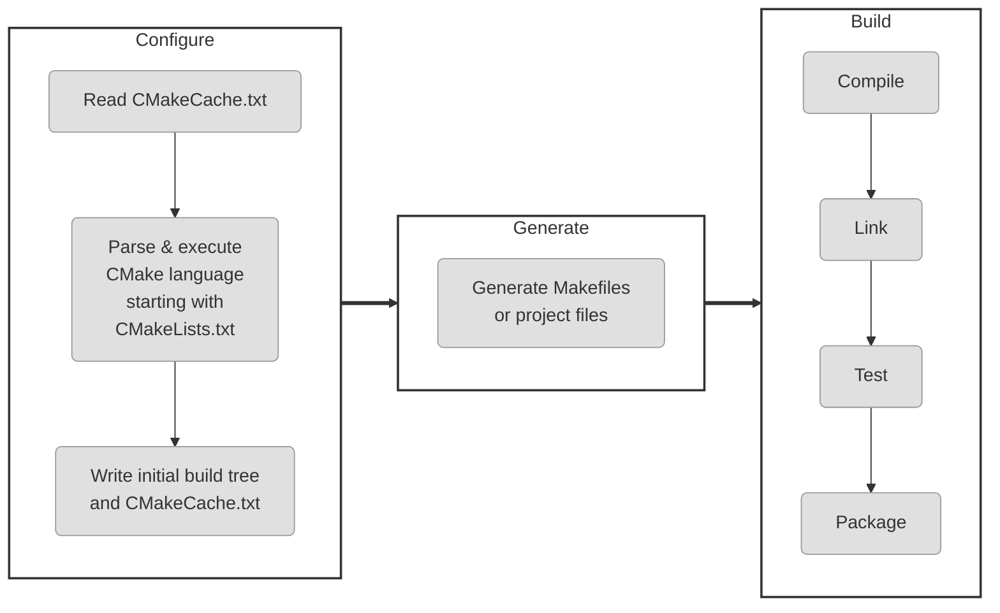

# Modern CMake

[TOC]



生成项目构建系统

构建项目的第一步就是生成构建系统,以下是执行CMake生成项目构建系统操作的三种命令形式

```sh
cmake [<options>] -S <source tree> -B <build tree>
cmake [<options>] <source tree>
cmake [<options>] <build tree>
```

CMake 的一个重要特性是支持源外构建或支持,将构建工件存储在与源树不同的目录中

```sh
cmake -S <source tree> -B <build tree>
```
从 source tree 读取项目文件,使用build目录中生成构建系统

选择生成器

```sh
cmake -G <generator name> -S <source tree> -B <build tree>
```
CMake 在许多平台上支持多种本地构建系统,CMake会选择一个,通过设置CMAKE_GENERATOR环境变量或直接在命令行上指定生成器来覆盖

```sh
cmake -G <generator name> -S <source tree> -B <build tree>
```
```sh
cmake -G <generator name>
-T <toolset spec>
-A <platform name>
-S <source tree> -B <build tree>
```

-T 指定工具集(编译器)和平台(编译器 SDK) 进行更深入的指定

此外,CMake将扫描环境变量以覆盖默认值:CMAKE_GENERATOR_TOOLSET和CMAKE_GENERATOR_PLATFORM

使用预填充缓存信息的能力:

```sh
cmake -C <initial cache script> -S <source tree> -B <build tree>
```

现有缓存变量的初始化和修改可以用另一种方式完成（当创建一个文件仅为设置几个变量有些过于繁琐时），可以直接在命令行中设置：

```sh
cmake -D <var>[:<type>]=<value> -S <source tree> -B <build tree>
```

:<type> 部分可选（由 GUI 使用）并且接受以下类型：BOOL，FILEPATH，PATH，STRING或 INTERNAL。如果省略类型，CMake 会检查变量是否存在于 CMakeCache.txt 文件中并使用其类型；否则，将设置为 UNINITIALIZED

为了debug,还可以使用 - L 选项列出缓存变量

```sh
cmake -L -S <source tree> -B <build tree>

# 同时打印变量帮助信息
cmake -LH -S <source tree> -B <build tree>
cmake -LAH -S <source tree> -B <build tree>
```


使用 -D 选项手动添加的自定义变量不会在这个打印输出中显示

可以使用以下选项删除一个或多个变量：
```sh
cmake -U <globbing_expr> -S <source tree> -B <build tree>
```

使用通配表达式支持 *（通配符）和?（任意字符）符号时要小心，因为很容易意外删除比预期更多的变量

Cmake 命令可以使用多种选项来让了解其内部工作,要获取变量,命令和其他设置的通用信息,请运行以下命令:

```sh
cmake --system-information [file]
```

可选的file参数允许将输出存储在文件中,在构建树目录中,将打印有关缓存变量和日志文件中的构建消息的相关信息

以下行指定了感兴趣的日志级别：
```sh
cmake --log-level=<level>
```

级别可以是以下任意一项:ERROR,WARNING,NOTICE,STATUS,VERBOSE,DEBUG或TRACE
也可以在CMAKE_MESSAGE_LOG_LEVEL缓存变量中指定此设置

CMAKE_MESSAGE_CONTEXT变量可以像栈一样使用

每当代码进入一个有趣的上下文时,就可以给它一个描述性的名称

这样做之后,消息将使用CMAKE_MESSAGE_CONTEXT变量装饰

```sh
[some.context.example] Debug message
```

启用这种日志输出的选项如下：
```sh
cmake --log-context <source tree>
```

如果其他所有方法都失败了,就需要使用重型武器——跟踪模式,它会打印每个执行的命令及其文件名,调用它的行号,以及传递的参数列表

```sh
cmake --trace
```

要列出所有可能的预设,执行以下命令:
```sh
cmake --list-presets
```

可以使用其中一个可用的预设：
```sh
cmake --preset=<preset> -S <source> -B <build tree>
```

清理构建树

```sh
cmake --fresh -S <source tree> -B <build tree>
```

构建项目
在生成构建树之后就可以进行项目构建操作,CMake 不仅知道如何为许多不同的构建工具生成输入文件,还可以根据项目需求为运行这些工具提供适当 参数

运行并构建: 使用多核

```sh
cmake --build <build tree> --parallel [<number of jobs>]
cmake --build <build tree> -j [<number of jobs>]
```

选择要构建和清理的目标
```sh
cmake --build <build tree> --target <target name1> --target <target name2> ...
```

清理构建树

```sh
cmake --build <build tree> -t clean
```

如果想先清理再执行正常的构建：
```sh
cmake --build <build tree> --clean-first
```
我们已经对生成器有了一定的了解：它们有不同的类型和功能。其中一些生成器能够在一
个构建树中同时构建 Debug 和 Release 构建类型，支持此功能的生成器包括 Ninja
Multi-Config、Xcode 和 Visual Studio。其他每个生成器都是单一配置生成器，需要
为每种配置类型单独构建树。
选择 Debug、Release、MinSizeRel 或 RelWithDebInfo 并指定如下：
为多配置生成器配置构建类型
```sh
cmake --build <build tree> --config <cfg>
```

调试构建过程

出现问题时,应该首先检查输出信息,打印所有细节会困惑,当需要查看底层情况时,可以要求CMake打印详细信息
```sh
cmake --build <build tree> --verbose
cmake --build <build tree> -v
```

同样的效果可以通过设置CMAKE_VERBOSE_OUTPUT缓存变量实现

安装项目
 当构建产物完成后,用户可以将它们安装到系统中,这意味这将文件复制到正确的目录,安装库或者运行CMake脚本中的自定义安装逻辑

 安装项目

 当构建产物完成后,用户可以将它们安装到系统中

```sh
cmake --install <build tree> [<options>]
```

像其他操作一样,需要生成的构建树的路径

```sh
cmake --install <build tree>
```

选择安装目录

```sh
cmake --install <build tree> --install-prefix <prefix>

cmake --install <build tree> --prefix <prefix>
```

多配置生成器

可用类型包括 Debug,Release，MinSizeRel 和 RelWithDebInfo

```sh
cmake --install <build tree> --config <cfg>
```

选择组件:

作为开发者，可能会选择将项目拆分为可以独立安装的组件。现在，假设有一组不需要在所有情况下使用的产物。这可能类似于 application、docs 和 extra-tools。
要安装单个组件，使用以下选项：

```sh
cmake --install <build tree> --component <component>
```

权限设置 ，如果 安装 在类 Unix 平台上，可以使用以下选项指定安装目录的默认权限，格式为u=rwx,g=rx,o=rx

```sh
cmake --install <build tree>
--default-directory-permissions <permissions>
```

与构建阶段类似，也可以选择查看安装阶段的详细输出：
```sh
cmake --install <build tree> --verbose
cmake --install <build tree> -v
```

执行脚本

```sh
cmake [{-D <var>=<value>}...] -P <cmake script file>
[-- <unparsed options>...]
```

* 通过使用 -D 选项定义的变量
* 通过可以在 -- 符号后传递的参数
CMake 将为传递给脚本的所有参数 (包括--) 创建 CMAKE_ARGV<n> 变量。

命令行工具


少数情况下,我们需要以平台无关的方式运行单个命令——例如复制文件或计算校验和,并非所有的平台都完全相同

Make 提供了一种模式，大多数常见命令都可以跨平台地以相同方式执行。其语法如下：
```sh
cmake -E <command> [<options>]
```

工作流预设

使用 CMake 构建项目分为三个阶段：配置、生成和构建。此外，还可以使用 CMake 运行
自动化测试，甚至创建可重分配的包。通常，用户需要通过命令行单独手动执行每一个步骤。但是，
高级项目可以指定工作流预设，将多个步骤捆绑成单一动作，只需一个命令即可执行。目前，只需
知道用户可以通过运行以下命令，获取可用预设的列表：


```sh
cmake ––workflow --list-presets
```

